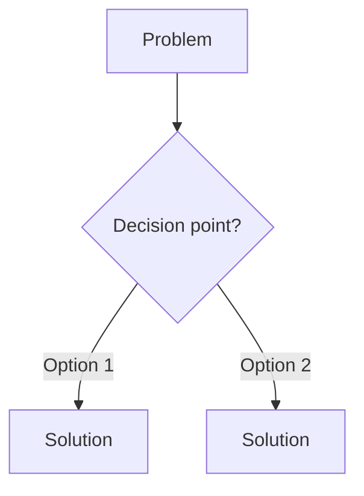

# Repo Improver — Data Engineering Learning Notes

## When to Use

- User asks to improve, rewrite, or add interview questions to any `.md` file in this repo
- User asks to bring a file "up to standard" or "to the file-formats.md bar"
- User wants to add a new topic file and needs it to match existing quality
- User asks to audit the repo for thin or missing content

## The Quality Bar (file-formats.md Standard)

Every file must have these sections in order:

### 1. Opening Question (real scenario)
```markdown
## 0. The Opening Question

> "Your pipeline does X. It's now Y. You have Z hours. What do you check first?"

A real production scenario the interviewer hands you. Sets context for every section that follows. Ends with a "What the interviewer is testing" callout.
```

### 2. Core Concepts (with Mermaid diagrams)
- Deep internals — byte-level or step-by-step worked examples
- Mermaid diagrams for architecture, state machines, sequence flows
- Math with concrete numbers (not just formulas)
- Real configs from production, not invented ones

### 3. Real Interview Questions (8–10)
Each question must follow this structure:
```markdown
### Q1: "Scenario question verbatim"

**The trap:** What most candidates say (and why it's wrong).

**The answer:** Full technical walkthrough with:
- Concrete numbers / worked example
- Step-by-step diagnosis
- Code or command where relevant

**Interviewer follow-up:** The harder question they ask next.
```

Required question types per file (pick 8-10):
- Performance diagnosis (why is this slow?)
- Architecture trade-off (X vs Y vs Z)
- Data modeling (design this schema)
- Failure scenario (it broke at 3 AM, what do you do?)
- Scale math (how many partitions? how much memory?)
- Migration (old system → new system)
- "Explain this to me" (prove you understand internals)
- Cost optimization
- Tool selection with reasoning

### 4. Decision Trees (Whiteboard-ready)

At least 1-2 per file. These are what candidates draw on the whiteboard.

### 5. Quick Reference — Interview Edition
| Question | Short Answer |
|---|---|
| "What is X?" | One-liner |
| "X vs Y?" | Two-column comparison |
| "When to use X?" | Bullet list |

## The Improvement Process

### Step 1: Audit the file
```bash
wc -l <file>        # Is it thin? (<300 lines for a topic file)
grep -c "^###" <file>  # How many subsections?
grep -c "Mermaid\|flowchart\|sequenceDiagram" <file>  # Any diagrams?
grep -c "Q[0-9]" <file>  # Any interview questions?
```

### Step 2: Identify gaps
Check for:
- [ ] Opening question with scenario
- [ ] Deep internals (not surface-level)
- [ ] Mermaid diagrams (not ASCII art)
- [ ] 8-10 real interview Qs with full diagnosis
- [ ] Decision trees (Mermaid flowchart)
- [ ] Quick reference table
- [ ] Real configs (not invented)
- [ ] Concrete math with numbers

### Step 3: Rewrite in-place
- Keep what's good, expand what's thin
- Add sections in the order listed above
- Match the tone: production-oriented, direct, no fluff
- Code blocks: 4-space indentation, real examples
- Every fact must be verifiable before committing

### Step 4: Accuracy verification (MANDATORY before every commit)
- [ ] Byte-level details: verify against actual format specs
- [ ] Config names: verify against official docs
- [ ] Default values: verify against source code or docs
- [ ] Timeline claims: verify against release notes
- [ ] "Deprecated" claims: verify current status
- [ ] Remove any invented configs or made-up numbers
- [ ] If unsure about a claim, mark it with a citation or remove it

### Step 5: Commit and push
```bash
git add <file>
git commit -m "Enhance <topic>: <what was added>"
git push
```

Commit message style: imperative verb, name the topic, be specific.
Examples:
- `Rewrite file-formats.md as interview-centric deep dive`
- `Enhance kafka/notes.md: 3 more questions (10 total)`
- `Add interview quick reference to emr/notes.md`

## File Assessment Template

For each file, report:
```
FILE: <path>
LINES: <before> → <after>
Qs: <before> → <after> (target: 8-10)
DIAGRAMS: <count> (target: 2-4 Mermaid)
ACCURACY FIXES: <list of issues found and fixed>
```

## Cross-references

After improving a file, add cross-references to related files:
- Foundations files reference each other (e.g., file-formats → serialization)
- Topic files reference foundations (e.g., kafka → distributed-systems)
- System design references all topic files

Use this format:
```markdown
> **Cross-reference:** See [distributed-systems/notes.md](../foundations/distributed-systems.md) for CAP theorem.
```

## Anti-patterns to Avoid

- Adding comments unless explicitly asked
- Using ASCII art when Mermaid works
- Inventing config names or default values
- Adding surface-level content that belongs in a tutorial, not interview prep
- Repeating the same content across files (cross-reference instead)
- Using emojis unless user requests them
- Long paragraphs (use bullets, tables, code blocks)

## Existing File Status

Track which files are at the bar:

| File | Status | Last Enhanced |
|---|---|---|
| `foundations/file-formats.md` | At bar | 592 lines, 7 Qs |
| `foundations/olap-vs-oltp.md` | At bar | ~420 lines, 9 Qs |
| `foundations/data-modeling.md` | At bar | ~560 lines, 9 Qs |
| `foundations/distributed-systems.md` | At bar | ~500 lines, 9 Qs |
| `foundations/containerization.md` | At bar | ~590 lines, 9 Qs |
| `foundations/serialization.md` | At bar | ~400 lines, 9 Qs |
| `apache-kafka/notes.md` | At bar | ~690 lines, 10 Qs |
| `apache-flink/notes.md` | At bar | ~750 lines, 8 Qs |
| `apache-iceberg/notes.md` | At bar | ~730 lines, 9 Qs |
| `system-design/notes.md` | At bar | ~780 lines, 6 scenarios, 29 drills |
| `apache-spark-pyspark/notes.md` | At bar | ~1220 lines, 9 Qs |
| `emr/notes.md` | At bar | 1347 lines + 18-row quick ref |

Update this table when files are enhanced.
