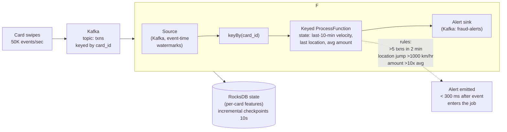
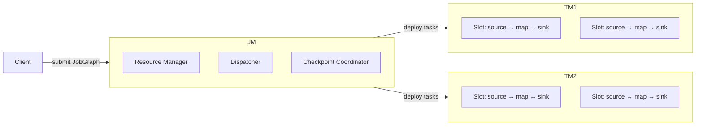
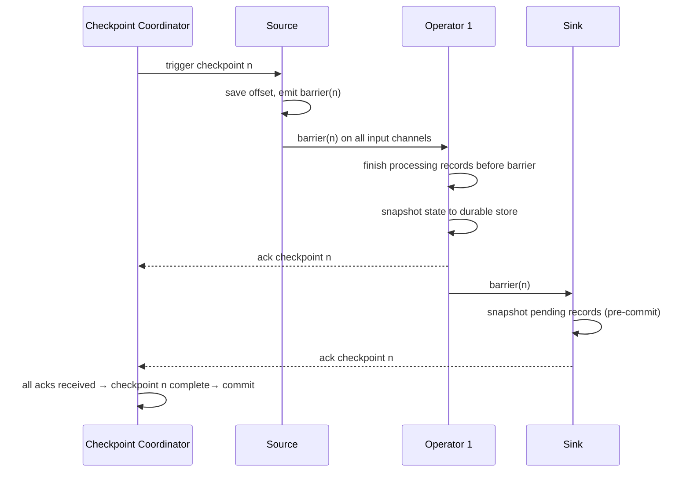
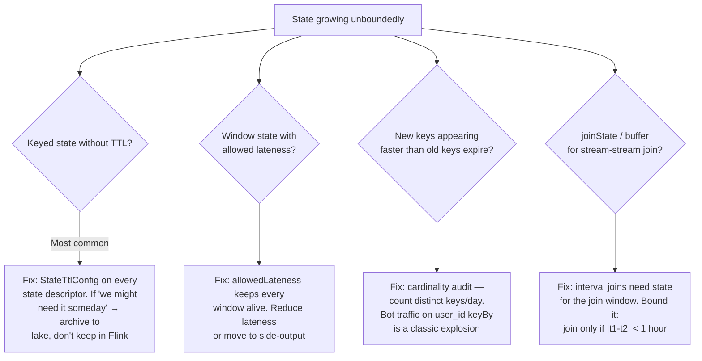
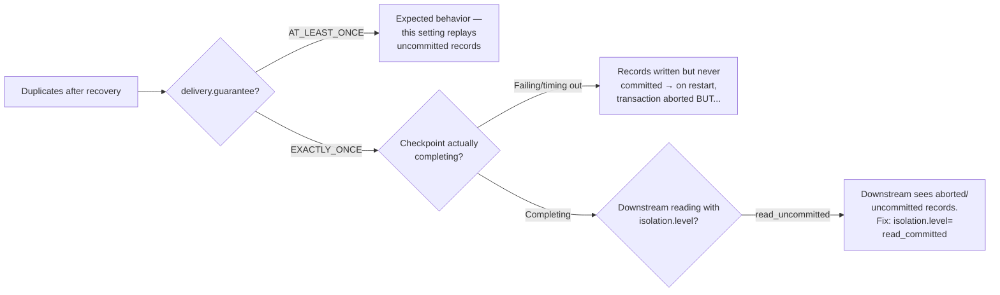
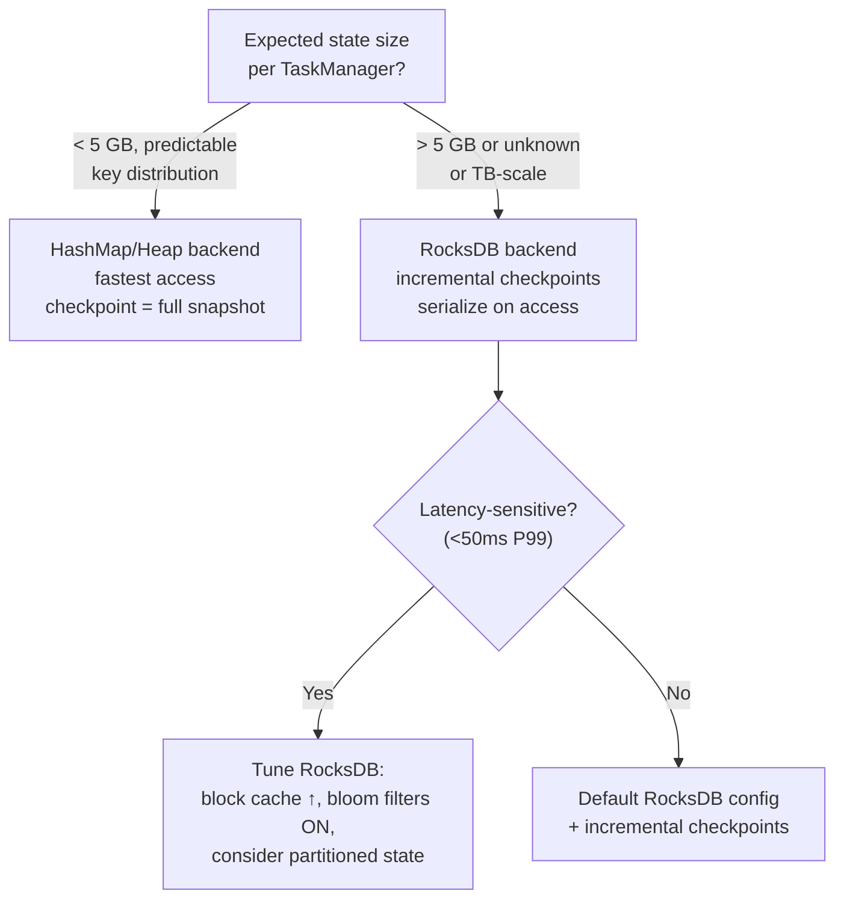
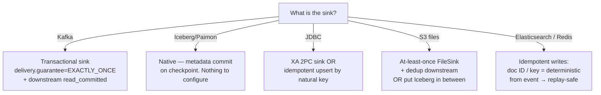

# Apache Flink — Interview Prep Notes

> Format: Senior DE (Alex) ↔ Staff DE (Sam) conversation series.
> Goal: Deep understanding for production use and senior/staff-level interviews.

---

## Table of Contents

1. [The Opening Question](#1-the-opening-question)
2. [Why Flink? (vs Spark Streaming)](#2-why-flink-vs-spark-streaming)
3. [Architecture: JobManager, TaskManager, Slots](#3-architecture-jobmanager-taskmanager-slots)
4. [Execution Model: Streaming-First, Not Micro-Batch](#4-execution-model-streaming-first-not-micro-batch)
5. [State and State Backends](#5-state-and-state-backends)
6. [Checkpoints and Savepoints](#6-checkpoints-and-savepoints)
7. [Watermarks and Event Time](#7-watermarks-and-event-time)
8. [Windowing](#8-windowing)
9. [Backpressure](#9-backpressure)
10. [Exactly-Once Sinks](#10-exactly-once-sinks)
11. [Restart Strategies and Failure Recovery](#11-restart-strategies-and-failure-recovery)
12. [Real Interview Questions](#12-real-interview-questions)
13. [Decision Trees](#13-decision-trees)
14. [Operational Playbook](#14-operational-playbook)
15. [Quick Reference — Interview Edition](#15-quick-reference--interview-edition)
16. [Flink 2.0 and What Changed](#16-flink-20-and-what-changed)
17. [Resources](#17-resources)

---

## 1. The Opening Question

**Question:** *"Design a system that detects fraudulent credit-card transactions within 500 milliseconds of the swipe."*



**Answer structure:**
```
1. Why Flink: sub-second latency + per-card keyed state + event-time
   correctness — the three things micro-batch can't give you together
2. Keyed state holds rolling features per card (RocksDB, TB-scale OK)
3. Watermarks: bounded out-of-orderness (5s) + withIdleness (1 min)
4. Exactly-once: checkpoint 10s + Kafka transactional sink
5. Recovery: restart from checkpoint, replay ≤10s of Kafka, no dup alerts
```

---

## 2. Why Flink? (vs Spark Streaming)

### The Core Difference

| | Flink | Spark Streaming |
| :--- | :--- | :--- |
| **Model** | True streaming — each event processed as it arrives | Micro-batch — events collected per interval, then processed as a batch |
| **Event time** | Native — watermark-driven, late event handling built in | Added later (2.1+); batch boundary limits sub-second latency |
| **State** | Keyed state with checkpointing and incremental savepoints | State store backed by RocksDB or HDFS; less granular |
| **Latency** | Sub-second (pipelines do not wait for a batch boundary) | Batch interval + processing time (typically 1–5s minimum) |
| **Exactly-once** | Two-phase-commit sink; native end-to-end guarantee | Idempotent sink pattern; transactional sink requires work |
| **Backpressure** | Credit-based flow control (proactive signal, no dropped data) | Rate-limiting via `maxRate` — possible overshoot |

### Where Flink Wins

- **Low-latency streaming** — fraud detection, real-time alerts, trading.
- **Complex event-time semantics** — accurate temporal joins, session windows with gap detection.
- **State-heavy pipelines** — RocksDB state backend scales to terabytes without garbage collection pauses.
- **Exactly-once to multiple sinks** — two-phase commit across Kafka, Iceberg, JDBC within a single checkpoint barrier.

**Alex:** When would you still pick Spark over Flink?

**Sam:** Three cases. First, you already have a Spark ecosystem — notebooks, ML pipelines, batch ETL — and streaming is a small part of the workload; unifying on one engine justifies the latency trade. Second, your streaming throughput needs to saturate hundreds of nodes with relatively stateless transformations — Spark's micro-batch overhead is small at that scale, and its SQL optimizer is more mature for complex batch-stream hybrids. Third, you need a fully managed environment with minimal ops — Databricks Structured Streaming is easier to operate than a Flink cluster on self-managed infrastructure. For everything else in the "true streaming" category, Flink is the right tool.

### Key Interview Answer

> Flink is streaming-first: every event goes through the pipeline immediately, and event time is part of the execution model, not an add-on. This makes it the right choice when latency matters, when state is large, or when temporal correctness must survive late data. Spark Structured Streaming is better when the primary workload is batch and the streaming requirement is secondary.

---

## 3. Architecture: JobManager, TaskManager, Slots



| Component | Role |
| :--- | :--- |
| **JobManager** | Orchestrates checkpoint barriers, coordinates recovery, converts JobGraph to ExecutionGraph |
| **TaskManager** | Runs operator subtasks in slots; one JVM process per TaskManager |
| **Task Slot** | The unit of parallelism — each slot runs one operator chain. Default: operators from one job can share slots (slots = parallelism) |
| **Slot sharing** | Reduces the total slots needed: a source + map + sink chain uses one slot, not three |

### Parallelism vs Slots

- `parallelism.default` = the pipeline parallelism (number of parallel subtasks per operator).
- `taskmanager.numberOfTaskSlots` = how many subtasks each TaskManager can run.
- If 10 slots total and parallelism=5, each operator gets 5 slots; remaining slots are unused.
- Slot sharing (default ON) means a source + map + sink chain (parallelism=5 each) still needs only 5 slots total, not 15.

**Alex:** Why do people say "slots are not CPU cgroups" and then cap slots per TM?

**Sam:** A slot is a JVM thread group without CPU or memory boundaries. Over-subscribing slots causes GC pressure and thread contention. The heuristic is 1–2 slots per CPU core and roughly 2–4 GB heap per slot for typical streaming (more with RocksDB). The actual limit is rarely CPU — it is file handles, checkpoint bandwidth, and memory for the state backend.

---

## 4. Execution Model: Streaming-First, Not Micro-Batch

### Pipelined Execution

In Spark, a barrier operation (join, aggregation) forces a **stage boundary** — shuffle, write to disk, pull from disk.

In Flink, the default execution is **pipelined**: data flows operator-to-operator through bounded in-memory buffers. There is no artificial batch boundary; the pipeline runs as long as there is data.

```
Source → Map → KeyBy → Window → Sink
         ├──────────────┤
          One pipelined chain (shares slot)
```

### Batch on Streaming

Flink runs batch jobs on the same engine by treating bounded sources as "streams that end." The execution is identical — pipelined, stateful, checkpointing optional. This is the **unified execution** vision: one engine, two modes.

### Why This Matters

- No batch interval to tune (vs Spark's `batchDuration`).
- No artificial latency floor.
- Backpressure signal is direct (buffer fill → sender slows) instead of reactive (`maxRate` guessing).

---

## 5. State and State Backends

### Types of State

| Type | Scope | Example |
| :--- | :--- | :--- |
| **Keyed state** | Per key in a `keyBy()` stream | `ValueState<Long>` for a running count per user |
| **Operator state** | Per parallel subtask | Source offsets (offset per Kafka partition) |
| **Broadcast state** | Shared across all subtasks | Rule table for dynamic pattern matching |

### State Backend Comparison

| | HashMap (Heap) | RocksDB |
| :--- | :--- | :--- |
| **Storage** | JVM heap — fast, GC-bound | `RocksDB` on local disk (off-heap) |
| **State limit** | Up to heap size | Up to disk (TB-scale) |
| **Access speed** | Nanosecond (heap read) | Micro-millisecond (serialize + LSM lookup) |
| **Checkpoint** | Sync snapshot (STW), fast | Async snapshot (incremental since 1.11) |
| **Serialization** | None — stored as Java objects | Java objects serialized to bytes |
| **Use when** | Small state (<10GB), low latency | Large state, long-running pipelines |

**Alex:** When would heap state trigger a production incident?

**Sam:** A common pattern: a `keyBy()` on a high-cardinality field like `user_id` combined with windowed aggregation state. OOM starts after a traffic spike redistributes keys unevenly across slots — one TaskManager gets more keys' state than heap allows. Heap state has no spill-to-disk; it dies on `OutOfMemoryError`. RocksDB handles this via disk, but at the cost of checkpoint speed. Prefer RocksDB for any pipeline where state size or key distribution is unpredictable.

### State TTL

```java
StateTtlConfig ttl = StateTtlConfig
    .newBuilder(Time.days(1))
    .setUpdateType(OnCreateAndWrite)
    .setStateVisibility(NeverReturnExpired)
    .build();

ValueStateDescriptor<Long> desc =
    new ValueStateDescriptor<>("count", Long.class);
desc.enableTimeToLive(ttl);
```

- **OnCreateAndWrite** vs **OnReadAndWrite** — latter cleans expired state more aggressively.
- **NeverReturnExpired** vs **ReturnExpiredIfNotCleanedUp** — first guarantees callers never see expired values but may consume more cleanup CPU.

---

## 6. Checkpoints and Savepoints

### Checkpoints (Automatic, Restore-Driven)

Periodic snapshots of all operator state, coordinated by the JobManager:



| Concept | Detail |
| :--- | :--- |
| **Aligned checkpoint** | Default — barriers pause processing on each operator until all input channels reach the barrier. Precise "exactly once" state. |
| **Unaligned checkpoint** (1.11+) | Barriers skip buffered in-flight data by including it in the snapshot. Useful when backpressure prevents barriers from progressing. |
| **Incremental checkpoint** (RocksDB, 1.11+) | Only uploads SST files changed since last checkpoint — much faster and smaller for large state. |
| **Min pause between** | `ExecutionCheckpointingOptions.CHECKPOINTING_INTERVAL` — ensure checkpoints do not overlap; target 10–30s for most pipelines. |

### Savepoints (Manual, Upgrade-Driven)

- Same mechanism as checkpoints but **triggered manually** (stop/cancel with savepoint, rescale, resume).
- Used for: application version upgrades, parallelism changes, Flink version upgrades.
- RocksDB native savepoints (1.15+) are incremental and avoid full serialization.

**Alex:** A production job takes 5-minute checkpoints. Is that a problem?

**Sam:** It depends on your recovery SLA. If checkpoint duration equals checkpointing interval, the pipeline has no spare throughput for progress between snapshots — a failure causes a 5-minute rewind, and the recovery itself takes 5 more minutes. First action: switch RocksDB to incremental checkpoints (if not already). Next: reduce state size per key via TTL or partitioning. If still too slow, consider unaligned checkpoints (cost: more state to persist during backpressure) or shortening the interval so each checkpoint has less new data to snapshot.

### Key Interview Answer

> Checkpoints are automatic, periodic snapshots for failure recovery. Savepoints are manual snapshots for planned operations (upgrades, rescaling). Understand the difference between aligned (precise, stopps barriers) and unaligned (better under backpressure, more data per snapshot). RocksDB incremental checkpoints are essential for large state — without them, every checkpoint re-serializes the full state backend.

---

## 7. Watermarks and Event Time

### The Watermark Mechanism

A watermark is a monotonically increasing timestamp that says: *"No event with a timestamp earlier than this value will arrive."*

```mermaid
flowchart LR
    subgraph Kafka[Kafka Partitions]
        P0[Partition 0: e1@T1, e4@T3.5]
        P1[Partition 1: e2@T2]
        P2[Partition 2: e3@T3]
    end
    P0 --> SS0[Source SubTask 0]
    P1 --> SS0
    P2 --> SS1[Source SubTask 1]
    SS0 -->|WM = min(P0 WM, P1 WM)| W0[Watermark = T1.5]
    SS1 -->|WM = P2 WM| W1[Watermark = T3]
    W0 --> OP[Operator]
    W1 --> OP
    OP -->|global WM = min(W0, W1)| GW[Global Watermark = T1.5]
    GW -->|WM passes window end| Fire[Fire Window]

    style GW fill:#3b82f6,color:#fff
    style Fire fill:#10b981,color:#fff
```

- Watermarks are generated at the source or via a `WatermarkStrategy`.
- Operators use watermarks to close windows: a tumbling window [T2, T4) fires when watermark ≥ T4.
- Events that arrive after the watermark after their window is closed are **late events**.

```
WatermarkStrategy
  .<Event>forBoundedOutOfOrderness(Duration.ofSeconds(10))
  .withTimestampAssigner((e, ts) -> e.getTimestamp())
  .withIdleness(Duration.ofMinutes(1))     // ← critical for Kafka idle partitions
```

### Late Event Handling

| Strategy | Behavior |
| :--- | :--- |
| **Drop** | Default — late events are silently dropped |
| **Side output** | `sideOutputLateData()` captures late events to a separate `OutputTag` for auditing or re-processing |
| **Allowed lateness** | `window.allowedLateness(Duration)` — window state stays alive past the watermark. Fires again for each late event. Use with caution: state grows until allowed lateness expires |

**Alex:** Our watermark never advances in a Kafka source. Events are still flowing. What is happening?

**Sam:** One Kafka partition is idle — producing no events while others keep sending. The watermark is the **minimum across all partitions**, so a single silent partition stalls it. Add `.withIdleness(Duration.ofMinutes(1))` to the watermark strategy: after 1 minute without events on that partition, Flink treats it as waiting for events that may never come and advances the watermark based on the other partitions. This is the single most common Flink watermark bug.

> [!TIP]
> If your Flink job's event-time windows never fire, the culprit is almost always an idle Kafka partition stalling the watermark. Add `.withIdleness(...)` to every `WatermarkStrategy` for Kafka sources. Default? There is none. You must add it explicitly. A minute is a safe starting point — 10s if you need fast window triggers.

**Alex:** What is the trade-off in allowed lateness?

**Sam:** Every window's state survives on heap (or RocksDB) until the watermark passes the window end PLUS allowed lateness. If you have 1M keys in a sliding window with 10-minute lateness, you are holding ~10x the state before cleanup. Allowed lateness should be an exception, not a default — prefer side outputs for investigation and only use allowed lateness when you understand the state growth cost.

---

## 8. Windowing

### Window Types

| Type | Behavior | Example | State cost |
| :--- | :--- | :--- | :--- |
| **Tumbling** | Non-overlapping, fixed duration | `Tumble over 1 hour` | One window per key at a time |
| **Sliding** | Overlapping, emit every slide interval | `Slide over 1 hour every 5 minutes` | slide / size state multiplier |
| **Session** | Gap-based — closes after N of inactivity | `Session with gap 30 minutes` | One window per active session per key |
| **Cumulative** (1.15+) | Non-overlapping with partial emits | `Cumulate over 1 day each 1 hour` | One window per key, intermediate results |

### Sliding Window State Amplification

A sliding window of size 1 hour, slide 5 minutes creates **12 overlapping windows** per key. Each event belongs to 12 windows. With 10M keys, state = 12 × window state per key.

**Alex:** A sliding window job crashed with OOM. The operator has window state for 100K keys, 1-hour size, 1-minute slide — is that surprising?

**Sam:** 1-hour / 1-minute slide = 60 overlapping windows per key. 100K keys × 60 = 6M active window states. If each state holds a sum and a count (say 48 bytes each), that is 288MB of window state per subtask — plus serialization overhead, metadata, and pending checkpoint state. It adds up fast. Mitigations: reduce slide (less precision but fewer windows), switch to RocksDB state backend, or redesign as a tumbling window with post-processing.

### Key Interview Answer

> "Flink has four window types (tumbling, sliding, session, cumulative). Sliding windows multiply state by size/slide ratio — the most common cause of large window state. Session windows are natural for user-activity gaps but require careful gap tuning. Window state lives in the state backend and is checkpointed; excessive window state causes OOM with heap state and slow checkpoints with RocksDB."

---

## 9. Backpressure

### How Flink Manages It

Flink uses **credit-based flow control** (since 1.5):

```
Producer ──[buffer]──► Consumer
               ◄── credit ─
```

- Consumer advertises how many buffers it can receive (credit).
- Producer sends only up to the credit limit.
- If consumer is slow, credits shrink → producer buffers fill → backpressure propagates upstream → source read rate drops.

### Diagnosing in the Flink UI

| Backpressure level | Meaning |
| :--- | :--- |
| **OK** | No backpressure |
| **Low** | Some pressure but not limiting throughput |
| **High** | This operator is the bottleneck; downstream is blocking |

**Alex:** The Flink UI shows "Backpressure: High" on every operator. Where should I look?

**Sam:** Look at the **last operator with High backpressure that has no High behind it** — that is the bottleneck. Backpressure propagates upstream, so a slow sink creates High upstream through the entire chain. If the sink has High backpressure, the problem is there: slow writes to the database, slow Kafka ack, or slow Iceberg commit. If only a mid-stream operator has High, that operator is CPU- or state-bound. Common fixes: increase parallelism, optimize serialization (POJOs over `Row`), or move to RocksDB state if the bottleneck is heap GC under state pressure.

---

## 10. Exactly-Once Sinks

### Two-Phase Commit (2PC) Pattern

Flink's exactly-once guarantee to external systems uses the checkpoint barrier as the commit point:

```
1. Regular processing + writes to external system (pre-commit, not visible)
2. Checkpoint barrier arrives at sink
3. Sink pre-commits pending writes (Kafka transaction, Iceberg snapshot)
4. Checkpoint completes on JobManager → tells all sinks to commit
5. Sink commits (Kafka transaction commit, Iceberg metadata commit)
```

| Sink | Exactly-once mechanism |
| :--- | :--- |
| **Kafka** | Kafka transactions (`delivery.guarantee=EXACTLY_ONCE`) |
| **Iceberg** | Iceberg table format — metadata commit on checkpoint |
| **JDBC** | `JdbcExactlyOnceSink` via XA transactions (or idempotent upsert) |
| **S3 / File** | At-least-once (files written per checkpoint, read via `fileSink` commit policy) |

**Alex:** Why is S3 exactly-once harder than Kafka?

**Sam:** S3 does not offer a two-phase-commit primitive. Flink's `FileSink` with exactly-once uses a rolling policy + per-checkpoint pending files, then commits by renaming from `.pending` to committed — but rename on S3 is not atomic (it is a copy + delete). The recommended approach for S3 is at-least-once with idempotent reads (overwrite files using checkpoint-scoped paths, deduplicate on read). Flink Iceberg sink avoids this by using Iceberg's own metadata-level atomic commits.

### Key Interview Answer

> Flink's exactly-once to external systems works through the checkpoint barrier serving as a two-phase-commit coordinator. The sink must support a transactional commit protocol (Kafka transactions, Iceberg metadata commit). For systems without transactional support (S3, HDFS), use at-least-once with idempotent writes or Iceberg as an intermediate table format.

---

## 11. Restart Strategies and Failure Recovery

| Strategy | Config | Behavior |
| :--- | :--- | :--- |
| **Fixed-delay** | Default (checkpointing enabled) — `restart-strategy.fixed-delay.attempts: 2147483647`, delay: 1s | Infinite retries with 1s pause; resumed from last checkpoint |
| **Exponential-backoff** | `restart-strategy.exponential-delay.initial-backoff: 1s`, `max-backoff: min(10min, 60s * sqrt(attempts))` | Backs off exponentially between failures — avoids restart storms |
| **Failure rate** | `restart-strategy.failure-rate.max-failures-per-interval: 5`, `interval: 5min` | Crashes repeatedly within 5 min → job fails permanently |

### Recovery Flow

1. TaskManager hosting the failed subtask is lost.
2. JobManager detects failure via heartbeat loss.
3. All tasks stop (job enters `FAILING` state).
4. Latest completed checkpoint is fetched.
5. Job graph is redeployed on available TaskManagers.
6. State is restored from checkpoint — all operators seek to the snapshot boundary.
7. Sources resume from saved offsets.

**Alex:** How long will recovery take?

**Sam:** Roughly: time to redeploy the job graph + time to read state from the checkpoint store + time to catch up on events missed during downtime. The first two are predictable (seconds to minutes depending on state size). The third is the catch-up lag — proportional to downtime × ingress rate / parallelism. This is why checkpoint interval sets the upper bound on data loss but not on recovery time; recovery time is about state restoration speed, not checkpoint frequency.

---

## 12. Real Interview Questions

### Q1: "Checkpoints take 8 minutes and your interval is 10 minutes. A TaskManager dies. How much data reprocessing happens, and how long until the job is healthy again?"

```
Timeline math:

t=0:    checkpoint N completes
t=8m:   checkpoint N+1 starts (still running...)
t=10m:  TaskManager dies → job restarts from checkpoint N

Reprocessing window = events since checkpoint N = 10 minutes of Kafka data
  (NOT 8 — the interval, because N+1 never completed)

Recovery time =
  job graph redeploy:      ~30-60s (image pull if new pod)
  + state restore:         state_size / restore_throughput
                           (100 GB from S3 @ ~200 MB/s ≈ 8 min)
  + catch-up processing:   10 min of backlog at 2-3x normal rate
                           ≈ 3-5 min (if you have headroom)
  ≈ 12-14 minutes total

If 12 min of downtime is unacceptable:
  → shrink checkpoint interval (smaller state per checkpoint,
    faster restore, less catch-up)
  → keep spare capacity so catch-up runs at 3x not 1.2x
```

### Q2: "Your job's state grew from 10 GB to 800 GB over 3 months. Walk through the causes."



**The rule:** Flink state is a cache with an explicit eviction policy,
not a database. Every `ValueStateDescriptor` without a TTL is a bet
that keys stop arriving — audit that bet quarterly.

### Q3: "Kafka events arrive up to 5 minutes out of order. Business wants per-minute revenue dashboards. Design the watermark strategy."

```
Requirements tension:
  - 5-min out-of-orderness → watermark delay must be ~5 min
  - Per-minute dashboards → want windows to fire fast

Design:
  WatermarkStrategy
    .forBoundedOutOfOrderness(Duration.ofMinutes(5))
    .withIdleness(Duration.ofMinutes(1))

Result:
  - 1-minute tumbling windows fire ~5 minutes late
  - Revenue per minute is correct (events placed by event time)
  - Dashboard lag = watermark delay (5 min) + processing (~1s)

If 5-min dashboard lag is unacceptable:
  Option A: fire early + refine:
    trigger: on-time fire + allowedLateness(5 min) with re-fire
    → dashboard shows provisional numbers immediately, corrects
      as late events arrive. State cost: windows live 5 extra min.
  Option B: two outputs:
    processing-time stream → instant approximate dashboard
    event-time stream → authoritative numbers 5 min later
```

### Q4: "Flink vs Kafka Streams — a team asks which to build on."

| Dimension | Flink | Kafka Streams |
|---|---|---|
| **Deployment** | Cluster (JM + TMs) or K8s operator | Library embedded in your app |
| **State** | RocksDB, checkpointed, savepoints, rescale via savepoint | RocksDB local + changelog topics; rescale = full re-restore |
| **Event time** | Watermarks, first-class | Timestamps + grace periods, less flexible |
| **Exactly-once** | Checkpoint + 2PC sinks (Kafka, Iceberg, JDBC) | EOS via Kafka transactions (Kafka-to-Kafka only) |
| **SQL** | Flink SQL (mature) | ksqlDB (separate product) |
| **Ops surface** | You run a cluster | You run app instances (simpler) |
| **Best for** | Complex streaming topologies, non-Kafka sinks, TB state, SQL | Kafka-in/Kafka-out microservices, JVM teams |

**Interview answer:** "Kafka Streams for Kafka-centric microservices
where a library beats a cluster. Flink when the topology is complex,
the sink isn't Kafka, state is huge, or analysts need SQL over streams."

### Q5: "After a restart, your Kafka sink emits duplicates. The job was 'exactly-once.' Why?"

**Diagnosis:**


**The classic trap:** Flink's EXACTLY_ONCE Kafka sink writes records
inside Kafka transactions that commit on checkpoint completion. A
downstream consumer with `isolation.level=read_uncommitted` (the
default!) sees uncommitted records — and if the job crashes before
checkpoint, those aborted records were already read and processed.
**Exactly-once is a chain: it breaks at the weakest config.**

### Q6: "Join two Kafka streams: clicks (10M/min) and impressions (1M/min). A click joins to the impression from up to 30 minutes earlier. How?"

**Answer — interval join with bounded state:**

```java
clicks.keyBy(c -> c.adId)
  .intervalJoin(impressions.keyBy(i -> i.adId))
  .between(Time.minutes(-30), Time.minutes(0))
  .process(new JoinFunction() { ... });
```

```
State math (the part interviews probe):
  impressions side: 1M/min × 30 min = 30M impression records in state
  clicks side:      10M/min × 30 min = 300M click records in state
    (clicks must wait for late impressions too)
  → RocksDB mandatory; heap OOMs immediately

Alternatives when state is too big:
  1. Temporal table join if one side is a slowly-changing dimension
     (impressions aren't — they're events)
  2. Lookup join to an external store (Redis/Aerospike) for the
     impression side — trade: external dependency, no replay
  3. Enrich offline: accept 1-hour latency, join in Iceberg batch
```

### Q7: "Your session-window job returns wrong results after a parallelism change from 4 to 8. What broke?"

**Diagnosis:**
```
Changing parallelism requires a savepoint-based restart.
If you started fresh (no savepoint):
  → all keyed state was discarded → sessions restart from scratch
  → windows that were mid-session lose their start time
If you restored from a savepoint but the job graph changed:
  → operator UIDs changed or were never set
  → state can't map to the new graph → silently dropped

Fix going forward:
1. Always set explicit UIDs on operators:
   stream.keyBy(...).window(...).uid("session-window-v1")
2. Rescale ONLY from savepoints:
   flink stop --savepointPath s3://... jobId
   flink run -p 8 -s s3://savepoint job.jar
3. After restore, verify state: check restored checkpoint size
   in the UI — zero-size restore = state was dropped
```

### Q8: "A Flink SQL query with a GROUP BY produces growing state and eventually OOMs. But it's SQL — where's the state?"

**Answer:** Every stateful SQL operator keeps state:

| SQL operator | State kept | Grows until |
|---|---|---|
| `GROUP BY` (non-windowed) | One accumulator row per distinct key | Never — **infinite by design** |
| Windowed `GROUP BY` | Window accumulators per key per window | Window end + allowed lateness |
| `JOIN` (regular) | Both sides' rows | Never — **infinite by design** |
| Temporal join | Right side (versioned table) rows | Configured retention |
| `ROW_NUMBER` dedup | Latest row per key | Never — **infinite by design** |

**Fix for the non-windowed GROUP BY:**
```sql
-- Configure idle state retention (Flink SQL):
SET 'table.exec.state.ttl' = '24h';
-- Keys idle for 24h are evicted. Correct only if your keys
-- genuinely go quiet — a wrong-TTL produces silently wrong counts.
```

**The interview insight:** "Flink SQL hides state, not eliminates it.
Any streaming SQL without windows or temporal bounds is an
unbounded-state query. Either set `table.exec.state.ttl` knowingly,
or restructure with windows."

---

## 13. Decision Trees

### 13.1 State Backend Selection



### 13.2 Exactly-Once Sink Strategy



---

## 14. Operational Playbook

### Symptom → Likely Cause → First Action

| Symptom | Likely cause | First action |
| :--- | :--- | :--- |
| Checkpoint duration growing over time | RocksDB compaction lag; state growth | Enable incremental checkpoints; add more TaskManagers; check state TTL config |
| Checkpoint failures with `CheckpointException` with cause | Backpressure preventing barrier propagation; TaskManager OOM | Consider unaligned checkpoints; check heap/state memory; increase `taskmanager.memory.managed.size` |
| Watermark never advancing | Idle Kafka partition | Add `.withIdleness()` to the watermark strategy |
| Late events appearing after correct handling | Under-estimated out-of-order bound | Widen the `forBoundedOutOfOrderness` duration; inspect max observed lag in traces |
| Backpressure High on all operators | Slow sink (DB, Kafka ack, file I/O) | Check sink throughput; add parallelism to the sink operator; batch writes |
| High GC pauses in TaskManager | Heap state backend with large state | Switch to RocksDB; reduce state per key via TTL or different key structure |
| Job fails with `NoResourceAvailableException` | Not enough slots for parallelism | Add TaskManagers or reduce parallelism; check slot sharing is enabled |
| Kafka source lag growing | Consumer processing slower than produce rate | Increase parallelism; profile bottleneck operator; check backpressure upstream |

### Checkpoint Tuning Checklist

1. **Set checkpoint interval** — `preciselyOnce` aligned; target 10–30s typical.
2. **Enable incremental checkpoints** with RocksDB.
3. **Set min pause between checkpoints** = interval (prevents overlapping).
4. **Set checkpoint timeout** — default 10 min; lower if state is fast (catch failures sooner).
5. **Configure externalized checkpoints** (`DELETE_ON_CANCELLATION` vs `RETAIN_ON_CANCELLATION`) — use retentive for manual savepoint-from-checkpoint pattern.
6. **Monitor checkpoint size and duration** — growing trend means state is leaking or restoring without compaction.

**Alex:** What is the one-liner staff answer on running Flink in production?

**Sam:** Checkpoint health is your primary operational signal — duration, size, and failure rate tell you more about pipeline stability than throughput. RocksDB for any non-trivial state; watermark strategies with `withIdleness()` for Kafka sources; know the difference between aligned and unaligned checkpoints (and use unaligned as a tool, not a default). Most Flink incidents are watermark stalls, state growth, or checkpoint barrier delays under backpressure — not throughput.

---

## 15. Quick Reference — Interview Edition

| Question | Short answer |
| :--- | :--- |
| Flink vs Spark Streaming? | Streaming-first vs micro-batch. Flink wins on latency, event time, state. Spark wins on ecosystem, batch-stream hybrid, managed platforms. |
| State backend to use? | RocksDB for any state > a few GB or unpredictable key distribution. Heap for small, fast state. |
| Make checkpoints faster? | Incremental RocksDB checkpoints; reduce state TTL; add TaskManagers. |
| Watermark not advancing? | Idle Kafka partition — add `withIdleness()`. |
| Late events after window closed? | Side output or `allowedLateness()` — latter costs state growth. |
| Backpressure on all operators? | Sink is the bottleneck (DB, Kafka, file I/O). Check the last operator with High backpressure. |
| Exactly-once to S3? | At-least-once + idempotent path; or use Iceberg on S3 for metadata-level exactly-once. |
| Sliding window OOM? | size/slide ratio multiplies state. Reduce slide, use RocksDB, or redesign as tumbling + post-processing. |
| Savepoint vs checkpoint? | Manual (planned upgrade) vs automatic (failure recovery). |
| Slot count vs parallelism? | Parallelism × slot sharing = slots needed. Default: all operators share slots. |
| Restart after failure? | Default: infinite retries, 1s delay, resume from last checkpoint. |
| Source offset persists where? | Operator state (so it is checkpointed alongside everything else). |
| Recovery time formula? | Redeploy + state restore (state_size / throughput) + catch-up on missed events |
| State growing unbounded? | Missing TTL on keyed state (most common), allowed lateness, key cardinality explosion, unbounded join buffers |
| Duplicates after recovery w/ EOS sink? | Downstream using `isolation.level=read_uncommitted` (Kafka default!) — switch to `read_committed` |
| Rescale parallelism safely? | Only via savepoint; always set operator `.uid()` or state can't map to the new graph |
| Non-windowed SQL GROUP BY state? | Infinite by design — set `table.exec.state.ttl` knowingly or restructure with windows |
| Out-of-order events? | Watermark delay = max expected lateness; dashboard lag = watermark delay + processing |
| Flink vs Kafka Streams? | KStreams: library, Kafka-in/out microservices. Flink: complex topologies, non-Kafka sinks, TB state, SQL |

---

## 16. Flink 2.0 and What Changed

Flink 2.0 (released 2025) is the first major version bump since 1.0
(2016). It is not a rewrite — it is Flink 1.x with materialized
improvements that change how you think about the platform.

### What Stayed the Same

- Core streaming engine (DataStream API, checkpointing, state)
- Flink SQL, Table API, DataStream API — same mental model
- Exactly-once semantics, watermarks, event-time processing

### What Changed

| Feature | Flink 1.x | Flink 2.0 |
|---|---|---|
| **Scheduler** | Default scheduler (Adapative) | New **adaptive batch scheduler** — dynamically plans batch job execution based on data size and cluster resources |
| **Materialized Tables** | Not available | Declarative streaming pipelines as continuously updated tables (Flink SQL `CREATE MATERIALIZED TABLE`) |
| **State Lazy Access** | State always deserialized on access | Selective state access — only the required keys/values are deserialized, reducing CPU and memory |
| **Multi-Version State** | Not supported | Keep multiple state versions for time-travel queries and long-running window correctness |
| **Schema Registry** | No native integration | Built-in integration with Confluent/APICurio Schema Registry for Avro/Protobuf |
| **Flink SQL Gateway** | Experimental | Stable SQL Gateway for interactive queries via JDBC/ODBC |
| **Kubernetes Operator** | 1.x had an operator | Matured — declarative `FlinkDeployment` CRD, auto-upgrades, savepoint management |
| **REST API v2** | v1 | v2 with async job submission, better monitoring endpoints |
| **Paimon integration** | Optional | Native — Flink + Paimon for streaming lakehouse (Flink-native Iceberg alternative) |

### Migration Notes

| From 1.x | To 2.0 |
|---|---|
| Recompile your job JARs (API compatible, savepoints compatible) | `s/Flink 1.x/Flink 2.0/g` in build files |
| Check deprecated APIs: `DataStreamUtils`, all `-1.x` connectors | Use new connector artifacts (`flink-connector-kafka:3.x` → `4.x`) |
| Adaptive scheduler is default for batch jobs (no config change) | No action needed but review batch job performance |
| Old `flink-conf.yaml` still works | New options available for adaptive batch, materialized tables |

### What It Means for DE Interviews

- If asked "Which version of Flink?" — say **2.0** (demonstrates you
  keep current)
- Mention **materialized tables** as the future of streaming SQL
- Bring up **adaptive batch scheduler** for hybrid batch/streaming
  workloads
- Know that the **core engine hasn't changed** — 1.x knowledge is still
  valid

---

## 17. Resources

- [Flink Documentation — Concepts](https://nightlies.apache.org/flink/flink-docs-stable/docs/concepts/overview/) — official: stateful, streaming-first execution model
- [Flink Documentation — Operations](https://nightlies.apache.org/flink/flink-docs-stable/docs/ops/overview/) — checkpointing, backpressure, monitoring
- [Ververica Flink Primer](https://www.ververica.com/blog/flink-operations-primer) — production ops patterns
- [Streaming 101 (Tyler Akidau)](https://www.oreilly.com/radar/the-world-beyond-batch-streaming-101/) — the seminal article on event-time, watermarks, windows; non-Flink-specific but the foundation every streaming engineer must understand
- [Streaming 102 (Tyler Akidau)](https://www.oreilly.com/radar/the-world-beyond-batch-streaming-102/) — advanced: triggers, accumulation modes, retraction; directly informs Flink's trigger API and session window semantics
- [Flink Watermarks and Event Time — Handling Out-of-Order Events (Streamkap)](https://streamkap.com/resources-and-guides/flink-watermarks-event-time) — production-focused guide: watermark strategies, idle source problem, multi-stream propagation, monitoring with currentInputWatermark metric
- Practice roadmap: [`apache-flink/practice-roadmap.md`](practice-roadmap.md) — phased hands-on progression
- Local setup guide: [`apache-flink/kafka-to-flink-local-setup.md`](kafka-to-flink-local-setup.md)
- More curated links (resources, hands-on labs): [`data-engineering-learning-lab/apache-flink/`](https://github.com/cookiee01/data-engineering-learning-lab/tree/main/apache-flink)
