## Diagram


# Apache Iceberg — Interview Prep Notes

> Format: Alex (learner) ↔ Sam (guide) conversation series designed to build production-grade intuition.

---

## Table of Contents

1. [The Opening Question](#1-the-opening-question)
2. [Why Iceberg? (vs Hive Format)](#2-why-iceberg-vs-hive-format)
3. [Iceberg Metadata Architecture](#3-iceberg-metadata-architecture)
4. [Hidden Partitioning](#4-hidden-partitioning)
5. [Row-Level Updates: CoW vs MoR](#5-row-level-updates-cow-vs-mor)
6. [Time Travel & Snapshot Cleanup](#6-time-travel-snapshot-cleanup)
7. [ACID Commits & Concurrent Writers](#7-acid-commits-concurrent-writers)
8. [Schema Evolution & Field IDs](#8-schema-evolution-field-ids)
9. [Real Interview Questions](#9-real-interview-questions)
10. [Decision Trees](#10-decision-trees)
11. [Operational Maintenance Playbook](#11-operational-maintenance-playbook)
12. [Quick Reference — Interview Edition](#12-quick-reference--interview-edition)
13. [Resources](#13-resources)

---

## 1. The Opening Question

**Question:** *"Your company has 2 PB of data on S3 queried by Spark, Trino, and Snowflake. The Hive metastore is the bottleneck and a crashed job just corrupted a table again. Design the target state."*

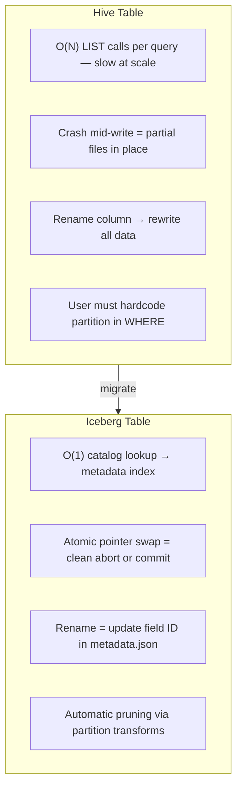

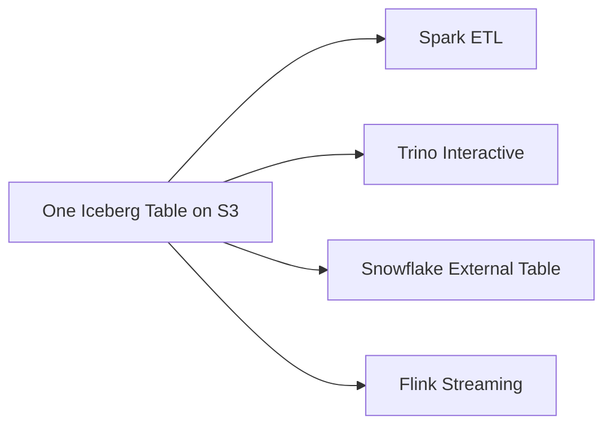

**Answer structure:**
```
1. Table format (Iceberg) decouples the table from the engine and
   from the directory layout — the metadata tree is the table
2. One copy of data, three engines reading it, no format lock-in
3. ACID via catalog CAS — crashes leave orphans, never corruption
4. Migration path: shadow table + backfill + cutover (see Q6)
```

---

## 2. Why Iceberg? (vs Hive Format)

### The Core Problem with Hive

In Hive, **the directory IS the table**. Files are discovered by listing directories on S3/HDFS.

| Problem | Detail |
| :--- | :--- |
| **Slow metadata** | Listing files is `O(N)` on object storage — extremely slow at scale |
| **No ACID** | A crashed Spark job mid-write leaves partial/corrupt data in directories |
| **Fragile schema evolution** | Renaming a column breaks existing data or forces full rewrites |
| **Partition must be in query** | Users must know physical layout to get partition pruning |

### Iceberg's Core Insight

> **The table is defined by a canonical list of files, not a directory structure.**

**Alex:** I keep hearing "table format." Isn't Parquet already a format?

**Sam:** Parquet is the *file format* — it defines how rows are packed inside a single file. Iceberg is the *table format* — it defines how the collection of Parquet files is organized into a table. Think of Parquet as the page layout inside a book, and Iceberg as the book's table of contents + index + revision history. You can swap page layouts (Parquet ↔ ORC) and the table of contents still works.

**Alex:** And the catalog? Hive has a metastore, Iceberg uses one too — what's different?

**Sam:** The catalog is just a pointer store. It holds one thing: "this table's current metadata.json is at `s3://.../00002-metadata.json`." In Hive, the metastore also stores partition lists, file locations, statistics — the full inventory. Iceberg stores all that inside the metadata tree on S3. The catalog is thin. That's why you can swap from Hive Metastore to Glue to a REST catalog without touching a single data file. The table lives in the files, not in the catalog.

Iceberg tracks every data file at the metadata layer. This enables:
- ✅ Full ACID transactions (atomic commits via snapshot isolation)
- ✅ Time travel (every write creates an immutable snapshot)
- ✅ Schema evolution (rename, reorder, add, drop columns safely)
- ✅ Hidden partitioning (automatic partition pruning, no user burden)
- ✅ Partition evolution (change partitioning strategy without rewriting data)

---

## 3. Iceberg Metadata Architecture

When Spark/Trino reads an Iceberg table, it traverses a **4-tier metadata tree**:

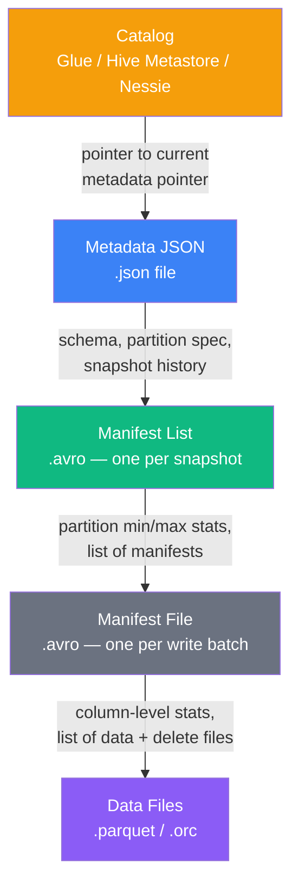

**What this looks like on S3 after one INSERT:**

```
s3://my-warehouse/events/
├── metadata/
│   ├── 00001-metadata.json              # schema, partition spec, list of snapshots
│   ├── snap-8494399784576965614-manifest-list.avro  # current snapshot → its manifests
│   ├── 00001-abcdef...-manifest.avro    # first write batch's manifest
│   ├── 00002-123456...-manifest.avro    # second write batch's manifest
│   └── version-hint.text                # tells the catalog which metadata.json is active
└── data/
    ├── event_time_day=20284/
    │   └── 00001-....parquet
    └── event_time_day=20285/
        └── 00002-....parquet
```

**Alex:** So the `metadata/` directory IS the table? Without it, the Parquet files are just bytes?

**Sam:** Exactly. The metadata tree is the table. The data directory only has value because the metadata knows how to find and interpret those files. That's why losing the metadata directory means losing the table — the connection between catalog pointer, manifest list, manifests, and files is severed.

**Alex:** What does one entry in a manifest file look like? I want to understand how pruning works at the byte level.

**Sam:** Each manifest entry is a row in an Avro file. Here's what one entry looks like conceptually. Take a file containing events for user_id range 1000-5000 on July 4-5, bucketed to partition 37:

```
Entry:
  status: 1 (ADDED)
  snapshot_id: 8494399784576965614
  data_file:
    content: 0 (DATA)
    file_path: s3://.../data/event_time_day=20266/00001.parquet
    file_format: PARQUET
    partition: event_time_day=20266, user_id_bucket=37
    record_count: 85000
    file_size_in_bytes: 268435456    (256 MB)
    column_sizes: {1: 120000, 2: 85000, 3: 65000}
    value_counts: {1: 85000, 2: 85000, 3: 85000}
    null_value_counts: {1: 0, 2: 0, 3: 120}
    lower_bounds:
      1: \x00\x00\x03\xe8   (user_id min = 1000, binary encoded)
      2: \x00\x00\x00\x00   (event_time min, binary encoded)
      3: \x40\x59\x00\x00   (amount min = 100.0, binary encoded)
    upper_bounds:
      1: \x00\x00\x13\x88   (user_id max = 5000)
      2: \x00\x00\x00\x01   (event_time max)
      3: \x40\x8f\x00\x00   (amount max = 255.0)
```

When a query filters `WHERE user_id = 42 AND amount > 1000.0`, the engine reads the upper_bounds for user_id (5000) and lower_bounds for amount (100.0). The file contains user_id up to 5000 but the query wants user_id 42 — lower_bounds[user_id] = 1000, so 42 is below the minimum. The file is pruned at the manifest level without reading a single byte of Parquet data. This is the entire point of the metadata tree.

**Alex:** And the content field — 0 for data, 1 for position deletes, 2 for equality deletes?

**Sam:** Right. In v2+ manifests, every file entry carries that `content` field. The engine sees `content: 0` and reads it normally. `content: 1` means apply position-level anti-join. `content: 2` means filter by column values from the equality delete file.

**Why this matters for query planning:**

A query engine uses the stats at each layer to **prune aggressively before reading any data**:
1. Manifest List stats → skip entire manifests whose partitions don't overlap the filter
2. Manifest File stats → skip individual Parquet files whose column ranges don't overlap

This is far more powerful than Hive's directory listing approach.

### Concrete Query Trace

Trace a query step-by-step through the 4-tier tree:

```sql
SELECT SUM(amount) FROM events
WHERE event_time >= '2026-07-01' AND event_time < '2026-07-08';
```

```
Step 1 — Catalog lookup (milliseconds):
  Engine asks Glue catalog: "where is table events?"
  Catalog returns: s3://warehouse/events/metadata/00001-metadata.json
  (This is a single GetObject call — no listing)

Step 2 — Read metadata.json (1 HTTP GET):
  Engine reads 00001-metadata.json from S3
  Finds:
    current-snapshot-id: 8494399784576965614
    snapshot location: metadata/snap-8494399784576965614-manifest-list.avro
    partition spec: days(event_time), partition ID 0
  (Still no file listing — one GET + one pointer)

Step 3 — Read manifest list (1 HTTP GET):
  Engine reads the Avro manifest list file
  Finds 3 manifest entries, each with partition summary:

  Manifest A: partition range [20266, 20273]   days since epoch = July 1-7
  Manifest B: partition range [20250, 20265]   June 15-30
  Manifest C: partition range [20274, 20284]   July 9-14

Step 4 — Prune at manifest list level (zero data reads):
  Query filter: days >= 20266 AND days < 20273
  Manifest A: [20266, 20273] overlaps → INCLUDE
  Manifest B: [20250, 20265] ends at 20265, filter starts at 20266 → SKIP
  Manifest C: [20274, 20284] starts at 20274, filter ends at 20273 → SKIP

Step 5 — Read included manifests (1 HTTP GET):
  Engine fetches only Manifest A from S3
  Contains 50 file entries with column-level stats.

  Two entries that pass column pruning:
    File 001: user_id min=1000, max=5000, amount min=0.0, max=500.0
             event_time min=July 1, max=July 7 → INCLUDE
    File 002: user_id min=42, max=42, amount min=250.0, max=250.0
             event_time min=July 3, max=July 3 → INCLUDE

Step 6 — Prune at manifest file level (column bounds):
  48 of 50 files pruned because their amount or event_time bounds
  don't overlap the query filter. Only 2 files remain.

Step 7 — Read data files (2 Parquet GETs):
  Engine fetches and scans only 2 Parquet files instead of 50.
  Applies residual filter on amount, computes SUM.
  Returns result.

Total: 4 S3 GETs (catalog pointer, metadata.json, manifest list, 1 manifest)
       + 2 Parquet reads = 6 network calls
Instead of: 50+ Parquet reads + directory listing O(N) on S3
```

**Alex:** So the whole query spends 4 GETs on metadata and only 2 on data?

**Sam:** For this case, yes. But the ratio depends on the table. If the partition range is wide (e.g., full table scan), you read all manifests and fewer files are pruned. If column stats are missing or coarsely truncated, pruning power drops. The key insight: Iceberg converts the O(N) listing problem into a controlled metadata walk that's limited by the manifest tree depth, not the file count.

---

## 4. Hidden Partitioning

### Problems with Hive Partitioning

**Hive table creation forces a redundant column:**
```sql
CREATE TABLE events (
    user_id    BIGINT,
    event_type STRING,
    event_time TIMESTAMP,
    amount     DOUBLE
)
PARTITIONED BY (dt STRING);  -- redundant! event_time already contains the date
```

**Problem 1 — Data can go out of sync:**
```sql
-- Bad ETL writes row to wrong partition!
INSERT INTO events PARTITION (dt='2026-07-01')
VALUES (1, 'click', '2026-07-14 10:30:00', 5.0);
-- event_time says July 14, but it's in the July 1 partition. Silent data corruption.
```

**Problem 2 — Users must know physical layout:**
```sql
-- This causes a FULL TABLE SCAN because filter is on event_time, not dt
SELECT * FROM events WHERE event_time >= '2026-07-01';

-- Users MUST write this to get pruning:
SELECT * FROM events WHERE dt >= '2026-07-01' AND event_time >= '2026-07-01';
```

**Problem 3 — Changing partition strategy requires full data rewrite:**
- Daily → Hourly? Rewrite petabytes, swap table references, pray nothing breaks.

---

### Partition Transforms

Iceberg defines partitioning as a **transform applied to an existing column** — not a new column:

```sql
CREATE TABLE events (
    user_id    BIGINT,
    event_type STRING,
    event_time TIMESTAMP,   -- only ONE timestamp column, no 'dt'
    amount     DOUBLE
)
USING iceberg
PARTITIONED BY (days(event_time));  -- 'days()' is a transform, not a column
```

| Transform | Input | Output | Best For |
| :--- | :--- | :--- | :--- |
| `identity(col)` | Any | Exact value | Low-cardinality cols (e.g., country, status) |
| `days(col)` | Timestamp | Integer day since epoch | Day-level time-series |
| `hours(col)` | Timestamp | Integer hour since epoch | High-frequency streaming |
| `months(col)` | Timestamp | Integer month since epoch | Monthly reporting tables |
| `years(col)` | Timestamp | Integer year since epoch | Long-lived archival tables |
| `bucket(N, col)` | Any | Integer in `[0, N)` | High-cardinality join keys |
| `truncate(W, col)` | String/Int | Trimmed prefix/range | String prefix range scans |

---

### Write Path & Read Path

**Write Time** (row with `event_time = '2026-07-14 10:30:00'`):

```
1. Iceberg computes: days('2026-07-14 10:30:00') → 20284 (days since epoch)

2. Writes row to:
   s3://bucket/warehouse/events/data/event_time_day=20284/0001.parquet
   
   NOTE: The Parquet file contains the original 'event_time' column, NOT 'dt'.
         The partition value 20284 exists ONLY in the manifest metadata.

3. Manifest File records this file with partition value: 20284
```

**Read Time** (user queries `WHERE event_time >= '2026-07-01' AND event_time < '2026-07-08'`):

```
Query Engine:

1. Reads Manifest List → finds all Manifest Files
2. For each Manifest File, checks partition stats (using days() transform on filter bounds):
   - Manifest A: partition range [20266, 20273]  (July 1–7)  → INCLUDE ✅
   - Manifest B: partition range [20250, 20265]  (June 15–30) → SKIP   ❌
   - Manifest C: partition range [20274, 20284]  (July 9–14)  → SKIP   ❌

3. Reads only Manifest A → gets list of Parquet files

4. For each Parquet file, checks column-level stats:
   - File 001: event_time min=July1, max=July1  → INCLUDE ✅
   - File 002: event_time min=July3, max=July7  → INCLUDE ✅

5. Scans only 2 files. User wrote a normal WHERE clause. No awareness of partitioning needed.
```

---

### Partition Evolution

Change partitioning strategy with **zero data rewrites**:

```sql
-- Switch from daily to hourly partitioning
ALTER TABLE events
REPLACE PARTITION FIELD days(event_time) WITH hours(event_time);
```

**What happens internally:**

```
Before (Partition Spec ID: 1):         After (Partition Spec ID: 2):
  days(event_time)                       hours(event_time)

Old files (untouched):                 New files (going forward):
  data/event_time_day=20266/             data/event_time_hour=486384/
  data/event_time_day=20267/             data/event_time_hour=486385/
  ...                                    ...
```

Each Manifest File stores its **Spec ID**. At query time, Iceberg evaluates the filter against:
- Old manifests using Spec ID 1 (days transform) → correct pruning on old data
- New manifests using Spec ID 2 (hours transform) → correct pruning on new data

**Result: No downtime. No rewrite. No migration. Both old and new data queryable with the same SQL filter.**

---

### Buckets vs Identity

**Never use `identity()` on high-cardinality columns:**
```
identity(user_id) with 10 million users →
  data/user_id=1/
  data/user_id=2/
  ...
  data/user_id=10000000/    ← 10M tiny partitions, S3 listing explosion!
```

**Use `bucket(N, col)` instead:**
```
bucket(100, user_id):
  user_id=1   → hash(1)  % 100 = bucket 37
  user_id=2   → hash(2)  % 100 = bucket 91
  user_id=50  → hash(50) % 100 = bucket 37   (same bucket, different user)

  data/user_id_bucket=37/   ← only 100 partitions total, evenly distributed
  data/user_id_bucket=91/
```

**Bonus: Co-located Joins.** If two large tables are both bucketed by `bucket(100, user_id)`, the query engine can join bucket 37 from table A with bucket 37 from table B on each executor — **no full shuffle needed**.

---

### Common Mistakes

**Mistake 1 — Over-partitioning:**
```sql
-- BAD: 24 hours × 50 countries × 10 device_types = 12,000 partitions/day
PARTITIONED BY (hours(event_time), identity(country), identity(device_type))
```
- Each partition has tiny files → manifest overhead explodes
- **Rule of thumb:** Each partition file should be 128MB–512MB minimum

**Mistake 2 — Partition strategy misaligned with query patterns:**
```sql
-- You partition by user_id bucket, but 90% of queries filter by event_time
PARTITIONED BY (bucket(100, user_id))
-- Result: zero partition pruning for your most common queries!
```
Always ask: *"What does 90% of my WHERE clause look like?"* — partition for that.

---

## 5. Row-Level Updates: CoW vs MoR

Iceberg supports two strategies for `UPDATE` and `DELETE`. Choose based on read/write ratio.

| Feature | **Copy-on-Write (CoW)** | **Merge-on-Read (MoR)** |
| :--- | :--- | :--- |
| **How it works** | Rewrites entire data file containing affected rows immediately | Writes a separate Delete File; original data file untouched |
| **Write perf** | Slower (high write amplification) | Very fast (minimal write amplification) |
| **Read perf** | Fast (normal Parquet scan) | Slower (engine merges data + delete files at read time) |
| **Best for** | Read-heavy, infrequent updates (historical analytical tables) | Write-heavy, CDC pipelines, near-real-time streaming |

### Delete File Types

**Position Deletes:**
- Delete file contains: `(file_path, row_position)` pairs
- At read time: engine does an anti-join on row positions
- Fast to read, slightly slower to write (must look up positions)

**Equality Deletes:**
- Delete file contains: column-value pairs (e.g., `id = 123`)
- At read time: engine scans data files and filters out matching rows
- Extremely fast to write (ideal for high-throughput streaming), higher read cost

> **Production note:** With many MoR deletes accumulating over time, run **compaction** regularly
> to merge data files and delete files into clean, rewritten Parquet files (restores CoW-like read perf).

```sql
-- Spark compaction via Iceberg's rewrite procedure
CALL catalog.system.rewrite_data_files(
  table => 'my_db.events',
  strategy => 'binpack',
  options => map('min-file-size-bytes', '134217728')  -- 128MB
);
```

**Alex:** Walk me through the write amplification numbers. How bad is CoW in practice?

**Sam:** Say 10,000 Parquet files, each 256 MB. An UPDATE touches rows in 500 of them. CoW reads all 500, filters out the affected rows into new files, writes 500 new files. That's 500 × 256 MB = 128 GB read and 128 GB written — just to update a few thousand rows.

**Alex:** And MoR?

**Sam:** MoR writes one position delete file with `(file_path, row_position)` pairs — typically a few KB. The original 500 data files are untouched. But every reader must now merge those data files with the delete file at read time, performing an anti-join on row positions. Fast write, slower read.

**Alex:** And the delete file's `content` field — that's how the engine knows it's a delete file, not a data file?

**Sam:** Yes. In v2 manifests, every file entry has a `content` field: 0 = DATA, 1 = POSITION DELETES, 2 = EQUALITY DELETES. The engine reads the manifest, sees `content = 1`, and knows to apply an anti-join. `content = 2` means filter by column values. Without that field, the engine wouldn't know how to interpret the file.

---

## 6. Time Travel & Snapshot Cleanup

Every write operation creates an immutable **Snapshot**. Old snapshots and their data files are retained until explicitly expired.

**Querying historical data:**
```sql
-- By timestamp
SELECT * FROM events FOR SYSTEM_AS_OF '2026-07-01 12:00:00';

-- By snapshot ID (from metadata history)
SELECT * FROM events FOR VERSION AS OF 8494399784576965614;

-- List all snapshots
SELECT * FROM events.snapshots;
```

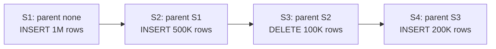

**Alex:** Each snapshot is a full copy of the table?

**Sam:** No — each snapshot is a complete *view* with its own manifest list, but data files are shared. S1 references files A, B, C. S2 adds D, E but still references A, B, C from its manifest list. Files are not duplicated. When you expire S1, A, B, C are not deleted — S2 still needs them. Physical deletion only happens when the *last* snapshot referencing a file is expired.

**Expire old snapshots (run as a scheduled maintenance job):**
```sql
-- Expire snapshots older than 7 days, keep at least 5 recent ones
CALL catalog.system.expire_snapshots(
  table => 'my_db.events',
  older_than => TIMESTAMP '2026-07-07 00:00:00',
  retain_last => 5
);
```

This physically **deletes orphaned Parquet files from S3** that are no longer referenced by any active snapshot. Without this, storage costs compound indefinitely.

**Alex:** A Flink job commits every 30 seconds. After 7 days, what does expire_snapshots actually delete?

**Sam:** 2 commits/min × 60 × 24 × 7 = 20,160 snapshots. expire_snapshots with `older_than = 7 days, retain_last = 10` removes all but the 10 most recent snapshots from metadata. Each removed snapshot's manifest list is deleted. Data files that were only referenced by those expired snapshots — files with `status = 1 (ADDED)` in a snapshot that is now gone, or files with `status = 2 (DELETED)` whose deletion snapshot is now gone — are physically deleted from S3. The actual `DELETE OBJECT` calls happen inside `expire_snapshots`.

**Wait — if a query is reading a snapshot that's being expired, it breaks?** That's why you set `older_than` far enough back. A query using `FOR SYSTEM_TIME AS OF` will hold a reference to that snapshot. expire_snapshots only expires snapshots older than `older_than` — so if your longest query runs 1 hour, set `older_than` to at least `NOW() - 1 hour - buffer`.

**Remove orphan files (safety net):**
```sql
-- Clean up files that exist on disk but are not tracked in any snapshot
CALL catalog.system.remove_orphan_files(table => 'my_db.events');
```

---

## 7. ACID Commits & Concurrent Writers

**Alex:** In interviews, people say Iceberg has ACID transactions on S3. But S3 does not support atomic directory rename like HDFS. What is actually atomic?

**Sam:** The atomic operation is not a file rename. It is the **catalog pointer swap** from the old metadata JSON to the new metadata JSON. Data files are written first, metadata is prepared next, and only then does the writer try to commit by updating the catalog pointer.

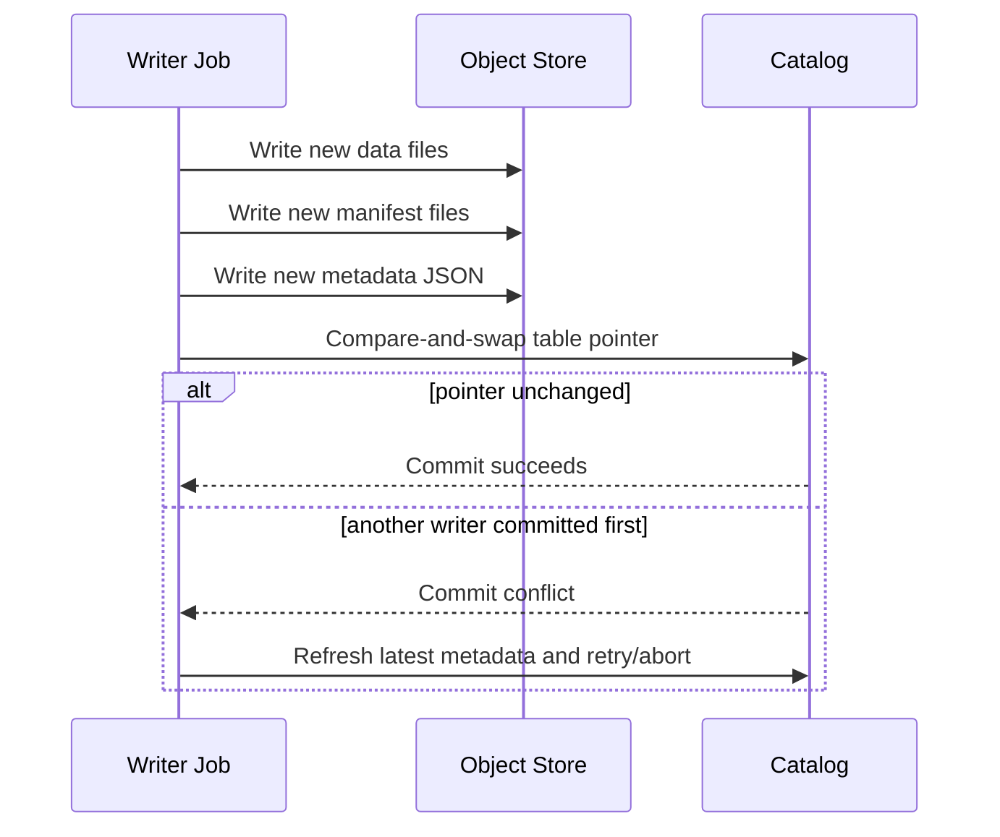

**Alex:** Walk me through the CAS mechanics. The catalog has a pointer to metadata/00001.json. What happens next?

**Sam:** The writer records that pointer value at the start. It writes new files and produces a new metadata/00002.json. To commit, it tells the catalog: "atomically swap the pointer FROM metadata/00001.json TO metadata/00002.json, but ONLY if it still points at metadata/00001.json." If another writer already committed 00002, the CAS fails. The writer reads the new pointer, rebases its work, and retries. No locks. No S3 transaction. Just one atomic metadata operation in the catalog.

**Alex:** So readers never see half-written files?

**Sam:** Correct. Readers start from the catalog's current metadata pointer. Until the pointer changes, new files are invisible even if they already exist in S3. If a job crashes before commit, those files are orphan files and can be cleaned later.

**Alex:** What conflicts are detected?

**Sam:** Iceberg uses optimistic concurrency. Two append-only writers can often both succeed after retry. But if one writer rewrites or deletes files that another writer also touched, Iceberg detects that the new snapshot is no longer based on the expected file set and rejects the unsafe commit.

---

## 8. Schema Evolution & Field IDs

**Alex:** Why is Iceberg safer than Hive for schema changes?

**Sam:** Iceberg tracks columns by stable **field IDs**, not just by column names or positions. That is why rename and reorder operations are metadata-only and do not corrupt old files.

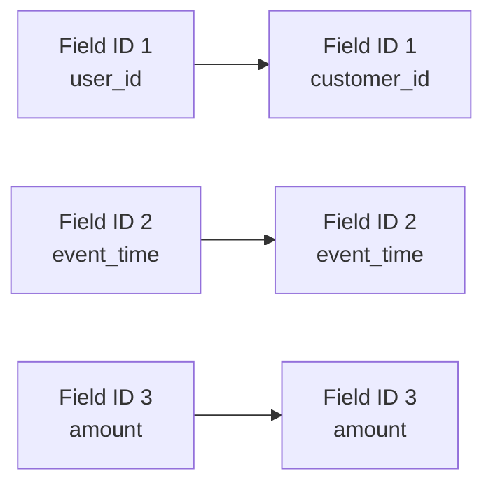

**Alex:** Give me the interview answer for rename.

**Sam:** In Hive-style tables, a rename can be ambiguous because readers may bind by name or position depending on file format and engine behavior. In Iceberg, `user_id` can be renamed to `customer_id` while keeping the same field ID. Old Parquet files do not need to be rewritten because the table metadata maps the current name to the same logical field.

**Alex:** Show me what that looks like inside metadata.json.

**Sam:** The metadata.json stores two things — the current schema and a schema history. When you rename:
```json
{
  "schema-id": 1,
  "schemas": [
    {
      "schema-id": 0,
      "fields": [
        {"id": 1, "name": "user_id",    "type": "long"},
        {"id": 2, "name": "event_time", "type": "timestamp"},
        {"id": 3, "name": "amount",     "type": "double"}
      ]
    },
    {
      "schema-id": 1,
      "fields": [
        {"id": 1, "name": "customer_id", "type": "long"}
        {"id": 2, "name": "event_time",  "type": "timestamp"},
        {"id": 3, "name": "amount",      "type": "double"}
      ]                           
    }
  ],
  "current-schema-id": 1
}
```
Old Parquet files still have column `user_id` in their schema. But Iceberg knows field ID 1 was renamed. The reader sees the query references `customer_id` → finds field ID 1 in current schema → looks up field ID 1 in the old file → finds `user_id` with the same ID → reads it. Column name mismatch doesn't matter because the binding is by ID, not name.

**Alex:** What about adding a column — do old files need to be rewritten to include it?

**Sam:** No. Iceberg assigns a new field ID (e.g., 4 for `device_type`). Old files simply don't have a column with ID 4. At read time, the Iceberg reader sees that field ID 4 is missing in the old Parquet schema and returns NULL for every row. Zero bytes rewritten. New files will include the column. This is why Iceberg schema evolution is metadata-only — no backfill needed.

**Safe evolution examples:**
```sql
ALTER TABLE events RENAME COLUMN user_id TO customer_id;
ALTER TABLE events ADD COLUMN device_type STRING;
ALTER TABLE events ALTER COLUMN amount TYPE DECIMAL(18, 2);
```

**Be careful with:**
- Dropping a column and later re-adding a column with the same name. It will get a new field ID, so it is a different logical column.
- Type changes that are not widening conversions. Validate engine support before production rollout.
- Nested struct changes. Iceberg supports them, but downstream engines and BI tools may lag.

---

## 9. Real Interview Questions

### Q1: "Iceberg vs Delta Lake vs Hudi — how do you choose?"

| Dimension | Iceberg | Delta Lake | Hudi |
|---|---|---|---|
| **Engine neutrality** | Best-in-class: Spark, Trino, Flink, Snowflake, BigQuery read the same table | Databricks-first; open-source Delta lags on non-Spark engines | Spark/Flink-first; Trino support weaker |
| **Metadata design** | Manifest tree (Avro) — engine-agnostic spec | Transaction log (`_delta_log` JSON) | Timeline-based metadata |
| **Partition evolution** | Yes, first-class (spec IDs) | No — change partitioning = rewrite | No |
| **Hidden partitioning** | Yes (transforms) | No (partition columns, but generated columns help) | No |
| **Streaming upserts** | Good (MoR + Flink) | Good (MERGE) | Best-in-class (built for CDC upserts) |
| **Vendor momentum** | Snowflake, Databricks (UniForm), Tabular, AWS | Databricks | Onehouse |

**Interview answer:** "Iceberg when engine neutrality matters — multiple
engines, avoiding lock-in, partition evolution. Delta when you're
all-in Databricks. Hudi when the primary workload is high-frequency
CDC upserts and the team already runs it. In 2026 the default for a
new multi-engine lakehouse is Iceberg."

### Q2: "Your Iceberg table has 50,000 small files after 3 months of streaming. Queries take 10 minutes. Diagnose and fix."

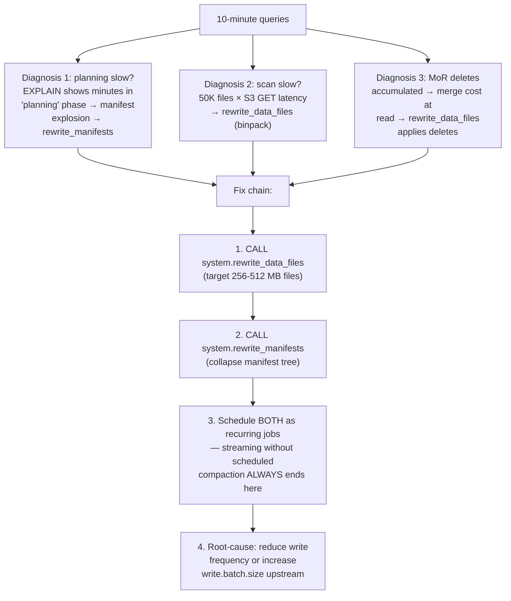

### Q3: "Two Spark jobs write to the same Iceberg table at the same time. Job A appends, Job B deletes. What happens?"

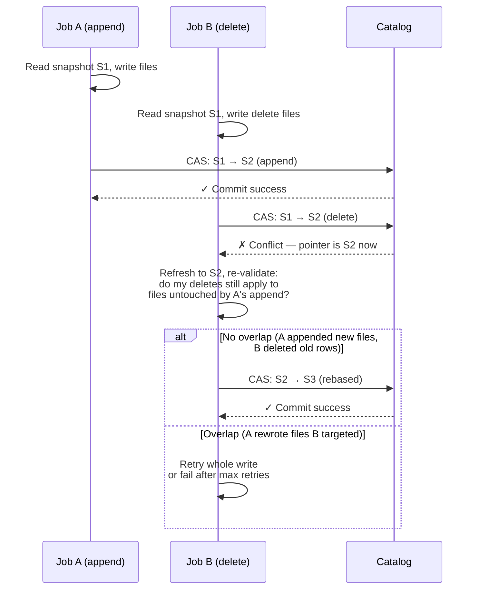

**Key:** Iceberg's optimistic concurrency does **conflict detection at
the file level**, not row level. Non-overlapping writes can both
succeed after rebase; overlapping writes retry. No locks, no blocking —
which is why it scales on S3.

### Q4: "GDPR request: delete all data for customer 42 across your lake. Tables are Iceberg on S3. Walk through it."

```
1. Identify tables with customer data (data catalog / lineage scan)

2. Delete at the format level per table:
   DELETE FROM table WHERE customer_id = 42;
   → MoR: writes equality delete files (fast, logical delete)
   → CoW: rewrites affected data files (slow, physical delete)

3. GDPR requires PHYSICAL deletion — MoR delete files are not enough:
   → run rewrite_data_files to materialize deletes into clean files
   → run expire_snapshots with older_than < request_date
     (old snapshots still contain the customer's data!)
   → run remove_orphan_files to drop unreferenced files

4. Verify: query all snapshots history; confirm files physically gone
   (orphan check + S3 prefix audit)

5. Watch out: derived tables, cached query results, and
   BI extracts also contain the data — lineage matters
```

**Interview trap:** "We ran DELETE, we're compliant." — No. Snapshots
retain the data until expired. Time travel and GDPR are in tension:
**your snapshot retention window is your maximum deletion latency.**

### Q5: "A Flink job commits to Iceberg every 30 seconds. After 2 weeks, query planning takes 40 seconds. Why, and fix?"

```
Math:
  30s per commit × 2 commits/min × 60 × 24 × 14 days
  = 40,320 snapshots
  Each snapshot = 1 manifest list + manifests
  → 40K+ metadata files; planner walks the tree per query

Fix (in order):
1. expire_snapshots(older_than => 7 days, retain_last => 10)
   → drops old manifest lists; planning time collapses
2. rewrite_manifests → compact surviving manifests
3. Reduce commit cadence upstream:
   checkpoint interval 30s → 5min (600 snapshots/day not 2,880)
   (trade: recovery granularity)
4. Set table properties so retention is automatic:
   'history.expire.max-snapshot-age-ms' = '604800000'  -- 7 days
   'history.expire.min-snapshots-to-keep' = '10'
```

### Q6: "Migrate a 500 TB Hive table to Iceberg with zero downtime. Plan?"

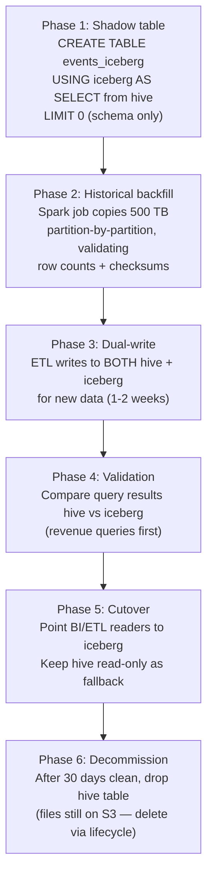

**Alternative for brave teams:** in-place migration (`migrate` Spark
procedure converts Hive → Iceberg by registering existing files in
Iceberg metadata — no data copy). Fast but: no re-layout, old files
keep Hive partitioning semantics, and rollback is painful. Use shadow
migration for anything business-critical.

### Q7: "Same query runs slower on Iceberg than on the old Hive table. Both on S3, same files. Why?"

**Likely causes:**
1. **Planning overhead:** Hive's metastore partition pruning was fast
   because the table had few partitions; Iceberg's manifest tree walk
   (S3 GETs per manifest) is slower for tables with many manifests
   → `rewrite_manifests`
2. **Stats missing:** Iceberg relies on column metrics in manifests;
   if written without metrics (`write.metadata.metrics`), the engine
   can't prune → rewrite with metrics enabled
3. **File sizes:** the migration preserved 10 MB files from the Hive
   layout; Hive's input format amortized differently → `rewrite_data_files`
4. **Engine integration:** older Trino/Spark versions have weaker
   Iceberg pushdown than Hive pushdown → upgrade; review the engine's
   Iceberg connector tuning docs for planning-time parallelism options

### Q8: "CDC pipeline: source adds a column mid-stream. Downstream Iceberg table, Spark structured streaming job. What breaks?"

**Answer:**
```
Avro source (registry) + Iceberg sink — the good path:
1. Registry adds field with default → BACKWARD compatible ✓
2. Spark schema evolves on read (reader schema from catalog)
3. Iceberg: ALTER TABLE ADD COLUMN → new field ID, metadata-only
4. Old files: new column reads as NULL (or default) ✓
5. New files: written with the new column ✓
   → Zero downtime. This is why people choose this stack.

JSON source (schema-on-read) — the fragile path:
1. New field appears in some records
2. Spark infers schema from sample → inconsistent types
   (first seen as long, later as double → cast failures)
3. Iceberg rejects commit on schema mismatch (if not auto-evolving)
4. Job fails → manual ALTER TABLE → restart
   → The failure mode is silent schema inference, not Iceberg.
```

### Q9: "REST catalog vs Hive Metastore vs AWS Glue for Iceberg — which catalog and why?"

| Catalog | Pros | Cons | Best for |
|---|---|---|---|
| **Hive Metastore** | Works everywhere, battle-tested | HMS scaling limits, single point, versioned API friction | Existing Hive estates |
| **AWS Glue** | Managed, IAM integration, no ops | AWS-only, throttling at high TPS, slow metadata at scale | AWS-centric shops |
| **REST catalog** | Decoupled, versioned API, multi-engine clean | You run the service (or use Tabular/Polaris) | Multi-engine, multi-cloud |
| **Nessie** | Git-like branching of tables (!) | Extra infra, niche | Experiment isolation, data-as-code |
| **JDBC catalog** | Simple, any RDBMS | Row-level locking limits concurrency | Small deployments |

**Interview answer:** "The catalog is just the CAS pointer store.
Glue for AWS-only, REST (Polaris/Tabular/Gravitino) for multi-engine
futures, HMS only if you're already there. The important interview
point: **catalog choice doesn't change the data layout — you can swap
catalogs without touching files.**"

---

## 10. Decision Trees

### 10.1 CoW vs MoR Selection

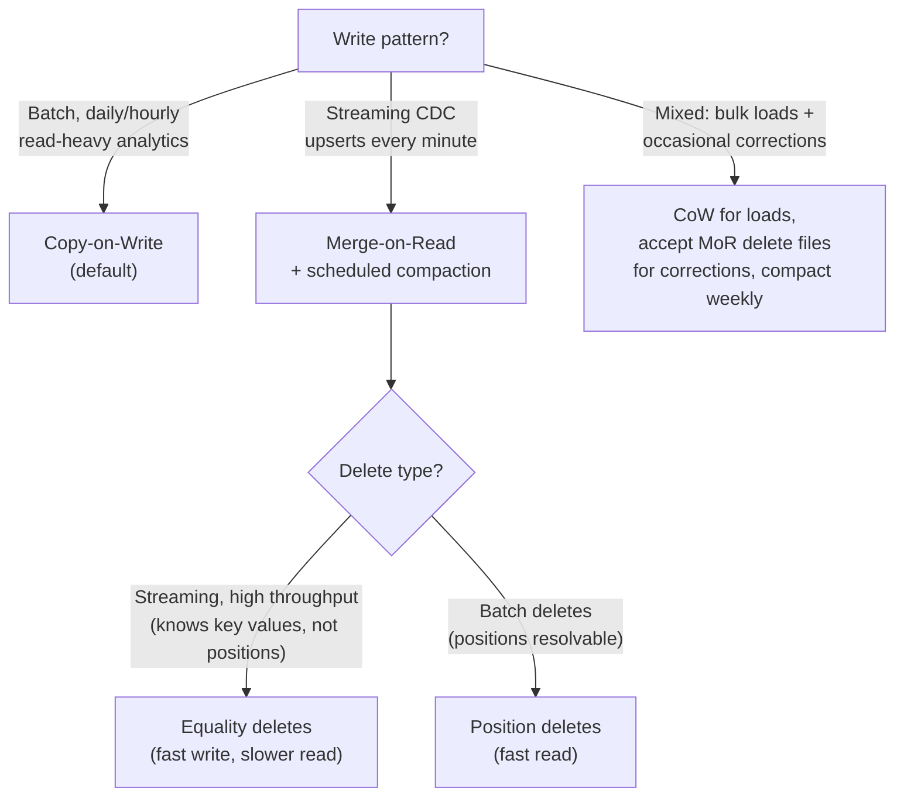

### 10.2 Partition Transform Selection

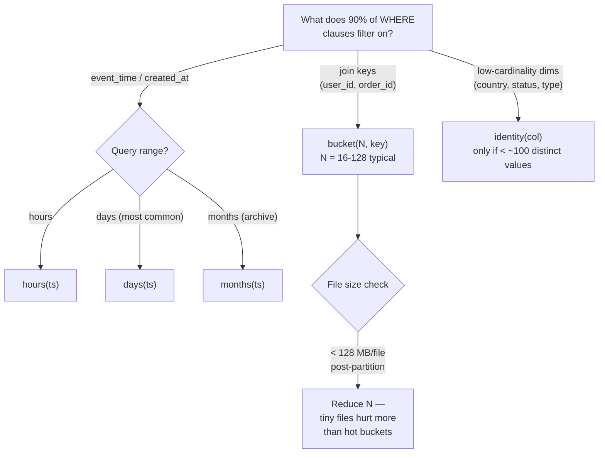

---

## 11. Operational Maintenance Playbook

**Alex:** What production jobs should I run for Iceberg tables?

**Sam:** Think of maintenance as keeping metadata, files, and delete files healthy. Iceberg avoids Hive's listing problem, but it still needs periodic cleanup and compaction.

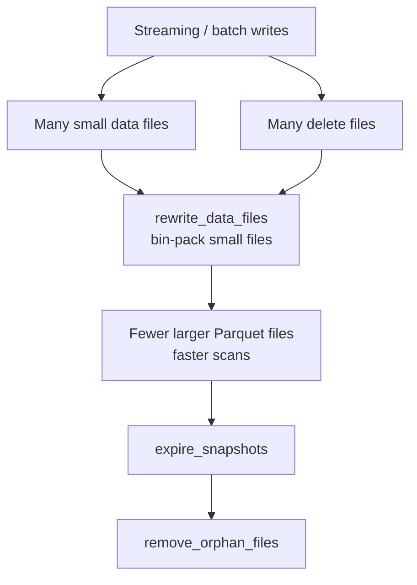

| Symptom | Likely Cause | Maintenance Action |
| :--- | :--- | :--- |
| Query planning is slow | Too many manifests / metadata files | `rewrite_manifests` |
| Scan reads many tiny files | Streaming or frequent small batches | `rewrite_data_files` |
| Reads slow after CDC deletes | MoR delete files accumulated | `rewrite_data_files` to apply deletes |
| Storage keeps growing | Old snapshots retained | `expire_snapshots` |
| Untracked files in table path | Failed jobs before commit | `remove_orphan_files` |

**Alex:** What is the one-liner staff answer?

**Sam:** Iceberg makes writes atomic through metadata commits, but production performance comes from maintenance: compact small files, rewrite manifests when planning slows, expire old snapshots based on retention policy, and remove orphan files after failed writes.

**Alex:** Give me the cron schedule for a production streaming table.

**Sam:** For a typical streaming table (Flink committing every 5 minutes):

```
Hourly:     rewrite_data_files(strategy='binpack', min-file-size=134217728)
            → bin-packs files < 128 MB into 256-512 MB files

Hourly:     rewrite_manifests()
            → collapses the manifest tree after compaction

Daily:      expire_snapshots(older_than=NOW() - 7 days, retain_last=5)
            → deletes snapshots older than 7 days, keeps 5 most recent

Daily:      remove_orphan_files()
            → cleans up files from failed commits

Table properties for automatic retention:
  'history.expire.max-snapshot-age-ms'     = '604800000'  (7 days)
  'history.expire.min-snapshots-to-keep'   = '10'
  'write.metadata.metrics.default'         = 'truncate(16)'
```

Schedule compaction during low-traffic windows. The hourly slot keeps file sizes healthy for nightly batch reads. Expiration runs daily because it does S3 bulk deletes and can take minutes on large tables.

---

## 12. Quick Reference — Interview Edition

| Question | Short Answer |
|---|---|
| **Iceberg in one line?** | Table = canonical list of files in metadata, not a directory — ACID, time travel, evolution on object storage |
| **Metadata tree?** | Catalog → metadata.json → manifest list → manifest files → data files |
| **What's atomic in a commit?** | Catalog pointer CAS swap to new metadata.json. Files written first, pointer last |
| **Crashed writer?** | Orphan files (invisible, pointer never moved) — clean with `remove_orphan_files` |
| **Concurrent writers?** | Optimistic: CAS fails → refresh → rebase → retry. File-level conflict detection |
| **Hidden partitioning?** | Transform on existing column (days/hours/bucket); pruning automatic; no redundant `dt` column |
| **Partition evolution?** | ALTER TABLE spec change; zero rewrite; old/new specs coexist via spec ID in manifests |
| **identity() on user_id?** | Never — high cardinality → partition explosion. Use `bucket(N, col)` |
| **CoW vs MoR?** | CoW: rewrite files (slow write, fast read). MoR: delete files (fast write, merge at read) — compact regularly |
| **Position vs equality deletes?** | Position: (file, row) pairs — fast read. Equality: (col=val) — fast write, ideal for streaming CDC |
| **Time travel?** | `FOR SYSTEM_TIME AS OF '...'` or `VERSION AS OF <snapshot_id>` |
| **Snapshot explosion?** | Streaming commits every 30s = 40K snapshots/2wks → planning crawls. `expire_snapshots` + longer checkpoint interval |
| **Small files after streaming?** | `rewrite_data_files` (binpack to 256-512 MB) + `rewrite_manifests` — schedule both |
| **Schema rename safe?** | Yes — field IDs, not names/positions. Re-added same-name column = NEW field ID |
| **GDPR delete on MoR?** | DELETE is logical until compaction. Physical deletion needs rewrite + expire_snapshots + remove_orphan_files |
| **Iceberg vs Delta vs Hudi?** | Iceberg: engine neutrality + partition evolution. Delta: Databricks. Hudi: CDC upsert-heavy |
| **Catalog swap cost?** | Low — catalog only stores the pointer; metadata.json lives with the data files |
| **Hive migration?** | Shadow table + backfill + dual-write + validate + cutover (safe) or in-place `migrate` (fast, keeps old layout) |

---

## 13. Resources

- [Apache Iceberg Official Docs](https://iceberg.apache.org/docs/latest/)
- [Iceberg Table Spec (deep internals)](https://iceberg.apache.org/spec/)
- [Iceberg Hidden Partitioning](https://iceberg.apache.org/docs/latest/partitioning/)
- [Hello Interview – Iceberg Deep Dive](https://www.hellointerview.com/learn/system-design/deep-dives/apache-iceberg)
- [Tabular Blog (Iceberg creators)](https://tabular.io/blog/)
- [Apache Iceberg Architecture Deep Dive (BigData Boutique)](https://bigdataboutique.com/blog/apache-iceberg-architecture-deep-dive) — layer-by-layer walkthrough of catalog, metadata files, manifest lists, manifests, data files; concrete example of what happens on disk when you create and write to a table
- [Deep Dive into Apache Iceberg Architecture: The Three Layers That Power Your Lakehouse (Snowflake Builders Blog)](https://medium.com/snowflake/deep-dive-into-apache-iceberg-architecture-the-three-layers-that-power-your-lakehouse-83c03403e503) — dissects catalog, metadata, and data layers with practical query trace example showing how hierarchical pruning narrows search from catalog → Parquet files
- [2025 Comprehensive Guide to Apache Iceberg (Alex Merced)](https://blog.datalakehouse.help/posts/2025-01-2025-comprehensive-apache-iceberg-guide/) — definitive yearly guide covering architecture, ecosystem, migration patterns, comparison with Delta Lake/Hudi
