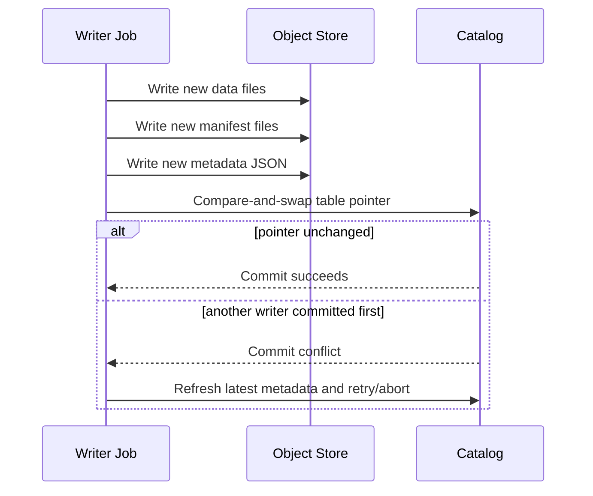
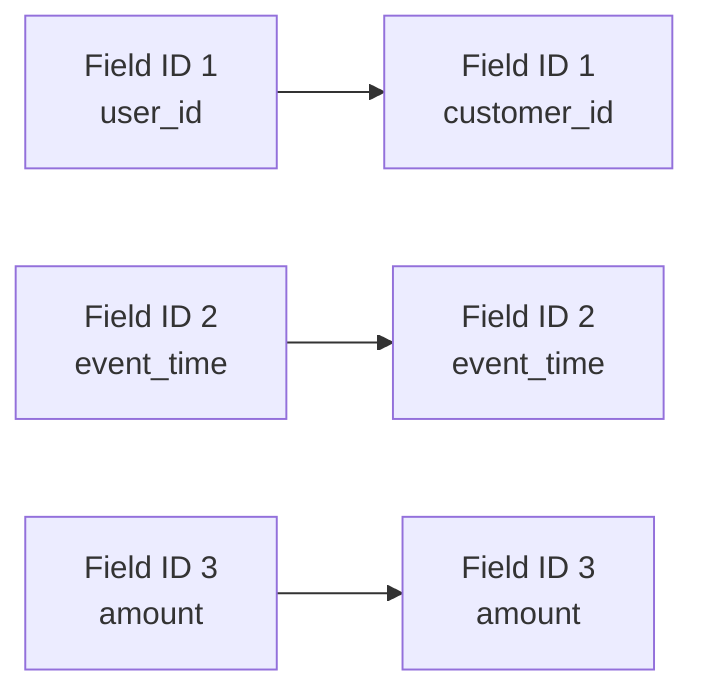
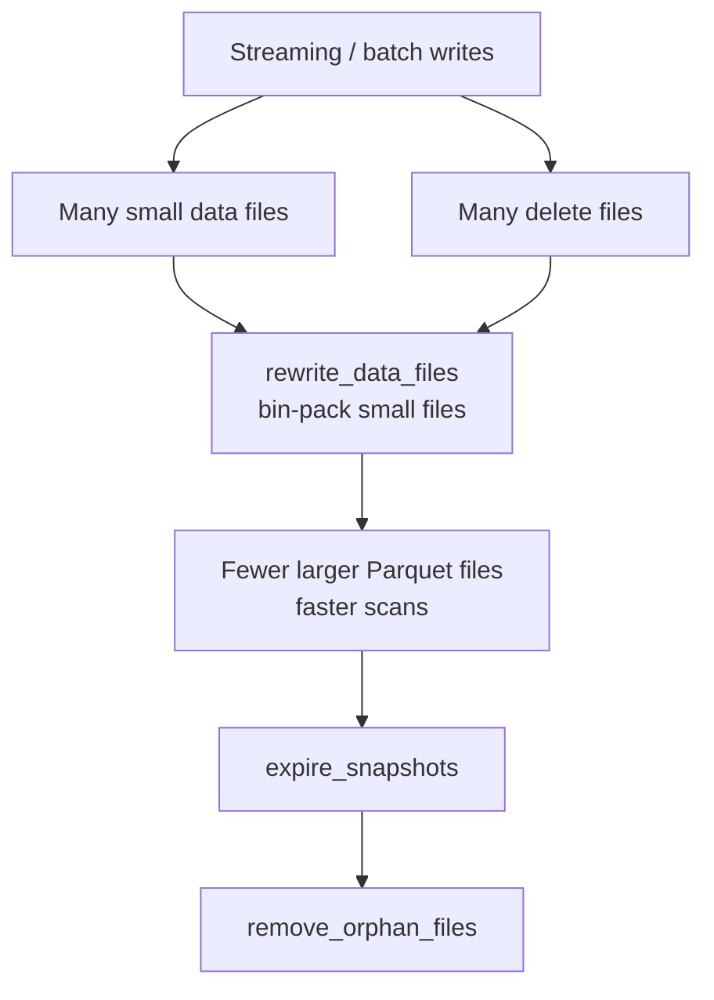

# Apache Iceberg — Interview Prep Notes

> Format: Senior DE (Alex) ↔ Staff DE (Sam) conversation series.
> Goal: Deep understanding for production use and senior/staff-level interviews.

---

## Table of Contents

1. [Why Iceberg? (vs Hive Format)](#1-why-iceberg-vs-hive-format)
2. [Iceberg Metadata Architecture](#2-iceberg-metadata-architecture)
3. [Hidden Partitioning](#3-hidden-partitioning)
   - [Problems with Hive Partitioning](#problems-with-hive-partitioning)
   - [Partition Transforms](#partition-transforms)
   - [Write Path & Read Path](#write-path--read-path)
   - [Partition Evolution](#partition-evolution)
   - [Buckets vs Identity](#buckets-vs-identity)
   - [Common Mistakes](#common-mistakes)
4. [Row-Level Updates: CoW vs MoR](#4-row-level-updates-cow-vs-mor)
   - [Delete File Types](#delete-file-types)
5. [Time Travel & Snapshot Cleanup](#5-time-travel--snapshot-cleanup)
6. [ACID Commits & Concurrent Writers](#6-acid-commits--concurrent-writers)
7. [Schema Evolution & Field IDs](#7-schema-evolution--field-ids)
8. [Operational Maintenance Playbook](#8-operational-maintenance-playbook)
9. [Quick Reference Cheatsheet](#9-quick-reference-cheatsheet)

---

## 1. Why Iceberg? (vs Hive Format)

### The Core Problem with Hive

In Hive, **the directory IS the table**. Files are discovered by listing directories on S3/HDFS.

| Problem | Detail |
| :--- | :--- |
| **Slow metadata** | Listing files is `O(N)` on object storage — extremely slow at scale |
| **No ACID** | A crashed Spark job mid-write leaves partial/corrupt data in directories |
| **Fragile schema evolution** | Renaming a column breaks existing data or forces full rewrites |
| **Partition must be in query** | Users must know physical layout to get partition pruning |

### Iceberg's Core Insight

> **The table is defined by a canonical list of files, not a directory structure.**

Iceberg tracks every data file at the metadata layer. This enables:
- ✅ Full ACID transactions (atomic commits via snapshot isolation)
- ✅ Time travel (every write creates an immutable snapshot)
- ✅ Schema evolution (rename, reorder, add, drop columns safely)
- ✅ Hidden partitioning (automatic partition pruning, no user burden)
- ✅ Partition evolution (change partitioning strategy without rewriting data)

---

## 2. Iceberg Metadata Architecture

When Spark/Trino reads an Iceberg table, it traverses a **4-tier metadata tree**:

Editable diagram: [`diagrams/metadata-tree.excalidraw`](diagrams/metadata-tree.excalidraw)

```
Catalog (Glue / Hive Metastore / Nessie)
   └── pointer to current Metadata JSON file
          │
          ▼
   Metadata JSON (.json)
   - Table schema
   - Partition spec
   - History of Snapshots
          │
          ▼
   Manifest List (.avro)             ← one per Snapshot
   - List of Manifest Files
   - Partition-level min/max stats   ← used to skip ENTIRE manifests
          │
          ▼
   Manifest File (.avro)             ← one per batch of data files
   - List of Data Files (Parquet/ORC)
   - Column-level stats per file     ← used for file-level pruning
   - List of Delete Files (MoR)
          │
          ▼
   Data Files (.parquet / .orc)
```

**Why this matters for query planning:**

A query engine uses the stats at each layer to **prune aggressively before reading any data**:
1. Manifest List stats → skip entire manifests whose partitions don't overlap the filter
2. Manifest File stats → skip individual Parquet files whose column ranges don't overlap

This is far more powerful than Hive's directory listing approach.

---

## 3. Hidden Partitioning

### Problems with Hive Partitioning

**Hive table creation forces a redundant column:**
```sql
CREATE TABLE events (
    user_id    BIGINT,
    event_type STRING,
    event_time TIMESTAMP,
    amount     DOUBLE
)
PARTITIONED BY (dt STRING);  -- redundant! event_time already contains the date
```

**Problem 1 — Data can go out of sync:**
```sql
-- Bad ETL writes row to wrong partition!
INSERT INTO events PARTITION (dt='2026-07-01')
VALUES (1, 'click', '2026-07-14 10:30:00', 5.0);
-- event_time says July 14, but it's in the July 1 partition. Silent data corruption.
```

**Problem 2 — Users must know physical layout:**
```sql
-- This causes a FULL TABLE SCAN because filter is on event_time, not dt
SELECT * FROM events WHERE event_time >= '2026-07-01';

-- Users MUST write this to get pruning:
SELECT * FROM events WHERE dt >= '2026-07-01' AND event_time >= '2026-07-01';
```

**Problem 3 — Changing partition strategy requires full data rewrite:**
- Daily → Hourly? Rewrite petabytes, swap table references, pray nothing breaks.

---

### Partition Transforms

Iceberg defines partitioning as a **transform applied to an existing column** — not a new column:

```sql
CREATE TABLE events (
    user_id    BIGINT,
    event_type STRING,
    event_time TIMESTAMP,   -- only ONE timestamp column, no 'dt'
    amount     DOUBLE
)
USING iceberg
PARTITIONED BY (days(event_time));  -- 'days()' is a transform, not a column
```

| Transform | Input | Output | Best For |
| :--- | :--- | :--- | :--- |
| `identity(col)` | Any | Exact value | Low-cardinality cols (e.g., country, status) |
| `days(col)` | Timestamp | Integer day since epoch | Day-level time-series |
| `hours(col)` | Timestamp | Integer hour since epoch | High-frequency streaming |
| `months(col)` | Timestamp | Integer month since epoch | Monthly reporting tables |
| `years(col)` | Timestamp | Integer year since epoch | Long-lived archival tables |
| `bucket(N, col)` | Any | Integer in `[0, N)` | High-cardinality join keys |
| `truncate(W, col)` | String/Int | Trimmed prefix/range | String prefix range scans |

---

### Write Path & Read Path

**Write Time** (row with `event_time = '2026-07-14 10:30:00'`):

```
1. Iceberg computes: days('2026-07-14 10:30:00') → 20284 (days since epoch)

2. Writes row to:
   s3://bucket/warehouse/events/data/event_time_day=20284/0001.parquet
   
   NOTE: The Parquet file contains the original 'event_time' column, NOT 'dt'.
         The partition value 20284 exists ONLY in the manifest metadata.

3. Manifest File records this file with partition value: 20284
```

**Read Time** (user queries `WHERE event_time >= '2026-07-01' AND event_time < '2026-07-08'`):

```
Query Engine:

1. Reads Manifest List → finds all Manifest Files
2. For each Manifest File, checks partition stats (using days() transform on filter bounds):
   - Manifest A: partition range [20266, 20273]  (July 1–7)  → INCLUDE ✅
   - Manifest B: partition range [20250, 20265]  (June 15–30) → SKIP   ❌
   - Manifest C: partition range [20274, 20284]  (July 9–14)  → SKIP   ❌

3. Reads only Manifest A → gets list of Parquet files

4. For each Parquet file, checks column-level stats:
   - File 001: event_time min=July1, max=July1  → INCLUDE ✅
   - File 002: event_time min=July3, max=July7  → INCLUDE ✅

5. Scans only 2 files. User wrote a normal WHERE clause. No awareness of partitioning needed.
```

---

### Partition Evolution

Change partitioning strategy with **zero data rewrites**:

```sql
-- Switch from daily to hourly partitioning
ALTER TABLE events
REPLACE PARTITION FIELD days(event_time) WITH hours(event_time);
```

**What happens internally:**

```
Before (Partition Spec ID: 1):         After (Partition Spec ID: 2):
  days(event_time)                       hours(event_time)

Old files (untouched):                 New files (going forward):
  data/event_time_day=20266/             data/event_time_hour=486384/
  data/event_time_day=20267/             data/event_time_hour=486385/
  ...                                    ...
```

Each Manifest File stores its **Spec ID**. At query time, Iceberg evaluates the filter against:
- Old manifests using Spec ID 1 (days transform) → correct pruning on old data
- New manifests using Spec ID 2 (hours transform) → correct pruning on new data

**Result: No downtime. No rewrite. No migration. Both old and new data queryable with the same SQL filter.**

---

### Buckets vs Identity

**Never use `identity()` on high-cardinality columns:**
```
identity(user_id) with 10 million users →
  data/user_id=1/
  data/user_id=2/
  ...
  data/user_id=10000000/    ← 10M tiny partitions, S3 listing explosion!
```

**Use `bucket(N, col)` instead:**
```
bucket(100, user_id):
  user_id=1   → hash(1)  % 100 = bucket 37
  user_id=2   → hash(2)  % 100 = bucket 91
  user_id=50  → hash(50) % 100 = bucket 37   (same bucket, different user)

  data/user_id_bucket=37/   ← only 100 partitions total, evenly distributed
  data/user_id_bucket=91/
```

**Bonus: Co-located Joins.** If two large tables are both bucketed by `bucket(100, user_id)`, the query engine can join bucket 37 from table A with bucket 37 from table B on each executor — **no full shuffle needed**.

---

### Common Mistakes

**Mistake 1 — Over-partitioning:**
```sql
-- BAD: 24 hours × 50 countries × 10 device_types = 12,000 partitions/day
PARTITIONED BY (hours(event_time), identity(country), identity(device_type))
```
- Each partition has tiny files → manifest overhead explodes
- **Rule of thumb:** Each partition file should be 128MB–512MB minimum

**Mistake 2 — Partition strategy misaligned with query patterns:**
```sql
-- You partition by user_id bucket, but 90% of queries filter by event_time
PARTITIONED BY (bucket(100, user_id))
-- Result: zero partition pruning for your most common queries!
```
Always ask: *"What does 90% of my WHERE clause look like?"* — partition for that.

---

## 4. Row-Level Updates: CoW vs MoR

Iceberg supports two strategies for `UPDATE` and `DELETE`. Choose based on read/write ratio.

| Feature | **Copy-on-Write (CoW)** | **Merge-on-Read (MoR)** |
| :--- | :--- | :--- |
| **How it works** | Rewrites entire data file containing affected rows immediately | Writes a separate Delete File; original data file untouched |
| **Write perf** | Slower (high write amplification) | Very fast (minimal write amplification) |
| **Read perf** | Fast (normal Parquet scan) | Slower (engine merges data + delete files at read time) |
| **Best for** | Read-heavy, infrequent updates (historical analytical tables) | Write-heavy, CDC pipelines, near-real-time streaming |

### Delete File Types

**Position Deletes:**
- Delete file contains: `(file_path, row_position)` pairs
- At read time: engine does an anti-join on row positions
- Fast to read, slightly slower to write (must look up positions)

**Equality Deletes:**
- Delete file contains: column-value pairs (e.g., `id = 123`)
- At read time: engine scans data files and filters out matching rows
- Extremely fast to write (ideal for high-throughput streaming), higher read cost

> **Production note:** With many MoR deletes accumulating over time, run **compaction** regularly
> to merge data files and delete files into clean, rewritten Parquet files (restores CoW-like read perf).

```sql
-- Spark compaction via Iceberg's rewrite procedure
CALL catalog.system.rewrite_data_files(
  table => 'my_db.events',
  strategy => 'binpack',
  options => map('min-file-size-bytes', '134217728')  -- 128MB
);
```

---

## 5. Time Travel & Snapshot Cleanup

Every write operation creates an immutable **Snapshot**. Old snapshots and their data files are retained until explicitly expired.

**Querying historical data:**
```sql
-- By timestamp
SELECT * FROM events FOR SYSTEM_AS_OF '2026-07-01 12:00:00';

-- By snapshot ID (from metadata history)
SELECT * FROM events FOR VERSION AS OF 8494399784576965614;

-- List all snapshots
SELECT * FROM events.snapshots;
```

**Expire old snapshots (run as a scheduled maintenance job):**
```sql
-- Expire snapshots older than 7 days, keep at least 5 recent ones
CALL catalog.system.expire_snapshots(
  table => 'my_db.events',
  older_than => TIMESTAMP '2026-07-07 00:00:00',
  retain_last => 5
);
```

This physically **deletes orphaned Parquet files from S3** that are no longer referenced by any active snapshot. Without this, storage costs compound indefinitely.

**Remove orphan files (safety net):**
```sql
-- Clean up files that exist on disk but are not tracked in any snapshot
CALL catalog.system.remove_orphan_files(table => 'my_db.events');
```

---

## 6. ACID Commits & Concurrent Writers

**Alex:** In interviews, people say Iceberg has ACID transactions on S3. But S3 does not support atomic directory rename like HDFS. What is actually atomic?

**Sam:** The atomic operation is not a file rename. It is the **catalog pointer swap** from the old metadata JSON to the new metadata JSON. Data files are written first, metadata is prepared next, and only then does the writer try to commit by updating the catalog pointer.

Editable diagram: [`diagrams/acid-commit-flow.excalidraw`](diagrams/acid-commit-flow.excalidraw)



**Alex:** So readers never see half-written files?

**Sam:** Correct. Readers start from the catalog's current metadata pointer. Until the pointer changes, new files are invisible even if they already exist in S3. If a job crashes before commit, those files are orphan files and can be cleaned later.

**Alex:** What conflicts are detected?

**Sam:** Iceberg uses optimistic concurrency. Two append-only writers can often both succeed after retry. But if one writer rewrites or deletes files that another writer also touched, Iceberg detects that the new snapshot is no longer based on the expected file set and rejects the unsafe commit.

---

## 7. Schema Evolution & Field IDs

**Alex:** Why is Iceberg safer than Hive for schema changes?

**Sam:** Iceberg tracks columns by stable **field IDs**, not just by column names or positions. That is why rename and reorder operations are metadata-only and do not corrupt old files.



**Alex:** Give me the interview answer for rename.

**Sam:** In Hive-style tables, a rename can be ambiguous because readers may bind by name or position depending on file format and engine behavior. In Iceberg, `user_id` can be renamed to `customer_id` while keeping the same field ID. Old Parquet files do not need to be rewritten because the table metadata maps the current name to the same logical field.

**Safe evolution examples:**
```sql
ALTER TABLE events RENAME COLUMN user_id TO customer_id;
ALTER TABLE events ADD COLUMN device_type STRING;
ALTER TABLE events ALTER COLUMN amount TYPE DECIMAL(18, 2);
```

**Be careful with:**
- Dropping a column and later re-adding a column with the same name. It will get a new field ID, so it is a different logical column.
- Type changes that are not widening conversions. Validate engine support before production rollout.
- Nested struct changes. Iceberg supports them, but downstream engines and BI tools may lag.

---

## 8. Operational Maintenance Playbook

**Alex:** What production jobs should I run for Iceberg tables?

**Sam:** Think of maintenance as keeping metadata, files, and delete files healthy. Iceberg avoids Hive's listing problem, but it still needs periodic cleanup and compaction.

Editable diagram: [`diagrams/maintenance-lifecycle.excalidraw`](diagrams/maintenance-lifecycle.excalidraw)



| Symptom | Likely Cause | Maintenance Action |
| :--- | :--- | :--- |
| Query planning is slow | Too many manifests / metadata files | `rewrite_manifests` |
| Scan reads many tiny files | Streaming or frequent small batches | `rewrite_data_files` |
| Reads slow after CDC deletes | MoR delete files accumulated | `rewrite_data_files` to apply deletes |
| Storage keeps growing | Old snapshots retained | `expire_snapshots` |
| Untracked files in table path | Failed jobs before commit | `remove_orphan_files` |

**Alex:** What is the one-liner staff answer?

**Sam:** Iceberg makes writes atomic through metadata commits, but production performance comes from maintenance: compact small files, rewrite manifests when planning slows, expire old snapshots based on retention policy, and remove orphan files after failed writes.

---

## 9. Quick Reference Cheatsheet

```
┌─────────────────────────────────────────────────────────────────────────┐
│                   ICEBERG INTERVIEW CHEATSHEET                          │
├──────────────────────┬──────────────────────────────────────────────────┤
│ CONCEPT              │ KEY POINT                                        │
├──────────────────────┼──────────────────────────────────────────────────┤
│ Metadata tree        │ Catalog → Metadata JSON → Manifest List          │
│                      │ → Manifest Files → Data Files                   │
├──────────────────────┼──────────────────────────────────────────────────┤
│ Hidden partitioning  │ Transform (days/hours/bucket) applied at write;  │
│                      │ auto-pruned at read. User writes normal SQL.     │
├──────────────────────┼──────────────────────────────────────────────────┤
│ Partition evolution  │ ALTER TABLE to change spec; zero data rewrite;   │
│                      │ old+new specs coexist via Spec ID in manifest.   │
├──────────────────────┼──────────────────────────────────────────────────┤
│ CoW                  │ Rewrites file on update. Slow writes, fast reads.│
│ MoR                  │ Appends delete files. Fast writes, slower reads. │
├──────────────────────┼──────────────────────────────────────────────────┤
│ Delete file types    │ Position: row_pos anti-join (fast read)          │
│                      │ Equality: col-val filter scan (fast write)       │
├──────────────────────┼──────────────────────────────────────────────────┤
│ Time travel          │ FOR SYSTEM_AS_OF '<timestamp>'                   │
│ Snapshot cleanup     │ expire_snapshots() + remove_orphan_files()       │
├──────────────────────┼──────────────────────────────────────────────────┤
│ ACID commits         │ Atomic catalog pointer swap to new metadata JSON │
│ Concurrency          │ Optimistic commit; refresh/retry on conflicts    │
├──────────────────────┼──────────────────────────────────────────────────┤
│ Schema evolution     │ Stable field IDs make rename/reorder safe        │
│                      │ Re-added same-name column gets a new field ID    │
├──────────────────────┼──────────────────────────────────────────────────┤
│ Compaction           │ rewrite_data_files() → merges small files +      │
│                      │ applies delete files for clean CoW reads.        │
├──────────────────────┼──────────────────────────────────────────────────┤
│ Partition anti-patt  │ identity() on high-cardinality → explosion       │
│                      │ Over-partitioning → small files, slow planning   │
│                      │ Partitioning misaligned with query access pattern │
└──────────────────────┴──────────────────────────────────────────────────┘
```

---

## Resources

- [Apache Iceberg Official Docs](https://iceberg.apache.org/docs/latest/)
- [Iceberg Table Spec (deep internals)](https://iceberg.apache.org/spec/)
- [Iceberg Hidden Partitioning](https://iceberg.apache.org/docs/latest/partitioning/)
- [Hello Interview – Iceberg Deep Dive](https://www.hellointerview.com/learn/system-design/deep-dives/apache-iceberg)
- [Tabular Blog (Iceberg creators)](https://tabular.io/blog/)
