# Apache Kafka — Interview Deep Dive

> Format: Senior DE (Alex) ↔ Staff DE (Sam) conversation series, plus
> real interview questions with full diagnosis walkthroughs.
> Goal: Deep understanding for production use and senior/staff-level interviews.

---

## Table of Contents

1. [The Opening Question](#1-the-opening-question)
2. [Why Kafka? The Log Abstraction](#2-why-kafka-the-log-abstraction)
3. [Architecture: Brokers, Partitions, KRaft](#3-architecture-brokers-partitions-kraft)
4. [Replication and ISR](#4-replication-and-isr)
5. [Producer Path: Acks, Batching, Idempotence](#5-producer-path-acks-batching-idempotence)
6. [Consumer Groups and Rebalancing](#6-consumer-groups-and-rebalancing)
7. [Delivery Semantics and Exactly-Once](#7-delivery-semantics-and-exactly-once)
8. [Retention and Log Compaction](#8-retention-and-log-compaction)
9. [Storage Internals: Why Kafka Is Fast](#9-storage-internals-why-kafka-is-fast)
10. [Real Interview Questions](#10-real-interview-questions)
11. [Decision Trees](#11-decision-trees)
12. [Kafka 4.0: KIP-848 & Tiered Storage](#12-kafka-40-kip-848--tiered-storage)
13. [Operational Playbook](#13-operational-playbook)
14. [Quick Reference — Interview Edition](#14-quick-reference--interview-edition)
15. [Resources](#15-resources)

---

## 1. The Opening Question

**Question:** *"Design a system that ingests 1 million clickstream events per second and makes them available to 5 different teams."*

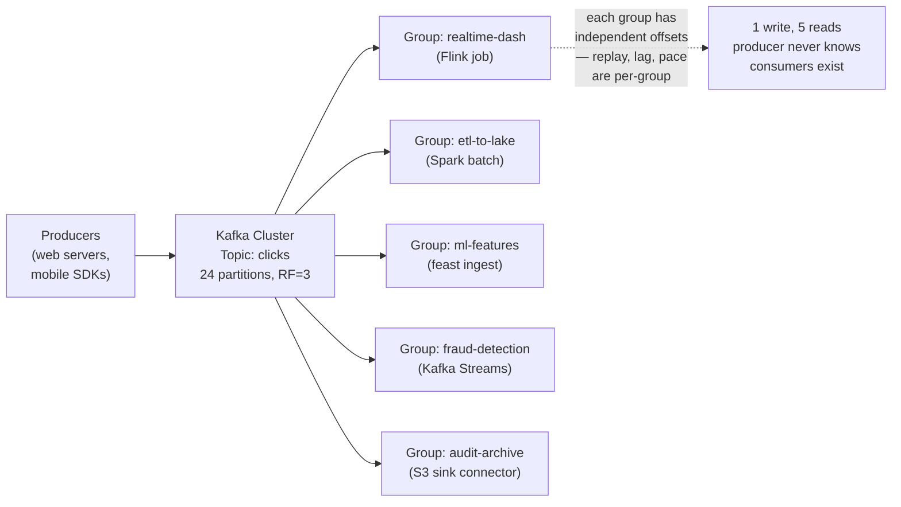

**Answer structure:**
```
1. Kafka as the central log: producers write once, each team reads
   independently via its own consumer group
2. Partitions for parallelism: 24 partitions → up to 24 consumers per group
3. RF=3 + durability triangle for no data loss
4. Retention 7 days → any team can replay a week of history
5. Schema Registry + Avro for contract enforcement between teams
```

---

## 2. Why Kafka? The Log Abstraction

### The Core Insight

> **Kafka is not a message queue. It is a distributed, append-only log with pub/sub semantics.**

| Property | Traditional Queue (RabbitMQ) | Kafka (Log) |
| :--- | :--- | :--- |
| Consumption model | Destructive — message deleted after ack | Non-destructive — offset moves, data stays |
| Multiple readers | Competing consumers on one queue | Many independent consumer groups |
| Replay | Not possible | Reset offset, re-read history |
| Ordering | Per queue | Per partition |
| Retention | Until consumed | Time/size-based, independent of consumption |

Because consumers only move an offset pointer, the same data can feed a real-time pipeline, a nightly backfill, and a new service onboarding — all at their own pace, without touching the producer.

### Why This Matters in Data Engineering

- **Decoupling**: producers and consumers evolve independently; schema registry enforces contracts.
- **Buffering**: Kafka absorbs burst traffic (CDC spikes, clickstream floods) so downstream systems process at their own rate.
- **Replayability**: reprocessing after a bug fix is an offset reset, not a re-ingest from source.

**Alex:** Everyone says "Kafka is a log, not a queue." What actually changes in how I design around it?

**Sam:** Three things. First, you stop worrying about "did the consumer get it" — the data sits there for 7 days regardless, so slow consumers are a lag metric, not a data-loss risk. Second, you design for replay from day one: every pipeline you build will be re-run someday, so make transformations idempotent. Third, retention becomes a design lever: a compacted topic is a database changelog, a 7-day topic is a stream buffer, a tiered-storage topic is an archive. Same system, three roles.

---

## 3. Architecture: Brokers, Partitions, KRaft

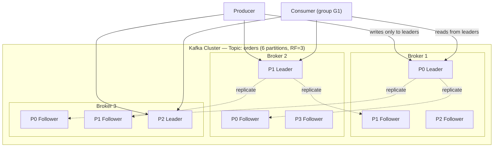

| Concept | Detail |
| :--- | :--- |
| **Partition** | Unit of parallelism and ordering. A partition lives on one broker's disk as a directory of segment files. |
| **Leader replica** | The only replica that serves reads/writes for its partition. |
| **Follower replica** | Passively fetches from the leader; eligible for promotion. |
| **Controller** | One broker elected (via KRaft) to manage metadata: partition assignments, leader elections, broker membership. |
| **KRaft** | Kafka's built-in Raft consensus (KIP-500). Replaced ZooKeeper; production-ready since 3.3, ZK fully removed in 4.0. |

### Why Partitions Are the Scaling Unit

- **Write scaling**: a topic with N partitions can accept N parallel write streams across brokers.
- **Read scaling**: within a consumer group, max active consumers = partition count. Extra consumers sit idle.
- **Ordering guarantee**: only *within* a partition. Global ordering requires one partition (and kills parallelism).

**Alex:** I need strict ordering for order events per customer. What do I do?

**Sam:** Use `customer_id` as the message key — Kafka hashes the key to a partition, so all events for one customer land in the same partition and stay ordered. The trap: if one customer produces 80% of traffic, their partition is hot. Ordering per key and even load are in tension when keys skew. If skew hits, you either accept it (that one partition is a bottleneck), or you salt keys and give up strict ordering. There is no config that gives both.

---

## 4. Replication and ISR

### ISR (In-Sync Replicas)

The **ISR** is the set of replicas caught up to the leader (within `replica.lag.time.max.ms`, default 30s).

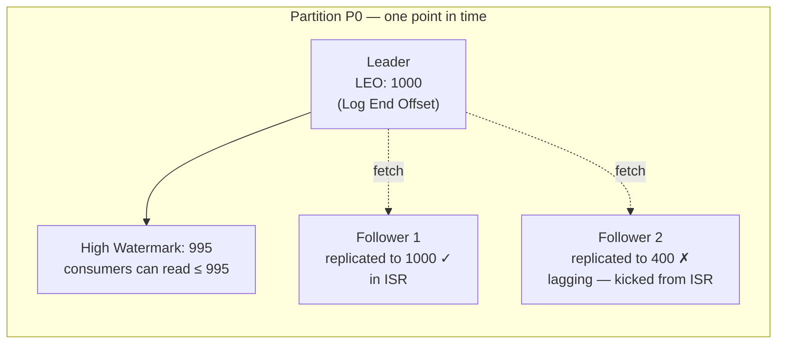

- **High watermark**: the highest offset replicated to *all* ISR members. Consumers can only read up to the high watermark — never unreplicated data.
- **Leader epoch** (KIP-101): a monotonic counter bumped on every leader election. Prevents the old high-watermark-truncation bug that could cause data loss/divergence when a failed leader rejoined.

### The Durability Triangle

For a partition that survives a broker failure without data loss:

```ini
replication.factor = 3
acks = all                              # producer waits for full ISR
min.insync.replicas = 2                 # write fails if ISR shrinks below 2
unclean.leader.election.enable = false  # never elect an out-of-sync replica
```

**Alex:** Why do people say `acks=all` alone is not enough?

**Sam:** Because "all" means "all *current* ISR members." If two followers have fallen out of ISR and only the leader remains, `acks=all` acknowledges after a single broker write. One broker crash later and the data is gone. `min.insync.replicas=2` closes that hole: the produce request *fails* when the ISR is smaller than 2, trading availability for durability. That is the correct trade for data you cannot re-derive.

> [!WARNING]
> `acks=all` alone is **not sufficient** for durability. It only waits for the current ISR, which can be a single broker. Always pair with `min.insync.replicas=2` (or higher) at the broker level. Without it, `acks=all` is just "acks=1 when followers are lagging."

**Alex:** What is actually committed when the leader acknowledges?

**Sam:** The leader appends to its local log (page cache, flushed asynchronously by the OS), waits until all ISR members have fetched past the new offset, advances the high watermark, then responds. Kafka does **not** fsync per message by default — durability comes from replication across machines, not from disk flush on one machine.

### Key Interview Answer

> Replication gives durability only when producer config, broker config, and replica health line up. The safe production profile is RF=3, `acks=all`, `min.insync.replicas=2`, unclean leader election disabled. Understand the high watermark: consumers never see uncommitted data, and the ISR membership defines what "committed" means at any moment.

---

## 5. Producer Path: Acks, Batching, Idempotence

### Write Path

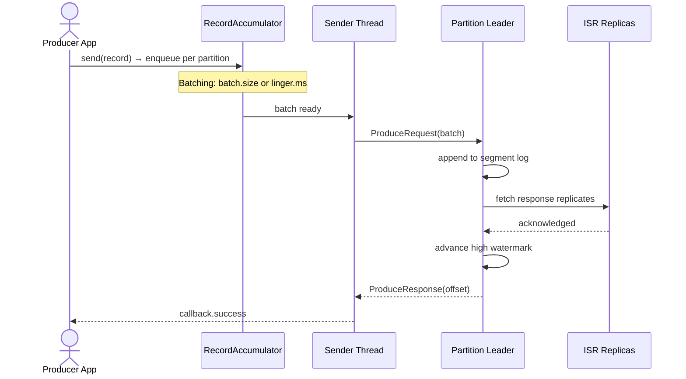

### Critical Configs

| Config | Default | Why it matters |
| :--- | :--- | :--- |
| `acks` | `all` (3.x) | `0`=fire-and-forget, `1`=leader only, `all`=full ISR |
| `enable.idempotence` | `true` (since 3.0) | Dedupes retries within a producer session via PID + sequence numbers |
| `linger.ms` | `0` | Small wait (5–20ms) dramatically improves batching/throughput |
| `batch.size` | 16KB | Per-partition batch cap |
| `compression.type` | `none` | `lz4`/`zstd` compress per-batch; CPU-for-bandwidth trade |
| `max.in.flight.requests.per.connection` | 5 | >1 is safe for ordering **only** because idempotence reorders on the broker |
| `delivery.timeout.ms` | 120s | Total budget for retries; must exceed `linger.ms` + `request.timeout.ms` |

**Alex:** Retries can reorder messages, right? How is that safe with 5 in-flight requests?

**Sam:** Without idempotence, it is not safe: batch 1 fails and retries while batch 2 succeeds — order flips. The idempotent producer fixes this by attaching a producer ID and per-partition sequence number to every batch. The broker detects gaps and duplicates, and holds out-of-order batches until the gap fills. That is why `max.in.flight=5` with idempotence preserves per-partition ordering.

**Alex:** What does idempotence *not* cover?

**Sam:** Two things. First, it is scoped to one producer session — if the producer process restarts, it gets a new PID, so a retry of "did my last write land?" across a restart can still duplicate. Second, it only covers the produce request itself, not multi-partition atomicity. For cross-partition or consume-transform-produce atomicity you need transactions with a stable `transactional.id`.

### Key Interview Answer

> The modern producer defaults (`acks=all`, idempotence on) already give ordered, duplicate-free single-partition writes within a session. Tuning is about the batching trade: `linger.ms` and `batch.size` exchange latency for throughput, and compression multiplies batch efficiency. Idempotence handles retry safety; transactions handle atomicity across partitions.

---

## 6. Consumer Groups and Rebalancing

### Group Semantics

- Each partition is consumed by **exactly one** consumer in a group → ordering + no double-processing within the group.
- Different groups are fully independent (each has its own offsets in `__consumer_offsets`).
- Max useful consumers per group = partition count.

### Rebalance Protocols

| Protocol | Behavior | Problem it solves |
| :--- | :--- | :--- |
| **Eager** (legacy) | Everyone revokes all partitions, full reassignment | — |
| **Cooperative sticky** (2.4+, default in 4.0) | Only moving partitions are revoked; the rest keep processing | Stop-the-world pauses on every deploy/scale event |
| **Static membership** (`group.instance.id`, KIP-345) | Restarted member keeps its assignment if back within `session.timeout.ms` | Rolling restarts no longer trigger rebalances at all |

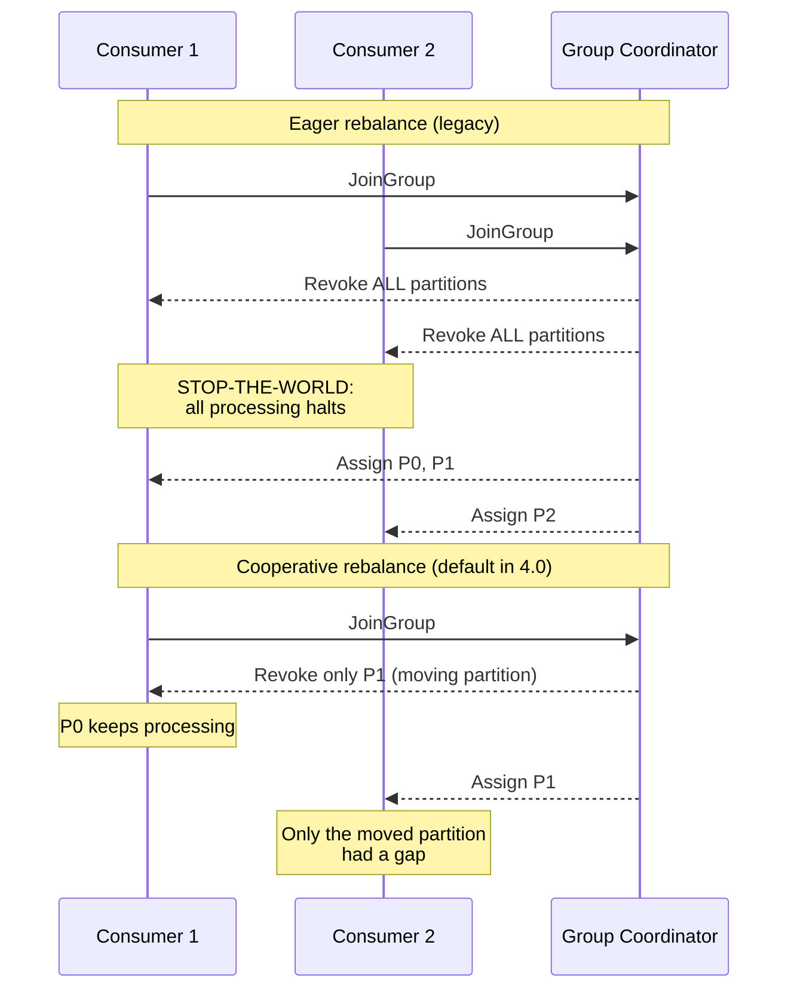

### Failure Detection — Two Timers People Confuse

| Timer | Default | Triggered by | Consequence |
| :--- | :--- | :--- | :--- |
| `session.timeout.ms` | 45s | Heartbeats stop (crash, network partition) | Broker kicks member → rebalance |
| `max.poll.interval.ms` | 5 min | `poll()` not called (slow processing loop) | Member voluntarily leaves → rebalance |

**Alex:** A consumer doing a slow batch write between polls keeps getting rebalanced. Heartbeats are fine. What is wrong?

**Sam:** That is the classic `max.poll.interval.ms` breach. The heartbeat thread says "I'm alive," but the group coordinator watches `poll()` calls as proof of *progress*. Five minutes without a poll means "stuck processing" — the member is removed and its partitions reassigned. Fixes in order of preference: shrink `max.poll.records` (default 500) so a batch finishes faster, move the slow write off the poll loop (pause/resume or a worker queue), or raise the interval as a last resort. Never just crank the timeout without understanding why processing is slow — you are masking the symptom.

**Alex:** When should offset commits be manual?

**Sam:** Any time you cannot tolerate reprocessing. Auto-commit commits the *polled* offsets on a timer, even if processing of those records is still in flight — a crash between poll and process loses data. Manual commit after successful processing gives at-least-once. Commit *before* processing gives at-most-once. There is no config that gives exactly-once for free; that is what transactions are for.

---

## 7. Delivery Semantics and Exactly-Once

| Semantic | How | Failure mode |
| :--- | :--- | :--- |
| **At-most-once** | Commit offsets, then process | Crash mid-processing → data loss |
| **At-least-once** | Process, then commit offsets | Crash after processing, before commit → duplicates |
| **Exactly-once** | Kafka transactions (`transactional.id`) | Higher latency, more coordination |

### What Kafka Transactions Actually Do

```mermaid
sequenceDiagram
    participant SRC as Input Topic
    participant APP as App (transactional.id=T1)
    participant OUT as Output Topic
    participant OFF as __consumer_offsets
    participant TC as Transaction Coordinator

    APP->>TC: beginTransaction()
    SRC->>APP: consume batch
    APP->>OUT: write output records
    Note over OUT: Invisible to read_committed<br/>consumers until commit
    APP->>OFF: write consumed offsets
    Note over OFF: Inside the same transaction
    APP->>TC: commitTransaction()
    TC->>OUT: 2PC: commit markers
    TC->>OFF: 2PC: commit markers
    Note over OUT,OFF: Atomic: offsets + output<br/>commit together or not at all
```

The key move: **input offsets and output records commit atomically.** A crash either commits both or neither — no duplicates, no loss, even across partitions.

**Alex:** So if my sink is Postgres, do Kafka transactions help?

**Sam:** No. Kafka transactions are atomic only across Kafka topics. The moment the sink is external — Postgres, S3, Iceberg — you are back to at-least-once plus an idempotent sink design: upsert by natural key, dedupe table, or a two-phase-commit sink like Flink's. "Exactly-once" in a job posting usually means "exactly-once *effect*," and the honest design is at-least-once delivery with idempotent writes.

### Key Interview Answer

> Within Kafka, exactly-once is real: idempotent producer plus transactions give atomic consume-transform-produce across partitions. Across system boundaries, exactly-once is a design pattern, not a config: at-least-once delivery plus an idempotent or transactional sink.

---

## 8. Retention and Log Compaction

### Time/Size Retention (default: `cleanup.policy=delete`)

- `retention.ms` default **7 days**, `retention.bytes` default unlimited (per partition).
- Deletion happens at **segment** granularity — the active segment is never deleted, so effective retention can exceed the configured value with few segments.

### Log Compaction (`cleanup.policy=compact`)

For keyed changelog topics (CDC, dimension tables):

```
Before:   k1→A  k2→X  k1→B  k3→P  k1→C  k2→null
After:    k2→X  k3→P  k1→C          (latest value per key; tombstone
                                     null kept for delete.retention.ms=24h, then removed)
```

- Guarantees: a consumer reading from the start always reconstructs the latest state per key.
- Compaction runs when the dirty ratio exceeds `min.cleanable.dirty.ratio` (default 0.5).
- **Tombstones** (`null` value) mark deletes; they linger for `delete.retention.ms` so lagging consumers still see the delete marker.

**Alex:** Can I use a compacted topic as a changelog for rebuilding downstream state?

**Sam:** That is exactly what it is for — Kafka Streams' state stores and sink caches are backed by compacted topics. But compaction is *not* a substitute for retention guarantees: it keeps the latest value per key, not every version. If you need event history for replay or audit, that belongs in a delete-policy topic or a lake, not a compacted one.

---

## 9. Storage Internals: Why Kafka Is Fast

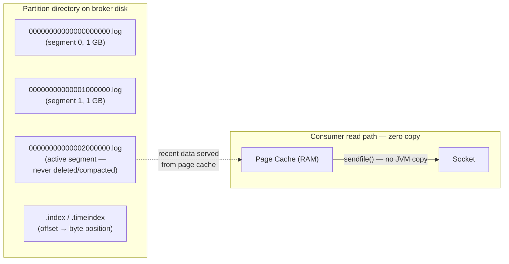

| Mechanism | Effect |
| :--- | :--- |
| **Sequential append I/O** | Disk writes are appends to segment files — sequential I/O is fast even on HDDs; no random seeks |
| **Page cache reliance** | Kafka writes go to OS page cache; reads of recent data are served from RAM without touching the process heap |
| **Zero-copy (`sendfile`)** | Broker transfers bytes from page cache to socket without copying into JVM userspace — CPU stays flat as consumers scale |
| **Segment files** | Partitions are directories of segments (`log.segment.bytes`, default 1GB) — deletion/compaction operate on whole segments |
| **Batching end-to-end** | Producer batches, broker appends batches, consumers fetch batches — per-message cost amortizes to near zero |

**Alex:** Why does Kafka not fsync every message? That sounds unsafe.

**Sam:** Because fsync-per-message would cap throughput at disk latency, and the durability unit in Kafka is *replication across machines*, not a single disk. The replicated-to-ISR ack means the data survives any single machine loss even if no disk was flushed. The only hole is a correlated multi-broker crash of the full ISR before any OS flush — a datacenter-level event you mitigate with rack awareness and multi-AZ placement, not with fsync.

---

## 10. Real Interview Questions

### Q1: "Your consumer lag is growing 10K messages/minute. Walk me through your diagnosis."

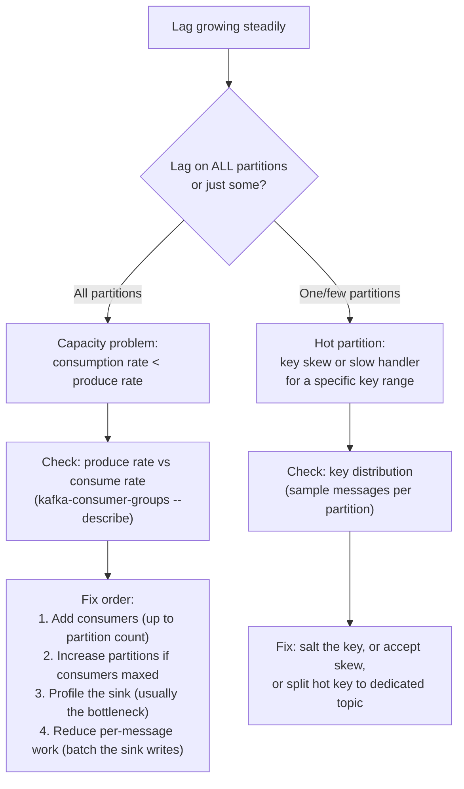

**The one-liner:** "Lag is a rate mismatch. Either the whole group is
under-provisioned (add consumers/partitions), or one partition is hot
(fix the key)."

### Q2: "After a deployment, all consumer groups pause for 30 seconds. Why, and how do you make deployments transparent?"

**Diagnosis:** Eager rebalance protocol — every member revokes all
partitions, full reassignment, processing halts group-wide.

**Fix:**
```ini
# 1. Static membership — restarted member keeps its assignment
group.instance.id=consumer-pod-42

# 2. Cooperative sticky assignor (default in 4.0)
partition.assignment.strategy=org.apache.kafka.clients.consumer.CooperativeStickyAssignor

# 3. Roll pods one at a time (K8s maxUnavailable=1)
```

**Result:** rolling restarts stop triggering rebalances entirely
(static membership), and when a rebalance does happen, only moving
partitions pause.

### Q3: "You see `NOT_ENOUGH_REPLICAS` errors and producers are blocked. What's happening?"

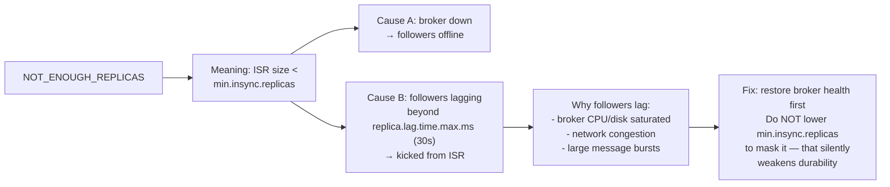

### Q4: "Design a pipeline: read from Kafka, transform, write to S3 as Parquet. Duplicates are unacceptable."

**Answer:**
```
1. Consume: at-least-once (process, then commit)
2. Transform: pure/deterministic functions only (no random(), no now()
   baked into output rows — use event time from the record)
3. Write: idempotent sink pattern:
   - Write to staging path: s3://bucket/staging/dt=.../attempt-N/
   - Dedup key: Kafka (topic, partition, offset) embedded in each row
   - Atomic commit: write a _SUCCESS marker only after all rows land
   - On retry: overwrite the same staging path (idempotent by path)
4. Downstream dedup (belt and braces):
   - Iceberg MERGE INTO on (topic, partition, offset) natural key
```

**Why not "just use exactly-once":** Kafka transactions end at the Kafka
boundary. S3 has no transaction coordinator. The design pattern is
at-least-once + idempotent writes + dedup by natural key.

### Q5: "Kafka is slow for one consumer group but fine for others. Same cluster, same topic. Why?"

**Likely causes, in order:**
1. **That group reads cold data**: other groups read from page cache
   (recent offsets); this group lags far behind and forces disk reads
   → check lag depth per group
2. **Fetch size too small**: `fetch.min.bytes` / `max.partition.fetch.bytes`
   limiting throughput for large messages
3. **Client-side bottleneck**: deserialization (e.g., Avro without
   schema caching), or slow per-message processing
4. **Tiered storage**: if lag exceeds hot-tier retention, every fetch
   hits S3 — expect 10-100x higher latency than page-cache reads

### Q6: "How many partitions should this topic have?" — the full framework

```
Inputs:
  P = target produce throughput (MB/s)
  C = target consume throughput (MB/s)
  p = single-partition produce rate (~10s of MB/s, message-size dependent)
  c = single-partition consume rate
  G = max consumers you'll ever need in the busiest group

Partition count = max( P/p, C/c, G ) + headroom

Example:
  P = 500 MB/s, p = 25 MB/s  → need ≥ 20 for writes
  G = 30 consumers planned    → need ≥ 30 for reads
  → 36 partitions (headroom), not 20 and not 100
```

**Costs of over-partitioning:** more file handles, more controller
metadata, longer leader-election storms on broker failure. **Cost of
under-partitioning:** parallelism ceiling you can't raise without
breaking per-key ordering (adding partitions re-hashes keys).

### Q7: "A compacted topic is 500 GB and growing. Consumers rebuilding state take 6 hours. Fix it."

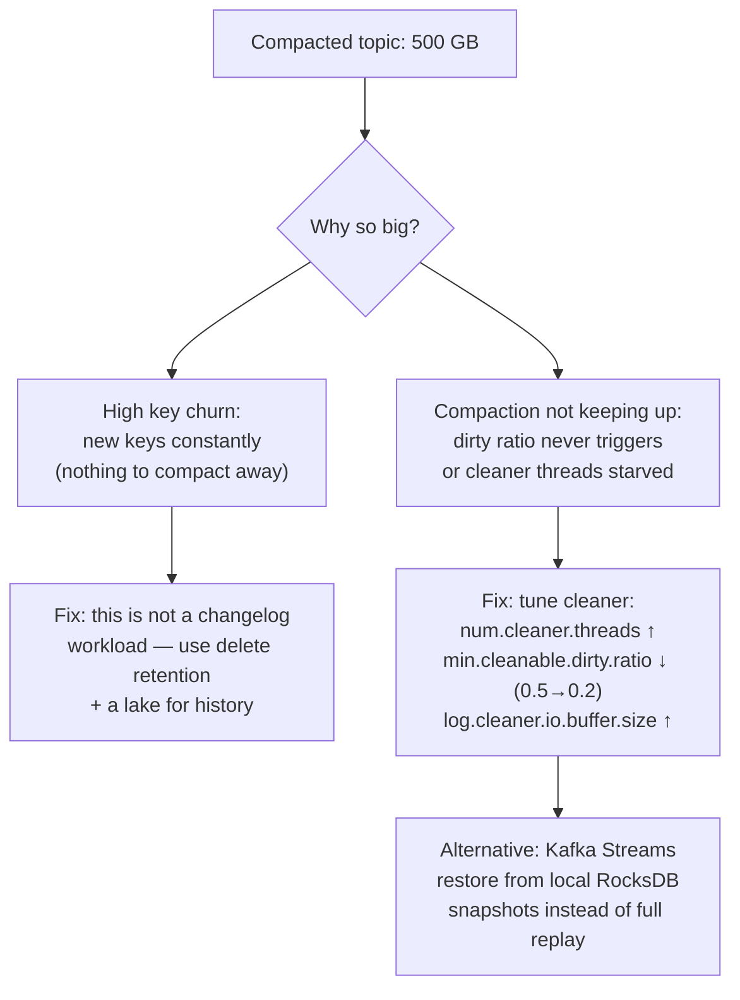

### Q8: "Kafka vs Pulsar vs Kinesis — how do you choose?"

| Dimension | Kafka | Pulsar | Kinesis |
|---|---|---|---|
| **Architecture** | Brokers own storage + compute | Brokers (compute) + BookKeeper bookies (storage) separated | Fully managed AWS service |
| **Scaling** | Add brokers; partitions pinned to brokers | Scale compute and storage independently | Reshard streams (merge/split shards) |
| **Tiered storage** | KIP-405 (4.0) | Native from day one | Kinesis Data Streams On-Demand / extended retention |
| **Multi-tenancy** | Weak (ACLs, quotas) | Strong (namespaces, per-tenant isolation) | Account-level |
| **Ecosystem** | Largest: Connect, Streams, Flink, every vendor | Growing, smaller | AWS-native (Firehose, Lambda) |
| **Ops burden** | You run it (or MSK/Confluent) | Higher (two systems: brokers + bookies) | Lowest (managed) |

**Interview answer:** "Default Kafka — ecosystem and hiring pool win.
Pulsar when multi-tenancy and independent storage scaling are hard
requirements (large shared platform teams). Kinesis when you're all-in
AWS, small team, and operational simplicity beats cost at scale
(Kinesis gets expensive at high throughput vs self-managed Kafka)."

### Q9: "Design disaster recovery for a Kafka cluster spanning two regions."

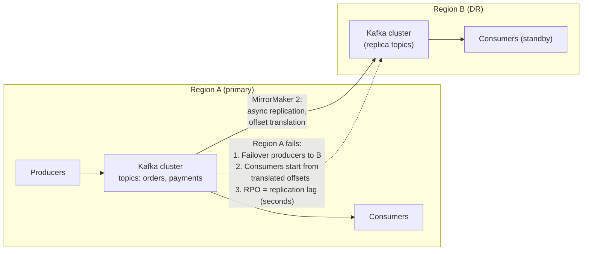

**Key decisions:**
- **Async replication (MirrorMaker 2)** is the standard — sync
  cross-region replication kills latency and availability (CAP)
- **RPO** = replication lag (seconds to minutes), not zero
- **Offset translation**: MM2 maintains offset mapping so failover
  consumers resume approximately where they left off
- **Active-active vs active-passive**: active-active needs conflict
  handling for writes in both regions (rarely worth it for DE workloads)

### Q10: "How does MirrorMaker 2 actually work? What are its failure modes?"

```
Architecture:
  MM2 runs as Kafka Connect connectors:
  - MirrorSourceConnector: consumes from source topics,
    produces to target as <source-alias>.<topic-name>
  - MirrorCheckpointConnector: syncs consumer group offsets
    (via a checkpoints topic + offset mapping)
  - MirrorHeartbeatConnector: liveness probes between clusters

What it preserves:     messages, keys, headers, partition assignment
What it does NOT:      source topic configs (set on target manually),
                       ACLs, exactly-once across clusters

Failure modes:
1. Replication lag spikes → target falls behind; monitor
   replication-lag as a first-class metric
2. Topic rename loop: A→B and B→A both configured without
   filtering → infinite mirror loop. Use topic filters/aliases
3. Offset translation gaps: checkpoints connector lagging means
   failover consumers start too far back → duplicate processing
4. Schema registry mismatch: two registries, same subject, different
   IDs → deserialize failures on target. Mirror schemas too
```

**Alex:** So MM2 gives me geo-replication — do I still need backups?

**Sam:** Different failure domains. MM2 protects against **region loss**;
it faithfully replicates **accidental deletes and corrupt data too**.
Backups (topic exports to S3 with schema snapshots) protect against
**logical corruption and human error**. You need both: MM2 for DR,
backups for "someone deleted the topic / pushed poison messages."

---

## 11. Decision Trees

### 11.1 Delivery Semantics Selection

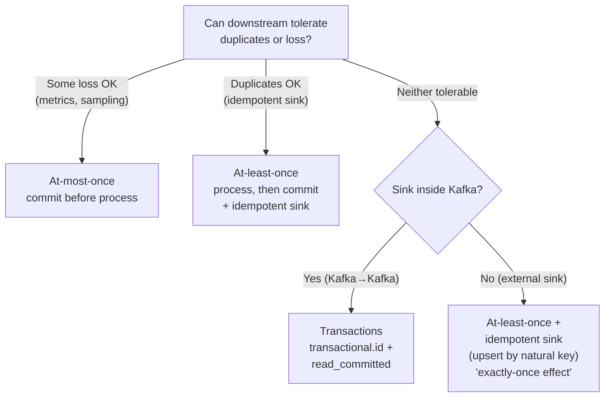

### 11.2 Retention Policy Selection

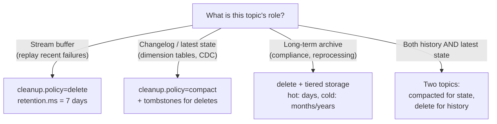

---

## 12. Kafka 4.0: Key Changes (KIP-848 & Tiered Storage)

Kafka 4.0 (released 2025) removes ZooKeeper entirely (already gone in
3.x for new clusters) and introduces two major changes DEs must know.

### KIP-848: New Consumer Rebalance Protocol

The biggest change to consumer groups since Kafka 0.9.

| Aspect | Old Protocol (Kafka < 3.7) | New Protocol (KIP-848, 3.7+) |
|---|---|---|
| **Coordination** | All rebalance coordination through the **group coordinator** broker | Same, but protocol is **incremental and cooperative by default** |
| **Rebalance type** | Stop-the-world (all consumers revoke all partitions) | **Incremental** — only affected consumers revoke/assign partitions |
| **Assignment** | Client-side (consumers compute assignment) | **Server-side** (broker computes assignment) |
| **State** | Consumers track assignment locally | Assignment tracking moved to broker |
| **Performance** | Full rebalance can take seconds for large groups | Sub-second rebalances, no global pause |

**Why it matters:**
- Large consumer groups (1000+) no longer pause processing during rebalances
- Adding/removing consumers is near-transparent
- Server-side assignment enables smarter load balancing

### KIP-405: Tiered Storage

Separates **hot** (local broker disk) from **cold** (S3/GCS/ABS) data,
enabling near-infinite retention without adding broker nodes.

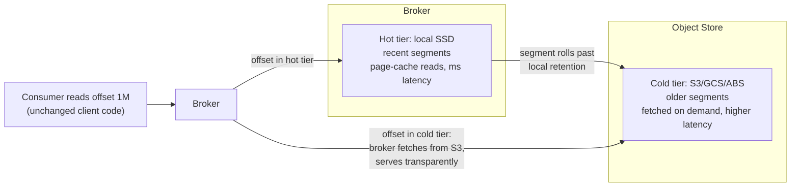

| Tier | Storage | Performance | Retention | Cost |
|---|---|---|---|---|
| **Hot** (broker disks) | Local SSD/HDD | Low latency | Hours to days | High ($/GB) |
| **Cold** (object store) | S3/GCS/ABS | Higher latency on cold reads | Months to years | Low ($/GB) |

**When to use:**
- Compliance requires multi-year retention
- Reprocessing historical data without re-ingesting
- Reducing broker disk cost (largest Kafka operational expense)

**DE interview answer:**
> "Tiered Storage moves older segment files from broker-attached disks
> to S3. Consumers still read from any offset — the broker fetches from
> S3 transparently. It decouples retention from storage cost."

### KRaft Maturity (ZooKeeper Removal)

| Version | KRaft Status |
|---|---|
| Kafka 3.3 (2022) | KRaft production-ready for new clusters |
| Kafka 3.5 (2023) | KRaft self-balancing, JBOD support |
| Kafka 4.0 (2025) | ZooKeeper code **removed entirely** |

> [!WARNING]
> If you see a job posting or blog from 2023 mentioning ZooKeeper,
> that is **obsolete**. Kafka 4.0 has no ZK code. KRaft uses a
> Raft-based controller quorum.

---

## 13. Operational Playbook

### Symptom → Likely Cause → First Action

| Symptom | Likely cause | First action |
| :--- | :--- | :--- |
| Consumer lag growing | Processing slower than produce rate; under-partitioned; consumer too small | Check lag trend (`kafka-consumer-groups --describe`); add consumers up to partition count; profile the slow sink |
| Lag flat but nonzero on one partition | Hot partition (key skew) | Inspect key distribution; re-key or add a salt; consider more partitions |
| Rebalance storms on deploy | Eager protocol, no static membership | Set `group.instance.id`; verify cooperative sticky assignor |
| `NOT_ENOUGH_REPLICAS` produce errors | ISR shrunk below `min.insync.replicas` | A broker is down or followers are lagging; check broker health and `replica.lag.time.max.ms` |
| Duplicates after consumer restart | Auto-commit or commit-before-process | Switch to manual commit after successful processing |
| Missing data after retention change | Segment-level deletion rounding | Remember: active segment never deleted; small topics keep data longer than `retention.ms` |

### Partition Count Heuristics

- **Parallelism ceiling**: consumers per group = partitions. Size for peak consumer parallelism.
- **Throughput**: a single partition sustains roughly tens of MB/s depending on message size/acks; divide target throughput accordingly.
- **Costs of over-partitioning**: more file handles and memory per broker, more metadata for the controller, longer unavailability during broker failure (more leader elections). KRaft improved this a lot, but thousands of partitions per broker is still a smell.
- **Growing later is one-way**: increasing partitions re-keys the hash space — ordering for a given key breaks across the change. Do not under-provision and assume you can grow cleanly.

**Alex:** What is the one-liner staff answer on running Kafka in production?

**Sam:** Kafka itself is boring when sized honestly: RF=3 with the durability triangle, partitions chosen for peak consumer parallelism, and lag as your primary SLI. The incidents that hurt are always the same three — hot partitions from skewed keys, rebalance storms from missing static membership, and "exactly-once" expectations that were never designed into the sink.

---

## 14. Quick Reference — Interview Edition

| Question | Short answer |
| :--- | :--- |
| Kafka in one line? | Distributed append-only log; offset-based, non-destructive reads |
| Ordering guarantee? | Per partition only. Key by entity ID. |
| Durability recipe? | RF=3, `acks=all`, `min.insync.replicas=2`, unclean election off |
| Why is acks=all not enough? | "All" = current ISR, which can shrink to just the leader |
| High watermark? | Highest offset replicated to all ISR; consumers read ≤ HW |
| Max consumers per group? | Partition count |
| Why rebalance on slow processing? | `max.poll.interval.ms` (5 min) exceeded — poll loop must make progress |
| Rebalance storms on deploy? | Missing static membership (`group.instance.id`) + eager protocol |
| At-least-once? | Process first, commit offsets after |
| Exactly-once in Kafka? | Idempotent producer + transactions (`transactional.id`), `read_committed` consumers |
| Exactly-once to Postgres/S3? | Not from Kafka alone — at-least-once + idempotent sink |
| Why is Kafka fast? | Sequential I/O, page cache, zero-copy sendfile, end-to-end batching |
| Retention unit? | Segments — active segment never deleted/compacted |
| Compaction guarantees? | Latest value per key; tombstones removed after `delete.retention.ms` |
| ZooKeeper? | Gone — KRaft since 3.3 (prod-ready), removed entirely in 4.0 |
| Adding partitions later? | Allowed, but re-hashes keys — breaks per-key ordering across the change |
| KIP-848? | Server-side, incremental consumer rebalancing (sub-second, no stop-the-world) |
| KIP-405? | Tiered storage — cold segments to S3, transparent reads |
| Lag diagnosis one-liner? | Rate mismatch: under-provisioned group, or one hot partition |

---

## 15. Resources

- [Kafka Crash Course (YouTube)](https://youtu.be/DU8o-OTeoCc?si=Ce1_j7LbREdRqSNL) — quick visual refresher
- [Kafka Deep Dive (Hello Interview)](https://www.hellointerview.com/learn/system-design/deep-dives/kafka) — system-design angle on internals
- [Kafka: The Definitive Guide (Confluent, free ebook)](https://www.confluent.io/resources/kafka-the-definitive-guide/) — reference book for configs
- [Exactly-Once Semantics Are Possible: Here's How Kafka Does It (Confluent, 2017)](https://www.confluent.io/blog/exactly-once-semantics-are-possible-heres-how-apache-kafka-does-it/) — the canonical explanation of idempotent producers, transactions, and exactly-once semantics from Kafka's original creators; still the best first read on EOS
- [Demystifying Kafka Exactly Once Semantics (HelloFresh Engineering)](https://engineering.hellofresh.com/demystifying-kafka-exactly-once-semantics-eos-390ae1c32bba) — practical production perspective on EOS boundaries, what it does and doesn't guarantee, with clear examples of the read-process-write cycle
- [Kafka Monthly Digest (Red Hat)](https://developers.redhat.com/blog/2025/01/07/kafka-monthly-digest-december-2024) — community highlights, new KIPs, ecosystem changes
- More curated links (MSK, Connect, Streams): [`data-engineering-learning-lab/apache-kafka/resources.md`](https://github.com/cookiee01/data-engineering-learning-lab/blob/main/apache-kafka/resources.md)
