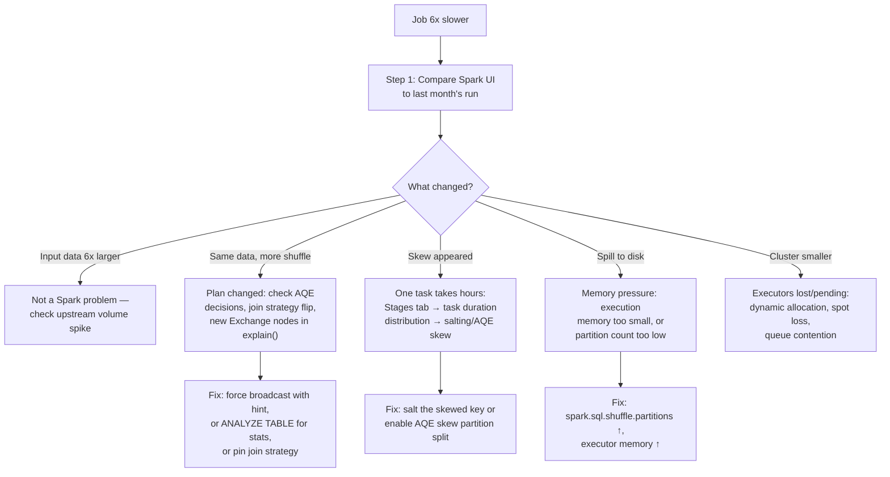
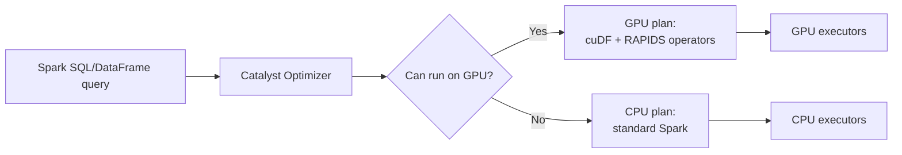
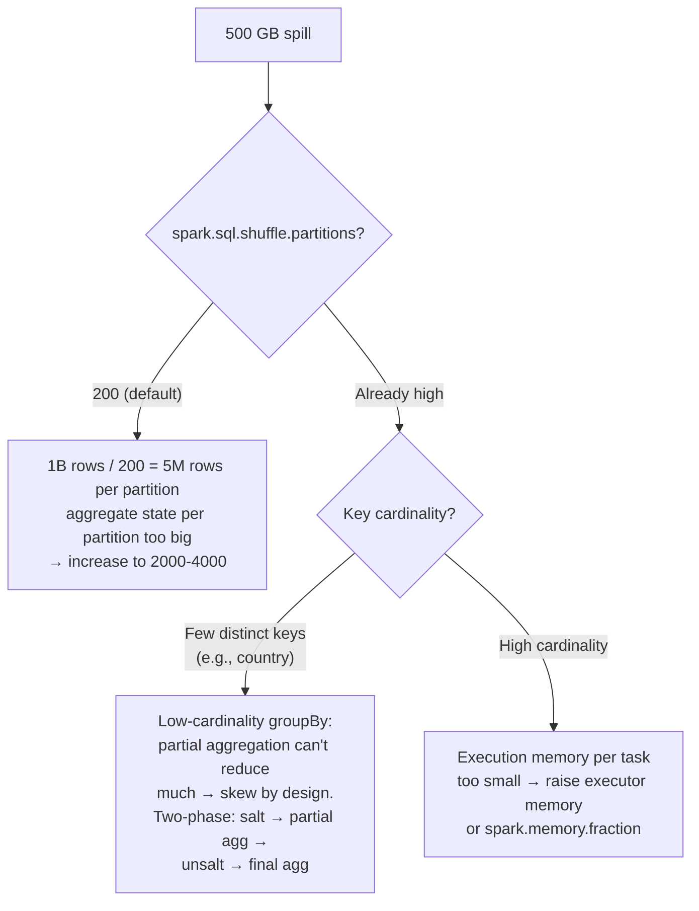
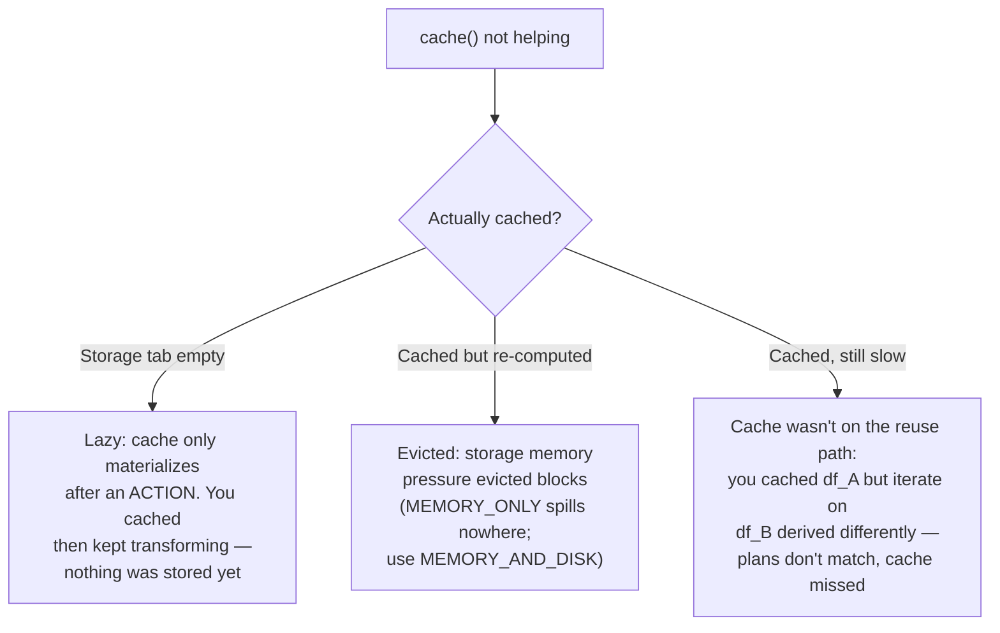
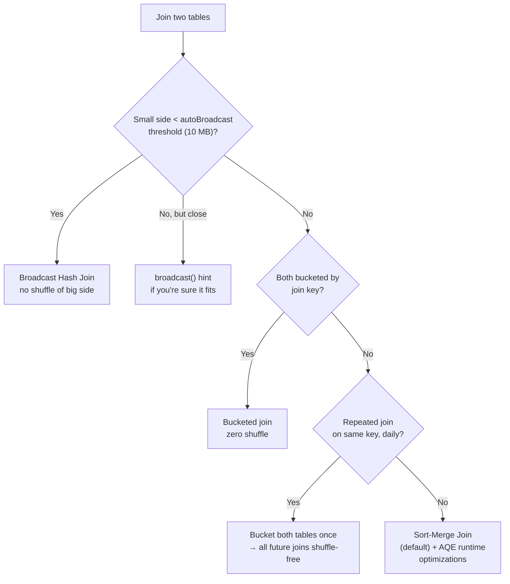
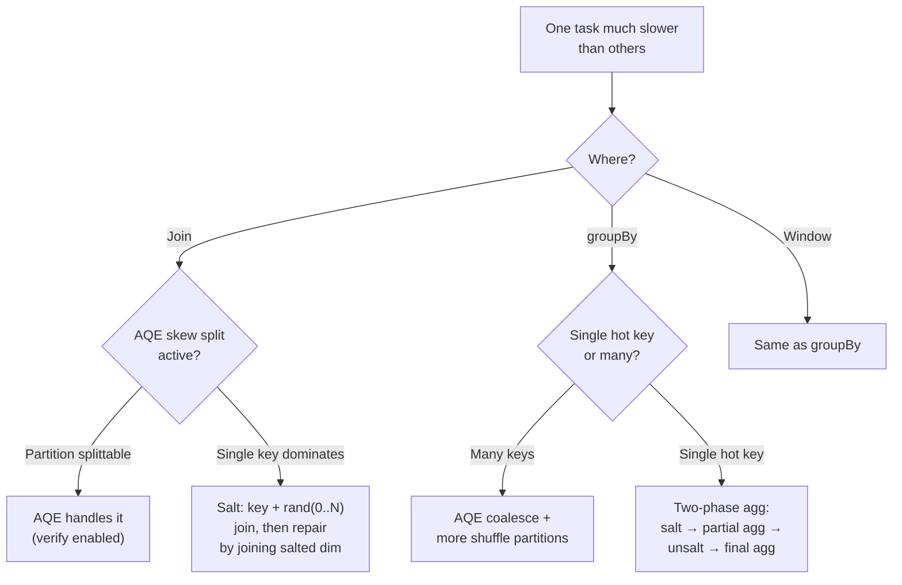

# PySpark / Spark — Interview Notes

**Targets Spark 3.x (primarily 3.2+ where AQE is enabled by default) with Spark 4.x coverage in §15.** A few sections (push-based shuffle, star join) reference Spark 3.2–3.3 features. The core concepts (Catalyst, Tungsten, memory model, shuffle) apply to 2.x+ as well. GPU acceleration via RAPIDS covered in §16.

## 0. The Opening Question

**Question:** *"Your Spark job processes 500 GB and takes 4 hours. The same job took 40 minutes last month. Walk me through your debugging process."*



**The framework:** Compare before/after on four axes — **data volume,
plan, skew, resources**. 90% of "job got slower" cases are one of these
four, and the Spark UI stages tab tells you which within 2 minutes.

---

## 1. Catalyst Optimizer

Catalyst is a rule-based optimizer (with some cost-based decisions) that converts a logical plan into an optimized physical plan through four phases.

### Four Phases

| Phase | Input → Output | Key Rules |
|---|---|---|
| **Analysis** | Unresolved logical plan → Resolved logical plan | Resolve columns/attributes against catalog, validate types, infer schemas |
| **Logical Optimization** | Resolved plan → Optimized logical plan | Predicate pushdown, projection pruning, constant folding, Boolean simplification, `CombineFilters`, `CollapseProject` |
| **Physical Planning** | Optimized plan → Physical plan(s) | Join strategy selection (BHJ vs SMJ vs SHJ), `EnsureRequirements` (adds exchanges for partitioning/sorting), strategy cost comparison |
| **Codegen** | Physical plan → Generated Java code | `WholeStageCodegen` — fuses operator pipelines into a single generated Java class |

### Nuances

**Phase 2 (Logical Optimization) is entirely rule-based**, not cost-based. Apply heuristic always wins like "push filters down" regardless of data size. This is fine because these transformations are universally beneficial or neutral.

**Phase 3 (Physical Planning)** has targeted cost-based decisions. The most visible is join strategy:

```
Join selection logic:
1. If one side fits in `spark.sql.autoBroadcastJoinThreshold` (default 10MB) → broadcast hash join
2. If both sides are large → sort-merge join (default), shuffle hash join if one side fits `spark.sql.join.preferSortMergeJoin=false`
3. AQE can override this decision at runtime with observed stats
```

The cost model for other operators is limited. Spark is not like a traditional database with a deep cardinality estimation framework. Column statistics are only available if collected via `ANALYZE TABLE` or Hive metastore, and even then only Hive connector populates them.

**Codegen (Phase 4)** is where most DataFrame performance comes from. Without codegen, Volcano-style iteration generates millions of virtual dispatch calls. With `WholeStageCodegen`, Spark compiles a single loop over rows with no function call overhead per row.

### Key Interview Answer

> Catalyst turns your DataFrame code into an optimized physical plan through four phases. Analysis resolves names and types against the catalog. Logical optimization applies universal rules like predicate pushdown. Physical planning selects join strategies with limited cost info. Codegen fuses the plan into a single Java loop. AQE then re-optimizes at runtime using real partition statistics.

---

## 2. Tungsten Execution Engine

Project Tungsten improves CPU and memory efficiency through three initiatives:

| Initiative | Detail |
|---|---|
| **Off-heap memory & binary format** | `UnsafeRow` stores rows as raw byte arrays in off-heap memory. Avoids JVM object overhead (12-16 bytes per object header + 8 bytes per reference). |
| **Cache-aware computation** | Columnar layout (in vectorized reads) and compact row format improve cache locality vs scattered JVM objects. |
| **Whole-stage codegen** | Fuses operators (filter → project → aggregate) into a single generated class. Eliminates virtual function calls and intermediate materialization. |

### UnsafeRow Layout

```
[null bits (8 bytes)] [fixed-length fields] [variable-length offset array]
```

- Primitive types (int, long, double) written inline
- Strings and byte arrays stored in variable-length region at end
- Access is direct memory offset arithmetic—no object allocation per field read

### When Tungsten Doesn't Help

- Python UDFs break codegen. Each row crosses JVM → Python boundary.
- RDD operations use JVM objects, not `UnsafeRow`.
- Complex nested types (`Array[Struct]`) still trigger object creation on access.

### Interview Answer

> Tungsten improves Spark's CPU efficiency three ways: binary row format (UnsafeRow) to avoid JVM object overhead, whole-stage codegen to fuse operator pipelines into a single loop, and cache-aware memory layout. For DataFrame-heavy workloads, Tungsten is the primary reason Spark is fast. For RDD or UDF-heavy code, these benefits diminish.

---

## 3. Memory Architecture

### Unified Memory Pool

```
Executor JVM Heap
├── Reserved Memory (300 MB, fixed)
├── User Memory (40% of (heap - reserved))      ← your UDFs, data structures
└── Spark Memory (60% of (heap - reserved))
    ├── Execution Memory (shuffle, joins, sorts, aggregations)
    └── Storage Memory (cache, broadcast variables)
```

Key configs:

| Config | Default | Effect |
|---|---|---|
| `spark.memory.fraction` | 0.6 | Fraction of (heap - reserved) for Spark Memory. Lower = more room for user objects. |
| `spark.memory.storageFraction` | 0.5 | Fraction of Spark Memory that storage can borrow from execution. Execution can evict storage, but storage cannot evict execution. |
| `spark.memory.offHeap.enabled` | false | If true, Spark Memory uses off-heap. Requires `spark.memory.offHeap.size`. Reduces GC pressure but adds serialization overhead. |

### When to Tune

**When to tune `spark.memory.fraction` down:**
- Heavy use of Python UDFs or pandas UDFs (Python worker process memory lives outside Spark's unified pool, but data conversion still consumes user memory)
- Large broadcast variables
- Custom accumulators or state in streaming

**When to tune `spark.memory.storageFraction` up:**
- Read-heavy workloads that benefit heavily from caching
- Repeated iteration over cached data (ML training)

**Off-heap is often overhyped.** It helps when GC pauses are the bottleneck AND heap size is large (>64GB). For most pipelines, tuning on-heap is higher ROI.

### Container Memory (YARN/K8s)

```
Container memory = spark.executor.memory + spark.executor.memoryOverhead
```

`spark.executor.memoryOverhead` (default 10% of executor memory, min 384MB) covers:
- JVM overhead (metaspace, threads, code cache, GC)
- Python worker process memory (PySpark)
- Native libraries (Parquet, snappy, zstd, ORC)
- Off-heap allocations by Java/Scala code (direct buffers, NIO)

### Interview Answer

> Spark uses a unified memory pool split between execution (shuffle, joins) and storage (cache). Execution can evict storage blocks when needed, but not vice versa. The pool is controlled by `spark.memory.fraction` (default 0.6) and within it `spark.memory.storageFraction` (default 0.5). Container overhead covers JVM overhead, Python workers, and native libs, and is often the cause of container OOM kills even when executor memory seems sufficient.

---

## 4. AQE (Adaptive Query Execution)

Enabled by `spark.sql.adaptive.enabled=true` since Spark 3.2 (default). AQE re-optimizes the physical plan at runtime after shuffle stages complete and real partition statistics are available.

### Three Main Optimizations

| Optimization | What It Fixes |
|---|---|
| **Coalescing shuffle partitions** | After a shuffle, AQE estimates the optimal number of partitions based on data size per partition target (`spark.sql.adaptive.coalescePartitions.minPartitionSize`, default 64MB). Reduces small tasks. |
| **Switching join strategies** | If a broadcast hash join was planned but the filtered table is much smaller than estimated, AQE converts SMJ → BHJ at runtime. If the broadcast table is larger than expected, AQE keeps SMJ. |
| **Skew join** | AQE detects skewed partitions during shuffle read and splits the large side into sub-partitions, replicating the small side to match. Controlled by `spark.sql.adaptive.skewJoin.skewedPartitionFactor` (default 5) and `skewedPartitionThresholdInBytes` (default 256MB). |

### How AQE Works Internally

1. **Stage materialization**: Physical plan is split at shuffle boundaries. Each stage is executed independently.
2. **Stat collection**: After a stage completes, AQE collects partition size metrics from shuffle write.
3. **Plan rematerialization**: With new stats, AQE re-applies physical planning rules downstream. Can change join strategies, partition counts, and join reordering.

This is fundamentally different from traditional optimizer approach (Plan → Execute). AQE is: Plan → Execute partially → Re-plan → Execute.

### Key Configs

| Config | Default | Note |
|---|---|---|---|
| `spark.sql.adaptive.coalescePartitions.parallelismFirst` | true | When true, partitions are coalesced only if it doesn't reduce parallelism below `spark.sql.adaptive.coalescePartitions.minPartitionNum`. Set to false to aggressively reduce partitions for small data. |
| `spark.sql.adaptive.maxShuffledHashJoinLocalMapThreshold` | — | Controls when to use shuffled hash join vs sort-merge after AQE. |
| `spark.sql.adaptive.nonEmptyPartitionRatioForBroadcastJoin` | 0.2 | If fewer than 20% of partitions have data after filtering, AQE may choose BHJ even for moderately sized tables. |

### Interview Answer

> AQE re-optimizes the physical plan at runtime after shuffle stages complete and real partition statistics are known. It fixes three common problems: too many small shuffle partitions (coalescing), incorrect join strategy selection (runtime conversion), and data skew (splitting skewed partitions). AQE is the single most impactful performance feature in Spark 3.x and should always be enabled.

---

## 5. Shuffle Internals

### Sort-Based Shuffle (Default)

Each task writes shuffle data to a single file, sorted by partition ID. The reducer fetches only its partition's range.

```
Map Task → In-memory buffer → Sort by partition ID → Spill to disk → Merge spills → Single shuffle file + index file
```

**Pros:** Single file per task (O(tasks) files, not O(partitions × tasks)). Index file enables fast range lookup.
**Cons:** Sort overhead even when not needed.

### Bypass Merge Sort

When number of partitions <= `spark.shuffle.sort.bypassMergeThreshold` (default 200) and no aggregator/ordering is specified, Spark writes separate files per partition without sorting.

**Pros:** No sort overhead, ~2x faster for small partition counts.
**Cons:** Produces O(partitions × tasks) files. Bad for large partition counts (file system pressure).

### Shuffle File Consolidation

When `spark.shuffle.consolidateFiles=true` (default was false before Spark 3.x, now depends on deployment), consecutive map tasks on the same executor write to the same shuffle file. Reduces file count from O(tasks × reducers) to O(cores × reducers).

### Push-Based Shuffle (Spark 3.2+, YARN/Standalone)

Instead of each reducer fetching from all map tasks, map tasks push data to a centralized shuffle service that merges blocks. Reduces reducer connection count from O(map tasks) to O(1). Requires `spark.shuffle.push.enabled=true` and a compatible shuffle service.

### Tuning

| Symptom | Likely Cause | Fix |
|---|---|---|
| Many small shuffle files (<< block size) | Too many partitions after shuffle | `spark.sql.adaptive.enabled=true` or lower `spark.sql.shuffle.partitions` |
| Shuffle fetch failures + GC | Shuffle service under memory pressure | Increase `spark.shuffle.service.index.cache.size` or executor overhead |
| High shuffle write time | Ser/de overhead or large row sizes | Switch to Kryo for RDD workloads, or check row size (wide schemas) |
| Shuffle write is fast, read is slow | Network contention or fetch parallelism | Check `spark.reducer.maxSizeInFlight` and `spark.reducer.maxReqsInFlight` |

### Interview Answer

> Spark's default shuffle is sort-based: each map task sorts records by partition ID and writes a single file with an index. This keeps file count O(tasks) instead of O(partitions × tasks). The bypass merge sort optimization skips sorting when the partition count is low (<=200) and no aggregation is needed. Push-based shuffle (Spark 3.2+) further reduces reducer connection overhead by pre-merging blocks on the shuffle service side.

---

## 6. Join Strategies Deep Dive

| Strategy | Condition | Data Movement | Best For |
|---|---|---|---|
| **Broadcast Hash Join (BHJ)** | One side ≤ `autoBroadcastJoinThreshold` (10MB by default) | No shuffle of the large side; small table sent to all executors | Star-schema: fact joins to small dimension |
| **Sort-Merge Join (SMJ)** | Default for two large tables | Both sides shuffled and sorted by join key | Large tables with evenly distributed keys |
| **Shuffled Hash Join (SHJ)** | `spark.sql.join.preferSortMergeJoin=false` + one side fits in hash table after shuffle | Both sides shuffled but no sort | One side significantly smaller after shuffle (rarely chosen; AQE can switch from SMJ) |
| **Skew Join (AQE)** | AQE detects skewed partition (size > 256MB × 5× median) | Skewed partition split into sub-partitions; small side replicated | Real-world data with natural skew (user_id, country, date) |

### How Spark Chooses (Pre-AQE)

```
1. If one side fits in broadcast threshold → BHJ
2. If spark.sql.join.preferSortMergeJoin=true (default) → SMJ
3. Else, if one side after shuffle fits in memory → SHJ
4. Else → SMJ
```

### How AQE Changes This

AQE executes the shuffle stage first, collects real partition sizes, and then decides:
- If one side is now small enough for broadcast → switch from SMJ to BHJ
- If a partition is > 5× median partition size → apply skew join (split large partition, replicate small side)

### Broadcast Join Threshold Tuning

Default 10MB is conservative for most cloud environments. Common tuning:
- **10MB**: Safe for all deployments. Broadcast happens entirely via Spark's internal TorrentBroadcast.
- **100MB+**: Risk of driver OOM if many concurrent joins. Risk of executor OOM if broadcast table is large. Only increase if you understand concurrency × broadcast size.

### Star Join (Spark 3.3+)

`spark.sql.optimize.starJoin.enabled=true` (default false). Informs Catalyst to prioritize BHJ in star-schema fact-to-dimension joins.

### Interview Answer

> Spark selects join strategies in priority order: broadcast hash join for small tables, then sort-merge join (default), then shuffled hash join if one side fits in a hash table post-shuffle. AQE can override this at runtime — switching SMJ to BHJ when post-filter stats show one side is much smaller, or applying skew join to split skewed partitions. The broadcast threshold (10MB default) should be tuned based on executor memory and concurrency.

---

## 7. Skew Handling

### Detection

| Sign | Metric |
|---|---|
| **Task duration** | A few tasks take 10×+ longer than median |
| **Shuffle read size** | Skewed partition reads 100s of MB vs median 1-10 MB |
| **Spill** | Skewed tasks spill to disk (visible in Spark UI stage metrics) |
| **GC time** | Skewed tasks have excessive GC from holding large hash tables |

### Mitigation Patterns

#### 1. Salting (Manual)

Add a random prefix to the skewed key, explode the smaller side to match.

```python
# Add salt to skewed key
from pyspark.sql.functions import col, concat, lit, rand, when

skewed_key = "user_id"
salt_range = 100  # tune based on skew degree

# Large side: append salt to join key
large_salted = large_df.withColumn(
    "salted_key",
    concat(col(skewed_key), lit("_"), (rand() * salt_range).cast("int"))
)

# Small side: cross-join with salt range
small_exploded = small_df.crossJoin(
    spark.range(salt_range).toDF("salt")
).withColumn(
    "salted_key",
    concat(col(skewed_key), lit("_"), col("salt"))
)

result = large_salted.join(small_exploded, "salted_key").drop("salted_key", "salt")
```

**Tradeoff:** Works universally but increases shuffle size. `salt_range` controls tradeoff between parallelism and shuffle amplification.

#### 2. AQE Skew Join (Automatic)

Enable with `spark.sql.adaptive.skewJoin.enabled=true` (default when AQE is on). Spark detects skewed partitions from shuffle stats and splits them into sub-partitions, replicating the small side.

**Limitations:** Only handles skew in join keys where AQE can observe partition sizes. Does not handle aggregation skew or groupBy skew.

#### 3. Separate Skewed Keys (For extreme cases)

```python
# Split data into skewed and non-skewed paths
skewed_keys = ["hot_key_1", "hot_key_2"]
skewed = large_df.filter(col("key").isin(skewed_keys))
normal = large_df.filter(~col("key").isin(skewed_keys))

# Process skewed path without shuffle (broadcast)
skewed_result = skewed.join(small_df.hint("broadcast"), "key")

# Process normal path with standard SMJ
normal_result = normal.join(small_df, "key")

# Union results
result = skewed_result.union(normal_result)
```

**Tradeoff:** More code, but eliminates shuffle entirely for the skewed path. Best for extreme skew where even AQE splitting creates too many sub-partitions.

### Interview Answer

> I detect skew by looking at Spark UI stage metrics — a few tasks processing 10×+ more data than the median, or spilling to disk. For mitigation, I use three patterns: AQE skew join for automatic handling of join skew (enabled by default in Spark 3.x), manual salting for complex skew or groupBy skew, and separate skewed-key paths for extreme cases where even salting doesn't help enough.

---

## 8. Output Committers

Output committers manage the atomicity of writing data to a filesystem. This is where Spark's "exactly-once" guarantee lives for batch writes.

### Committer Types

| Committer | Available Since | How It Works | Cloud Issue |
|---|---|---|---|
| **FileOutputCommitter V1** | Hadoop 1.x | Write to `_temporary/`, then rename to final dir on commit | Directory rename is NOT atomic on S3. Can leave partial data on failure. |
| **FileOutputCommitter V2** | Hadoop 2.x | Write files in-place (no rename). Commit is a no-op. | Files appear one-by-one as tasks complete. Downstream readers see partial data. |
| **Magic Committer (V3)** | EMR 5.x (S3-specific) | Write to `_temporary/` with task-level staging. Commit uses S3 multi-part commit for atomic visibility. | Solves S3 atomicity. Only on EMR. |
| **S3A Committer** | Hadoop 3.1 / Spark 3.x | Similar to Magic Committer but works on any Spark distribution via S3A filesystem. Uses S3 multi-part upload + list-based commit protocol. | Works on open-source Spark. Performance can suffer with many small files (slow listing). |
| **Staging Committer** | Spark 3.0+ | Writes to a staging directory (not task-level), then renames. Uses list-and-rename or S3 copy for commit. | Best for Append mode. Not suitable for Overwrite with dynamic partitions. |

### Recommendation

| Environment | Recommended Committer |
|---|---|
| **EMR** | Magic Committer (default since EMR 6.x) |
| **Open-source Spark on S3** | S3A Committer with `committer=magic` |
| **HDFS / on-premise** | V1 or V2 (rename is cheap and atomic) |
| **GCS** | V2 (GCS rename is atomic) |
| **Azure ADLS** | V2 (ADLS rename is atomic) |

### Key Config

```python
spark.conf.set("spark.sql.sources.commitProtocolClass",
    "org.apache.spark.internal.io.cloud.PathOutputCommitProtocol")
spark.conf.set("spark.hadoop.fs.s3a.committer.name", "magic")
```

### Dynamic Partition Overwrite

`spark.sql.sources.partitionOverwriteMode=dynamic` (default `static` in Spark <3.0, `dynamic` in 3.0+). Dynamic mode only overwrites partitions that have data in the write, leaving other partitions untouched. Critical for incremental write patterns.

### Interview Answer

> Committers control atomicity of file writes. The original V1 committer renames from temp to final directory, which is not atomic on S3 (listing-based rename can leave partial data visible). V2 writes in-place, so partial data is visible mid-job. For S3, I use the S3A Magic Committer (open-source) or the EMR Magic Committer — both use multi-part uploads for atomic commit. On HDFS, V1/V2 are fine because directory rename is atomic.

---

## 9. Spark UI Deep Dive

### Stages Tab

| Column | What to Look For |
|---|---|
| **Duration** | Skew: a few tasks taking 10× more than median |
| **Shuffle Read Size/Records** | Skew: one partition reading 100× more |
| **Shuffle Write Size** | Large output per partition indicates potential skew downstream |
| **Spill (Memory + Disk)** | >0 means executors are memory-constrained for this stage |
| **GC Time** | >10% of task time → consider reducing heap overhead or increasing executor memory |
| **Input Size / Records** | Verify stage processes expected amount of data |
| **Locality Level** | `NODE_LOCAL` is best; `ANY` means data had to move across network |

### SQL Tab

The SQL tab shows the physical plan tree with metrics per operator. Key operators:

| Operator | Metric to Check |
|---|---|
| `Exchange` | Number of shuffle partitions, shuffle write size |
| `BroadcastHashJoin` / `SortMergeJoin` | BuildSide size (did the broadcast fit?), actual join type |
| `WholeStageCodegen (1)` | Subtree is codegen'd. If many WholeStageCodegen subtrees → many pipeline breaks |
| `ObjectHashAggregate` vs `HashAggregate` | Object variant means codegen wasn't applied (Python UDF or complex type broke it) |
| `Scan parquet` | PushedFilters — verify partition pruning + predicate pushdown worked |

### Executors Tab

| Metric | Implication |
|---|---|
| **Shuffle Read/Write (peaks)** | Identifies executors handling skewed partitions |
| **Storage Memory** | Compare to `spark.executor.memory` to see cache utilization |
| **Disk Used** | Spill presence — indicates memory pressure |
| **Active Tasks** | Must match available cores for full utilization |

### Event Timeline

Shows when tasks were scheduled vs waiting for executor slots. Gaps between stages indicate shuffle materialization. Gaps within a stage indicate resource contention (not enough executors).

### Interview Answer

> I always start with the Stages tab in Spark UI. I look for task duration skew (the biggest red flag), then shuffle read skew, then spill. The SQL tab shows me the actual physical plan — whether AQE changed join strategies, whether codegen is working, and whether predicate pushdown happened. The executors tab confirms our resource allocation is balanced.

---

## 10. Performance Debugging Framework

### Step 1: Data Estimation

Before writing code, estimate:
- **Row count** and **row size** (bytes per row)
- **Total data per stage** (input size, intermediate size after filtering)
- **Shuffle volume** (groupBy/join keys — how many unique values?)

### Step 2: Parallelism Calculation

```python
# Target: 2-3× partitions per executor core for even distribution
target_partitions = total_cores * 2

# Spark's shuffle partition count
spark.conf.set("spark.sql.shuffle.partitions", 200)  # default, adjust up/down

# For AQE target partition size
# spark.sql.adaptive.coalescePartitions.minPartitionSize = 64MB (default)
```

### Step 3: Memory Sizing

```python
# Per executor
executor_cores = 4
executor_memory = "8g"
overhead = "2g"  # conservative for PySpark
# Container = 10g

# For a 256GB cluster with 16 executors:
per_executor_shuffle_max = shuffle_volume / 16
per_executor_execution_memory = executor_memory * 0.6 * 0.5  # ~2.4GB for 8g executors
# Verify: per_executor_shuffle_max < per_executor_execution_memory
```

### Step 4: Iterative Tuning

1. Run on 10% sample data first. Verify plan in SQL tab.
2. Check AQE is active: look for `AdaptiveSparkPlan` in `explain()` output.
3. Check `Exchange` nodes: expected partition count? Expected join type?
4. Run full data. Check stages tab for skew, spill, GC.
5. If skewed: apply salting or enable AQE skew join.
6. If spilling: increase executor memory or adjust `spark.memory.fraction`.
7. If GC heavy: try off-heap or reduce JVM object overhead.
8. Iterate.

### Interview Answer

> My debugging framework is: estimate the data size first, then set parallelism to 2-3× cores, size memory to hold the largest shuffle without spill, and run on a sample to verify the plan. Then I use the Spark UI to check for skew (stage duration), spill (memory pressure), and shuffle volume. Fix the bottleneck, re-run, repeat.

---

## 11. Structured Streaming

### Exactly-Once Pipeline

Three components must cooperate:

| Layer | Mechanism |
|---|---|
| **Source** | Must be replayable (Kafka by offset, file source by mod time + path) |
| **Spark** | Write-ahead log records offsets. Checkpoint stores state and progress. On failure, restarts from last committed offset. |
| **Sink** | Must be idempotent or transactional (Kafka sink, foreachBatch with idempotent DB writes, file sink with unique paths) |

```python
df.writeStream \
    .outputMode("append") \
    .trigger(processingTime="10 seconds") \
    .option("checkpointLocation", "/path/to/checkpoint") \
    .foreachBatch(write_to_idempotent_sink) \
    .start()
```

### State Management

| State Type | Backend | Best For |
|---|---|---|
| **Keyed state (mapGroupsWithState)** | HashMap (in-memory, default) | Small state (<100k keys) |
| **Keyed state** | RocksDB (`rocksdb.state.changelog.enabled=true`) | Large state (millions of keys). Spills to disk, minimal GC impact. |
| **Replicated state (mapGroupsWithState)** | Changelog + checkpoint | Fault-tolerant. Must be enabled. |

### Streaming Joins

| Join Type | What Spark Keeps in State |
|---|---|
| **Stream-Stream (inner)** | Both sides' state within watermark boundaries |
| **Stream-Stream (left/right outer)** | Unmatched rows from the outer side until watermark evicts them |
| **Stream-Static** | No state; static table is broadcast-read each micro-batch |
| **Stream-Dimensions (using as-of join)** | Requires custom stateful processing |

### Watermark + Allowed Lateness

```python
stream_df \
    .withWatermark("event_time", "10 minutes") \
    .groupBy(window("event_time", "5 minutes"), col("user_id")) \
    .count()
```

- Rows with `event_time` > watermark are discarded (late data with no penalty is bounded by watermark + allowedLateness)
- State is retained for watermark duration + window length
- `allowedLateness` is implicit: Spark keeps state until watermark passes window end + watermark delay

### foreachBatch Pattern

```python
def write_microbatch(df, epoch_id):
    # Dedup within micro-batch (window function)
    # Merge into target table (MERGE INTO for Delta/Iceberg)
    # Log metrics (row count, min/max timestamp, null counts)
    pass
```

### Interview Answer

> Structured Streaming achieves exactly-once through three guarantees: a replayable source (Kafka offsets, file mod times), Spark's write-ahead log and checkpointing for fault-tolerant state and progress tracking, and an idempotent or transactional sink. State can be stored in-memory (fast, small) or RocksDB (large state, disk-backed). Watermarks bound state retention and late data handling. The foreachBatch pattern is the most flexible sink for production, letting you apply dedup, idempotent merges, and logging inside each micro-batch.

---

## 12. Cloud-Specific Considerations

### S3

| Problem | Cause | Mitigation |
|---|---|---|
| **Listing overhead** | S3 is not a filesystem. Directory listing is O(objects) API calls. | Avoid listing patterns. Use partition pruning with Hive-style paths (`dt=2024-01-01/`). Set `spark.sql.sources.parallelPartitionDiscovery.parallelism` higher. |
| **List-before-write consistency** | S3 list is eventually consistent in some regions (though strong read-after-write since Dec 2020). | Use S3A Magic Committer to avoid listing-based commit. |
| **Request rate throttling** | Too many concurrent requests to the same S3 prefix. | Use random prefixing for data lake paths. Ensure partition columns are high cardinality enough. |
| **Small file problem** | Low throughput to S3 (each file takes a PUT request). | Coalesce partitions before write. Target 64-256 MB per output file. |
| **Gateway timeout** | 504 errors on large Spark jobs reading/writing S3. | Check `fs.s3a.connection.timeout` and `fs.s3a.attempts.maximum`. Use S3 gateway endpoint in the same region. |

### EMR vs Open-Source

| Feature | EMR | Open-Source |
|---|---|---|
| **S3 committer** | Magic Committer (best for S3) | S3A Committer (good, but listing overhead on commit) |
| **EMRFS consistent view** | Deprecated (EOL June 2023). S3 strong consistency makes it unnecessary. | N/A — rely on S3 strong consistency |
| **Auto-scaling** | Instance fleet + managed scaling | Manual or custom K8s autoscaler |
| **Runtime** | EMR 6.x includes Spark 3.x + Iceberg + Hudi + Delta pre-installed | Manual dependency management |
| **Spot integration** | EMR manages spot termination gracefully (task nodes only) | Manual unschedulable node handling |

### Spot Instance Strategy

```python
# EMR: use instance fleets with mixed on-demand + spot
# On-demand base: 1-2 nodes (guarantee critical driver + some workers)
# Spot: remaining nodes
# Spark speculation enabled: handles stragglers / preempted tasks
spark.conf.set("spark.speculation", "true")
spark.conf.set("spark.speculation.interval", "1000ms")
spark.conf.set("spark.speculation.multiplier", "1.5")
```

### Interview Answer

> On S3, the biggest challenges are listing overhead (mitigated by partition pruning and parallel discovery), small files (fixed by coalescing before write to 64-256 MB per file), and committer atomicity (solved by Magic or S3A committer). On EMR, I use the built-in Magic Committer for atomic S3 writes, instance fleets with spot instances for cost, and enable speculation for resilience against spot termination.

---

## 13. Optimizer Configs Reference

### Must-Know Configs

| Config | Default | Note |
|---|---|---|
| `spark.sql.adaptive.enabled` | true | Always leave enabled. |
| `spark.sql.adaptive.coalescePartitions.minPartitionSize` | 64 MB | Increase to 128 MB for larger clusters (reduces task count). |
| `spark.sql.adaptive.skewJoin.enabled` | true | Keep enabled. Disable only if skew join heuristic is wrong (rare). |
| `spark.sql.adaptive.maxShuffledHashJoinLocalMapThreshold` | — | Raise to prefer SHJ over SMJ for pre-join filtered tables. |
| `spark.sql.autoBroadcastJoinThreshold` | 10 MB | Increase carefully. Each join broadcasts separately. With 100 MB threshold and 50 concurrent joins, driver may need 5 GB+ for broadcast tracking. |
| `spark.sql.shuffle.partitions` | 200 | Set per job based on data size, not globally. Rule of thumb: data per partition 64-256 MB. |
| `spark.sql.sources.partitionOverwriteMode` | dynamic | Use dynamic for incremental writes. |
| `spark.sql.optimizer.metadataOnly` | true | Can skip file scan for count() queries on partitioned tables. |
| `spark.serializer` | JavaSerializer | Set to KryoSerializer if you use RDDs or cache in SER mode. |
| `spark.sql.execution.arrow.pyspark.enabled` | true | Arrow accelerates pandas UDF and toPandas. Enable. |
| `spark.sql.legacy.replacer.partitionColumnValue` | false | Set to true if partition values contain characters that break Hive path conventions. |
| `spark.sql.sources.bucketing.enabled` | true | Enables bucketed joins (avoid shuffle if both tables bucketed on join key with compatible bucket count). |

---

## 14. Failure Scenarios & Debugging

### Executor OOM (Container Killed)

**Symptom:** YARN kills container. Spark UI shows executor lost. Logs show "Container killed by YARN for exceeding memory limits."

**Causes:**
- `spark.executor.memory` + `spark.executor.memoryOverhead` exceed container limit
- Python worker process memory (PySpark) — each executor runs one Python daemon that can consume significant memory
- Native library allocations (Parquet reader, snappy compression, ORC)

**Diagnosis:**
```bash
# In executor logs (stderr): look for container memory tracking
# YARN logs show: "Physical memory usage of <X> GB exceeds <Y> GB limit"
```

**Fixes:**
1. Increase `spark.executor.memoryOverhead` (try 15-20% instead of 10%)
2. Reduce executor cores (fewer concurrent tasks → less peak memory pressure)
3. Reduce `spark.sql.autoBroadcastJoinThreshold` (broadcast joins materialize the entire table in executor memory)
4. For PySpark: use `spark.python.worker.memory` to limit Python worker memory, or use arrow/pandas UDFs with memory limits

### Driver OOM

**Symptom:** Driver crashes after `collect()`, large broadcase, or action that returns results.

**Fixes:**
1. Never `collect()` large datasets. Use `take(n)`, limit, or write to disk.
2. Reduce broadcast threshold if many concurrent joins.
3. Use `spark.driver.maxResultSize` to limit result accumulation.

### Shuffle Fetch Failure

**Symptom:** Executor fails during shuffle read with "FetchFailedException". Job retries the stage.

**Causes:**
- Executor loss during shuffle (spot preemption, OOM)
- Shuffle service crash
- Network partition

**Fixes:**
1. Enable `spark.shuffle.detectCorrupt=true`
2. Increase `spark.shuffle.io.maxRetries` (default 3) and `spark.shuffle.io.retryWait` (default 5s)
3. Use speculation: `spark.speculation=true`
4. For push-based shuffle: check shuffle service availability

### Speculation & Blacklisting

When enabled (`spark.speculation=true`), Spark re-launches straggler tasks. If a task fails on the same executor multiple times (`spark.task.maxFailures`, default 4), Spark blacklists that executor.

---

## 15. Spark 4 — Key Changes for Interview Awareness

Spark 4.0 was released May 2025 (current: 4.2.0). The core concepts (Catalyst, Tungsten, AQE, shuffle) are unchanged. These are the interview-relevant additions:

### ANSI SQL Default

`spark.sql.ansi.enabled` defaults to `true` (was `false`). This means:

| Operation | Spark 3 (silent) | Spark 4 (error) |
|---|---|---|
| Division by zero | Returns `null` | Throws runtime error |
| Invalid cast | Coerces silently | Rejects with error |
| Type mismatch | Null propagation | Strict validation |

**Interview mention:** "In Spark 4, ANSI SQL mode is default — operations like division-by-zero throw instead of returning null. Improves data quality but requires migration for pipelines that relied on the old behavior."

### VARIANT Data Type

A schema-on-read type for semi-structured JSON without defining a fixed schema upfront. Stored in a columnar binary format, faster than `struct<...>` or `string` + parsing.

```python
df = spark.read.json("s3://bucket/logs/", schema="payload VARIANT")
df.select("payload:user_id", "payload:event_type")
```

**Interview mention:** "The VARIANT type lets you ingest JSON without a schema. Internally stored in a compact binary format, so it's faster than storing as string and parsing. Useful for schemaless data lakes or APIs with evolving payloads."

### SQL Scripting

Procedural SQL with session variables, control flow, and SQL UDFs:

```sql
DECLARE max_id INT DEFAULT 1000;
WHILE max_id < 5000 DO
  INSERT INTO target SELECT * FROM source WHERE id > max_id;
  SET max_id = max_id + 1000;
END WHILE;
```

Also: `CREATE FUNCTION ... AS SQL` for reusable SQL UDFs (no Python/Scala needed).

**Interview mention:** "Spark 4 adds procedural SQL with variables and control flow, plus SQL UDFs. Reduces the need for Python/Scala for simple pipeline logic."

### Spark Connect

Client-server architecture decoupling the client from the cluster. Near feature-parity with classic Spark in 4.0 — including ML training over the remote protocol. New `spark.api.mode` setting to switch between classic and connect.

**Interview mention:** "Spark Connect lets you run Spark operations from a lightweight client (~1.5 MB) without a full driver. Useful for thin clients, mobile, or embedding Spark into other applications."

### Streaming: `transformWithState`

New stateful streaming API that replaces `mapGroupsWithState` / `flatMapGroupsWithState`. Supports multiple state variables per key, timer-based callbacks, and TTL per state variable.

**Interview mention:** "`transformWithState` is the new stateful streaming API in Spark 4. Each key can maintain multiple state variables with individual TTLs, plus you can register timer callbacks. More flexible than the old `mapGroupsWithState`."

### Migration Note

| Config | Spark 3 | Spark 4 |
|---|---|---|
| `spark.sql.ansi.enabled` | `false` | `true` (default) |
| `spark.sql.sources.partitionOverwriteMode` | `static` (default) | `dynamic` (default) |
| `spark.sql.adaptive.enabled` | `false` (3.0-3.1), `true` (3.2+) | `true` (default) |
| Hive UDFs | Supported | Deprecated |

---

## 16. GPU Acceleration: RAPIDS Accelerator for Apache Spark

The RAPIDS Accelerator (by NVIDIA) lets Spark run on GPUs without
rewriting code — it replaces the CPU-based physical plan with GPU-
optimized operators.

### How It Works



- Catalyst physical plan is inspected; operators with GPU implementations
  (filter, join, agg, sort, window, scan) run on GPU
- Unsupported operators (UDFs, some string ops) fall back to CPU
- Transition between GPU and CPU happens transparently via
  host/exchange memory

### What Speeds Up

| Operator | GPU Speedup (Typical) | Notes |
|---|---|---|
| Filter / Projection | 5-10x | Memory-bandwidth bound — GPU excels |
| Hash Join (BHJ/SHJ) | 3-8x | Parallel hash table on GPU |
| Aggregation | 3-6x | GroupBy + SUM/AVG/COUNT |
| Sort | 2-5x | GPU merge sort |
| Window functions | 2-4x | Dependent on partition count |
| Parquet read (GPU decode) | 2-3x | GPU accelerates decompression + decoding |

### Requirements

- **Hardware:** NVIDIA GPU with ≥ 16 GB memory (T4, L4, A10G, A100, H100)
- **Software:** RAPIDS Accelerator JAR + CUDA 11.x / 12.x
- **Spark config:**
  ```conf
  spark.plugins=com.nvidia.spark.SQLPlugin
  spark.rapids.sql.enabled=true
  spark.rapids.memory.gpu.pooling.enabled=true
  ```
- **Supported on:** EMR, Databricks (Photon GPU), GCP Dataproc, on-prem

### When NOT to Use

- GPU memory < 4 GB (no benefit, risk of OOM)
- Heavy Python UDFs (can't run on GPU, incur CPU/GPU transfer cost)
- Small datasets (overhead of launching GPU kernels > CPU processing time)
- Shuffle-heavy workloads with small GPU memory (spill kills performance)

### DE Interview Angle

> "RAPIDS is a Catalyst plugin that maps physical operators to GPU
> implementations via cuDF + cuIO. It's a config change, not a code
> change. Best for filter/join/agg on large datasets with clean GPU
> memory fit."

---

## 17. Databricks Patterns

**Sam:** GCCs running on AWS/Azure increasingly use Databricks as the Spark platform. Understanding Databricks-specific features differentiates senior candidates.

### Unity Catalog

**Sam:** Unity Catalog is Databricks' governance layer — fine-grained access control, lineage, data discovery, and audit across workspaces:

```sql
-- Three-level namespace: catalog.schema.table
SELECT * FROM main_prod.sales.fct_orders;

-- Grant column-level access
GRANT SELECT ON VIEW main_prod.sales.fct_orders TO `analyst_team`;
GRANT SELECT (customer_name, total_amount) ON main_prod.sales.fct_orders TO `support_team`;

-- Track lineage (who depends on what)
-- In Databricks UI: Catalog Explorer → table → Lineage tab
```

| Feature | What it replaces | Why it matters |
| :--- | :--- | :--- |
| Three-level namespace | Hive Metastore (db.table) | Isolate dev/staging/prod in the same metastore |
| RBAC + column-level | IAM + Hive ACLs | Govern data without cloud IAM changes |
| Automated lineage | Manual tracking | See which dashboards break when a table changes |
| Audit log | CloudTrail | Who queried what PII column and when |
| System tables | None | `system.access.audit` — query audit logs in SQL |

### Delta Lake

**Sam:** Delta Lake is Databricks' open table format (now Linux Foundation). It adds ACID transactions, schema enforcement, and time travel to Parquet:

```sql
-- Create Delta table
CREATE TABLE fct_orders (
    order_id BIGINT,
    customer_id INT,
    amount DECIMAL(10,2)
) USING DELTA
LOCATION 's3://data-lake/delta/fct_orders/'
TBLPROPERTIES ('delta.enableChangeDataFeed' = 'true');

-- Time travel
SELECT * FROM fct_orders VERSION AS OF 42;
SELECT * FROM fct_orders TIMESTAMP AS OF '2025-06-15T10:00:00';

-- History
DESCRIBE HISTORY fct_orders;

-- Optimize (compaction + bin-packing)
OPTIMIZE fct_orders;
OPTIMIZE fct_orders ZORDER BY (customer_id);
```

### Delta Live Tables (DLT)

**Sam:** DLT is a declarative ETL framework on Databricks — define what you want, Databricks handles pipelines, dependencies, and monitoring:

```python
# DLT pipeline — Databricks manages orchestration
import dlt
from pyspark.sql.functions import *

@dlt.table
def orders_raw():
    return spark.readStream.format("cloudFiles") \
        .option("cloudFiles.format", "parquet") \
        .option("cloudFiles.inferColumnTypes", "true") \
        .load("s3://data-lake/landing/orders/")

@dlt.table
@dlt.expect("valid_amount", "amount > 0")
def orders_clean():
    return dlt.read("orders_raw").filter(col("amount").isNotNull())
```

| Feature | Manual Spark | DLT |
| :--- | :--- | :--- |
| Pipeline orchestration | Airflow + Spark jobs | Declarative `@dlt.table` dependencies |
| Data quality | Custom checks | `@dlt.expect` / `@dlt.expect_or_drop` |
| Incremental processing | Manual watermark + merge | Auto (`apply_changes()` for CDC) |
| Monitoring | CloudWatch/Logs | UI + system tables |

### Auto Loader

**Sam:** Auto Loader incrementally ingests new files from S3 without directory listing:

```python
df = spark.readStream.format("cloudFiles") \
    .option("cloudFiles.format", "parquet") \
    .option("cloudFiles.schemaLocation", "s3://data-lake/schemas/orders") \
    .load("s3://data-lake/landing/orders/")
```

- Uses SQS notifications instead of LIST — works at any file count
- Automatically infers and evolves schema
- Best practice: always use Auto Loader for S3 ingestion into Bronze

### Databricks SQL and Serverless

**Sam:** Databricks SQL provides warehouse-like SQL endpoints on Delta Lake:

```sql
-- Create a SQL warehouse (equivalent to Snowflake VW)
-- In UI: SQL Warehouses → Create → Serverless or Pro or Classic

-- Query Delta tables directly
SELECT customer_id, SUM(amount) as total
FROM main_prod.sales.fct_orders
WHERE order_date >= '2025-01-01'
GROUP BY customer_id;
```

- **Serverless**: Instant start, no cluster to manage. Best for BI.
- **Pro**: For ETL workloads needing more control.
- **Photon**: Vectorized query engine — 2-10x faster for SQL. Transparent.

### Databricks vs Spark (Interview Answer)

| Aspect | Open-source Spark | Databricks Spark |
| :--- | :--- | :--- |
| Shuffle | Standard | Photon-accelerated (vectorized) |
| Catalog | Hive Metastore | Unity Catalog (three-level + RBAC + lineage) |
| File format | Parquet/ORC | Delta Lake (ACID + time travel) |
| Streaming | Structured Streaming | DLT (declarative + quality + monitoring) |
| S3 ingestion | fileStream (LIN) | Auto Loader (SQS-based, schema evolution) |
| SQL | Spark SQL | Databricks SQL (Photon, serverless) |

**Sam:** Most GCCs using Spark on AWS are moving toward Databricks because of Unity Catalog's governance (required for compliance in BFSI/healthcare) and DLT's operational simplicity. If you know open-source Spark well, Databricks is a thin layer on top — learn the Delta table format and Unity Catalog permissions model.

---

## 18. Real Interview Questions

### Q1: "Your groupBy on 1 billion rows spills 500 GB to disk. Diagnose and fix."



**The math interviewers want:**
```
spill happens when: rows_per_task × agg_state_per_row > execution_memory
1B rows / 200 partitions = 5M rows/task
5M × 100 bytes state = 500 MB > ~2.4 GB execution memory budget? close
→ 800 partitions: 1.25M rows/task × 100 B = 125 MB ✓ safe
```

### Q2: "A join that used to broadcast now does sort-merge after a table grew. Nothing in code changed. Explain and fix."

**Diagnosis:**
```
Broadcast threshold: spark.sql.autoBroadcastJoinThreshold = 10 MB (default)
Small table grew past 10 MB → planner flipped to SMJ →
now BOTH sides shuffle → 10x slower
```

**Fixes (in order):**
```python
# 1. Hint it explicitly (you know it's still small enough)
df.join(broadcast(small_df), "key")

# 2. Raise threshold if the table is legitimately small
spark.conf.set("spark.sql.autoBroadcastJoinThreshold", "100m")

# 3. If AQE is on, check why runtime stats didn't catch it —
# AQE demotes BHJ→SMJ when observed size exceeds threshold;
# verify the table stats are fresh (ANALYZE TABLE)
```

### Q3: "Count the shuffles in this plan and justify each one."

```python
(df1.join(df2, "user_id")
    .filter(col("country") == "IN")
    .groupBy("product_id").agg(sum("amount"))
    .orderBy("sum(amount)", ascending=False)
    .limit(100))
```

```
Shuffle 1: join on user_id → hash exchange on user_id (both sides)
Shuffle 2: groupBy product_id → hash exchange on product_id
Shuffle 3: orderBy → range exchange (global sort)
           (+ limit pushed into partial stages)

Filter: no shuffle (narrow)
limit: no additional full shuffle (partial limit per partition
       then final limit on driver — one more small gather)

Total: 3 shuffles. Each is justified: two hash re-keys + one global sort.
```

### Q4: "Your job fails with FetchFailedException at hour 3. What is it, and why does increasing memory not help?"

**Answer:**
```
FetchFailedException = a reduce task failed to fetch shuffle blocks
from a map-side executor.

Causes in order of frequency:
1. Executor LOST (OOM-killed, preempted spot instance, GC death spiral)
   → its shuffle blocks are gone → recompute
2. Shuffle service overloaded (external shuffle service down/slow)
3. Network timeouts (shuffle.io.maxRetries exhausted)

Why memory doesn't help: the failure is on the MAP side executor
that died, not the reduce side. More memory might prevent the OOM
that killed it — but if it's spot preemption, memory is irrelevant.

Real fixes:
- spark.shuffle.io.maxRetries = 10, retryWait = 60s
- spark.network.timeout = 600s
- Spot: enable decommissioning (spark.decommission.enabled)
- Persistent fix: reduce single-executor shuffle block size
  (more partitions = smaller blocks per fetch)
```

### Q5: "You need to write exactly one output file per partition key to S3, and downstream Hive requires `dt=...` directory layout. Code it."

```python
(df
 .repartition(col("dt"))            # one task per dt value → one file per dt
 .write
 .partitionBy("dt")                  # writes dt=2026-01-01/ directory layout
 .mode("overwrite")                  # or "dynamic" overwrite for partition-level
 .option("partitionOverwriteMode", "dynamic")  # only touch written partitions
 .parquet("s3://bucket/warehouse/events/"))
```

**Interview follow-ups:**
- `repartition(col)` vs `repartition(n, col)`: former lets Spark pick count
- `partitionOverwriteMode=dynamic`: only replaces partitions present in
  the DataFrame — static overwrite wipes the whole table. This is the
  classic "I deleted the table" bug.
- One file per partition guarantees: `repartition` before write, and
  beware AQE coalescing changing file counts at runtime.

### Q6: "Explain why `df.cache()` didn't speed up your iterative job."



**Rule:** cache at the exact DataFrame that multiple downstream actions
branch from, call an action to materialize, and verify in the Storage
tab before assuming.

### Q7: "PySpark UDF is 10x slower than the same logic in Spark SQL functions. Why, and what are the options?"

```
Regular Python UDF:
  JVM → serialize rows → socket → Python worker → deserialize →
  run → serialize back → JVM
  Cost: per-row serialization + no Catalyst optimization + no codegen

Options, fastest first:
1. Built-in functions (expr/col functions): stay in JVM, codegen'd
2. Pandas UDF (vectorized): batch transfer via Arrow columnar format
   — 10-100x faster than row-at-a-time Python UDF
3. Scala/Java UDF: JVM-native (but breaks Catalyst inlining less
   than Python; still opaque to optimizer)
4. mapInPandas / mapPartitions: for stateful per-partition logic

Interview line: "A Python UDF is an opaque black box to Catalyst —
no pushdown, no pruning through it, and every row crosses the
JVM-Python boundary twice."
```

### Q8: "Design a job that joins a 2 TB fact table with a 50 GB dimension daily. Dimension changes slowly."

**Answer:**
```
Day-0 thinking: 50 GB is too big for broadcast (default 10 MB, even
tuned ~a few GB). SMJ shuffles 2 TB daily — expensive.

Better designs:
1. Bucket both tables by join key (bucket(256, key)):
   → bucketed join = NO shuffle, co-located reads
   → the standard answer for repeated large-large joins
2. If dimension truly fits after filtering (only ~5% changes daily):
   maintain a compacted 'current dimension' view that IS
   broadcastable; join stream/batch against the small current view
3. Delta/Iceberg MERGE instead of join-and-rewrite:
   apply dimension updates as an upsert — skip the join entirely
4. If using Spark 3.3+: Storage-Partitioned Joins on Iceberg
   (spark.sql.sources.v2.bucketing.enabled) — bucketed join without
   Hive bucketing ceremony
```

### Q9: "AQE didn't fix your skew. When does AQE fail?"

```
AQE skew handling requires:
1. spark.sql.adaptive.skewJoin.enabled = true (default on)
2. Skew detected as: partition > max(5x median, 256 MB)
3. The skewed partition must be SPLITTABLE (sort-merge join side)

AQE fails when:
- Skew is in a groupBy aggregate, not a join (AQE skew = join-only)
- One key holds 90% of data (single-key skew — splitting that
  partition still leaves one giant key on one reducer)
- Skew partition < threshold (just under 5x median → invisible)
- Stats stale: CBO chose plan before seeing real sizes

Single-key skew fix is ALWAYS manual: salt the key.
```

---

## 19. Decision Trees

### 19.1 Join Strategy Selection



### 19.2 Skew Mitigation



---

## 20. Quick Reference — Interview Edition

| Question | Short Answer |
|---|---|
| **What is a Spark job/stage/task?** | Job = action call. Stage = wide dependency boundary (shuffle). Task = partition × stage |
| **How does Spark handle fault tolerance?** | Lineage recomputation (RDD DAG). No replication. Checkpoint truncates lineage for long chains |
| **Shuffle in one sentence?** | Map writes sorted files to local disk → reduce fetches partitions across network → YARN external shuffle service keeps files alive for dynamic allocation |
| **What does AQE do?** | Coalesces/ splits partitions at runtime based on shuffle statistics. Reduces manual `shuffle.partitions` tuning |
| **Why is shuffle spill bad?** | Data written to disk (spill) then re-read = 10-100x slower than in-memory. Fix: more executor memory or off-heap overhead |
| **Broadcast vs Sort-Merge join?** | BHJ: no shuffle if small table < 10 MB (autoBroadcastJoinThreshold). SMJ: default, sorts both sides, shuffles both |
| **Skew in join?** | AQE skew split (if partition > 5× median). Or salt: key + random prefix → join → repair by dropping prefix |
| **Skew in groupBy?** | Two-phase agg: salt → partial agg → unsalt → final agg. Or use `repartition()` with more partitions |
| **Kryo vs Java serializer?** | Kryo: 10x faster, ~50% smaller, requires `registerKryoClasses`. Java: default, handles all classes, slow |
| **Parquet + predicate pushdown?** | Footer stats → min/max per row group → ColumnIndex → page-level skipping. Only reads matching row groups |
| **Small file problem?** | Too many files → excessive S3 LIST operations. Fix: coalesce before write, target 256 MB–1 GB per file |
| **Dynamic allocation?** | `minExecutors` / `maxExecutors` executors; `executorIdleTimeout` (default 60s) releases idle ones |
| **Spark on K8s vs YARN?** | K8s: pod-per-executor, CRD-based operator, no shuffle service. YARN: ExternalShuffleService, more mature scheduling |
| **Cache vs checkpoint?** | Cache: lazy, kept in memory, lineage preserved. Checkpoint: eager, breaks lineage, writes to reliable storage |
| **What is Tungsten?** | Off-heap memory management + cache-aware layout + codegen. Avoids JVM GC overhead for shuffle and aggregation |
| **When to bucketing?** | Repeated joins on same key. Bucket once → zero-shuffle joins thereafter. Must sort within each bucket |
| **Most expensive Spark operation?** | Shuffle (network I/O + serialization + disk spill). Minimize: bucketing, AQE, broadcast join |
| **How to debug slow job?** | Spark UI → SQL tab → stage duration (longest stage) → shuffle spill → skew → GC time → S3 metrics |

---

## 21. Curated Resources

### Official Documentation
- [Apache Spark Docs — Tuning](https://spark.apache.org/docs/latest/tuning.html) — start here for config reference
- [Spark SQL Performance Tuning](https://spark.apache.org/docs/latest/sql-performance-tuning.html) — AQE, caching, join hints, partition tuning
- [S3A Committer docs](https://hadoop.apache.org/docs/current/hadoop-aws/tools/hadoop-aws/committers.html) — cloud write path
### Catalyst Optimizer (Specific)

- **Unravel Data — Spark Catalyst Pipeline: A Deep Dive into Spark's Optimizer** (https://www.unraveldata.com/resources/catalyst-analyst-a-deep-dive-into-sparks-optimizer) — the best in-depth explanation available. Covers all 4 phases, clarifies misconceptions about cost model (mostly rule-based, not cost-based), explains what rules apply where, and includes AQE integration. More accurate and up-to-date than the original Databricks blog. Start here.
- **Databricks Blog — Deep Dive into Spark SQL's Catalyst Optimizer** (https://www.databricks.com/blog/2015/04/13/deep-dive-into-spark-sqls-catalyst-optimizer.html) — the canonical post from the creators. Core concepts (tree + rule + pattern matching, 4 phases) are still correct. Does not cover AQE (didn't exist yet) and oversimplifies the cost model. Read for foundational understanding after Unravel.
- **Jacek Laskowski — Spark SQL Internals** (https://books.japila.pl/spark-sql-internals/) — book-level reference covering Catalyst trees, rules, physical planning, and codegen in full detail.

### General Deep Internals

- [SparkInternals on GitHub (JerryLead)](https://github.com/JerryLead/SparkInternals) — problem-driven walkthrough of Spark 1.x internals. Still conceptually relevant for DAG, shuffle, BlockManager, scheduling
- [EffectiveAI/SparkInternals](https://github.com/EffectiveAI/SparkInternals) — design principles, execution mechanisms, system architecture, performance optimization

### Production Debugging & Performance
- [Databricks Spark Knowledge Base](https://kb.databricks.com/) — real production troubleshooting patterns
- [Wait, what's a shuffle? (Dean Wampler)](https://deanwampler.github.io/polyglot-programming/spark/shuffle/) — clear explanation of shuffle internals
- [Cloudera Resource Efficiency Analysis](https://community.cloudera.com/t5/Engineering-Blogs/Under-the-Hood-How-We-Built-Data-Driven-Recommendations-for/ba-p/414020) — how to measure Spark resource wastage and right-size executors
- [Databricks Query Profile Guide](https://community.databricks.com/t5/technical-blog/performance-tuning-using-query-profile/ba-p/96779) — reading SQL query profiles for bottleneck detection

### Interview-Specific (2026)
- [Top Spark Interview Questions — Nishchay Agarwal](https://medium.com/@nishchayagrawal/top-data-engineering-apache-spark-interview-questions-staff-engineer-level-871eb8e232de)
- [Spark Interview Questions — DataDriven](https://datadriven.io/tools/spark-interview-questions) — 2026 practice problems with join decision matrix
- [70 Spark Questions for Data Engineers (Real Asks, 2026)](https://datavidhya.com/blog/apache-spark-data-engineering-interview-questions/) — production scenarios at 100M+ rows scale
- [Apache Spark Interview Questions 2026 — PapersAdda](https://papersadda.com/article/apache-spark-interview-questions-2026/) — 28 answers with PySpark code
- [InterviewForgeAI — Spark Guide](https://interviewforgeai.com/guides/data-engineering/spark) — fundamentals, 12 deep Q&A, 7-day roadmap

### Video & Interactive
- [Afaque Ahmad (YouTube)](https://www.youtube.com/@afaqueahmad7117) — Spark execution architecture, practical tuning
- [DataCamp PySpark Interview Questions (2026)](https://www.datacamp.com/blog/pyspark-interview-questions) — 36 questions from basics to advanced

### Performance Optimization (Cloud)
- [9 Powerful Spark Optimization Techniques (Databricks Community)](https://community.databricks.com/t5/community-articles/9-powerful-spark-optimization-techniques-in-databricks-with-real/ba-p/132925) — real examples, 90% runtime reduction
- [Databricks Performance Optimization Guide (2026)](https://www.genaiblueprints.com/topics/performance-tuning/) — Photon, Liquid Clustering, Predictive Optimization

### Best Articles
- [On Spark, Hive, and Small Files (Airbnb Engineering)](https://medium.com/airbnb-engineering/on-spark-hive-and-small-files-an-in-depth-look-at-spark-partitioning-strategies-a9a364f908) — the definitive guide to Spark partitioning strategies and managing output file count; explains coalesce, repartition, dynamic partition strategies at production scale
- [Understanding Apache Spark Shuffle (Philipp Brunenberg)](https://medium.com/@philipp.brunenberg/understanding-apache-spark-shuffle-85644d90c8c6) — detailed walkthrough of shuffle internals: map side write, reduce side read, SortShuffleManager, performance bottlenecks
- [Apache Spark Internals — Catalyst, Tungsten, Shuffles (DataVidhya)](https://datavidhya.com/learn/de-system-design/technology-deep-dives/spark-internals/) — concise interview-focused deep dive covering execution model, Catalyst phases, Tungsten off-heap memory, and skew mitigation
