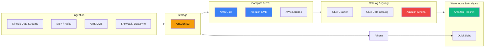
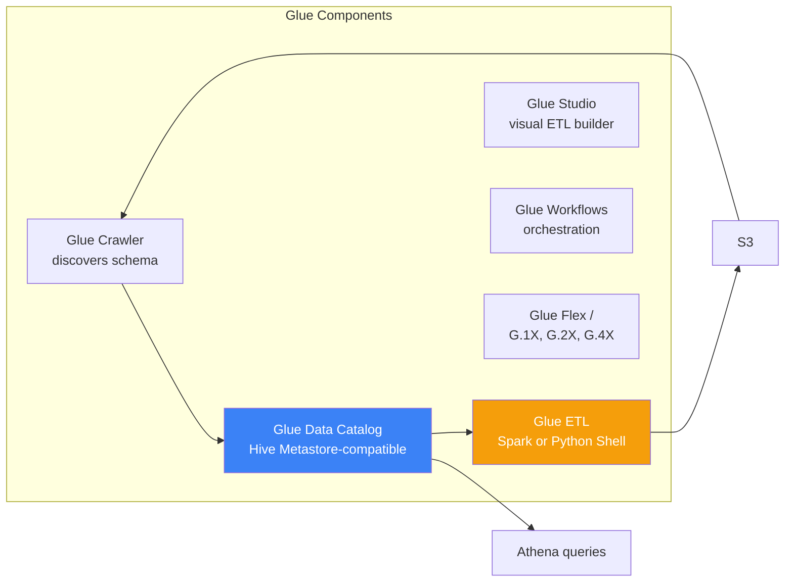
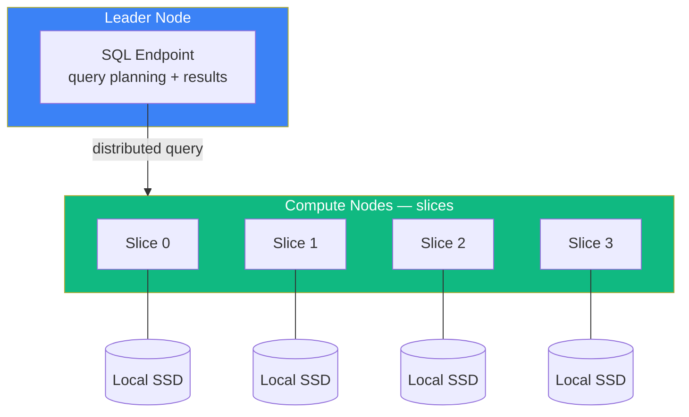
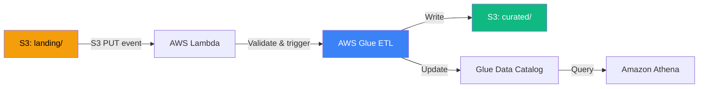
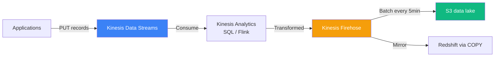

# AWS Data Engineering

> Staff DE Sam covers the AWS services and patterns every senior data engineer interviewing at GCCs needs to know — what to use, when, and at what cost.

## Contents

1. [The AWS Data Stack](#1-the-aws-data-stack)
2. [S3 — The Foundation](#2-s3-the-foundation)
3. [Glue — Serverless ETL and Catalog](#3-glue-serverless-etl-and-catalog)
4. [EMR — Spark on AWS](#4-emr-spark-on-aws)
5. [Redshift — MPP Data Warehousing](#5-redshift-mpp-data-warehousing)
6. [Lambda and Step Functions — Serverless Orchestration](#6-lambda-and-step-functions-serverless-orchestration)
7. [Kinesis — Streaming Data](#7-kinesis-streaming-data)
8. [IAM Patterns for Data Pipelines](#8-iam-patterns-for-data-pipelines)
9. [Cost Optimization](#9-cost-optimization)
10. [Architecture Patterns](#10-architecture-patterns)
11. [Interview Cheatsheet](#11-interview-cheatsheet)

---

## 1. The AWS Data Stack



**Sam:** AWS has many data services. The key skill at senior level is picking the *right* one, not knowing all of them. The decision tree for most data pipelines is:

| Workload | Recommended | Alternative |
| :--- | :--- | :--- |
| Serverless ETL, small-medium | Glue (Spark or Python Shell) | Glue Studio if visual |
| Custom Spark at scale | EMR | Glue for < 1hr runs |
| Ad-hoc SQL on S3 | Athena | Redshift Spectrum |
| Data warehouse | Redshift | Redshift Serverless |
| Real-time ingestion | Kinesis Data Streams | MSK (managed Kafka) |
| File ingestion into warehouse | Redshift COPY / Glue | Snowpipe (Snowflake) |
| Orchestration | Step Functions / MWAA (Airflow) | Glue Workflows |
| Schema discovery | Glue Crawler | Athena DDL manually |

---

## 2. S3 — The Foundation

**Sam:** Nearly every AWS data pipeline starts and ends with S3. Understanding it well is the highest-ROI AWS knowledge.

### Storage Classes

| Class | Durability | Minimum duration | Use case |
| :--- | :--- | :--- | :--- |
| S3 Standard | 99.999999999% | None | Hot data, frequent access |
| S3 Intelligent-Tiering | 99.999999999% | 30 days | Automatic cost optimization |
| S3 Standard-IA | 99.999999999% | 30 days | Infrequent access, fast retrieval |
| S3 One Zone-IA | 99.999999999% | 30 days | Reproducible data, lower cost |
| S3 Glacier Instant | 99.999999999% | 90 days | Archived but needs instant access |
| S3 Glacier Deep Archive | 99.999999999% | 180 days | Regulatory retention, never accessed |

### Lifecycle Policies

**Sam:** Automate storage class transitions. Every data lake should have lifecycle rules:

```json
{
  "Rules": [
    {
      "Id": "OptimizeCost",
      "Status": "Enabled",
      "Transitions": [
        {"Days": 30, "StorageClass": "STANDARD_IA"},
        {"Days": 90, "StorageClass": "GLACIER_INSTANT_RETRIEVAL"},
        {"Days": 365, "StorageClass": "DEEP_ARCHIVE"}
      ],
      "Expiration": {"Days": 2555}   // Delete after 7 years
    }
  ]
}
```

### Partitioning for S3

**Sam:** S3 is a flat key-value store. Use Hive-style partitioning for Athena/Glue:

```text
s3://data-lake/orders/year=2025/month=01/day=15/orders_001.parquet
s3://data-lake/orders/year=2025/month=01/day=15/orders_002.parquet
```

- Partition by columns used in WHERE clauses
- Avoid too many small files (< 128MB) — bad for Athena, Glue, Spark
- Avoid prefixes with more than a few thousand partitions (S3 LIST throttling)
- Use Iceberg or Delta Lake for tables with frequent updates — they handle partitioning internally

### S3 Consistency

S3 is **read-after-write consistent** for PUTs of new objects (since Dec 2020). Overwrite (PUT) + read is also strongly consistent. No more eventual-consistency surprises.

---

## 3. Glue — Serverless ETL and Catalog

**Sam:** Glue is the Swiss Army knife of AWS data engineering — but it has sharp edges.



### Glue ETL

| Feature | Detail |
| :--- | :--- |
| Engine | Apache Spark (or Python Shell for lightweight work) |
| Pricing | Per DPU (Data Processing Unit) per second — ~$0.44/DPU-hour |
| Worker types | G.1X (16GB, 1 vCPU), G.2X (32GB, 2 vCPU), G.4X (64GB, 4 vCPU), G.8X (128GB, 8 vCPU) |
| Flex execution | Up to 34% discount for non-urgent jobs |
| Job bookmark | Track processed files for incremental loads |

**Alex:** When should I use Glue vs EMR?

**Sam:** Glue for:
- Serverless — no cluster to manage
- Jobs running < 1 hour (EMR overhead > Glue for short runs)
- When you already use Glue Catalog + Athena

EMR for:
- Custom Spark configurations (autoscaling, instance fleets, spot instances)
- Jobs running > 1 hour (EMR is cheaper per compute-hour)
- When you need Spark ML, Hive, HBase, or Presto
- Cost-sensitive workloads (spot pricing can be 70% off)

### Glue Data Catalog

**Sam:** The catalog is a Hive Metastore-compatible service. All your AWS data tools (Athena, EMR, Redshift Spectrum, Glue) read from it. It is not a data governance tool — it does not do fine-grained access control, column-level lineage, or quality checks. For that, add Unity Catalog (Databricks) or Polaris (Iceberg).

---

## 4. EMR — Spark on AWS

**Sam:** For heavy Spark workloads, EMR gives you full control.

### EMR Cluster Types

| Type | Use case |
| :--- | :--- |
| **Transient** (auto-terminate) | Batch ETL — provision, run, terminate. Most common for DE. |
| **Long-running** | Interactive analysis, ad-hoc queries, ML training |
| **Managed Scaling** | Auto-scales core + task nodes based on YARN memory. Default for most teams. |

### Instance Fleets

**Sam:** Combine on-demand + spot + reserved instances in one cluster:

```bash
# Core nodes: on-demand (can't lose these — HDFS data lives here)
# Task nodes: spot (ephemeral compute, can be reclaimed)
aws emr create-cluster \
  --instance-fleets CoreInstanceFleet='[{InstanceFleetType=CORE,TargetOnDemandCapacity=5}]' \
  --instance-fleets TaskInstanceFleet='[{InstanceFleetType=TASK,TargetSpotCapacity=20}]'
```

### EMR Cost Optimization

| Technique | Savings | Risk |
| :--- | :--- | :--- |
| Spot instances for task nodes | 50–70% | Tasks nodes can be reclaimed (handle via graceful decommission) |
| Transient clusters | 100% when idle | Zero cost between runs |
| Auto Scaling | Matches cluster to workload | None if configured correctly |
| EMR on EKS | Share cluster with other workloads | Adds Kubernetes complexity |
| Graviton instances | 10–20% | Requires Graviton-compatible code |

---

## 5. Redshift — MPP Data Warehousing

**Sam:** Redshift is the most mature AWS warehouse. It is MPP (Massively Parallel Processing), not a virtual warehouse like Snowflake.

### Architecture



### Distribution Styles

**Sam:** Choosing the right diststyle is the most impactful Redshift tuning decision:

| Style | How data is distributed | When to use |
| :--- | :--- | :--- |
| **EVEN** | Round-robin across slices | Default. Fact tables with no clear join key. |
| **KEY** | Hash-distributed by a column | Fact table distributed on the same key as the most-joined dimension. Collocates join data — much faster joins. |
| **ALL** | Full copy on every node | Slow-changing dimension tables (under 1M rows). No shuffle needed for joins. |

```sql
CREATE TABLE fact_orders (
    order_id BIGINT DISTKEY,
    customer_id INT,
    order_date DATE,
    amount DECIMAL(10,2)
) DISTSTYLE KEY DISTKEY (customer_id)    -- Same key as dim_customer
  SORTKEY (order_date);                    -- Sort by date for range scans
```

### Sort Keys

| Key type | Behavior | Use case |
| :--- | :--- | :--- |
| **Compound** | Columns sorted as a group | Queries filter on the leading column(s) |
| **Interleaved** | Equal weight to all sort columns | Queries filter on multiple columns independently |

### Redshift Spectrum

**Sam:** Query S3 data directly without loading into Redshift:

```sql
CREATE EXTERNAL TABLE spectrum.orders (
    order_id BIGINT,
    customer_id INT,
    amount DECIMAL(10,2)
)
ROW FORMAT SERDE 'org.apache.hadoop.hive.ql.io.parquet.serde.ParquetHiveSerDe'
LOCATION 's3://data-lake/orders/';
```

- Spectrum queries S3 data directly (you pay for bytes scanned)
- Use for: cold data, data lake queries, joining S3 data with Redshift tables
- 10x slower than native Redshift — do not use for hot-path queries

### Redshift vs Snowflake

| Aspect | Redshift | Snowflake |
| :--- | :--- | :--- |
| Architecture | MPP, fixed node types | Virtual warehouses, storage-compute separation |
| Scaling | Resize (downtime) or Elastic Resize (minutes) | Instant warehouse resize, no downtime |
| Concurrency | WLM queues, manual | Multi-cluster auto-scaling |
| Performance tuning | Diststyle + sortkey + compression | Warehouse sizing + clustering |
| Cost model | Provisioned (pay per hour) | Compute credits + storage (pay per second) |
| Serverless | Redshift Serverless (2022+) | Yes (default) |

---

## 6. Lambda and Step Functions — Serverless Orchestration

### Lambda for Data Processing

**Sam:** Lambda is good for lightweight, event-driven data processing. Not for heavy ETL (15 min max, 10GB RAM):

```python
import json, boto3

def lambda_handler(event, context):
    """Triggered by S3 PUT — validates and moves a file"""
    bucket = event['Records'][0]['s3']['bucket']['name']
    key = event['Records'][0]['s3']['object']['key']
    
    # Validate file
    s3 = boto3.client('s3')
    response = s3.head_object(Bucket=bucket, Key=key)
    if response['ContentLength'] == 0:
        raise ValueError(f"Empty file: {key}")
    
    # Move to processing prefix
    copy_key = key.replace('landing/', 'processing/')
    s3.copy_object(Bucket=bucket, CopySource=f'{bucket}/{key}', Key=copy_key)
    s3.delete_object(Bucket=bucket, Key=key)
    
    return {'statusCode': 200, 'body': json.dumps('File validated and moved')}
```

### Step Functions for Orchestration

**Sam:** Step Functions coordinate multiple AWS services into a workflow. It replaces Airflow for simple pipelines (no scheduler needed):

```json
{
  "Comment": "Data Pipeline",
  "StartAt": "ValidateSource",
  "States": {
    "ValidateSource": {
      "Type": "Task",
      "Resource": "arn:aws:lambda:...validate",
      "Next": "RunGlueJob"
    },
    "RunGlueJob": {
      "Type": "Task",
      "Resource": "arn:aws:states:::glue:startJobRun",
      "Parameters": {
        "JobName": "etl-job"
      },
      "Next": "Success"
    },
    "Success": {
      "Type": "Succeed"
    }
  }
}
```

---

## 7. Kinesis — Streaming Data

| Service | What it is | When to use |
| :--- | :--- | :--- |
| **Kinesis Data Streams** | Real-time data ingestion (producer → consumer) | Raw event stream, need custom consumer, retention up to 365 days |
| **Kinesis Data Firehose** | Load streaming data into S3/Redshift/Elasticsearch | Near-real-time delivery to S3, no custom consumer needed |
| **Kinesis Data Analytics** | SQL or Flink-based stream processing | Simple transformations on streaming data before Firehose |
| **MSK** (Managed Kafka) | Fully managed Apache Kafka | When your architecture uses Kafka (existing investment, Kafka Connect, schema registry) |

### Kinesis Data Streams vs MSK

| | KDS | MSK |
| :--- | :--- | :--- |
| Max throughput per shard | 1MB/s write, 2MB/s read | Kafka limits (configurable) |
| Scaling | Add shards (manual or auto) | Add brokers |
| Consumer model | Pull (KCL, Lambda, Firehose) | Kafka consumer protocol |
| Best for | Simple ingestion, Lambda consumers | Kafka-native apps, Kafka Connect |

---

## 8. IAM Patterns for Data Pipelines

**Sam:** IAM is where most teams get data security wrong. Follow least-privilege for data pipelines:

### S3 Access Pattern

```json
{
    "Effect": "Allow",
    "Action": ["s3:GetObject", "s3:ListBucket"],
    "Resource": ["arn:aws:s3:::data-lake/*", "arn:aws:s3:::data-lake"],
    "Condition": {
        "StringLike": {
            "s3:prefix": ["landing/", "processing/"]
        }
    }
}
```

### Cross-Account Access

**Sam:** In GCCs, data lakes are often in a separate "data" account. Use S3 bucket policies + IAM roles with `sts:AssumeRole`:

```json
{
    "Effect": "Allow",
    "Action": "sts:AssumeRole",
    "Resource": "arn:aws:iam::DATA_ACCOUNT:role/DataLakeReader"
}
```

### Instance Profile for EMR

```json
{
    "Effect": "Allow",
    "Action": [
        "s3:GetObject", "s3:PutObject", "s3:ListBucket",
        "glue:GetTable", "glue:GetDatabase", "glue:GetPartitions",
        "logs:CreateLogGroup", "logs:CreateLogStream", "logs:PutLogEvents"
    ],
    "Resource": "*"
}
```

---

## 9. Cost Optimization

| Strategy | Service | Savings | Effort |
| :--- | :--- | :--- | :--- |
| Spot instances | EMR (task nodes) | 50–70% | Low |
| S3 lifecycle | S3 (older → colder) | 50–90% | Low |
| Right-sizing | EMR, Glue, Redshift | 20–40% | Medium |
| Auto-scaling | EMR, Redshift | 15–30% | Medium |
| S3 Intelligent-Tiering | S3 | Auto-saves any tier cost | Zero |
| Reserved Instances / Savings Plans | EMR, Redshift | 30–60% | Low |
| Delete unused resources | All | Varies | Low |
| Athena partition + compression | Athena | 50–90% | Medium |
| Glue Flex execution | Glue | Up to 34% | Low |

---

## 10. Architecture Patterns

### Pattern 1: Serverless ETL



### Pattern 2: Batch Spark on EMR

```bash
# Submit transient EMR cluster for nightly batch
aws emr create-cluster \
  --release-label emr-7.0.0 \
  --applications Name=Spark \
  --instance-groups \
    InstanceGroupType=MASTER,InstanceType=r5.xlarge,InstanceCount=1 \
    InstanceGroupType=CORE,InstanceType=r5.2xlarge,InstanceCount=4,BidPrice=OnDemand \
    InstanceGroupType=TASK,InstanceType=r5.2xlarge,InstanceCount=10,BidPrice=0.15 \
  --auto-terminate \
  --steps Type=Spark,Name=ETL,ActionOnFailure=CONTINUE,Args=[--deploy-mode,cluster,--class,com.etl.Main,s3://bucket/job.jar]
```

### Pattern 3: Streaming with Kinesis + Firehose



---

## 11. Interview Cheatsheet

### Service Selection

| Task | Best service | When NOT to use |
| :--- | :--- | :--- |
| File storage | S3 | Low-latency IO (use EBS/EFS) |
| Ad-hoc SQL on S3 | Athena | Frequent queries (use Redshift) |
| Serverless Spark | Glue | Long-running jobs (use EMR) |
| Custom Spark | EMR | < 1hr runs (Glue is cheaper) |
| Data warehouse | Redshift | Serverless-first teams (use Snowflake) |
| Real-time ingestion | Kinesis Data Streams | Kafka ecosystem (use MSK) |
| S3 load automation | Kinesis Firehose | Precise control (custom Lambda) |
| Orchestration | Step Functions / MWAA | Complex branching (use Airflow) |
| Schema discovery | Glue Crawler | Known schema (write DDL yourself) |

### Key Interview Answer

> AWS data engineering is about matching the right service to the workload. S3 is the foundational storage layer with lifecycle policies for cost management. Glue provides serverless Spark ETL and the Data Catalog for schema discovery. EMR offers full-control Spark for heavy jobs with spot instance savings. Redshift is the MPP warehouse for BI — performance depends on diststyle + sortkey tuning. Kinesis handles real-time ingestion, Firehose automates S3 delivery, and Step Functions orchestrates serverless pipelines. Cost optimization is a first-class concern: spot instances, S3 lifecycle rules, right-sized clusters, and auto-scaling. IAM least-privilege is non-negotiable — every service role should only access the S3 prefixes and Glue tables it needs.

---

### Resources

- [AWS Well-Architected Framework — Data Analytics Lens](https://docs.aws.amazon.com/wellarchitected/latest/analytics-lens/analytics-lens.html)
- [AWS Data Engineering — Best Practices](https://aws.amazon.com/big-data/data-engineering/)
- [EMR Best Practices Guide](https://docs.aws.amazon.com/emr/latest/ManagementGuide/emr-plan-instances-guidelines.html)
- [Redshift Best Practices for Data Loading](https://docs.aws.amazon.com/redshift/latest/dg/c_best-practices-single-table.html)
- [AWS Cost Management for Data Pipelines](https://aws.amazon.com/blogs/big-data/category/analytics/big-data/)
- [Serverless Data Lake with AWS (Whitepaper)](https://docs.aws.amazon.com/whitepapers/latest/aws-serverless-data-lake/aws-serverless-data-lake.html)
