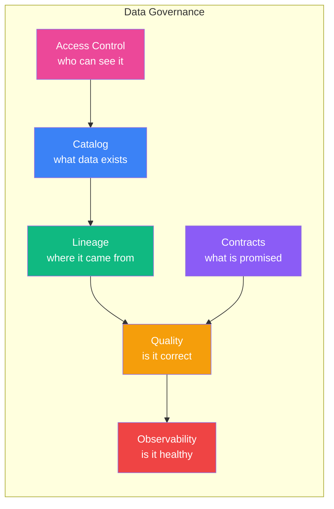
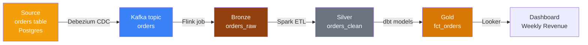
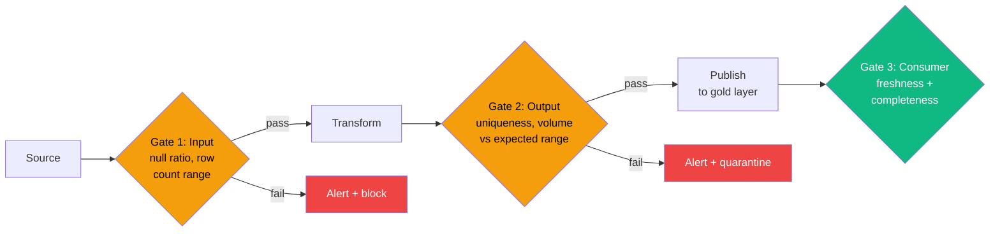

# Data Governance and Quality

> Staff DE Sam walks Senior DE Alex through the governance and quality practices that separate staff-level engineers from seniors — and that GCCs increasingly demand in 2026.

## Contents

1. [Why Governance Matters Now](#1-why-governance-matters-now)
2. [Data Catalog — Unity Catalog, Polaris, DataHub](#2-data-catalog-unity-catalog-polaris-datahub)
3. [Data Lineage](#3-data-lineage)
4. [Data Quality Frameworks](#4-data-quality-frameworks)
5. [Data Contracts](#5-data-contracts)
6. [Data Observability](#6-data-observability)
7. [SLA, SLO, SLI for Data Pipelines](#7-sla-slo-sli-for-data-pipelines)
8. [Access Control and PII Handling](#8-access-control-and-pii-handling)
9. [Interview Cheatsheet](#9-interview-cheatsheet)

---

## 1. Why Governance Matters Now

**Alex:** Governance sounds like something the compliance team does. Why should I care as a data engineer?

**Sam:** Because without governance, your data lake becomes a data swamp — nobody knows what tables exist, which columns have PII, whether the data is fresh, or which dashboard breaks when you change a schema. At the staff level, you are expected to design the governance layer, not just complain about its absence.

**Alex:** What changed in 2025–2026?

**Sam:** Three things:

1. **AI pipelines consume data directly** — RAG systems, feature stores, and LLM fine-tuning read from the data lake. Bad data = bad AI. Governance is now an AI-enabler, not a blocker.
2. **Regulations are tightening** — India's DPDPA (Digital Personal Data Protection Act), GDPR, CCPA. GCCs in BFSI and healthcare need audit trails for every data access.
3. **Data platform engineering** — the expectation that you build trust through contracts, quality SLAs, and self-service discovery, not firefighting.

**Alex:** What are the concrete things I need to know?

**Sam:** Six areas: catalog, lineage, quality, contracts, observability, and access control.



---

## 2. Data Catalog — Unity Catalog, Polaris, DataHub

**Sam:** A data catalog answers "what tables exist, what do the columns mean, and who owns them?" Without one, every new hire spends weeks discovering data by asking Slack channels.

### Comparison

| Tool | Type | Key strength | Weakness |
| :--- | :--- | :--- | :--- |
| **Unity Catalog** | Databricks-native | RBAC + lineage + audit in one system | Tied to Databricks ecosystem |
| **Apache Polaris** | Open REST catalog for Iceberg | Iceberg-native, multi-engine | No lineage yet |
| **DataHub** (LinkedIn) | Open source metadata platform | Best lineage, great UI, pulls from any source | Requires deployment + maintenance |
| **Amundsen** (Lyft) | Open source data discovery | Simple search + table metadata | Less active community |
| **AWS Glue Catalog** | AWS-native | Free with Glue, Hive-compatible | No governance features (no RBAC/lineage) |
| **Alation / Collibra** | Commercial | Enterprise-grade governance + workflow | Expensive |

**Sam:** In 2026, the most common stack is **Unity Catalog** for Databricks-native teams and **Polaris** for Iceberg-first multi-engine teams. For lineage specifically, **DataHub** is the open-source standard.

### What a Catalog Should Track

```yaml
table: fct_orders
description: "One row per order line item at order time"
location: "s3://data-lake/gold/sales/fct_orders"
owner: "sales-analytics-team"
domain: "sales"
tags:
  - pii
  - gold-tier
columns:
  - name: customer_email
    type: string
    pii: true
    description: "Customer email address (masked in non-prod)"
  - name: amount
    type: decimal(10,2)
    description: "Line item total after discount"
freshness:
  last_updated: "2025-06-15T14:30:00Z"
  update_frequency: "hourly"
quality:
  completeness: 0.995
  uniqueness: 0.999
```

---

## 3. Data Lineage

**Sam:** Lineage answers "if I change this column, what breaks?" It maps data flow from source → staging → gold → dashboards.



### Levels of Lineage

| Level | What it captures | Tooling |
| :--- | :--- | :--- |
| **Table-level** | Table A → Table B | dbt `ref()`, Spark SQL DAG, Airflow |
| **Column-level** | Column X in A → Column Y in B | DataHub, Unity Catalog, custom |
| **Transformation-level** | The SQL/Python logic that produces the value | DataHub + OpenLineage |

**Sam:** Start with table-level lineage (easy, most tools support it automatically). Add column-level lineage when you hit incidents where a renamed column breaks a dashboard. Transformation-level is aspirational for most teams.

### OpenLineage

**Sam:** OpenLineage is the open standard for lineage metadata:

```json
{
  "eventType": "COMPLETE",
  "run": { "runId": "..." },
  "job": { "name": "etl_job", "namespace": "spark" },
  "inputs": [{"namespace": "s3://data-lake", "name": "bronze/orders"}],
  "outputs": [{"namespace": "s3://data-lake", "name": "silver/orders"}],
  "producer": "https://github.com/OpenLineage/OpenLineage"
}
```

- Integrates with Spark, dbt, Airflow, Flink
- Feeds into DataHub, Marquez, or custom sinks

---

## 4. Data Quality Frameworks

**Alex:** What does "data quality" mean in practice?

**Sam:** Six dimensions:

| Dimension | Question | How to measure |
| :--- | :--- | :--- |
| **Completeness** | Are all rows present? | Row count vs expected; NULL ratio per column |
| **Uniqueness** | Are there duplicates? | `COUNT(DISTINCT key)` vs `COUNT(*)` |
| **Timeliness** | Is data fresh enough? | Max timestamp vs SLA boundary |
| **Validity** | Do values conform to schema? | Type checks, pattern matching (email regex) |
| **Accuracy** | Is it correct? | Cross-reference with source or business rules |
| **Consistency** | Does it agree across systems? | Compare counts between warehouse and source |

### Tooling Stack

| Tool | What it does | When to use |
| :--- | :--- | :--- |
| **dbt tests** | SQL assertions on warehouse models | First line of quality — every model should have at least `not_null` + `unique` on its key |
| **Great Expectations** | Python-based expectation framework | Complex checks, batch data outside dbt, ML data validation |
| **Deequ** (AWS) | Scala/Python quality library for Spark | Large-scale quality checks on Spark DataFrames |
| **Soda Core** | Open-source SQL checks | Lightweight alternative to GE, simpler syntax |
| **dbt-expectations** | dbt package of advanced tests | Extends dbt tests with 50+ expectation types |

### Great Expectations Example

```python
import great_expectations as ge

df = ge.read_parquet("s3://data-lake/silver/orders/")
df.expect_column_values_to_not_be_null("order_id")
df.expect_column_values_to_be_between("amount", 0, 100000)
df.expect_column_pair_values_to_be_equal("order_date", "ship_date")
```

### dbt Quality Checks

```yaml
# tests/marts/fct_orders.yml
version: 2
models:
  - name: fct_orders
    tests:
      - dbt_expectations.expect_table_row_count_to_be_between:
          min_value: 10000
          max_value: 100000000
    columns:
      - name: order_id
        tests:
          - unique
          - not_null
      - name: total_amount
        tests:
          - not_null
          - dbt_expectations.expect_column_values_to_be_between:
              min_value: 0
              max_value: 1000000
```

### Quality Gates in Pipelines

**Sam:** Every pipeline should have three quality gates:



---

## 5. Data Contracts

**Sam:** A data contract is a formal agreement between a data producer and a data consumer. It specifies what is promised and what happens when the promise is broken.

```yaml
contract:
  producer: "order-service-team"
  consumer: "analytics-team"
  dataset: "orders"
  schema:
    order_id: "BIGINT NOT NULL"
    customer_id: "INT NOT NULL"
    amount: "DECIMAL(10,2) NOT NULL"
    order_date: "DATE NOT NULL"
  slas:
    freshness: "Data available within 15 minutes of event time"
    completeness: ">= 99.5% of expected daily volume"
    availability: "99.9% queryable"
  breaking_changes:
    notification: "72 hours before deployment"
    process: "PR review against consumer impact analysis"
```

| Element | What it prevents |
| :--- | :--- |
| Schema contract | Producer drops/renames column → consumer dashboard breaks |
| Freshness SLA | Pipeline stalls → stale dashboards |
| Volume SLO | Data missing → ML model serves stale predictions |
| Notification policy | Breaking change deployed on Friday without warning |

**Sam:** The most impactful single governance practice: **require every producer to define a contract before the consumer reads the data.** Without contracts, you get Slack DMs at 11 PM asking "did something change with orders?"

---

## 6. Data Observability

**Sam:** Observability means knowing your data health in real time — not when a stakeholder emails you.

### Five Pillars

| Pillar | What it detects | Example |
| :--- | :--- | :--- |
| **Freshness** | Pipeline is stalled or late | No new data in `orders` for 2 hours |
| **Volume** | Data is missing or duplicated | Row count dropped 80% from yesterday |
| **Schema** | Column added/renamed/dropped | New column `customer_email` appeared in source |
| **Quality** | Values are out of expected range | 50% NULL rate on `amount` |
| **Lineage** | Downstream impact | Which dashboards depend on `orders.total_amount` |

### Tooling

| Tool | Type | Notes |
| :--- | :--- | :--- |
| **Monte Carlo** | Commercial | End-to-end observability, lineage, alerting |
| **Bigeye** | Commercial | Column-level quality + freshness SLAs |
| **Sifflet** | Commercial | Unified catalog + quality + lineage |
| **Soda Cloud** | Commercial | Open-source core, cloud observability UI |
| **dbt + Elementary** | Open source | dbt run artifacts + quality dashboards |
| **Prometheus + Grafana** | Open source | Pipeline metrics (row counts, latency) from custom exporters |

**Sam:** The observability maturity model:

1. **Reactive** — stakeholder reports an issue, you investigate
2. **Proactive** — monitors alert you before stakeholders notice
3. **Preventive** — quality gates block bad data from reaching consumers
4. **Automated** — system auto-heals (re-runs failed pipelines, backfills missing data)

Most GCC teams are between 2 and 3 in 2026. Staff engineers drive from 2 to 3.

---

## 7. SLA, SLO, SLI for Data Pipelines

**Sam:** Borrowed from SRE, these concepts apply directly to data:

| Term | Data meaning | Example |
| :--- | :--- | :--- |
| **SLI** (Indicator) | The measured metric | "Time since last successful load of `orders`" |
| **SLO** (Objective) | The target value | "99% of daily loads complete within 15 minutes of scheduled time" |
| **SLA** (Agreement) | The contractual commitment | "If freshness SLO is missed for 3 consecutive days, data team provides root cause analysis" |

### Defining Data SLOs

```python
# Example: Freshness SLO monitoring
from datetime import datetime, timedelta

def check_freshness_slo(table_name, max_age_minutes=60):
    """Check if table data is fresh enough"""
    last_updated = get_last_updated(table_name)  # from catalog
    age_minutes = (datetime.utcnow() - last_updated).total_seconds() / 60
    
    if age_minutes > max_age_minutes:
        alert(f"SLO breach: {table_name} is {age_minutes:.0f} min old "
              f"(SLO: {max_age_minutes} min)")
        return False
    return True
```

### Common Data SLOs

| SLO | Target | Measurement |
| :--- | :--- | :--- |
| Freshness | Data ≤ 15 min old | Max event_time in warehouse vs now |
| Completeness | ≥ 99% of expected rows | Actual row count vs forecast or source count |
| Availability | 99.9% queryable | Warehouse query failure rate |
| Correctness | < 0.1% anomaly rate | Quality check failure rate |
| Recovery | ≤ 30 min MTTR | Time from alert to data healthy again |

---

## 8. Access Control and PII Handling

### Column-Level Security

**Sam:** Not everyone should see PII columns. Implement column-level masking:

```sql
-- Snowflake: Dynamic masking
CREATE MASKING POLICY email_mask AS (val STRING) RETURNS STRING ->
  CASE WHEN CURRENT_ROLE() IN ('analyst') THEN val
       ELSE CONCAT(LEFT(val, 2), '****@***')
  END;

ALTER TABLE dim_customer MODIFY COLUMN email
  SET MASKING POLICY email_mask;

-- Databricks Unity Catalog: column-level grant
GRANT SELECT (customer_sk, total_amount) ON TABLE fct_orders TO `analyst_role`;
GRANT SELECT ON TABLE fct_orders TO `finance_role`;  -- sees all columns
```

### PII Classification

| Category | Examples | Handling |
| :--- | :--- | :--- |
| **Sensitive** | Email, phone, SSN, passport | Always masked in non-prod, audited on every access |
| **Internal** | Employee ID, internal emails | Mask by default, accessible with justification |
| **Public** | Product name, category | No restrictions |
| **Regulated** | Financial transactions, health records | Retention limits, immutable audit log |

### Row-Level Security

```sql
-- PostgreSQL: Row-level security
CREATE POLICY user_isolation ON fact_orders
    USING (tenant_id = current_setting('app.tenant_id')::INT);
ALTER TABLE fact_orders ENABLE ROW LEVEL SECURITY;
```

### Audit Logging

**Sam:** Every query against sensitive data should be logged. In Unity Catalog, this is built-in:

```sql
-- Unity Catalog system table
SELECT * FROM system.access.audit
WHERE table_name = 'main_prod.sales.fct_orders'
  AND action_name = 'select'
  AND event_time > CURRENT_DATE - 7
ORDER BY event_time DESC;
```

---

## 9. Interview Cheatsheet

### Quick Reference

| Area | Key tools | Key concepts |
| :--- | :--- | :--- |
| Catalog | Unity Catalog, Polaris, DataHub | Three-level namespace, metadata discovery |
| Lineage | OpenLineage, DataHub, Marquez | Table-level → Column-level → Transformation-level |
| Quality | dbt tests, Great Expectations, Soda | Completeness, uniqueness, timeliness, validity, accuracy, consistency |
| Contracts | Custom schema + YAML | Schema, freshness SLA, breaking change policy |
| Observability | Monte Carlo, Soda, Elementary | Freshness, volume, schema, quality alerts |
| SLO | Custom monitoring | SLI → SLO → SLA, error budget for data |
| Access control | Unity Catalog, column masking | RBAC, column-level security, row-level security, PII classification |

### Key Interview Answer

> Data governance is the foundation of a trustworthy data platform. I start with a catalog — Unity Catalog or DataHub — so teams can discover and understand available data. Lineage (via OpenLineage or built-in tooling) tells us what breaks when something changes. Data quality is enforced at three gates: input (validate source), transform (dbt tests + Great Expectations), and output (freshness + volume checks against SLOs). Data contracts between producers and consumers codify schema, freshness, and notification policies. Access control combines column-level masking for PII with RBAC for role-based access. The goal is a self-service platform where consumers trust the data without needing to ask "is this correct?" — because the governance layer proves it.

---

### Resources

- [OpenLineage](https://openlineage.io/) — Open standard for lineage metadata
- [DataHub](https://datahubproject.io/) — Open-source metadata platform
- [Great Expectations](https://greatexpectations.io/) — Data quality framework
- [dbt Tests and Documentation](https://docs.getdbt.com/docs/build/tests) — Testing in dbt
- [Monte Carlo Data Observability](https://www.montecarlodata.com/) — Commercial observability platform
- [Soda Core](https://www.soda.io/) — Open-source data quality
- [Unity Catalog Documentation](https://www.databricks.com/product/unity-catalog) — Databricks governance
- [Apache Polaris](https://polaris.io/) — Open Iceberg REST catalog
