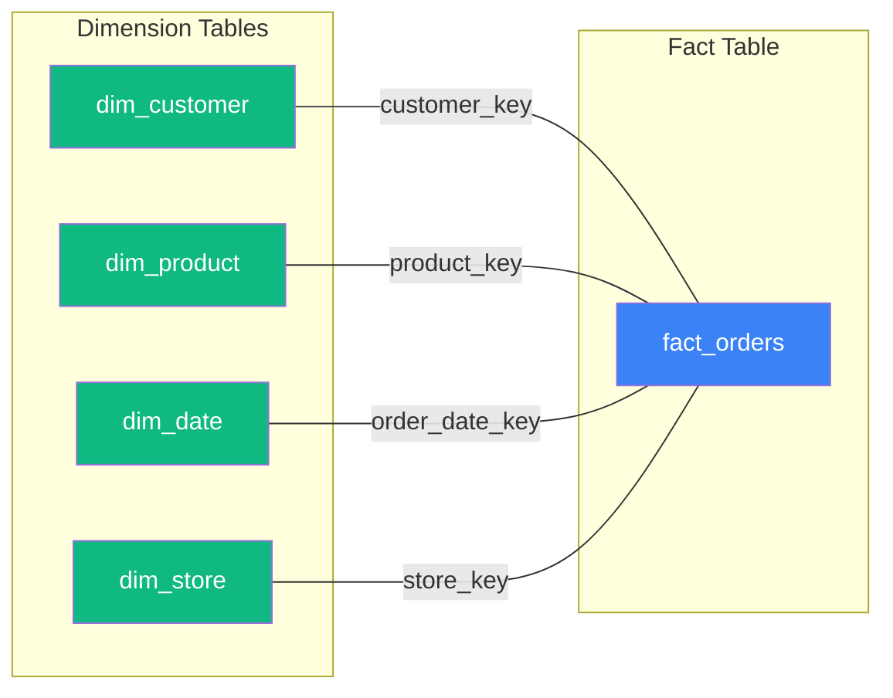
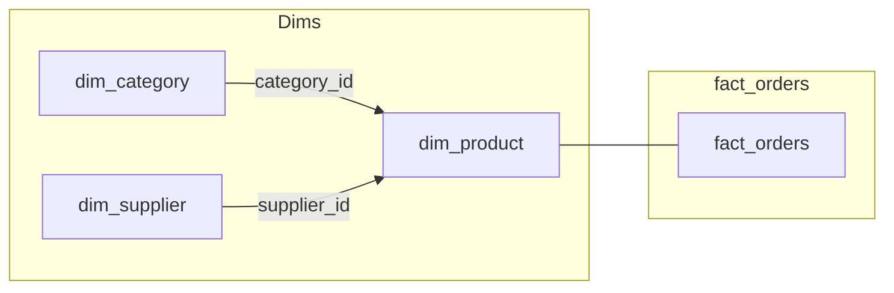
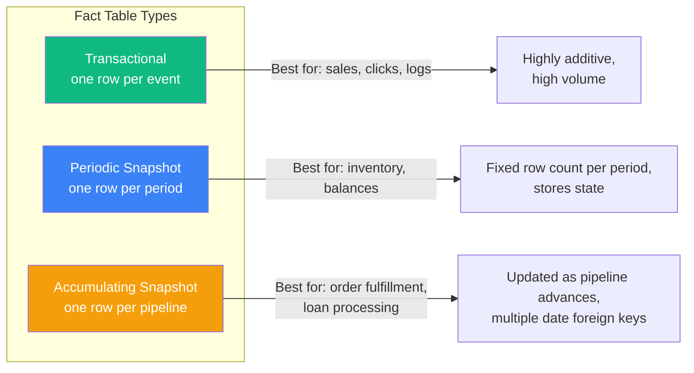
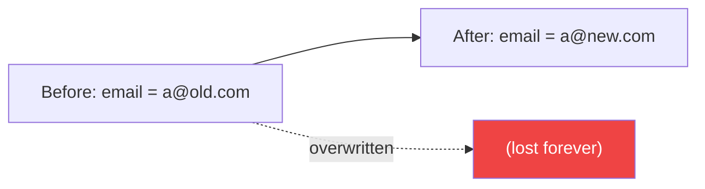
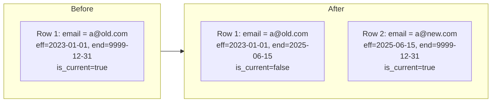
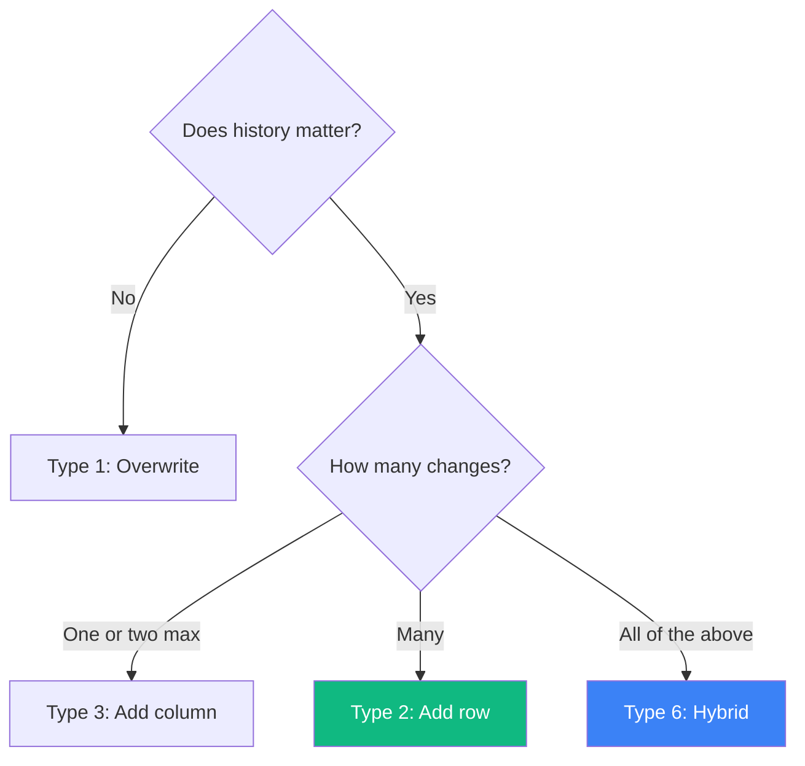
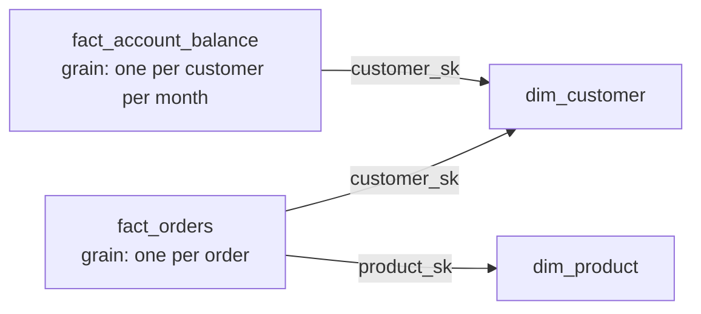

# Data Modeling for Data Engineering

> Staff DE Sam walks Senior DE Alex through the data modeling knowledge expected at senior/staff level — not theory, but what you actually design and defend in production.

## Contents

1. [Why Data Modeling Matters](#1-why-data-modeling-matters)
2. [Star Schema](#2-star-schema)
3. [Snowflake Schema](#3-snowflake-schema)
4. [Fact Tables](#4-fact-tables)
5. [Dimension Tables](#5-dimension-tables)
6. [Slowly Changing Dimensions (SCD)](#6-slowly-changing-dimensions-scd)
7. [Kimball vs Inmon vs Data Vault](#7-kimball-vs-inmon-vs-data-vault)
8. [Grain — The Most Important Decision](#8-grain--the-most-important-decision)
9. [Interview Cheatsheet](#9-interview-cheatsheet)

---

## 1. Why Data Modeling Matters

**Alex:** I can write pipelines. Why should I care about data modeling?

**Sam:** Because every pipeline either produces or consumes a data model. If the model is wrong, the pipeline is wrong — no amount of Spark tuning fixes a bad schema. Senior engineers are the ones who design the model. Juniors are the ones who implement it.

**Alex:** What is the single concept that separates good models from bad?

**Sam:** **Grain.** Declaring what one row means. Every modeling mistake traces back to unclear grain.

---

## 2. Star Schema



**Sam:** The star schema is the standard for analytics. One central fact table with numeric measures, surrounded by dimension tables with descriptive attributes. Every dimension joins on a surrogate key (integer, not the source system's ID).

```sql
-- Fact table
CREATE TABLE fact_orders (
    order_sk BIGINT PRIMARY KEY,        -- Surrogate key
    order_date_sk INT NOT NULL,          -- Foreign key to dim_date
    customer_sk INT NOT NULL,            -- Foreign key to dim_customer
    product_sk INT NOT NULL,             -- Foreign key to dim_product
    store_sk INT NOT NULL,               -- Foreign key to dim_store
    quantity INT NOT NULL,
    unit_price DECIMAL(10,2) NOT NULL,
    discount DECIMAL(5,2),
    total_amount DECIMAL(12,2) NOT NULL,
    created_at TIMESTAMP
);

-- Dimension table
CREATE TABLE dim_customer (
    customer_sk INT PRIMARY KEY,         -- Surrogate key
    customer_id INT NOT NULL,            -- Natural key from source
    full_name VARCHAR(100),
    email VARCHAR(200),
    city VARCHAR(50),
    state VARCHAR(50),
    created_date DATE,
    is_current BOOLEAN,                  -- For SCD Type 2
    effective_date DATE,
    end_date DATE
);
```

| Element | Fact Table | Dimension Table |
| :--- | :--- | :--- |
| Content | Measures (numeric, additive) | Attributes (descriptive, textual) |
| Rows | Transactions, events, snapshots | Entities (customers, products, dates) |
| Keys | Composite of dimension foreign keys | Surrogate primary key |
| Updates | Append-only (new rows, no update) | Slowly changing |
| Size | Large (billions of rows) | Small (thousands to millions) |

---

## 3. Snowflake Schema

**Sam:** Snowflake schema normalizes dimensions into multiple related tables. Saves storage but adds JOIN complexity. BI tools prefer star because it is simpler to query.



**Alex:** When would you snowflake?

**Sam:** Almost never for analytics. Snowflake-normalized dimensions add JOIN hops for no query benefit. The exception is when a dimension has a genuinely independent hierarchy (e.g., product → category is one-to-many and category has 50+ attributes that change independently). Even then, most teams flatten into the dimension table and accept the redundancy. Storage is cheap; developer time is not.

---

## 4. Fact Tables

### Three Types



| Type | Grain | Row added when | Row updated when | Example |
| :--- | :--- | :--- | :--- | :--- |
| **Transactional** | One row per event | Event occurs | Never (append-only) | `fact_sales` — one row per line item |
| **Periodic Snapshot** | One row per entity per period | Period ends | Never (new row each period) | `fact_inventory_daily` — one row per product per day |
| **Accumulating Snapshot** | One row per pipeline instance | Pipeline starts | As milestones complete | `fact_order_fulfillment` — one row per order, updated through shipping |

**Sam:** Accumulating snapshots are the least understood but most useful for operational pipelines. They record the entire lifecycle of an entity in one row, with date columns for each milestone:

```sql
CREATE TABLE fact_order_fulfillment (
    order_sk BIGINT PRIMARY KEY,
    order_date_sk INT,
    payment_date_sk INT,      -- NULL until payment completes
    ship_date_sk INT,         -- NULL until shipped
    delivery_date_sk INT,     -- NULL until delivered
    order_amount DECIMAL(12,2),
    days_to_payment INT,      -- Computed: payment_date - order_date
    days_to_ship INT,
    days_to_deliver INT
);
```

---

## 5. Dimension Tables

### Conformed Dimensions

**Sam:** A dimension that means the same thing across multiple fact tables. `dim_date` is the classic example — shared across every fact table so revenue and inventory can be joined on the same date key.

### Degenerate Dimensions

A dimension attribute stored in the fact table because it has no independent dimension table:

```sql
-- Order number is a degenerate dimension — it exists in the source order table
-- but has no attributes of its own
CREATE TABLE fact_order_line_items (
    order_number VARCHAR(20),    -- Degenerate dimension
    line_item_id INT,
    product_sk INT,
    quantity INT,
    amount DECIMAL(12,2)
);
```

### Junk Dimensions

**Sam:** Low-cardinality flags and indicators that don't warrant their own dimension. Combine them into a single junk dimension:

```sql
-- Instead of storing is_new_customer, is_expedited_ship, is_gift in fact table
-- Create a single junk dimension
CREATE TABLE dim_order_flags (
    flag_sk INT PRIMARY KEY,
    is_new_customer BOOLEAN,
    is_expedited_ship BOOLEAN,
    is_gift BOOLEAN
);

-- fact.flag_sk → dim_order_flags.flag_sk
```

---

## 6. Slowly Changing Dimensions (SCD)

**Sam:** This is the most asked data modeling topic in senior/staff interviews. Know the types cold.

### SCD Type 0 — Retain Original

- The attribute never changes once written.
- Use: creation date, original customer ID.

### SCD Type 1 — Overwrite



- The old value is lost. No history.
- Use: corrections (typo in name), attributes where history does not matter.

### SCD Type 2 — Add New Row (Most Common)



```sql
-- Find the customer's email at the time of order
SELECT o.order_id, c.email, c.full_name
FROM fact_orders o
JOIN dim_customer c
    ON o.customer_sk = c.customer_sk
    AND o.order_date >= c.effective_date
    AND o.order_date < c.end_date;
```

| Element | Value |
| :--- | :--- |
| When to use | When history matters (address changes, pricing tiers, department transfers) |
| Tracking columns | `effective_date`, `end_date`, `is_current` (or `valid_to = '9999-12-31'`) |
| Surrogate key | Required — natural key repeats across rows |
| Query pattern | Join on surrogate key OR natural key + date range |

### SCD Type 3 — Add New Column

**Sam:** Stores the previous value in a separate column. Rarely used because it only tracks one level of change:

```sql
ALTER TABLE dim_customer ADD COLUMN previous_email VARCHAR(200);
```

| When to use | Why |
| :--- | :--- |
| You need the current AND previous value in the same row | Reporting that compares "before and after" (e.g., "customers who changed email domain") |

### SCD Type 6 (Hybrid)

**Sam:** Type 2 + Type 1 + Type 3 combined. The dimension row tracks current value (Type 1 overwrite) AND historical rows (Type 2) AND a current-flag column in historical rows (Type 3-ish). Useful in modern data warehouses where you need both point-in-time accuracy and current-value lookups.

### SCD Decision Matrix



---

## 7. Kimball vs Inmon vs Data Vault

| Approach | Philosophy | Strengths | Weaknesses | When to use |
| :--- | :--- | :--- | :--- | :--- |
| **Kimball** (Dimensional) | Star schema, business-process oriented, conformed dimensions | Fastest for BI, intuitive for business users | Data redundancy, harder ETL initially | Most analytics warehouses |
| **Inmon** (3NF) | Normalized enterprise data warehouse (EDW), then dimensional marts | Single source of truth, no redundancy | Complex queries, slow to build, harder for business users | Large enterprises with regulatory need for normalized store |
| **Data Vault** | Hubs (business keys), Links (relationships), Satellites (attributes) | Highly scalable, flexible to source changes, auditable | Complex, many JOINs, tooling-dependent | Large-scale data integration with many source systems |

**Alex:** What should I use in 2026?

**Sam:** **Kimball** for the analytics layer (Gold in medallion terminology). **Data Vault** for the integration layer (Silver) if you have many source systems that change frequently. **Inmon** is increasingly rare — modern data platforms skip the normalized EDW and go straight to a well-designed star schema.

In practice: Bronze/Clean → Silver (Data Vault or flat with Surrogate Keys) → Gold (Kimball star schemas).

---

## 8. Grain — The Most Important Decision

**Sam:** Before you design a single table, ask: "What does one row represent?" Write it down. Everyone agrees.

```text
Bad grain statement:  "This table stores orders."
Good grain statement: "One row = one line item in one order, at the time the order was placed."

Bad:  "Customer dimension."
Good: "One row = one customer, uniquely identified by customer_id, effective only while the customer is active."
```

**Alex:** What happens when grain is wrong?

**Sam:** Double-counting. If the fact table has one row per order but someone loads it at the line-item grain, `SUM(amount)` over-counts. If the table is at the daily grain but you join to a customer dimension at the customer grain, you get fan traps (duplicate rows through the join). Grain fixes every modeling disagreement — always start there.

### Fan Trap



**Sam:** If you query fact_orders JOIN dim_customer JOIN fact_account_balance, each order row repeats the balance — summing the balance now gives the wrong number. Fix: aggregate separately and join later, or use a bridge table.

---

## 9. Interview Cheatsheet

### Quick Reference

| Concept | Key idea |
| :--- | :--- |
| **Star schema** | Fact + dimensions, one JOIN level |
| **Snowflake schema** | Normalized dimensions, more JOINs |
| **Grain** | What one row means — declare it first |
| **Surrogate key** | Integer PK, independent of source system |
| **Conformed dimension** | Same dimension usable across multiple facts |
| **Degenerate dimension** | Dimension stored in fact (order number) |
| **Junk dimension** | Low-cardinality flags combined into one table |
| **SCD Type 1** | Overwrite, no history |
| **SCD Type 2** | Add row, full history, date-tracked |
| **SCD Type 3** | Add column, previous value only |
| **Transactional fact** | One row per event, append-only |
| **Periodic snapshot** | One row per period per entity |
| **Accumulating snapshot** | One row per pipeline, updated through milestones |
| **Kimball** | Dimensional modeling for analytics |
| **Data Vault** | Hub + Link + Satellite for integration |

### Key Interview Answer

> Data modeling starts with grain — what one row represents. I typically use Kimball-style star schemas (fact + dimension) for the analytics layer because it maps directly to business questions and is the fastest for BI tools. For slowly changing dimensions, Type 2 (add row with effective dates) is my default when history matters. The three fact table types — transactional (events), periodic snapshot (state at period end), and accumulating snapshot (pipeline lifecycle) — each solve different problems. A well-designed model makes pipelines simpler, queries faster, and business logic self-evident.

---

### Resources

- [The Data Warehouse Toolkit (Kimball)](https://www.kimballgroup.com/data-warehouse-business-intelligence-resources/books/) — The definitive book on dimensional modeling
- [Designing Data-Intensive Applications (Kleppmann)](https://dataintensive.net/) — Chapter on data modeling fundamentals
- [Data Vault: Building a Scalable Data Warehouse](https://www.learnDataVault.com/) — Dan Linstedt's methodology
- [dbt Documentation — Data Modeling](https://docs.getdbt.com/guides/best-practices) — Practical modeling in dbt
