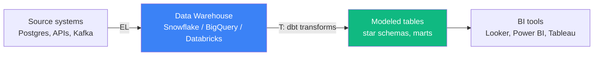
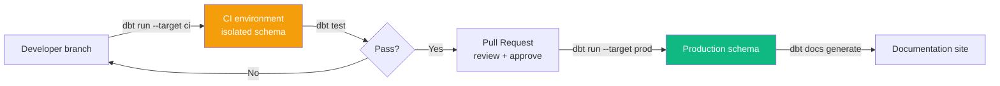

# dbt (Data Build Tool)

> Staff DE Sam explains dbt to Senior DE Alex — what it is, why it dominates the modern data stack, and how to think about it for production deployments in GCC environments.

## Contents

1. [What dbt Is and Why It Exists](#1-what-dbt-is-and-why-it-exists)
2. [Core Concepts — Models, Sources, Tests](#2-core-concepts--models-sources-tests)
3. [Materializations](#3-materializations)
4. [Jinja and Macros](#4-jinja-and-macros)
5. [Testing and Documentation](#5-testing-and-documentation)
6. [Incremental Models](#6-incremental-models)
7. [CI/CD with dbt](#7-cicd-with-dbt)
8. [dbt + Snowflake / Databricks](#8-dbt--snowflake--databricks)
9. [Interview Cheatsheet](#9-interview-cheatsheet)

---

## 1. What dbt Is and Why It Exists

**Alex:** Everyone is hiring for dbt. What does it actually do?

**Sam:** dbt is a **transformation tool** — it takes data already loaded into a warehouse and transforms it using SQL SELECT statements. It does not extract or load data. It handles the "T" in ELT.



**Sam:** Before dbt, transformations were stored procedures, Python scripts, or Airflow DAGs running SQL strings. dbt gives you **software engineering practices for SQL**:

- Version control (git)
- Code review (PRs)
- Testing (data quality tests)
- Documentation (auto-generated)
- Modularity ({{ ref('model_name') }})
- CI/CD (test before deploy)

---

## 2. Core Concepts — Models, Sources, Tests

### Project Structure

```text
my_dbt_project/
├── models/
│   ├── staging/           # Raw → typed, renamed, cast
│   │   ├── stg_orders.sql
│   │   └── stg_customers.sql
│   ├── intermediate/      # Business logic, dedup, pre-join
│   │   └── int_order_totals.sql
│   └── marts/             # Final fact + dim tables
│       ├── fct_orders.sql
│       └── dim_customer.sql
├── tests/                 # Custom singular tests
├── analyses/              # Ad-hoc queries (not materialized)
├── seeds/                 # CSV files loaded as tables
├── macros/                # Jinja reusable SQL snippets
└── dbt_project.yml        # Config
```

### Models

**Sam:** A model is a single `.sql` file that contains a `SELECT` statement. dbt wraps it in the materialization you choose:

```sql
-- models/staging/stg_orders.sql
WITH source AS (
    SELECT * FROM {{ source('ecommerce', 'orders') }}
),
renamed AS (
    SELECT
        id AS order_id,
        customer_id,
        order_date,
        status,
        amount::DECIMAL(10,2) AS amount
    FROM source
)
SELECT * FROM renamed;
```

### Sources

**Sam:** Sources define your raw input tables. dbt checks freshness automatically:

```yaml
# models/sources.yml
version: 2
sources:
  - name: ecommerce
    database: raw_db
    schema: public
    tables:
      - name: orders
        loaded_at_field: _etl_loaded_at
        freshness:
          warn_after: { count: 6, period: hour }
          error_after: { count: 24, period: hour }
      - name: customers
```

### The ref() Function

**Sam:** `{{ ref('model_name') }}` creates a dependency. dbt builds models in the correct order automatically:

```sql
-- models/marts/fct_orders.sql
SELECT
    o.order_id,
    o.customer_id,
    o.order_date,
    o.amount,
    c.first_name,
    c.last_name
FROM {{ ref('stg_orders') }} o
LEFT JOIN {{ ref('stg_customers') }} c
    ON o.customer_id = c.customer_id;
```

---

## 3. Materializations

| Type | Behavior | When to use |
| :--- | :--- | :--- |
| **table** | `CREATE TABLE AS SELECT`, rebuilt on each run | Small dimensions, reference data |
| **view** | `CREATE VIEW`, query-time | Staging models, lightweight transforms |
| **incremental** | `INSERT` / `MERGE` new rows only | Large fact tables (billions of rows) |
| **ephemeral** | Inlined as CTE into dependent models | Reusable logic that should not exist as a table |
| **materialized view** | Warehouse-native materialized view | High-cost queries that must stay fresh (advanced) |

```yaml
# dbt_project.yml — set defaults per directory
models:
  my_project:
    staging:
      +materialized: view
    marts:
      +materialized: table
    marts/finance:
      +materialized: incremental
```

---

## 4. Jinja and Macros

**Sam:** dbt uses Jinja for templating. Without it, you write repetitive SQL. With it, you write reusable logic:

```sql
-- Without Jinja: same logic repeated per partition
SELECT * FROM orders WHERE order_date = '2025-01-01';
SELECT * FROM orders WHERE order_date = '2025-01-02';

-- With Jinja: iterate

    SELECT * FROM orders WHERE order_date = '{{ day }}'
     UNION ALL 

```

### Custom Macros

```sql
-- macros/generate_schema_name.sql

    
        {{ target.schema }}
    
        {{ custom_schema_name }}
    

```

### dbt Built-in Variables

| Variable | Value |
| :--- | :--- |
| `{{ this }}` | Current model's database object name |
| `{{ ref('model') }}` | Reference to another model |
| `{{ source('src', 'table') }}` | Reference to a source table |
| `{{ target.schema }}` | Schema for the current target environment |
| `{{ invocation_id }}` | Unique ID for the current dbt run |
| `{{ run_started_at }}` | Timestamp when the run started |

---

## 5. Testing and Documentation

### Generic Tests

**Sam:** dbt ships with four built-in tests. Apply them in YAML:

```yaml
# models/schema.yml
version: 2
models:
  - name: dim_customer
    columns:
      - name: customer_sk
        tests:
          - unique
          - not_null
      - name: email
        tests:
          - unique
          - not_null
      - name: effective_date
        tests:
          - not_null
    tests:
      - dbt_utils.expression_is_true:
          expression: "end_date > effective_date"
```

| Test | What it checks |
| :--- | :--- |
| `unique` | No duplicate values |
| `not_null` | No NULL values |
| `accepted_values` | Value is in a specified list |
| `relationships` | Referential integrity (FK → PK exists) |

### Singular Tests

**Sam:** Custom SQL that returns 0 rows when passing:

```sql
-- tests/assert_positive_order_amount.sql
SELECT order_id, amount
FROM {{ ref('fct_orders') }}
WHERE amount < 0;
```

### Documentation

```yaml
# models/schema.yml
version: 2
models:
  - name: fct_orders
    description: "Core order fact table, one row per line item"
    columns:
      - name: total_amount
        description: "Line item total after discount"
        tests:
          - not_null
```

Run `dbt docs generate` → `dbt docs serve` to browse auto-generated docs.

---

## 6. Incremental Models

**Sam:** This is the most practically important concept. Full refreshes of billion-row fact tables are too slow. Incremental models only process new/changed data.

```sql
{{ config(
    materialized='incremental',
    unique_key='order_id',
    incremental_strategy='merge'
) }}

SELECT
    order_id,
    customer_id,
    order_date,
    amount
FROM {{ source('ecommerce', 'orders') }}


    WHERE order_date >= (SELECT MAX(order_date) FROM {{ this }})

```

| Strategy | Behavior | Supported by |
| :--- | :--- | :--- |
| `append` | Insert new rows, no dedup | All |
| `merge` | Update + insert by unique_key | Snowflake, BigQuery, Databricks, Postgres |
| `delete+insert` | Delete matching rows, then insert | Snowflake, BigQuery |
| `insert_overwrite` | Replace entire partition | BigQuery (partitioned tables) |

> [!WARNING]
> Always handle late-arriving data in incremental models. If an order from yesterday arrives today, `order_date >= MAX(order_date)` misses it. Solution: use a lookback window — `WHERE order_date >= DATEADD(day, -3, CURRENT_DATE)`.

---

## 7. CI/CD with dbt

**Sam:** The standard workflow in GCC environments:



```bash
# CI commands
dbt deps                  # Install packages
dbt seed --target ci      # Load seed data
dbt run --target ci       # Build models in CI schema
dbt test --target ci      # Run tests
dbt docs generate         # Generate docs
```

**Alex:** How do you handle schema isolation in CI?

**Sam:** Each PR builds into its own schema (e.g., `dbt_ci_pr_42`). Use `generate_schema_name` macro to namespace:

```yaml
# profiles.yml — Snowflake target
ci:
  target: pr_42
  outputs:
    pr_42:
      type: snowflake
      schema: dbt_ci_pr_42
      ...
```

---

## 8. dbt + Snowflake / Databricks

### Snowflake-Specific Patterns

```sql
{{ config(
    materialized='incremental',
    unique_key='order_id',
    incremental_strategy='merge',
    merge_update_columns=['status', 'amount'],
    cluster_by=['order_date']
) }}
```

- Use `cluster_by` for large tables (equivalent to clustering keys)
- Use `transient` flag for non-essential tables to save time travel costs
- `COPY_GRANTS` to preserve permissions across rebuilds

### Databricks-Specific Patterns

```sql
{{ config(
    materialized='incremental',
    unique_key='order_id',
    file_format='delta',
    incremental_strategy='merge'
) }}
```

- Use `file_format='delta'` for Delta Lake tables
- `liquid_clustered_by` for liquid clustering (Databricks 13.3+)
- `zorder` for legacy Databricks optimization

---

## 9. Interview Cheatsheet

### Key Commands

| Command | What it does |
| :--- | :--- |
| `dbt init` | Create new project |
| `dbt run` | Build all models (or `--select model_name`) |
| `dbt test` | Run data quality tests |
| `dbt build` | `dbt run` + `dbt test` combined |
| `dbt docs generate` | Generate documentation site |
| `dbt docs serve` | Serve docs locally |
| `dbt debug` | Test connection |
| `dbt deps` | Install packages from `packages.yml` |
| `dbt seed` | Load CSV seed files |

### dbt Packages (Extendability)

| Package | Purpose |
| :--- | :--- |
| `dbt_utils` | Date spine, surrogate keys, pivot, union |
| `dbt_expectations` | Advanced data quality tests |
| `dbt_profiler` | Profile column statistics |
| `dbt_artifacts` | Upload run artifacts for observability |
| `dbt_meta_testing` | Test that tests exist for every column |

### Selection Syntax

```bash
dbt run --select stg_orders                   # Single model
dbt run --select stg_orders+                  # Model + downstream
dbt run --select +fct_orders                  # Model + upstream
dbt run --select 3+stg_orders                 # 3 upstream ancestors
dbt run --select tag:finance                  # Models tagged 'finance'
dbt run --select source:ecommerce+            # Models based on ecommerce sources
```

### Key Interview Answer

> dbt is the transformation layer in the modern data stack — it converts raw warehouse data into analytics-ready models using SQL. Key concepts: ref() for dependency resolution, materializations (table/view/incremental) for performance, Jinja macros for DRY SQL, and dbt test for data quality. In production, I use incremental models with merge strategy for large fact tables, CI/CD with isolated schemas per PR, and dbt docs for self-documenting pipelines. dbt does not replace Spark for heavy transformation; it replaces stored procedures and Python-based SQL execution for warehouse-native ELT.

---

### Resources

- [dbt Documentation](https://docs.getdbt.com/) — Official docs, tutorials, and reference
- [dbt Learn](https://learn.getdbt.com/) — Free courses (dbt Fundamentals, advanced)
- [dbt Packages Hub](https://hub.getdbt.com/) — Community packages
- [dbt Best Practices Guide](https://docs.getdbt.com/guides/best-practices) — dbt's official style guide
- [dbt Developer Blog](https://docs.getdbt.com/blog) — Real-world dbt patterns and case studies
