# dbt (Data Build Tool) — Interview Deep Dive

The dbt question comes in every modern data stack interview at some angle: incremental models, DAG resolution, testing strategy, CI/CD. This file covers the internals **through the lens of real interview questions** with diagrams, worked examples, and decision frameworks.

---

## 0. The Opening Question

**Question:** *"Your dbt pipeline runs every night at 2 AM. This morning the CEO's dashboard shows `Total Revenue` off by 12% vs the raw source system. The incremental model for `fct_orders` ran successfully — no failures. What do you check first?"*

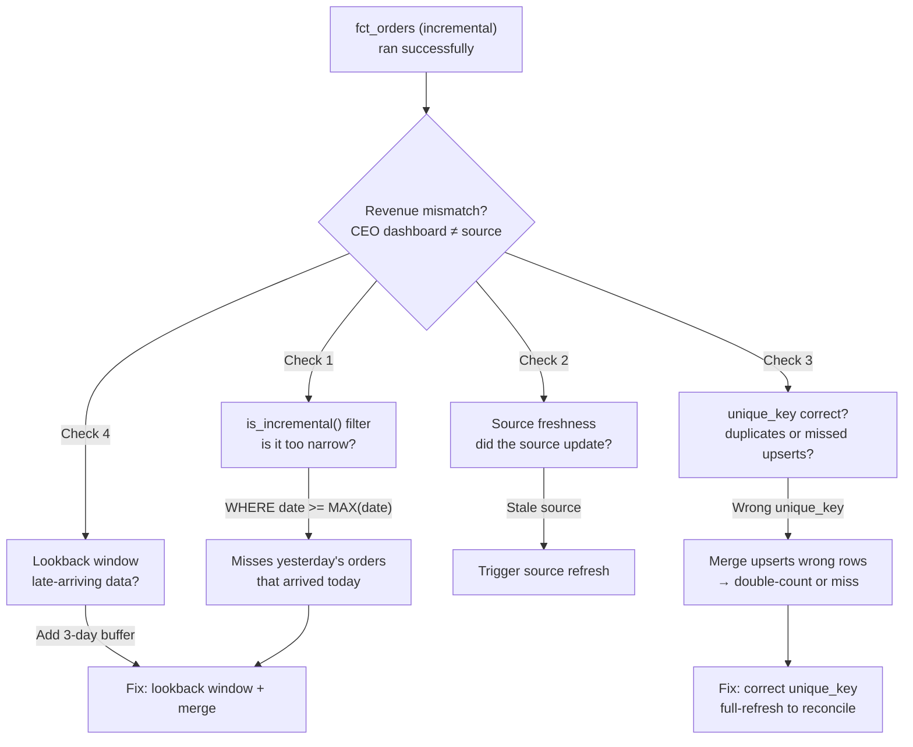

> [!NOTE]
> What the interviewer is testing: understanding of incremental model mechanics, late-arriving data patterns, source freshness monitoring, and systematic debugging — not guessing.

---

## 1. What dbt Is and Why It Exists

dbt is a **transformation tool** — it takes data already loaded into a warehouse and transforms it using SQL `SELECT` statements. It does not extract or load data. It handles the "T" in ELT.

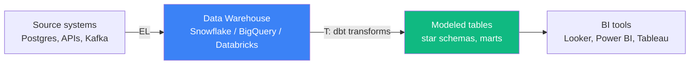

Before dbt, transformations were stored procedures, Python scripts, or Airflow DAGs running SQL strings wrapped in `execute()` calls. dbt gives you **software engineering practices for SQL**:

- Version control (git) and code review (PRs)
- Testing (data quality tests — generic + singular)
- Documentation (auto-generated from YAML descriptions)
- Modularity (`{{ ref('model_name') }}` for dependency resolution)
- CI/CD (test before deploy with schema isolation)

---

## 2. Core Internals — How dbt Actually Works

### 2.1 The Compilation Pipeline

Every `dbt run` goes through these phases:

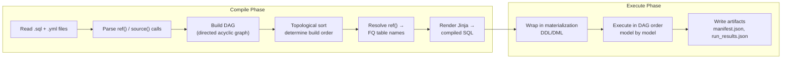

### 2.2 How `ref()` Resolution Works

When dbt parses `{{ ref('stg_orders') }}`:

1. **Parse time:** dbt scans all `.sql` files for `ref()` calls. It does NOT execute Jinja — it uses a regex-based parser to extract dependency edges.
2. **Graph construction:** Each model becomes a node. `ref()` calls become directed edges. dbt validates there are no cycles.
3. **Resolution:** At compile time, `{{ ref('stg_orders') }}` becomes the full object name based on the model's configured database, schema, and alias. For example:

```
{{ ref('stg_orders') }} → "analytics_prod"."dbt_public"."stg_orders"
```

The resolution depends on `generate_schema_name` and `generate_alias_name` macros. Default behavior uses the model filename as alias and the schema from `dbt_project.yml` or target config.

### 2.3 The Manifest.json

After every run, dbt writes `target/manifest.json`. Interviewers ask about this:

```json
{
  "metadata": {
    "dbt_version": "1.8.0",
    "invocation_id": "abc-123-def",
    "project_name": "analytics"
  },
  "nodes": {
    "model.my_project.stg_orders": {
      "database": "analytics_prod",
      "schema": "dbt_public",
      "name": "stg_orders",
      "depends_on": {
        "nodes": ["source.my_project.ecommerce.orders"]
      },
      "refs": [{"name": "stg_orders", "package": null}],
      "config": {"materialized": "view"}
    },
    "model.my_project.fct_orders": {
      "database": "analytics_prod",
      "schema": "dbt_marts",
      "name": "fct_orders",
      "depends_on": {
        "nodes": ["model.my_project.stg_orders", "model.my_project.stg_customers"]
      },
      "config": {"materialized": "incremental", "unique_key": "order_id"}
    }
  },
  "sources": {
    "source.my_project.ecommerce.orders": {
      "name": "orders",
      "source_name": "ecommerce",
      "database": "raw_db",
      "schema": "public"
    }
  },
  "child_map": {
    "model.my_project.stg_orders": ["model.my_project.fct_orders"],
    "source.my_project.ecommerce.orders": ["model.my_project.stg_orders"]
  },
  "parent_map": {
    "model.my_project.fct_orders": ["model.my_project.stg_orders", "model.my_project.stg_customers"]
  }
}
```

**Key fields interviewers ask about:**
- `child_map` / `parent_map` — used for `--select` and `+` syntax traversal
- `depends_on.nodes` — determines topological sort order
- `config` — effective config after all YAML + Jinja inheritance
- `invocation_id` — unique per run, useful for observability

### 2.4 What SQL Does dbt Actually Generate?

For a **view** materialization, dbt wraps the model's `SELECT`:

```sql
CREATE OR REPLACE VIEW analytics_prod.dbt_marts.fct_orders AS (
    SELECT ... FROM analytics_prod.dbt_public.stg_orders o
    LEFT JOIN analytics_prod.dbt_public.stg_customers c ...
);
```

For a **table** materialization:

```sql
CREATE TABLE analytics_prod.dbt_marts.fct_orders__dbt_tmp AS (
    SELECT ... FROM ...
);

ALTER TABLE analytics_prod.dbt_marts.fct_orders RENAME TO fct_orders__dbt_backup;
ALTER TABLE analytics_prod.dbt_marts.fct_orders__dbt_tmp RENAME TO fct_orders;
DROP TABLE IF EXISTS analytics_prod.dbt_marts.fct_orders__dbt_backup;
```

For an **incremental merge** on Snowflake:

```sql
MERGE INTO analytics_prod.dbt_marts.fct_orders AS DBT_INTERNAL_DEST
USING (
    SELECT ... FROM raw_db.public.orders
    WHERE order_date >= (SELECT MAX(order_date) FROM analytics_prod.dbt_marts.fct_orders)
) AS DBT_INTERNAL_SOURCE
ON DBT_INTERNAL_DEST.order_id = DBT_INTERNAL_SOURCE.order_id
WHEN MATCHED THEN UPDATE SET ...
WHEN NOT MATCHED THEN INSERT (...);
```

### 2.5 Selection Syntax — How the DAG Traversal Works

```bash
dbt run --select stg_orders                   # Single model (exact match)
dbt run --select stg_orders+                  # Model + all downstream
dbt run --select +fct_orders                  # Model + all upstream
dbt run --select 3+stg_orders                 # 3 ancestors upstream
dbt run --select stg_orders+1                 # 1 level downstream
dbt run --select tag:finance                  # All models tagged 'finance'
dbt run --select source:ecommerce+            # All models based on ecommerce sources
dbt run --select config.materialized:incremental  # All incremental models
dbt run --select model_name intersection:tag:daily # Set intersection
```

The `+` operator walks the `child_map` (downstream) or `parent_map` (upstream) in `manifest.json`. The number prefix (e.g., `3+`) limits traversal depth.

---

## 3. Materializations — Deep Dive with Worked Examples

### 3.1 Materialization Comparison

| Type | Generated SQL | Freshness | When to use |
| :--- | :--- | :--- | :--- |
| **view** | `CREATE OR REPLACE VIEW ... AS (SELECT ...)` | Real-time | Staging, lightweight transforms |
| **table** | `CREATE TABLE ... AS SELECT; DROP old; RENAME tmp` | Per run | Small dims, reference data, < 10M rows |
| **incremental** | `MERGE` / `INSERT` / `DELETE+INSERT` | Per run | Large fact tables, > 100M rows |
| **ephemeral** | Inlined as CTE into dependent models | N/A (not materialized) | Reusable SQL that should not persist |
| **materialized view** | Warehouse-native `CREATE MATERIALIZED VIEW` | Auto-refresh | Real-time aggregates (warehouse-specific) |

### 3.2 Incremental Strategy Worked Example

**Scenario:** `fct_orders` table with 500M rows. Daily increment of ~500K rows. Strategy: `merge`.

```sql
{{ config(
    materialized='incremental',
    unique_key='order_id',
    incremental_strategy='merge',
    merge_update_columns=['status', 'amount', 'updated_at']
) }}

SELECT
    order_id,
    customer_id,
    order_date,
    amount,
    status,
    updated_at
FROM {{ source('ecommerce', 'orders') }}


    WHERE updated_at >= (SELECT MAX(updated_at) FROM {{ this }}) - INTERVAL '3 days'

```

**What happens on each run:**

```
Day 1 (first run):
  → No existing table → CREATE TABLE fct_orders AS (SELECT * FROM source)
  → 500M rows, ~45 minutes

Day 2 (incremental):
  → MERGE INTO fct_orders USING (SELECT * FROM source WHERE updated_at >= '2025-01-01')
  → 500K new + 50K updated, ~3 minutes

Day 30:
  → 515M rows in table
  → Each merge scans ~500K-1M rows from source
  → Merge operation scans target on unique_key (order_id) → needs cluster/index
```

**Cost of no clustering on Snowflake:**
- Merge without cluster_by on `order_id` → full table scan of 515M rows to find matches
- With `cluster_by = ['order_id']` → micropartition pruning → scans only affected partitions
- Difference: ~45 min vs ~3 min for the merge operation

### 3.3 Late-Arriving Data — The Lookback Pattern

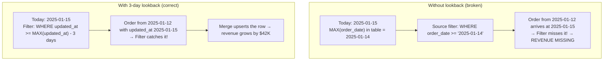

> [!WARNING]
> The common mistake: filtering on `order_date >= MAX(order_date)`. This misses late-arriving records for previous dates. Filter on a **last_updated timestamp** and use a lookback window proportional to your SLA for late data (3–7 days is typical).

### 3.4 Full Refresh Cost

```sql
-- Force full refresh when schema changes
dbt run --full-refresh --select fct_orders
```

What this does:
- Drops the existing table
- Re-runs the model's SELECT with NO `is_incremental()` filter
- For a 500M row table with 50 columns on Snowflake: ~45 minutes, ~$50 compute cost
- Queries against the table are blocked during the swap (atomic rename at the end)

---

## 4. Jinja and Macros

dbt uses Jinja for templating. Without it, you write repetitive SQL. With it, you write reusable logic:

```sql
-- Without Jinja: same logic repeated
SELECT * FROM orders WHERE order_date = '2025-01-01';
SELECT * FROM orders WHERE order_date = '2025-01-02';

-- With Jinja: iterate

    SELECT * FROM orders WHERE order_date = '{{ day }}'
     UNION ALL 

```

### Custom Macros — Schema Name Customization

```sql
-- macros/generate_schema_name.sql

    
        {{ target.schema }}
    
        {{ custom_schema_name }}
    

```

### dbt Built-in Variables

| Variable | Value |
| :--- | :--- |
| `{{ this }}` | Current model's fully qualified name in the database |
| `{{ ref('model') }}` | Resolved to FQN of another model |
| `{{ source('src', 'table') }}` | Resolved to FQN of source table |
| `{{ target.schema }}` | Schema for the current target environment |
| `{{ target.name }}` | Name of the current target (e.g., `prod`, `ci`) |
| `{{ invocation_id }}` | UUID for the current `dbt` run |
| `{{ run_started_at }}` | Timestamp when the run started |

### dbt_utils Macro Examples

```sql
-- Generate a surrogate key from multiple columns
{{ dbt_utils.generate_surrogate_key(['customer_id', 'order_date']) }}

-- Create a date spine for missing date filling
{{ dbt_utils.date_spine(
    datepart="day",
    start_date="cast('2025-01-01' as date)",
    end_date="cast('2025-12-31' as date)"
) }}

-- Pivot a column (e.g., status values into columns)
{{ dbt_utils.pivot('status', dbt_utils.get_column_values(ref('stg_orders'), 'status')) }}
```

---

## 5. Testing and Documentation

### 5.1 Generic Tests (Built-in)

Apply tests in YAML — dbt generates SQL for each:

```yaml
# models/schema.yml
version: 2
models:
  - name: dim_customer
    columns:
      - name: customer_sk
        tests:
          - unique
          - not_null
      - name: email
        tests:
          - unique
          - not_null
      - name: status
        tests:
          - accepted_values:
              values: ['ACTIVE', 'INACTIVE', 'CHURNED']
      - name: customer_id
        tests:
          - relationships:
              to: ref('stg_customers')
              field: customer_id
    tests:
      - dbt_utils.expression_is_true:
          expression: "end_date > effective_date"
```

| Test | SQL Generated | What it checks |
| :--- | :--- | :--- |
| `unique` | `SELECT customer_sk FROM dim_customer GROUP BY customer_sk HAVING COUNT(*) > 1` | No duplicate values |
| `not_null` | `SELECT customer_sk FROM dim_customer WHERE customer_sk IS NULL` | No NULL values |
| `accepted_values` | `SELECT DISTINCT status FROM dim_customer WHERE status NOT IN ('ACTIVE','INACTIVE','CHURNED')` | Value is in list |
| `relationships` | `SELECT customer_id FROM dim_customer WHERE customer_id NOT IN (SELECT customer_id FROM stg_customers)` | FK → PK match |

### 5.2 Singular Tests — Custom SQL

```sql
-- tests/assert_positive_order_amount.sql
-- Fails if any row is returned
SELECT order_id, amount
FROM {{ ref('fct_orders') }}
WHERE amount < 0;
```

### 5.3 Test Failure Impact

When a test fails:
- `dbt test`: Fails the test command. Other tests continue.
- `dbt build`: Model SQL failure skips downstream models. Test failures are recorded but do NOT block downstream models (the table exists; tests validate quality).
- `dbt test --store_failures`: Persists failing records to a `dbt_test__audit` schema for debugging.

### 5.4 Documentation

```yaml
# models/schema.yml
version: 2
models:
  - name: fct_orders
    description: "Core order fact table, one row per line item"
    columns:
      - name: total_amount
        description: "Line item total after discount"
        tests:
          - not_null
```

Run `dbt docs generate` → `dbt docs serve` to browse auto-generated docs with lineage graph.

---

## 6. CI/CD with dbt

### 6.1 Standard Workflow

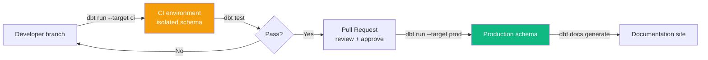

**Key CI patterns:**

```bash
# CI commands
dbt deps                  # Install packages
dbt seed --target ci      # Load seed data
dbt run --target ci       # Build models in CI schema
dbt test --target ci      # Run all tests
dbt run --target ci --select source:ecommerce+  # Build only models affected by source change
```

### 6.2 Schema Isolation in CI

Each PR builds into its own schema (e.g., `dbt_ci_pr_42`). Custom `generate_schema_name` macro:

```sql

    
        {{ custom_schema_name | default(target.schema) }}
    
        {{ target.schema }}_{{ custom_schema_name | default('public') }}
    

```

### 6.3 Slim CI — Only Build Changed Models

```bash
# Determine changed models vs main branch
CHANGED=$(git diff --name-only main...HEAD -- 'models/' | xargs -I {} basename {} .sql)
dbt run --select $CHANGED+  # Build changed + their downstream
dbt test --select $CHANGED+ # Test changed + downstream
```

This reduces CI time from 45 min to 3 min on large projects.

---

## 7. dbt + Snowflake / Databricks

### Snowflake-Specific Patterns

```sql
{{ config(
    materialized='incremental',
    unique_key='order_id',
    incremental_strategy='merge',
    merge_update_columns=['status', 'amount'],
    cluster_by=['order_date'],
    transient=true,
    snowflake_warehouse='transform_wh_large'
) }}
```

- `cluster_by`: Micropartition pruning — essential for merge performance on large tables
- `transient`: No time travel for non-critical tables (saves storage cost)
- `COPY_GRANTS`: Preserve permissions across table rebuilds
- `snowflake_warehouse`: Override warehouse per model for large transforms

### Databricks-Specific Patterns

```sql
{{ config(
    materialized='incremental',
    unique_key='order_id',
    file_format='delta',
    incremental_strategy='merge'
) }}
```

- `file_format='delta'`: Required for ACID, time travel, and merge on Databricks
- `liquid_clustered_by`: Liquid clustering (Databricks 13.3+) — replaces Z-order
- `zorder`: Legacy optimization, replaced by liquid clustering

---

## 8. Real Interview Questions

### Q1: "Our dbt incremental model for a 2B-row fact table is running for 6 hours. It used to take 30 minutes. What do you check?"

**The trap:** Saying "add more warehouse size" without diagnosing. Bigger warehouse doesn't fix a full table scan on the merge target.

**Diagnosis:**

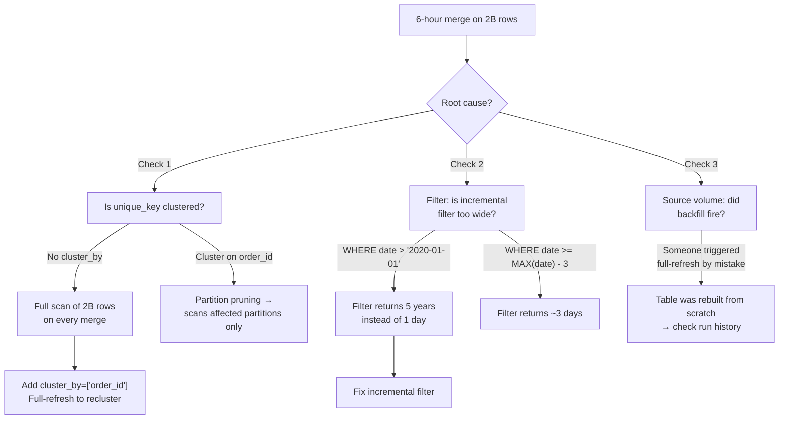

**Interviewer follow-up:** "We add `cluster_by` but the merge still takes 2 hours. Now what?"
**Answer:** Check if the merge is performing a full scan because `unique_key` isn't the cluster key. On Snowflake, merge join performs best when the join key aligns with the clustering key. If order_id is UUID (random), clustering on it won't help much — consider clustering on `order_date` instead and ensuring your incremental filter returns a narrow date range.

### Q2: "How does dbt resolve `{{ ref('model_name') }}` at compile time vs at runtime?"

**The trap:** Candidates say "it's a macro that runs at query time." Wrong — it's resolved at **compile time**.

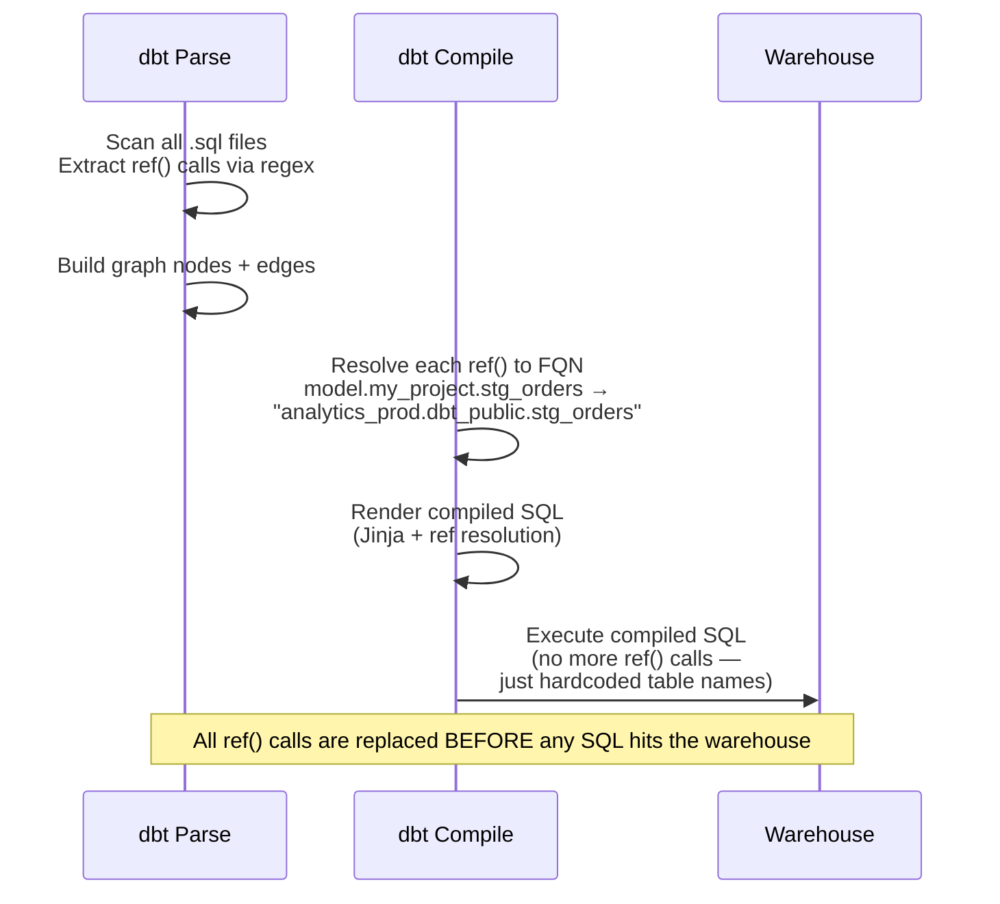

**Answer:** At compile time, dbt replaces `{{ ref('model_name') }}` with the fully qualified database object name (`database.schema.table_alias`). The compiled SQL contains no Jinja or ref calls — it's pure SQL with hardcoded table names. At runtime, the warehouse sees only the resolved names.

**Interviewer follow-up:** "What happens if the referenced model doesn't exist in the database yet?"
**Answer:** dbt uses the DAG to guarantee build order — upstream models are built first. If the table doesn't exist yet when dbt compiles, it doesn't matter because resolution produces only the table name string. The table must exist by the time that SQL executes, which it will because dbt runs models in topological order.

### Q3: "Design a data quality framework for a new dbt project. What tests at each layer?"

**The trap:** Listing the four built-in tests and stopping there. The interviewer wants **layered defense**.

**Answer:**

```
Staging layer:
  - PK: not_null + unique on every source surrogate key
  - Enums: accepted_values for status, type columns
  - Freshness: source freshness warnings per table

Intermediate layer:
  - relationships: FK → PK between joined models
  - expression_is_true: business logic invariants
    (e.g., "delivery_date >= order_date")
  - dbt_utils.cardinality_equality: ensure no fanout

Marts layer:
  - not_null + unique on dimension keys
  - relationships: fact FK → dimension PK
  - Custom singular tests:
    - assert_total_revenue_positive
    - assert_no_duplicate_orders
    - daily row count comparison vs 7-day moving average

Cross-layer:
  - dbt_expectations.expect_table_row_count_to_be_between
  - dbt_expectations.expect_column_values_to_not_be_null_and_unique
  - dbt_utils.recency: "has data loaded in the last 24 hours?"
  - dbt_meta_testing: "does every column have at least one test?"
```

**Interviewer follow-up:** "One of your tests fails at midnight. Who gets paged?"
**Answer:** We use dbt's `--store-failures` flag and route alerts through the CI/CD pipeline. A test failure in staging skips downstream models. A test failure in marts sends a notification to the owning team via webhook. We set `severity: warn` for informational tests and `severity: error` for blocking tests.

### Q4: "Your source table schema changed — `cust_id` was renamed to `customer_id`. The model still compiles. Why did the pipeline break at runtime?"

**The trap:** "dbt should catch this at compile time." It doesn't — dbt validates SQL syntax, not source schema.

**Answer:**

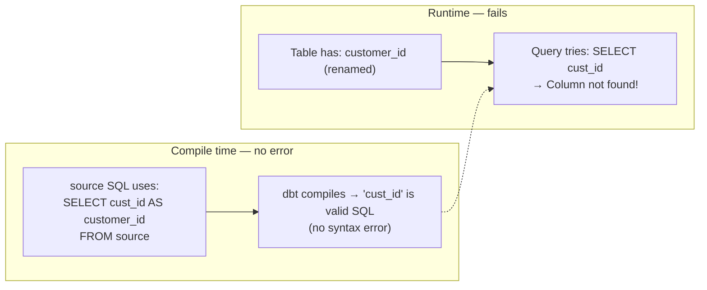

**Why it compiles:** dbt's compilation checks Jinja syntax and parses `ref()`/`source()` calls. It does **not** validate column names against the source table schema. The SQL `SELECT cust_id` is syntactically valid — it fails only when executed against the warehouse.

**Prevention:**

```yaml
# 1. Source freshness monitoring
sources:
  - name: ecommerce
    freshness:
      warn_after: { count: 6, period: hour }
    tables:
      - name: orders
```

```sql
-- 2. Explicit column lists (avoid SELECT *)
-- stg_orders.sql
SELECT
    id AS order_id,
    customer_id,  -- catches rename at runtime, not compile
    ...

-- 3. Use dbt source freshness in CI to detect stale or altered schemas
-- 4. Adapter-level: some warehouses support schema change detection
```

**Interviewer follow-up:** "What about `SELECT *` in staging?"
**Answer:** `SELECT *` is fragile — renamed columns pass through as the new name, causing downstream models that reference `cust_id` to fail. Best practice: always explicitly list and rename columns in staging models. Use `SELECT *` only for very wide sources where you load everything into a raw vault.

### Q5: "You have 200 models. `dbt run` takes 4 hours. The business needs data by 6 AM. How do you fix it?"

**The trap:** "Use a bigger warehouse." That's part of it — but the real answer is DAG optimization.

**Answer:**

```
1. Identify bottlenecks:
   dbt run --select model_name --profile slow_wh
   # Time each model individually

2. Check parallelism:
   # dbt_project.yml
   +threads: 8  # Default is 4. Increase to 8-16 for Snowflake

3. Convert table models to incremental:
   - Large fact tables: incremental + merge
   - Small dims (< 10M rows): keep as table (full refresh is fast)

4. Slim CI — partial runs:
   - Full run only for models that changed
   - Use dbt's state: comparison with last run manifest
   dbt run --select result:error+ state:modified+
   dbt run --select state:modified+  # dbt 1.6+ state-based selection

5. Model-level warehouse override:
   {{ config(snowflake_warehouse='transform_wh_xlarge') }}

6. DAG restructuring:
   - Merge serial chains into parallel branches
   - Identify bottleneck models (e.g., one model all others depend on)
```

**Expected time reduction:** From 4 hours to ~45 minutes:
- Parallelism (8 threads): 4h → 2.5h
- Incremental for top 3 largest tables: 2.5h → 1h
- DAG restructuring + warehouse sizing: 1h → 45min

**Interviewer follow-up:** "One model takes 2.5 hours alone. It's an incremental merge on 5B rows. What do you do?"
**Answer:** Check if the merge strategy is optimal. On Snowflake, `delete+insert` can be faster than `merge` when most changes are inserts. Consider partitioning the table (if BigQuery, use `insert_overwrite` on partitions). Verify the `cluster_by` key matches the join key. If the source is append-only, use `incremental_strategy='append'` (no merge overhead).

### Q6: "What happens when you run `dbt build` vs `dbt run` vs `dbt test`? When would you choose each?"

**The trap:** Not knowing the order of operations in `dbt build`.

**Answer:**

| Command | What it does | Use case |
| :--- | :--- | :--- |
| `dbt run` | Builds models only (no tests) | Morning run with separate test step |
| `dbt test` | Tests already-built models | After `dbt run` in prod |
| `dbt build` | Per model: build → test → next model | CI/CD — fail fast |

**How `dbt build` works internally:**

```
For each model in topological order:
  1. Run model (CREATE TABLE / MERGE / etc.)
  2. If model SQL FAILS → mark as error → SKIP downstream
  3. If model succeeds → run ALL tests (generic + singular)
  4. Test failures are recorded but do NOT block downstream
  5. Continue to next model in parallel (up to thread limit)
```

**Why this matters:** Model SQL failure (e.g., a `MERGE` on a missing column) blocks downstream because the table doesn't exist. Test failures (e.g., `not_null` violation) record quality issues but don't block — the table exists and downstream can build. With `dbt run` + `dbt test`, models all build regardless of upstream test failures. `dbt build` gives you faster feedback: models that reference a broken model are skipped automatically.

### Q7: "Your Snowflake warehouse costs exploded after deploying dbt. What do you check?"

**The trap:** Blaming dbt itself. The tool generates SQL — you control the cost.

**Answer:**

```
Check these in order:

1. Full refreshes:
   - Did someone run dbt run --full-refresh on a 2B-row table?
   - Check dbt run_results.json for last full_refresh timestamp

2. Unoptimized incremental models:
   - Merge without cluster_by → full table scan
   - No incremental filter → reprocessing entire source table
   - Fix: Add incremental where clause + cluster_by

3. Warehouse auto-suspend:
   - Are warehouses suspending between runs?
   - Snowflake: SET warehouse TRANSFORM_WH AUTO_SUSPEND = 300 (5 min)

4. Warehouse size:
   - Did someone set default warehouse to xlarge?
   - Use model-level warehouse override:
     {{ config(snowflake_warehouse='transform_wh_small') }}

5. Test queries:
   - dbt test --store-failures generates SELECT queries
   - On Snowflake, these consume credits
   - Set AUTO_SUSPEND to minimize idle time

6. Source freshness queries:
   - dbt source freshness queries all source tables
   - If you have 200 sources, each query costs ~1 second
   - Schedule separately, not during prod run
```

### Q8: "Explain the difference between `{{ source() }}` and `{{ ref() }}`. When do you use each?"

| Aspect | `source('src', 'table')` | `ref('model')` |
| :--- | :--- | :--- |
| What it references | Raw database tables (defined in YAML) | Other dbt models |
| DAG node | Yes — appears in lineage | Yes — appears in lineage |
| Freshness checks | Yes — configurable per source | No |
| Schema evolution | No compile-time validation | Depends on upstream model |
| Override | Via `dbt_project.yml` source overrides | Via environment target |
| Typical use | Staging models reading raw data | Any model referencing another model |

**The key insight:** `source()` creates a contract — you define the table name, database, schema, and freshness expectations in one place. If the source table moves (e.g., database rename), you update one YAML file instead of every model. `ref()` creates the dependency graph that enables dbt to build models in the correct order.

```sql
-- Always put source() in staging, never in marts
-- Good:
SELECT ... FROM {{ source('ecommerce', 'orders') }}
-- Bad:
SELECT ... FROM raw_db.public.orders
```

**Interviewer follow-up:** "Can I use `ref()` to reference a model in another dbt project?"
**Answer:** Yes, via **cross-project ref** (dbt 1.6+). You define the dependency in `dependencies.yml` and reference it as `{{ ref('model_name', 'project_name') }}`. The upstream project must publish its manifest as an artifact.

### Q9: "Your colleague says 'dbt is just a SQL templating engine.' How do you respond?"

**The trap:** Getting defensive. The colleague isn't entirely wrong — but dbt is more than that.

**Answer structure:**

```
What dbt IS: A SQL templating engine + more.
                       ↓                        ↓
              Jinja rendering                DAG orchestration
              ref() → FQN resolution          Topological execution
              Macro system                    State-based selection
              YAML config inheritance         Parallel model execution
                                             Artifact generation
                                             Testing framework
                                             Documentation generation
                                             Source freshness monitoring

Analogy: "dbt is to SQL what React is to JavaScript."
  - React is 'just a JS library' but it brings component architecture
  - dbt is 'just SQL templates' but it brings modular data transformation

The difference with a generic templating engine:
  1. DAG awareness — knows build order, does NOT execute out of order
  2. Materialization abstraction — same SELECT, different DDL/DML
  3. Testing integrated with the DAG — tests run when models complete
  4. State comparison — knows what changed since last run
  5. Lineage — auto-generated documentation with column-level lineage
```

### Q10: "You need to migrate 500 stored procedures to dbt. What's your strategy?"

**The trap:** Trying to rewrite everything at once. Most migrations fail doing this.

**Answer:**

```mermaid
flowchart LR
    subgraph PHASE1["Week 1-2: Audit"]
        A1["1. Map stored proc → output table"]
        A2["2. Identify dependencies<br/>(proc A calls proc B)"]
        A3["3. Classify: business logic vs<br/>utility vs legacy"]
    end

    subgraph PHASE2["Week 3-6: Core migration"]
        B1["4. Extract SELECT from each proc"]
        B2["5. Write as dbt model (same SELECT)"]
        B3["6. Define YAML sources for raw tables"]
        B4["7. Add ref() calls for dependencies"]
    end

    subgraph PHASE3["Week 7-8: Parallel run"]
        C1["8. Run stored proc AND dbt"]
        C2["9. Compare outputs row-by-row"]
        C3["10. Diff found? Fix, re-run, verify"]
    end

    subgraph PHASE4["Week 9: Cutover"]
        D1["11. Drop stored proc"]
        D2["12. Add tests + docs"]
        D3["13. Set up CI/CD"]
    end

    PHASE1 --> PHASE2 --> PHASE3 --> PHASE4
```

**Key tactics:**
- Keep naming convention: `sp__customer_summary.sql` → `stg__customer_summary.sql`
- Keep same SELECT logic initially — optimize AFTER migration
- Materialize as `view` initially (same behavior), convert to `table`/`incremental` later
- Use `dbt_utils.union_relations` if the proc used dynamic SQL

**Interviewer follow-up:** "The stored proc uses dynamic SQL with a cursor. How do you handle it?"
**Answer:** Most cursor-based stored procedures can be replaced with set-based SQL in dbt. If truly not possible (e.g., row-by-row complex calculation), extract that logic into a Python model using dbt's Python model support (`materialized='table'` with `language='python'`).

---

## 9. Decision Trees — Whiteboard for Interview

### 9.1 Materialization Selection Flow

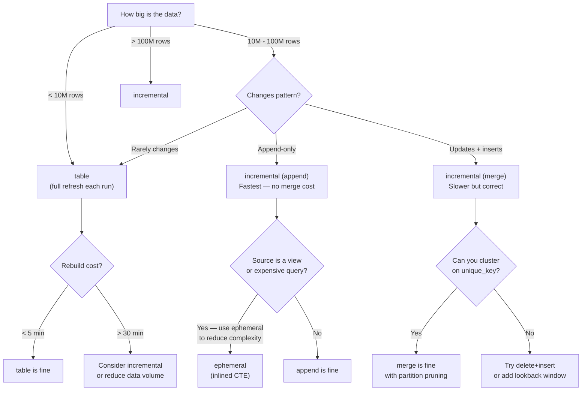

### 9.2 Incremental Strategy Selection Flow

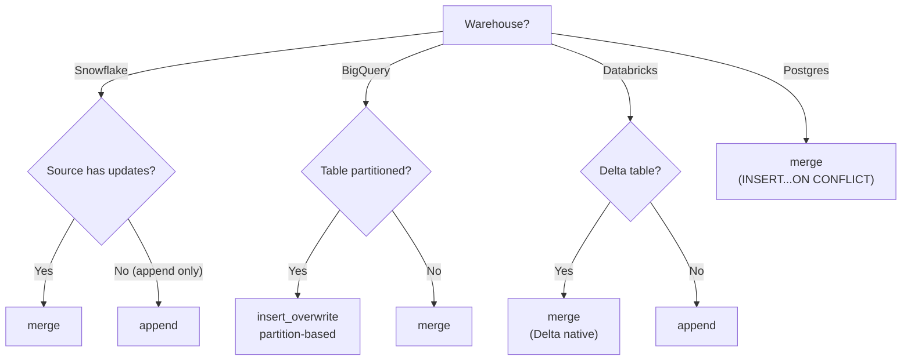

### 9.3 Debugging "dbt Is Slow" Flow

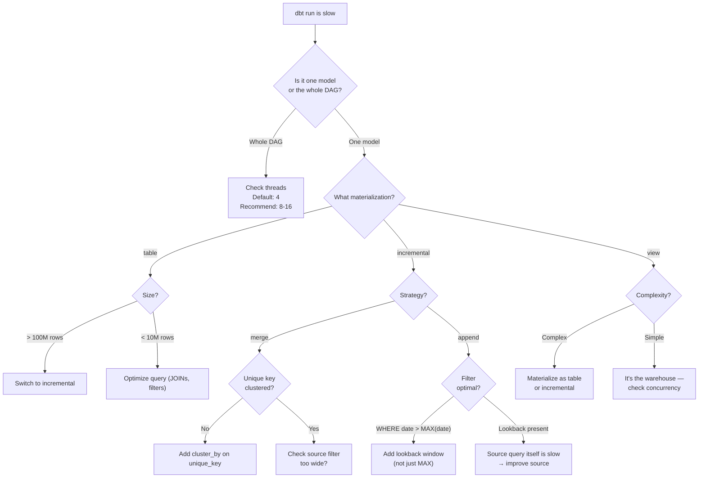

---

## 10. Quick Reference — Interview Edition

| Question | Short Answer |
|---|---|
| **What is dbt?** | Transformation layer in modern ELT — converts raw warehouse data into analytics-ready models using SQL |
| **dbt vs stored procedures?** | dbt: version-controlled, tested, modular, documented. SPs: hidden in the warehouse, no lineage, hard to test |
| **Incremental for what size?** | > 10M rows or rebuild takes > 15 min |
| **Merge vs append?** | Merge: upserts (updates + inserts). Append: inserts only (faster, no dedup) |
| **Late-arriving data fix?** | Lookback window on `updated_at`, not `order_date` |
| **How does ref() work?** | Resolved at compile time to fully qualified table name |
| **dbt build vs run vs test?** | `build` = run + test per model then skip downstream on failure; `run` = models only; `test` = tests on already-built models |
| **How to speed up slow dbt?** | Incremental for large models, cluster_by on merge keys, increase threads, slim CI with state selection |
| **Source freshness?** | YAML-based: `freshness.warn_after` / `error_after` per table; run via `dbt source freshness` |
| **Schema change handling?** | dbt 1.8+: `schema_change: fail` in source config. Otherwise, caught at runtime (column not found) |
| **dbt + Airflow?** | dbt handles T in ELT. Airflow orchestrates when dbt runs, not how. Common: `BashOperator` calling `dbt run` |
| **Cross-project ref?** | dbt 1.6+: `{{ ref('model', 'project') }}` with dependency in `dependencies.yml` |
| **Can dbt extract data?** | No — dbt is transformation-only. Use Fivetran, Airbyte, or custom loaders for E/EL |
| **dbt vs dbt Cloud vs dbt Core?** | Core = CLI, free, open-source. Cloud = managed UI + jobs + CI/CD + observability |
| **What's in manifest.json?** | All nodes, sources, macros, child_map, parent_map, metadata |
| **How to test dbt model?** | Generic tests (YAML), singular tests (SQL), `dbt_utils` package, `dbt_expectations` package |

### Key Commands

| Command | What it does |
| :--- | :--- |
| `dbt init` | Create new project |
| `dbt run` | Build all models (or `--select model_name`) |
| `dbt test` | Run data quality tests |
| `dbt build` | `dbt run` + `dbt test` combined per model |
| `dbt compile` | Compile SQL without executing |
| `dbt docs generate` | Generate documentation site |
| `dbt docs serve` | Serve docs locally |
| `dbt debug` | Test connection |
| `dbt deps` | Install packages from `packages.yml` |
| `dbt seed` | Load CSV seed files |
| `dbt source freshness` | Check source table freshness |

### dbt Packages

| Package | Purpose |
| :--- | :--- |
| `dbt_utils` | Date spine, surrogate keys, pivot, union, cardinality checks |
| `dbt_expectations` | Advanced data quality tests (distribution, quantile, matching) |
| `dbt_profiler` | Profile column statistics (min, max, null%, distinct%) |
| `dbt_artifacts` | Upload run artifacts for observability (Snowflake/BQ) |
| `dbt_meta_testing` | Test that tests exist for every column |

### Key Interview Answer

> dbt is the transformation layer in the modern data stack — it converts raw warehouse data into analytics-ready models using SQL. Key concepts: `ref()` for dependency resolution (resolved at compile time, not runtime), materializations (table/view/incremental) for performance, Jinja macros for DRY SQL, and dbt test for data quality. The DAG is the core: dbt parses all models, builds a dependency graph, topologically sorts it, and executes in order with parallel threads. In production, I use incremental models with merge strategy for large fact tables (with lookback windows for late-arriving data), CI/CD with isolated schemas per PR, and slim CI with state selection to only rebuild changed models. dbt does not replace Spark for heavy transformation; it replaces stored procedures and Python-based SQL execution for warehouse-native ELT.

---

## Cross-References

> **Cross-reference:** See [data-modeling.md](../foundations/data-modeling.md) for star schema design patterns used with dbt models.
> **Cross-reference:** See [olap-vs-oltp.md](../foundations/olap-vs-oltp.md) for warehouse architecture context.
> **Cross-reference:** See [apache-spark-pyspark/notes.md](../apache-spark-pyspark/notes.md) for when dbt vs Spark is the right choice.

### Resources

- [dbt Documentation](https://docs.getdbt.com/) — Official docs, tutorials, and reference
- [dbt Learn](https://learn.getdbt.com/) — Free courses (dbt Fundamentals, advanced)
- [dbt Packages Hub](https://hub.getdbt.com/) — Community packages
- [dbt Best Practices Guide](https://docs.getdbt.com/guides/best-practices) — dbt's official style guide
- [dbt Developer Blog](https://docs.getdbt.com/blog) — Real-world dbt patterns and case studies
