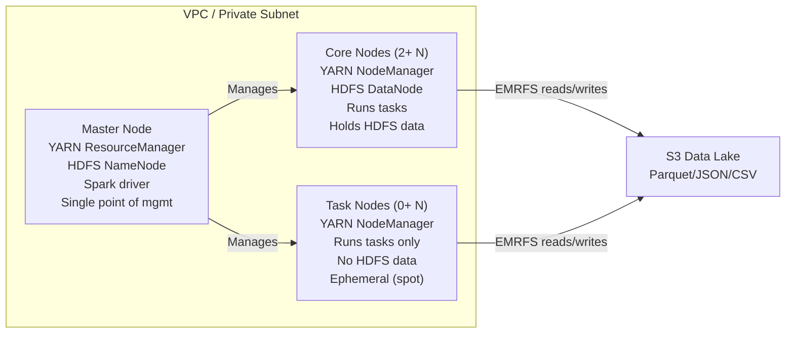

# EMR / Hadoop Notes

> [!NOTE]
> This file covers **EMR architecture, cluster types, and node roles** — the operational side. For Spark-specific tuning on EMR (committers, spot instances, etc.), see `apache-spark-pyspark/notes.md`. For the AWS ecosystem (Glue vs EMR, IAM, pipelines), see `aws-data-engineering/notes.md`.

## 1. What is EMR?

EMR is AWS's managed Hadoop/Spark ecosystem. It provisions EC2 instances, installs your chosen big data applications (Spark, Hive, HBase, Presto/Trino, Flink, Iceberg), and manages the cluster lifecycle.

**Key distinction:** EMR is not a service you call with a SQL query (like Athena/Redshift Serverless). You SSH into the master node, submit jobs, and manage the cluster — though EMR Serverless and EMR Studio change this for some use cases.

### What EMR handles for you

| Layer | AWS manages | You manage |
|---|---|---|
| OS + applications | Installs, configures, version-matches | Choose the release label |
| Cluster lifecycle | Provisioning, termination, auto-scaling | Decide transient vs long-running |
| Storage | EMRFS (S3 connector), local HDFS | Schema, partitioning, file format |
| Security | IAM integration, encryption at rest | IAM roles, S3 bucket policies, VPC config |
| Monitoring | CloudWatch metrics, logging to S3 | Set up alarms, enable logging |

---

## 2. EMR Architecture

### Node Types



| Node | YARN role | HDFS role | Fault tolerance | Best for |
|---|---|---|---|---|
| **Master** | ResourceManager | NameNode (if HDFS used) | Single point of failure — one master | Cluster management, Spark driver |
| **Core** | NodeManager | DataNode | Multi-AZ placement helps | Storing intermediate data, HDFS-backed workloads |
| **Task** | NodeManager | None | Can lose any; just re-runs tasks | Pure compute, spot-friendly, auto-scaling target |

> [!WARNING]
> If a core node fails and HDFS replication is low, you can lose intermediate data. Task nodes have zero HDFS risk — prefer spot for task nodes, not core nodes.

### YARN on EMR

EMR runs YARN even if you only use Spark (Spark on YARN mode by default).

```
Job flow:
1. Spark driver runs on master (client mode) or a core node (cluster mode)
2. Driver requests containers from YARN ResourceManager (master)
3. ResourceManager asks NodeManagers (core/task nodes) to launch executors
4. Executors run tasks and read/write S3 via EMRFS (or HDFS on core nodes)
```

### EMRFS (EMR File System)

EMRFS is a custom Hadoop filesystem that lets EMR read/write S3 as if it were HDFS. Key behaviors:

- **Consistent view** — Optional DynamoDB-backed metadata to handle S3's read-after-write eventually consistent model
- **Server-side encryption** — SSE-S3, SSE-KMS, SSE-C
- **IAM-based access** — Each cluster gets an EC2 instance profile; S3 bucket policies grant/deny access
- **Committing** — Can use S3 magic committer (EMR-only) to avoid rename-based commits; see Spark notes for details

---

## 3. Cluster Types

### Transient (Auto-Terminate)

Provision → run steps → terminate. Most common pattern for production ETL.

| Pros | Cons |
|---|---|
| Zero cost when idle | Startup time (5–15 min for provisioning) |
| Always fresh (no config drift) | Cold start for cached data |
| Easy to version (AMI-like via bootstrap) | Relies on external orchestration |
| No cluster management overhead | |

**Typical workflow:**

```bash
aws emr create-cluster \
  --name "etl-job-20260723" \
  --release-label emr-7.5.0 \
  --applications Name=Spark Name=Hive \
  --instance-type r5.2xlarge \
  --instance-count 5 \
  --ec2-attributes KeyName=my-key,SubnetId=subnet-xxx \
  --steps Type=Spark,Name="Run ETL",ActionOnFailure=TERMINATE_CLUSTER,Args=[--class,com.example.Main,s3://bucket/job.jar]
  --auto-terminate
```

> [!TIP]
> Use `ActionOnFailure=TERMINATE_CLUSTER` or `CONTINUE` strategically. For transient clusters, terminate on failure to avoid orphan clusters burning cost.

### Long-Running (Persistent)

Cluster stays up for ad-hoc queries, interactive development, or repeated jobs.

| Pros | Cons |
|---|---|
| No startup wait for each job | Pay for idle time |
| HDFS data persists across jobs | Config drift over time |
| Interactive via SSH/EMR Notebooks | Need to manage scaling manually (or enable Managed Scaling) |
| Good for teams sharing a cluster | Single point of failure (master) |

### Managed Scaling

EMR automatically adds/removes task/core nodes based on YARN memory + CPU demand. Enabled by default on new clusters.

```
How it works:
1. EMR monitors YARN pending + allocated memory
2. Uses a target utilization (default 50% for scale-up trigger)
3. Adds task nodes first; if still constrained, adds core nodes
4. Scales down when utilization drops below threshold for N minutes
5. Respects min/max instance count boundaries you set
```

| Setting | Recommendation |
|---|---|
| Minimum nodes | Enough for your smallest workload |
| Maximum nodes | Budget cap / quota limit |
| Scale-down timeout | 5–10 min default; increase for bursty workloads to avoid thrash |
| Spot percentage | Up to 100% for task nodes |

### Comparison

| Criterion | Transient | Long-running | Managed Scaling |
|---|---|---|---|
| Cost when idle | $0 | Pay per hour | Pay per hour |
| Startup delay | 5–15 min | 0 | 0 |
| Auto-scaling | No (fixed size) | Manual or Managed Scaling | Built-in |
| Best fit | Scheduled batch ETL | Dev/QA, interactive analysis | Production with variable load |
| HDFS | Lost on termination | Persists | Persists |

---

## 4. Instance Procurement

### Instance Types

| Instance family | Use case | EMR recommendation |
|---|---|---|
| **R-series** (r5/r6g/r7g) | Memory-bound: large shuffles, joins, aggregations | Most common for Spark ETL |
| **C-series** (c5/c6g/c7g) | CPU-bound: transformation-heavy, light aggregation | Good for HBase, Presto |
| **M-series** (m5/m6g/m7g) | Balanced: general purpose | Small clusters, dev |
| **I-series** (i3/i4i) | Storage-bound: HDFS-heavy, local SSD | Legacy HDFS workloads |
| **Graviton** (g-series) | ARM-based: 10–20% cheaper, need compatible code | Preferred for new clusters if code supports ARM |

### On-Demand vs Spot vs Reserved

| Procurement | Discount | Risk | Where to use |
|---|---|---|---|
| **On-Demand** | 0% | None | Core nodes (HDFS), master node |
| **Spot** | 50–90% | Interruption at 2-min notice | Task nodes (ephemeral compute) |
| **Reserved** (1yr/3yr) | 40–75% | Commitment risk | Steady-state core nodes |
| **Savings Plans** | Similar to reserved | Flexible across instance families | Any predictable workload |

### Instance Fleets

EMR can mix on-demand + spot instances within a single cluster via **Instance Fleets** (recommended over legacy instance groups).

```bash
aws emr create-cluster \
  --instance-fleets \
    MasterInstanceFleet='[{"InstanceFleetType":"MASTER","TargetOnDemandCapacity":1,"InstanceTypeConfigs":[{"InstanceType":"r5.2xlarge"}]}]' \
    CoreInstanceFleet='[{"InstanceFleetType":"CORE","TargetOnDemandCapacity":3,"InstanceTypeConfigs":[{"InstanceType":"r5.2xlarge"},{"InstanceType":"r5a.2xlarge"}]}]' \
    TaskInstanceFleet='[{"InstanceFleetType":"TASK","TargetSpotCapacity":10,"InstanceTypeConfigs":[{"InstanceType":"r5.2xlarge"},{"InstanceType":"r5a.2xlarge"},{"InstanceType":"r5d.2xlarge"}]}]'
```

**Why instance fleets over instance groups:**
- Can specify multiple instance types in one fleet → higher spot availability
- Fleet auto-adjusts allocations across instance types
- Simplifies cluster definition (one config for core, one for task)

> [!TIP]
> Always include multiple instance types in your spot fleet. If one AZ runs out of capacity for `r5.xlarge`, EMR will use `r5a.xlarge` or `r5d.xlarge` instead.

---

## 5. EMR on EKS

EMR can run as a Kubernetes custom resource on EKS instead of EC2 instances.

```
EMR on EKS architecture:
1. You register an EKS cluster with EMR
2. Submit Spark jobs via start-job-run API (no EC2 management)
3. Each job runs in its own pod, managed by the EMR Spark operator
4. Uses EMR's Spark runtime (optimized, same as EC2-based EMR)
5. No persistent cluster — pay only for vCPU-hours per job
```

| Aspect | EMR on EC2 | EMR on EKS |
|---|---|---|
| Resource model | YARN + EC2 instances | Kubernetes pods |
| Isolation | Container per executor via YARN | Pod per executor |
| Cost | Per-instance-hour | Per-vCPU-hour |
| Multi-tenant | Single-tenant cluster | Share EKS with other services |
| Startup | 5–15 min cluster bootstrap | Seconds (pods already on node) |
| Complexity | Lower (managed) | Higher (need EKS expertise) |

---

## 6. EMR Serverless

Fully managed — no cluster to provision, scale, or tune.

```
Application (your config: runtime, Spark image, network, IAM)
  └─ Job Run (your code + resources)
      └─ Auto-scaled executors (no YARN or nodes visible)
```

| Feature | Detail |
|---|---|
| Scaling | Instant — no warm-up, no cluster sizing |
| Cost | Per-vCPU + per-DPU-second; 0 cost when idle |
| Max parallelism | Configurable via `maximumCapacity` (initial workers + max workers) |
| Storage | EMRFS to S3 only (no HDFS) |
| Networking | Runs in your VPC |
| Limits | No Hive, HBase, Presto — Spark only |

> [!WARNING]
> EMR Serverless is Spark-only. If you need Hive, HBase, or custom YARN apps, use EC2-based EMR.

---

## 7. EMR Release Labels & Applications

EMR releases are versioned like `emr-7.5.0`. Each release bundles specific application versions.

| Release | Spark | Hive | Flink | Iceberg | Notable |
|---|---|---|---|---|---|
| **emr-7.5.0** | 3.5.4 | 3.1.3 | 1.19.1 | 1.6.1 | Latest (2026) |
| **emr-7.4.0** | 3.5.3 | 3.1.3 | 1.19.1 | 1.5.2 | |
| **emr-6.15.0** | 3.5.0 | 3.1.3 | 1.18.0 | 1.4.0 | Last 6.x |
| **emr-5.36.0** | 2.4.8 | 2.3.9 | 1.11.6 | — | End-of-life (March 2024) |

> [!NOTE]
> Always check [EMR release guide](https://docs.aws.amazon.com/emr/latest/ReleaseGuide/emr-release-components.html) before choosing a release label. Use the latest 7.x for new clusters.

---

## 8. Key Interview Answers

### "Describe EMR architecture"

> EMR has three node types: the **master node** runs YARN ResourceManager and Spark driver; **core nodes** run NodeManager and HDFS DataNode (tasks + storage); **task nodes** run NodeManager only (pure compute, no HDFS). Storage is either local HDFS on core nodes or S3 via EMRFS. YARN manages resource allocation. The cluster lives in a VPC with an IAM instance profile for S3 and other AWS access.

### "When would you use transient vs long-running clusters?"

> **Transient** for scheduled batch ETL — provision, run, terminate. Zero cost when idle, no config drift. **Long-running** for ad-hoc queries or dev teams where startup latency is unacceptable. Enable **Managed Scaling** on long-running clusters to auto-adjust capacity.

### "How do you protect against spot instance interruptions?"

> Place spot instances only on **task nodes** (no HDFS data). Use **multiple instance types** in the fleet so EMR can shift capacity if one type is reclaimed. Enable graceful decommissioning and set `spark.blacklist.decommissioning.timeout` so executors finish tasks before going down.

### "What is EMRFS and why does it matter?"

> EMRFS lets EMR treat S3 like HDFS. It provides consistent read-after-write via DynamoDB (optional), SSE integration, and IAM-based access. Most modern EMR workloads read/write S3 directly instead of HDFS — this makes clusters stateless and core nodes less critical.

### "EMR on EKS vs EMR on EC2?"

> EMR on EKS runs Spark jobs as Kubernetes pods, sharing an EKS cluster with other services. It bills per-vCPU-second with no cluster management. EMR on EC2 uses YARN on dedicated instances, has higher fixed cost but simpler operations. Choose EKS if you already run Kubernetes and want mixed workloads; choose EC2 for simplicity and full EMR application support.

---

## Resources

- [AWS EMR Documentation](https://docs.aws.amazon.com/emr/)
- [EMR Best Practices Guide (AWS blog)](https://aws.amazon.com/blogs/big-data/emr-best-practices/)
- [EMR Release Guide](https://docs.aws.amazon.com/emr/latest/ReleaseGuide/emr-release-components.html)
- [EMR on EKS docs](https://docs.aws.amazon.com/emr/latest/EMR-on-EKS-DevelopmentGuide/)
- [Hadoop: understanding splits, blocks & everything in between](https://jeromerajan.com/2023/04/21/hadoop-understanding-splits-blocks-everything-in-between/)
- [Hive on Tez: determining reducer counts (tuning notes)](hive-tez/reducer-counts.md)
