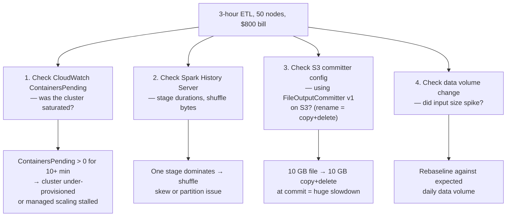
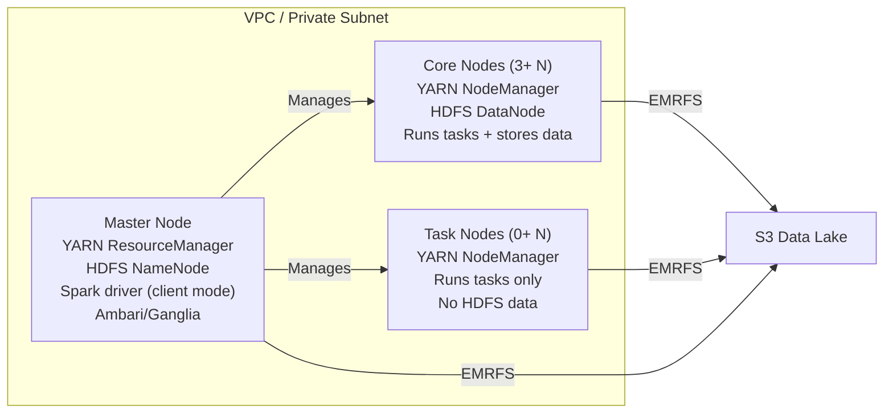
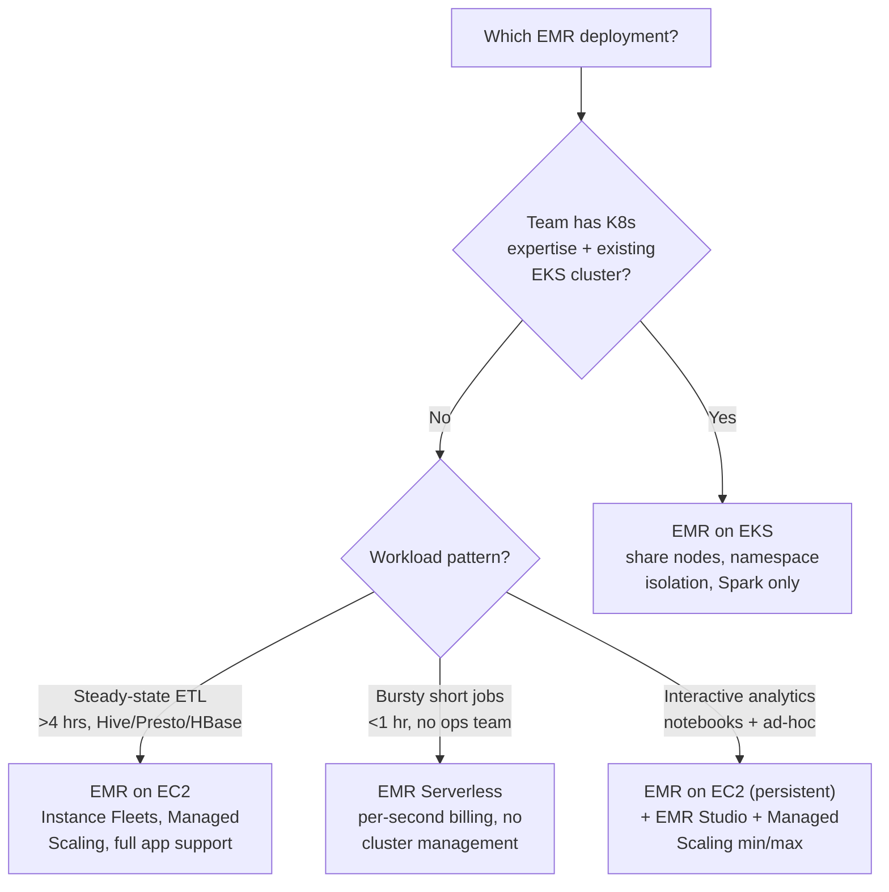
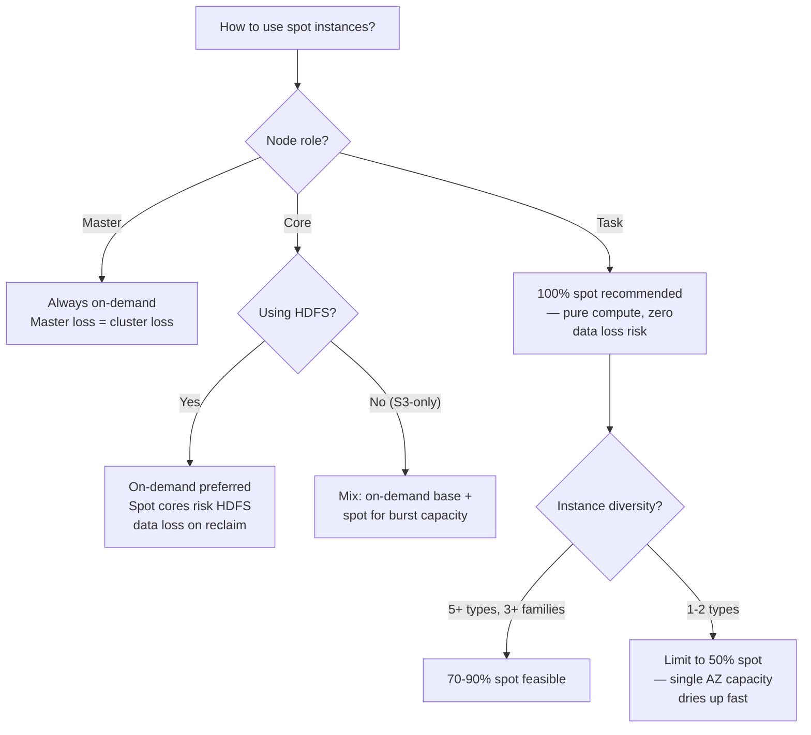
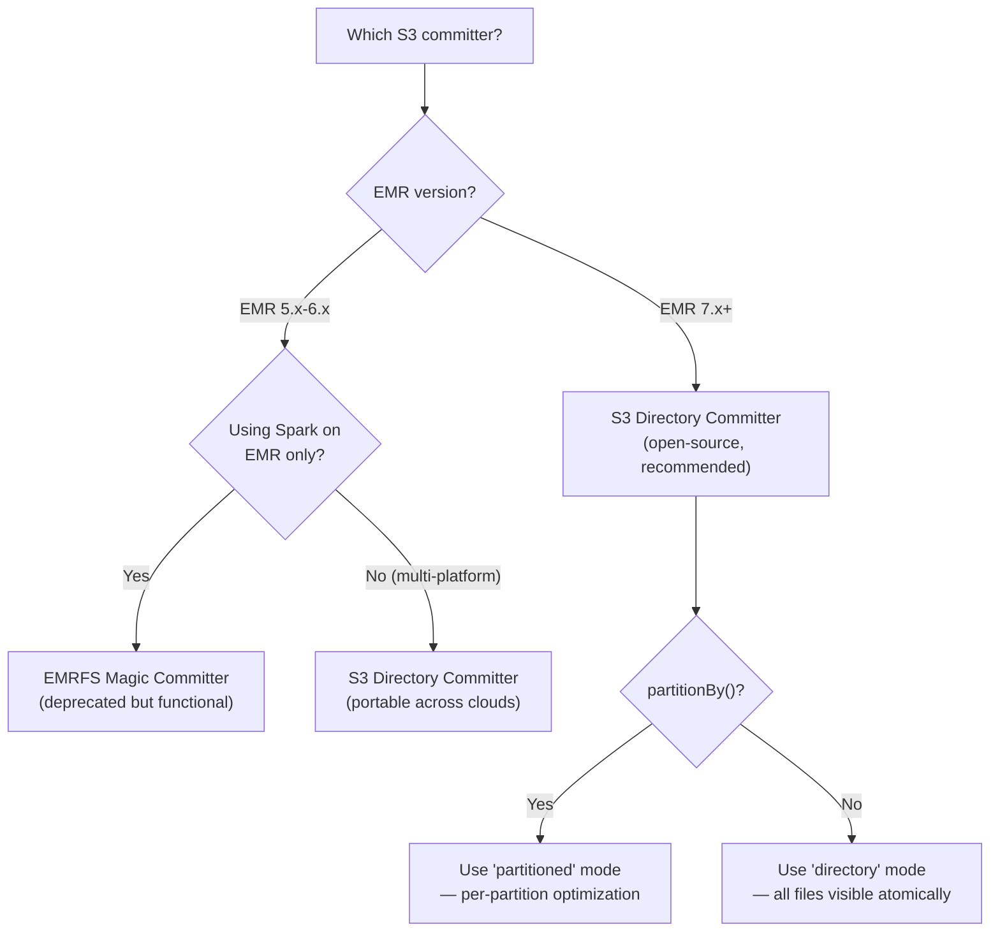

# EMR / Hadoop Notes

> [!NOTE]
> This file covers EMR at depth: architecture, operations, security, tuning, and production patterns. For Spark-specific tuning (committers, AQE, shuffle), see `apache-spark-pyspark/notes.md`. For the broader AWS ecosystem (Glue vs EMR, IAM, pipeline patterns), see `aws-data-engineering/notes.md`.

---

## 0. The Opening Question

**Question:** *"Your team built a Spark ETL pipeline that runs nightly on EMR. Last night it scaled to 50 nodes but took 3 hours instead of the usual 30 minutes. The bill was $800. What do you check first?"*



**Answer structure:**
```
1. Metric check: CloudWatch ContainersPending — if high, cluster needed more nodes faster
2. Spark History Server: find the dominating stage, check shuffle read size and skew
3. S3 committer: if using FileOutputCommitter v1, every file commit copies all data bytes = job cost doubles
4. Data volume: compare input size against baseline
```

> [!NOTE]
> What the interviewer is testing: your debugging methodology, understanding of EMR scaling behavior, YARN container management, S3 committer internals, and cost awareness — all at once.

---

## 1. What is EMR?

EMR is AWS's managed Hadoop/Spark ecosystem. It provisions EC2 instances, installs your chosen big data applications (Spark, Hive, HBase, Presto/Trino, Flink, Iceberg, Hue, etc.), and manages the cluster lifecycle.

**The key mental model:** EMR is a managed fleet of EC2 instances with Hadoop/Spark pre-installed and pre-configured. It is not a serverless SQL service. You are responsible for cluster sizing, job submission, and cost management — AWS handles OS patching, application configuration, and instance provisioning.

### Deployment Flavors

| Flavor | Control | Management overhead | Best for |
|---|---|---|---|
| **EMR on EC2** | Full — SSH, custom AMIs, bootstrap actions | Medium | Production ETL, complex pipelines, custom YARN apps |
| **EMR on EKS** | Kubernetes-native — pods, namespaces, RBAC | High (need K8s expertise) | Mixed workloads, existing EKS investment |
| **EMR Serverless** | Minimal — just submit Spark jobs | None | Variable/lightweight Spark, no ops team |
| **EMR Studio** | Notebook UI on top of any of the above | Low (managed notebook) | Data science, ad-hoc exploration |

### What EMR Manages for You

| Layer | AWS manages | You own |
|---|---|---|
| OS + applications | Installs, configures, version-matches applications | Choose the release label, test upgrades |
| Cluster lifecycle | Provisioning, termination, health checks | Decide transient vs long-running, set scaling limits |
| Storage driver | EMRFS (S3 connector), local HDFS | Schema design, partitioning, file format, compression |
| Security baseline | IAM integration, encryption at rest for EBS | IAM roles, S3 bucket policies, VPC config, Kerberos/Ranger |
| Instance management | Fleet provisioning, AZ distribution, replacement of failed nodes | Instance type selection, spot % strategy |
| Monitoring infra | CloudWatch metrics, log aggregation to S3 | Set up alarms, dashboard, log retention policy |

---

## 2. EMR Architecture

### Node Types



| Node | YARN role | HDFS role | Fault tolerance | Production guidance |
|---|---|---|---|---|
| **Master** | ResourceManager | NameNode | Single point of failure | Run 1 master (no HA option for EMR on EC2); use EMR on EKS for HA |
| **Core** | NodeManager | DataNode | Replication factor 3 protects data | Minimum 3 core nodes for HDFS durability; use on-demand only |
| **Task** | NodeManager | None | Any node can be lost | Prefer spot — zero data loss risk, pure compute |

> [!WARNING]
> Spot instances on core nodes can cause data loss if HDFS is used. If you must use spot for cores, enable HDFS data replication to S3 via `emrfs-site` or avoid HDFS entirely by using S3 as the sole storage layer.

### YARN Deep Dive

EMR runs YARN as the resource manager even if you only use Spark. Understanding YARN behavior is critical for debugging.

**YARN Schedulers on EMR:**

| Scheduler | Default on | Behavior | When to use |
|---|---|---|---|
| **Capacity Scheduler** | EMR 5.x (default), 6.x+ | Queues with min/max capacity guarantees | Multi-tenant clusters, predictable SLAs |
| **Fair Scheduler** | EMR 7.x (default) | Dynamic sharing — jobs get fair share over time | Ad-hoc/mixed workloads, teams sharing a cluster |

**YARN container sizing formula:**

```
Total containers per node = (node_memory - reserved_memory) / container_size

where:
  reserved_memory = yarn.nodemanager.resource.memory-mb (default: ~80% of instance RAM)
  container_size   = spark.executor.memory + spark.executor.memoryOverhead
```

**EMR's default memory fractions (EMR 7.x):**

| Component | % of instance RAM | Notes |
|---|---|---|
| YARN container max | 80% | Controlled by `yarn.nodemanager.resource.memory-mb` |
| OS + daemons | 12–15% | Includes HDFS DataNode, NodeManager, CloudWatch agent |
| HDFS metadata cache | Remaining | Only relevant if using HDFS heavily |

> [!TIP]
> On EMR 7.x, Spark dynamic allocation is enabled by default. YARN will release executors back to the pool when idle. If you see jobs competing for resources, check `spark.dynamicAllocation.executorIdleTimeout` (default 60s).

### EMRFS Deep Dive

EMRFS is a custom Hadoop FileSystem implementation (`com.amazon.ws.emr.hadoop.fs.EmrFileSystem`). It wraps the S3A filesystem with EMR-specific optimizations.

**EMRFS vs S3A:**

| Feature | EMRFS | S3A (open-source) |
|---|---|---|
| Consistent view | Deprecated (EOL June 2023) | Not needed — S3 is strongly consistent |
| S3 magic committer | Yes (EMR-only) | No |
| Server-side encryption | SSE-S3, SSE-KMS, SSE-C | SSE-S3, SSE-KMS |
| IAM role chaining | Yes | No (uses single role) |
| Performance on large listings | Optimized with pagination | Baseline |

**DynamoDB Consistent View (Deprecated):**

> [!WARNING]
> EMRFS consistent view reached **end of standard support on June 1, 2023** for new EMR releases. S3 has provided strong read-after-write consistency since December 2020. AWS recommends turning it off and deleting the associated DynamoDB table. Do not enable on new clusters.

Legacy configuration (for reference only):

```json
{
  "fs.s3.consistent": "true",
  "fs.s3.consistent.retryPolicy": "retryForever",
  "fs.s3.consistent.retryPeriodSeconds": "10",
  "fs.s3.consistent.retryCount": "5",
  "fs.s3.consistent.tableName": "EmrConsistencyView_<cluster-id>"
}
```

**Why it existed:** Before December 2020, S3 had list-after-overwrite eventual consistency. A Spark job that wrote files and immediately listed them could miss its own output. EMRFS tracked S3 object metadata in DynamoDB to work around this.

**Why it's gone:** S3 now provides strong read-after-write consistency for all GET/LIST/PUT operations across all regions. The DynamoDB workaround is unnecessary overhead.

**Migration:**
- Turn `fs.s3.consistent` to `false` in `emrfs-site`
- Delete the DynamoDB table (`EmrFSMetadata` or custom name)
- Remove any SQS notification queues configured for inconsistency alerts
- Verify no cost impact from unused DynamoDB provisioned capacity

**S3 Committers — The Multipart Upload Trick:**

Standard Spark committers (`FileOutputCommitter`) write task output to a `_temporary/` directory, then **rename** to the final path. On S3, rename is not atomic — it is a **COPY + DELETE** of every byte. For a 10 GB file, that means 10 GB re-copied over the network at commit time.

Both optimized committers solve this using the same mechanism: **S3 Multipart Upload (MPU)**.

```
Task writes data blocks ──> S3 pending MPU parts (invisible to LIST/GET)
         │
         ▼
Commit sends lightweight API call ──> CompleteMultipartUpload(UploadId)
         │
         ▼
Data appears at final path instantly ──> Zero bytes moved or copied
```

No bytes are copied at commit time — it is purely an **API control-plane operation**.

---

**EMRFS S3 Magic Committer** (`com.amazon.emr.magiccommitter.MagicCommitProtocol`):

Task data is streamed as MPU parts tagged with a `.$taskAttemptId` suffix in the pending upload metadata. On commit, it resolves those pending MPU IDs to the clean final path names via `CompleteMultipartUpload`.

```json
{
  "spark.sql.sources.commitProtocolClass": "com.amazon.emr.magiccommitter.MagicCommitProtocol",
  "spark.hadoop.mapreduce.fileoutputcommitter.algorithm.version": "2"
}
```

| Aspect | Detail |
|---|---|
| Mechanism | Writes MPU parts under a pending key with `.$taskAttemptId` suffix; commit completes MPU to final key |
| Data visibility mid-job | Files visible at destination path with temporary suffix |
| Portability | **EMR only** — proprietary code |
| Status | **Deprecated** in EMR 7.x |

---

**S3 Directory Committer** (`org.apache.spark.internal.io.cloud.PathOutputCommitProtocol`):

The open-source replacement built into Apache Hadoop's S3A filesystem. During task execution, data is stored as uncommitted MPU parts — **completely invisible** in S3. The Spark driver collects MPU UploadIds from all tasks and issues a batch `CompleteMultipartUpload` at job commit.

```json
{
  "spark.hadoop.fs.s3a.committer.name": "directory",
  "spark.sql.sources.commitProtocolClass": "org.apache.spark.internal.io.cloud.PathOutputCommitProtocol",
  "spark.sql.parquet.output.committer.class": "org.apache.spark.internal.io.cloud.BindingPathOutputCommitter"
}
```

For `partitionBy(...)` datasets, use `"partitioned"` instead of `"directory"` for per-partition optimization.

| Aspect | Detail |
|---|---|
| Mechanism | Streams MPU parts invisibly; driver completes all MPUs at job commit |
| Data visibility mid-job | **None** — files appear only after job commit |
| Portability | Any Spark/Hadoop environment (EMR, EC2, EKS, Databricks, GCP) |
| Status | **Recommended** in EMR 7.x+ |

---

**Comparison:**

| Attribute | Standard FileOutputCommitter | EMRFS Magic Committer | S3 Directory Committer |
|---|---|---|---|
| Commit operation | COPY + DELETE per file | `CompleteMultipartUpload` (metadata only) | `CompleteMultipartUpload` (metadata only) |
| Data copied at commit | Yes — full dataset | Zero bytes | Zero bytes |
| Portability | Any platform | EMR only | Any platform (open-source) |
| Mid-job file visibility | In `_temporary/` dir | Visible with suffix | Invisible |
| EMR 7.x status | Available | Deprecated | Recommended |

> [!TIP]
> Migrating from Magic Committer to Directory Committer is a config change only — the underlying MPU mechanism is identical. The Directory Committer is actually **more robust**: it avoids mid-job file visibility (no partial reads) and works on any Spark platform.

**Performance tips for EMRFS:**

| Issue | Symptom | Fix |
|---|---|---|
| Too many S3 LIST calls | High S3 request cost, slow task startup | Increase `mapreduce.input.fileinputformat.list-status.num-threads` (default 1 → 8–16) |
| Small files in S3 | Slow tasks, too many mappers | Coalesce/repartition before write, or use `spark.sql.files.maxPartitionBytes` |
| S3 throttling | `503 SlowDown` errors | Enable EMRFS retry with exponential backoff; use S3 prefixes to scale request rate |
| High EMRFS metadata cost | DynamoDB bill spikes | Disable consistent view entirely (deprecated since June 2023) and delete the DynamoDB table |

### HDFS on EMR — When and Why

Most modern EMR workloads treat HDFS as a transient scratch space (for shuffle data, intermediate results). Persistent data lives in S3.

**HDFS usage patterns:**

| Pattern | Data on HDFS | When to use |
|---|---|---|
| S3-only | None | Stateless clusters, easy to replace nodes, no HDFS data loss risk |
| HDFS scratch | Shuffle/temp data | Default — YARN writes shuffle data to local SSDs or HDFS |
| HDFS persistent | Input/intermediate | Legacy pipelines, on-prem migration patterns (avoid for new builds) |
| HDFS for hive warehouse | Managed tables | Legacy Hive workloads; prefer external tables pointing to S3 |

**EBS volume configuration for HDFS:**

EMR 7.x uses EBS-optimized instances with configurable EBS storage:

| Volume type | Default size | Recommendation |
|---|---|---|
| gp3 (general purpose) | 32 GB (master), varies per instance type | Sufficient for most Spark workloads |
| io2 (provisioned IOPS) | N/A | Only needed for latency-sensitive HDFS workloads |

> [!TIP]
> EMR automatically stripes EBS volumes across multiple disks for HDFS. You don't need RAID configuration. Increase EBS volume size per node to improve HDFS throughput — HDFS block I/O is sequential, so more spindles = more throughput.

---

## 3. Cluster Types & Lifecycle

### Transient (Auto-Terminate)

Provision → run steps → terminate. The default for production ETL.

**Step orchestration model:**

EMR steps run sequentially within a cluster. Each step is a job (Spark, Hive, Pig, or custom JAR) submitted at cluster launch or via `aws emr add-steps`.

```
Lifecycle of a step:
  PENDING → RUNNING → COMPLETED / FAILED / CANCELLED
```

**Step concurrency:**

| Setting | Effect |
|---|---|
| Default | Steps run sequentially (one at a time) |
| `--step-concurrency-level N` | Run up to N steps in parallel (EMR 5.30+) |

**Parallel step considerations:**
- Each step competes for YARN resources. If you run 3 Spark steps with max resource allocation, they will YARN-queue against each other.
- Parallel steps are useful for independent small jobs on the same cluster (e.g., writing to different S3 partitions).

**Common transient cluster patterns:**

```bash
# Pattern 1: Single-step cluster (simplest)
aws emr create-cluster \
  --name "daily-etl" \
  --release-label emr-7.5.0 \
  --instance-type r5.4xlarge \
  --instance-count 6 \
  --steps 'Type=Spark,Name="ETL Job",ActionOnFailure=TERMINATE_CLUSTER,Args=[s3://bucket/etl.py]' \
  --auto-terminate

# Pattern 2: Multi-step pipeline
aws emr create-cluster \
  --name "multi-step-pipeline" \
  --steps \
    'Type=Spark,Name="Step 1 - Extract",ActionOnFailure=TERMINATE_CLUSTER,Args=[s3://bucket/extract.py]' \
    'Type=Spark,Name="Step 2 - Transform",ActionOnFailure=TERMINATE_CLUSTER,Args=[s3://bucket/transform.py]' \
    'Type=Spark,Name="Step 3 - Load",ActionOnFailure=TERMINATE_CLUSTER,Args=[s3://bucket/load.py]' \
  --auto-terminate

# Pattern 3: Add steps to existing cluster
CLUSTER_ID=$(aws emr create-cluster --name "etl-cluster" --instance-type r5.4xlarge --instance-count 5 --auto-terminate --query 'ClusterId' --output text)
aws emr add-steps --cluster-id $CLUSTER_ID --steps 'Type=Spark,Name="Job",ActionOnFailure=CONTINUE,Args=[s3://bucket/job.py]'
```

**ActionOnFailure strategies:**

| Value | Behavior | Use case |
|---|---|---|
| `TERMINATE_CLUSTER` | Kill the entire cluster | Transient: fail fast, don't burn money on orphan clusters |
| `CONTINUE` | Run the next step | Long-running: log the failure, run next job |
| `CANCEL_AND_WAIT` | Cancel remaining steps, keep cluster alive | Dev/debug: inspect the state after failure |

### Long-Running (Persistent)

**Multi-master (EMR 6.x+):** EMR now supports multiple master nodes for HA of the ResourceManager and NameNode. This is distinct from the single-master model. In multi-master mode, if the active master fails, a standby takes over.

| Master deployment | Applies to | SLA improvement |
|---|---|---|
| Single master | All EMR on EC2 | No HA — master failure = cluster loss |
| Multi-master (3 nodes) | EMR 6.9+, emr-7.x | YARN ResourceManager + HDFS NameNode HA; Spark driver still single |

> [!NOTE]
> Multi-master protects against YARN/HDFS failure, not Spark driver failure. In Spark cluster mode, the driver runs on a core node (not the master), so driver failure still kills the job. Use checkpointing or structured streaming end-to-end exactly-once for fault tolerance.

**Maintenance strategies for long-running clusters:**

| Strategy | How | When |
|---|---|---|
| Rolling restart | `aws emr modify-cluster --no-visible-to-all-users` to cordon, then restart services | Config changes, application upgrades |
| Clone and replace | Create a new cluster from latest AMI, migrate workloads | Major version upgrades, security patches |
| Managed scaling | Automatic add/remove of task and core nodes | Variable load, predictable patterns |

### Managed Scaling Deep Dive

EMR Managed Scaling adjusts cluster capacity based on YARN memory and vCPU demand. It is enabled by default on new clusters.

**Scaling signals:**

```
Scale-up triggers (any of):
  - Pending memory > allocated memory × scale-up factor (default 0.15)
  - Pending vCPUs > allocated vCPUs × 0.15

Scale-down triggers (all of):
  - Allocated memory < 50% of total for 5+ minutes (configurable)
  - No pending containers
  - No shuffle data on the nodes being decommissioned
```

**Scale-down protection:**

EMR does not immediately terminate nodes with active shuffle data (Spark shuffle files, HDFS blocks). It waits for:

1. `yarn.resourcemanager.nm.liveness-monitor.interval-ms` (default 10 min) to detect idle nodes
2. YARN decommissioning protocol to gracefully drain containers
3. HDFS block replication to complete for core nodes

This means scale-down can take 10–20 minutes in practice, even if the workload drops instantly. For bursty workloads, set `ScaleDownTimeout` to 10–15 min to avoid thrash.

**Managed Scaling limits:**

| Limit | Default | Notes |
|---|---|---|
| Min nodes per fleet | 1 | Can't scale to 0 |
| Max nodes per fleet | 100 (soft) | Request increase via AWS support |
| Scale-up speed | ~5 min per batch of nodes | Nodes are provisioned in parallel batches |
| Instance types | Only one type per fleet | Use instance fleets to mix types within a fleet |

**Shared vs dedicated instance fleets with Managed Scaling:**

| Scenario | Minimum nodes | Maximum nodes | Scale-down timeout |
|---|---|---|---|
| Nightly batch (predictable) | 5 | 5 | N/A (disable scaling) |
| Variable load (8am–6pm peak) | 3 | 20 | 15 min |
| Ad-hoc/query cluster | 2 | 50 | 5 min |

> [!TIP]
> Managed Scaling works best when you set min nodes to your baseline load and allow it to scale up for spikes. If your load is constant, save the overhead and disable Managed Scaling with fixed node count.

---

## 4. Instance Selection & Procurement

### Instance Selection Methodology

Choosing the right instance type is the single biggest performance lever for EMR.

**Step 1: Characterize your workload**

| Workload type | Bottleneck | Preferred family | Why |
|---|---|---|---|
| Heavy join/aggregation | Memory (shuffle) | **R-series** (r7g > r6g > r5) | More RAM per vCPU for large hash tables |
| Transformation-heavy | CPU (computation) | **C-series** (c7g > c6g > c5) | More vCPUs per dollar for CPU-bound jobs |
| Large shuffle reads | Network bandwidth | **R-series or compute-optimized with ENA** | Network is the bottleneck during shuffle |
| Small/medium jobs | General balance | **M-series** (m7g > m6g > m5) | Balanced — safe default for mixed workloads |
| HDFS-heavy | Disk I/O | **I-series** (i4i > i3) | NVMe SSD for HDFS DataNode throughput |

**Step 2: Determine per-node sizing**

```
Rule of thumb:
  CPU per executor = 4–5 cores (to avoid JVM overhead from too many cores)
  Memory per executor = 16–32 GB (above 32 GB leads to GC pressure)
  Executors per node = (vCPUs - 1) / 5

Example: r5.4xlarge (16 vCPU, 128 GB RAM)
  Executors per node = (16 - 1) / 5 = 3 executors
  Memory per executor = (128 × 0.8) / 3 ≈ 32 GB

Example: r5.2xlarge (8 vCPU, 64 GB RAM)
  Executors per node = (8 - 1) / 5 = 1 executor
  Memory per executor = (64 × 0.8) / 1 ≈ 48 GB
```

**Step 3: Choose instance count**

```
Total executors = (Total required memory) / (Memory per executor)

For a job processing 1 TB with 2× memory overhead for shuffle:
  Total memory needed ≈ 2 TB = 2048 GB
  With r5.4xlarge (3 executors × 32 GB = 96 GB per node):
  Total nodes needed = 2048 / (96 × 0.7) ≈ 31 nodes (including some headroom)
```

### Graviton (ARM) Migration Guide

EMR 7.x supports Graviton instances (r7g, c7g, m7g). These offer 10–20% cost savings but require code compatibility validation.

**What to check before migration:**

| Component | Risk | Mitigation |
|---|---|---|
| Python packages | Some wheels are x86-only (`pyarrow`, `pandas` with native extensions) | Use `pip install --only-binary=:all:` to verify; rebuild with `--platform manylinux2014_aarch64` |
| Java/Scala code | Pure Java is fine | Native libs (JNI, JNA) may not have ARM builds |
| Native Spark extensions | Spark本身的scala代码是跨平台的 | Third-party native libs (e.g., Hadoop native IO) need ARM builds |
| Docker images | Must be multi-arch | Use `docker buildx` with `--platform linux/amd64,linux/arm64` |

**Graviton performance characteristics:**

| Aspect | Graviton (r7g) vs Intel (r5) |
|---|---|
| Raw CPU perf | ~20–30% better per core (SPEC benchmarks) |
| Memory bandwidth | Comparable |
| Network | Same ENA driver, same bandwidth limits per instance size |
| Cost | ~15% cheaper per unit of compute |

> [!WARNING]
> PySpark's `cryptography` and `grpcio` libraries have known ARM wheel issues. Pin versions that publish ARM wheels. Always run a compatibility smoke test before migrating production EMR clusters.

### Spot Instance Strategy

| Tier | Discount | Interruption rate | Strategy |
|---|---|---|---|
| **deeply discounted** | 60–90% | 15–20% monthly | Add as task-only, use multiple instance types |
| **moderate discount** | 30–50% | 5–10% monthly | Good for 24/7 task fleets with Managed Scaling |
| **new instance types** | 10–30% | <5% monthly | Newer gen instances have more spare capacity |

**Graceful decommissioning for spot interruptions:**

EMR handles spot reclaim by:
1. Receiving the EC2 spot termination notice (2-minute warning)
2. YARN marks the node as unhealthy, stops scheduling new containers
3. Spark blacklists the executor, reschedules failed tasks on surviving nodes

Configure:
```json
{
  "spark.blacklist.decommissioning.timeout": "3600s",
  "spark.stage.maxConsecutiveAttempts": "4",
  "spark.task.maxFailures": "8"
}
```

**Instance diversification for spot:**

```bash
aws emr create-cluster \
  --instance-fleets \
    TaskInstanceFleet='[{
      "InstanceFleetType":"TASK",
      "TargetSpotCapacity":20,
      "InstanceTypeConfigs":[
        {"InstanceType":"r5.2xlarge","WeightedCapacity":1},
        {"InstanceType":"r5a.2xlarge","WeightedCapacity":1},
        {"InstanceType":"r5d.2xlarge","WeightedCapacity":1},
        {"InstanceType":"r5n.2xlarge","WeightedCapacity":1},
        {"InstanceType":"r6g.2xlarge","WeightedCapacity":1}
      ]
    }]'
```

Include 3–5 instance types across different instance generations and families. Spot capacity varies by AZ — if you're in a constrained AZ, diversify.

### Instance Fleets vs Instance Groups

| Aspect | Instance Fleets (recommended) | Instance Groups (legacy) |
|---|---|---|
| Multiple instance types per role | Yes | No (one type per group) |
| Spot + on-demand in one config | Yes | Separate groups for spot vs on-demand |
| Auto-adjust on spot reclaim | Yes (moves to next instance type) | No (group fails if spot AZ is dry) |
| Weighted capacity | Yes | No (each instance = 1 unit) |
| Available since | EMR 5.20+ | All versions |

Instance fleets are strictly superior. Use them for all new clusters.

---

## 5. Security & Networking

### IAM Architecture

Every EMR cluster uses three IAM roles:

| Role | Purpose | Key permissions |
|---|---|---|
| **Service Role** (`EMR_DefaultRole`) | EMR service calling EC2, Auto Scaling, CloudWatch | `ec2:RunInstances`, `ec2:TerminateInstances`, `autoscaling:*`, `cloudwatch:*` |
| **EC2 Instance Profile** (`EMR_EC2_DefaultRole`) | EC2 instances assuming this role for AWS access | `s3:*` on data buckets, `dynamodb:*` on EMRFS consistency table, `kms:Decrypt` |
| **Auto Scaling Role** (`EMR_AutoScaling_DefaultRole`) | Managed Scaling adding/removing nodes | `ec2:Describe*`, `cloudwatch:GetMetricData` |

**Least-privilege EC2 instance profile:**

```json
{
  "Version": "2012-10-17",
  "Statement": [
    {
      "Effect": "Allow",
      "Action": [
        "s3:GetObject",
        "s3:PutObject",
        "s3:DeleteObject",
        "s3:ListBucket",
        "s3:GetBucketLocation"
      ],
      "Resource": [
        "arn:aws:s3:::data-lake-bucket",
        "arn:aws:s3:::data-lake-bucket/*",
        "arn:aws:s3:::etl-scripts-bucket",
        "arn:aws:s3:::etl-scripts-bucket/*",
        "arn:aws:s3:::emr-logs-bucket",
        "arn:aws:s3:::emr-logs-bucket/*"
      ]
    },
    {
      "Effect": "Allow",
      "Action": [
        "dynamodb:GetItem",
        "dynamodb:PutItem",
        "dynamodb:DeleteItem",
        "dynamodb:Query",
        "dynamodb:UpdateItem"
      ],
      "Resource": "arn:aws:dynamodb:*:*:table/EmrConsistencyView*"
    },
    {
      "Effect": "Allow",
      "Action": ["glue:GetTable", "glue:GetDatabase", "glue:GetPartitions"],
      "Resource": "*"
    }
  ]
}
```

> [!WARNING]
> The default `EMR_EC2_DefaultRole` grants `s3:*` on all buckets. In production, scope it to only the buckets your workloads need. A compromised Spark job could exfiltrate data from any S3 bucket.

### VPC & Networking Design

**EMR networking requirements:**

- All nodes must be in the **same subnet** (or same AZ with VPC peering)
- Master node needs inbound SSH (port 22) and web UI ports (8890, 8443)
- Nodes communicate on internal ports (YARN: 8030–8033, HDFS: 50070, 9000)
- Outbound internet for AWS API calls (or use VPC endpoints)

**VPC endpoint strategy for EMR:**

| Endpoint | Type | Purpose |
|---|---|---|
| `com.amazonaws.<region>.s3` | Gateway | S3 access without NAT gateway |
| `com.amazonaws.<region>.dynamodb` | Gateway | EMRFS consistent view |
| `com.amazonaws.<region>.logs` | Interface | CloudWatch logs |
| `com.amazonaws.<region>.kms` | Interface | KMS key operations |
| `com.amazonaws.<region>.sts` | Interface | IAM credential chaining |

Using gateway endpoints for S3 and DynamoDB is free. Interface endpoints cost ~$7/month each.

**Network cost optimization for EMR:**

EMR cross-AZ data transfer is **not free** (EC2 charges for cross-AZ traffic within a VPC). Keep all EMR nodes in the same subnet (single AZ) to avoid cross-AZ data transfer costs. If you need multi-AZ for HA, use EMR on EKS (pods scheduled across AZs).

> [!TIP]
> EMR in a private subnet with NAT gateway: the NAT gateway is often the most expensive part of the setup ($32/month + data processing). Replace it with VPC gateway endpoints for S3/DynamoDB and VPC interface endpoints for other API calls. If users need SSH access, use AWS Systems Manager Session Manager instead of a bastion host.

### Encryption

| Layer | Method | Configuration |
|---|---|---|
| At rest — EBS volumes | EMR enables encryption by default via `EMRFS Encryption` | Set `--ebs-root-volume-encryption` or use KMS key |
| At rest — S3 | SSE-S3 (default), SSE-KMS (recommended for compliance) | Set `fs.s3.cse.enabled` or `fs.s3.sse.kms.keyId` |
| In transit — within cluster | TLS for Spark shuffle, HDFS, YARN | Enable `spark.authenticate` and `spark.shuffle.encryption.enabled` |
| In transit — EMRFS to S3 | HTTPS | Enabled by default |
| At rest — local shuffle | Encrypted spill | `spark.io.encryption.enabled` (performance impact ~10%) |

### Kerberos & Apache Ranger

**Kerberos on EMR:**

EMR integrates with AWS Directory Service for Microsoft AD or self-managed Kerberos KDC. This is required for:
- Multi-tenant clusters with strict access control
- Hive/HBase authentication
- Compliance (HIPAA, PCI)

```bash
aws emr create-cluster \
  --security-configuration MyKerberosConfig \
  --kerberos-attributes \
    Realm=EMR.COM,ADDomainJoinUser=admin,ADDomainJoinPassword=***,CrossRealmTrustPrincipalPassword=***
```

**Apache Ranger on EMR:**

Ranger provides fine-grained access control (column-level, row-level) for Hive, HDFS, and S3. Deploy via security configuration or bootstrap action.

| Use case | Without Ranger | With Ranger |
|---|---|---|
| Restrict column access | Must build separate views per team | Policy-based column masking |
| Row-level filtering | Application-level filter logic | Ranger policy applied at query time |
| Audit | CloudTrail (S3-level only) | Ranger audit to Solr or S3 |
| Multi-team cluster | Shared credentials or complex HDFS ACLs | LDAP/AD-based policies per group |

> [!NOTE]
> Ranger on EMR is primarily relevant for Hive-based use cases. For Spark-only workloads on S3, IAM policies + S3 bucket policies + Lake Formation provide simpler access control without Ranger.

---

## 6. Monitoring, Logging & Debugging

### Log Architecture

EMR writes logs to both the local filesystem and S3 (if configured).

```
Log directory structure on master node:
  /emr/   — Cluster provisioning logs (bootstrap, instance state)
  /mnt/var/log/hadoop/   — YARN ResourceManager logs
  /mnt/var/log/hive/     — Hive metastore and HiveServer2 logs
  /mnt/var/log/spark/    — Spark event logs (if enabled)
  /mnt/var/log/apps/     — Application-specific logs (e.g., custom JAR steps)

Logs on core/task nodes:
  /mnt/var/log/hadoop/   — YARN NodeManager logs
  /mnt/var/log/hadoop-hdfs/ — HDFS DataNode logs
```

**S3 log delivery:**

Enable with `--log-uri s3://my-emr-logs-bucket/` at cluster creation. Logs are pushed every 5 minutes.

```
S3 path structure:
  s3://my-emr-logs-bucket/emr-cluster-id/
    /containers/application_xxx/container_xxx/stdout.gz
    /containers/application_xxx/container_xxx/stderr.gz
    /node/node-master-xxx/
    /steps/s-xxx/
```

**Log retention lifecycle:**

| Log type | Retention | Recommendation |
|---|---|---|
| Step stdout/stderr | Until cluster termination | Archive to S3 for 90 days |
| YARN container logs | 7 days (local) | Send to CloudWatch Logs for 30-day search |
| Spark event logs | Per-job | Enable `spark.eventLog.enabled` and `spark.eventLog.dir` to S3 for Spark History Server |
| bootstrap/logs | Until cluster termination | Keep in S3 for audit |

### CloudWatch Metrics

EMR publishes metrics via CloudWatch by default:

| Metric | Granularity | What it signals |
|---|---|---|
| `MemoryTotalMB` / `MemoryAvailableMB` / `MemoryAllocatedMB` | 1 min | YARN memory pressure |
| `VCoresTotal` / `VCoresAvailable` / `VCoresAllocated` | 1 min | CPU pressure |
| `ContainersPending` / `ContainersAllocated` / `ContainersRunning` | 1 min | Job queuing, resource contention |
| `HDFSUtilization` | 5 min | HDFS capacity pressure |
| `S3BytesRead` / `S3BytesWritten` | 5 min | S3 throughput (cost indicator) |
| `JobsRunning` / `JobsFailed` | 1 min | Job health |

**Alarms worth setting:**

```bash
# Scale stalled — containers pending too long
PENDING_TOO_HIGH: ContainersPending > 10 for 10 minutes

# Memory pressure
MEMORY_CRITICAL: MemoryAvailableMB < 10% of MemoryTotalMB for 5 minutes

# Job failures
JOB_FAILED: JobsFailed > 0 for 1 minute (p0 alert)

# Orphan cluster ($ burning)
CLUSTER_IDLE: MemoryAllocatedMB < 1% of MemoryTotalMB for 30 minutes (long-running clusters)
```

### Spark History Server

EMR provides a pre-installed Spark History Server on the master node:

```
URL: http://<master-dns>:18080/
```

To view completed applications, Spark event logs must be enabled and accessible:

```json
{
  "spark.eventLog.enabled": "true",
  "spark.eventLog.dir": "s3://my-bucket/spark-logs/",
  "spark.history.fs.logDirectory": "s3://my-bucket/spark-logs/"
}
```

> [!TIP]
> For transient clusters, configure Spark event logs to S3 so you can review performance after the cluster is terminated. The Spark History Server can be run locally on your laptop using the same logs.

### Debugging Playbook

| Symptom | Most likely cause | Check first |
|---|---|---|
| Cluster stuck in `STARTING` | Subnet lacks capacity or VPC endpoint missing | Check EC2 console for insufficient capacity errors |
| Step stuck in `RUNNING` (no progress) | YARN waiting for containers (cluster saturated) | CloudWatch `ContainersPending` metric |
| Step fails immediately | Application error or missing dependency | Step `stderr` in S3 logs |
| Slow job (known good code) | Resource contention or data skew | Spark History Server — stage duration and shuffle read size |
| Spot reclaim kills the job | Too many spot instances, not enough diversity | Instance fleet spot reclamation events |
| S3 access denied | Wrong instance profile or S3 bucket policy | Check EC2 instance profile, test with `aws s3 ls` from master |
| HDFS safe mode | Core node loss, low replication | `sudo -u hdfs hdfs dfsadmin -safemode leave` (temp fix) |

---

## 7. Orchestration & Automation

### EMR Steps API

The EMR Steps API is the primary way to submit jobs to both transient and long-running clusters.

**Command reference:**

```bash
# Add steps to a running cluster
aws emr add-steps \
  --cluster-id j-xxxxxxxx \
  --steps \
    'Type=Spark,Name="Transform",ActionOnFailure=CONTINUE,Args=[--deploy-mode,cluster,s3://bucket/etl.py,--date,2026-07-23]' \
    'Type=Hive,Name="Load Partition",ActionOnFailure=CANCEL_AND_WAIT,Args=[-f,s3://bucket/load.hql]'

# Wait for steps to complete (poll)
aws emr describe-step --cluster-id j-xxxxx --step-id s-xxxxx
```

**Step size limits:** The total step arguments cannot exceed 10,240 characters. For complex job configurations, upload a config file to S3 and reference it in the step.

### Orchestration with Step Functions

Step Functions is the recommended orchestration engine for EMR on AWS. It handles retries, error handling, and parallel branching.

```json
{
  "StartAt": "Start EMR Cluster",
  "States": {
    "Start EMR Cluster": {
      "Type": "Task",
      "Resource": "arn:aws:states:::elasticmapreduce:createCluster.sync",
      "Parameters": {
        "Name": "etl-pipeline",
        "Instances": { "InstanceFleet": [...] },
        "ReleaseLabel": "emr-7.5.0"
      },
      "Next": "Wait for Completion"
    },
    "Wait for Completion": {
      "Type": "Task",
      "Resource": "arn:aws:states:::elasticmapreduce:terminateCluster",
      "Parameters": { "ClusterId.$": "$.ClusterId" },
      "End": true
    }
  }
}
```

**Step Functions vs Airflow vs Lambda:**

| Engine | Best for | EMR integration |
|---|---|---|
| **Step Functions** | Simple sequential/parallel ETL pipelines | Native AWS SDK integration, no server to manage |
| **Airflow (MWAA)** | Complex DAGs, Python-heavy orchestration, SLA tracking | `EmrCreateJobFlowOperator`, `EmrAddStepsOperator` |
| **Lambda** | Lightweight triggers (e.g., S3 event → EMR) | Lambda creates cluster via SDK, but 15-min timeout limits polling |
| **EventBridge** | Schedule-based triggers | Trigger Lambda/Step Functions on schedule |

### Bootstrap Actions

Bootstrap actions run on every node during cluster startup, before application processes start.

**Common bootstrap patterns:**

```bash
#!/bin/bash
# 1. Install Python dependencies
sudo pip install requests boto3 pyarrow pandas

# 2. Set custom configuration
cat > /etc/spark/conf/spark-defaults.conf << EOF
spark.sql.shuffle.partitions=400
spark.sql.adaptive.coalescePartitions.minPartitionNum=50
EOF

# 3. Mount additional EBS volume for scratch space
mkfs -t ext4 /dev/xvdba
mkdir -p /mnt/scratch
mount /dev/xvdba /mnt/scratch

# 4. Install Amazon CloudWatch agent (for custom metrics)
yum install -y amazon-cloudwatch-agent
```

**Bootstrap order:**

```
1. Launch EC2 instances
2. Attach EBS volumes
3. Mount filesystems
4. Run bootstrap actions (in specified order)
5. Start EMR applications (HDFS, YARN, Spark, Hive, ...)
6. Run step commands
```

> [!TIP]
> Bootstrap actions run on every node. Use `grep -q "isMaster" /mnt/var/lib/info/instance.json` to conditionally run code only on the master node. Always make bootstrap actions idempotent — clusters can be restarted.

### Custom AMIs

EMR supports custom Amazon Linux AMIs for organizations with security compliance requirements (CIS benchmarks, custom kernel modules, pre-installed agents).

```bash
# Create a custom AMI from an EMR-optimized base
aws ec2 create-image \
  --instance-id i-xxxx \
  --name "emr-cis-baseline-2026" \
  --description "EMR 7.5 base with CIS hardening"
```

**Limitations:**
- AMI must be based on Amazon Linux 2 or 2023
- Must be in the same region as the cluster
- EMR needs `ec2:DescribeImages` permission for the AMI
- AMI is applied to all nodes (master, core, task)

---

## 8. Performance Tuning

### Spark on EMR Configuration Profile

Recommended Spark config defaults for EMR:

```json
{
  "Classification": "spark-defaults",
  "Properties": {
    "spark.executor.instances": "8",
    "spark.executor.cores": "4",
    "spark.executor.memory": "16g",
    "spark.executor.memoryOverhead": "4g",
    "spark.driver.memory": "8g",
    "spark.sql.shuffle.partitions": "400",
    "spark.sql.adaptive.enabled": "true",
    "spark.sql.adaptive.advisoryPartitionSizeInBytes": "128m",
    "spark.sql.adaptive.coalescePartitions.minPartitionNum": "10",
    "spark.sql.adaptive.coalescePartitions.parallelismFirst": "false",
    "spark.dynamicAllocation.enabled": "true",
    "spark.dynamicAllocation.minExecutors": "2",
    "spark.dynamicAllocation.maxExecutors": "50",
    "spark.shuffle.service.enabled": "true",
    "spark.serializer": "org.apache.spark.serializer.KryoSerializer",
    "spark.io.compression.codec": "lz4",
    "spark.eventLog.enabled": "true",
    "spark.eventLog.dir": "s3://my-bucket/spark-logs/",
    "spark.history.fs.logDirectory": "s3://my-bucket/spark-logs/",
    "spark.sql.sources.commitProtocolClass": "com.amazon.emr.magiccommitter.MagicCommitProtocol",
    "spark.hadoop.mapreduce.fileoutputcommitter.algorithm.version": "2",
    "spark.hadoop.fs.s3a.connection.maximum": "100",
    "spark.hadoop.fs.s3a.threads.max": "30"
  }
}
```

**Why each setting matters:**

| Setting | Rationale |
|---|---|
| `adaptive.enabled` | AQE solves the number-of-partitions guessing game |
| `advisoryPartitionSizeInBytes` | Target 128 MB per partition for optimal parallelism vs overhead |
| `parallelismFirst` = false | Don't scale partitions just for parallelism — keep partition sizes optimal |
| `dynamicAllocation` | Release idle executors back to YARN so other jobs can run |
| `KryoSerializer` | 10x faster than Java serializer, ~50% smaller objects |
| `lz4` | Faster than snappy with comparable compression ratio |
| `fs.s3a.threads.max` | High S3 throughput needs more threads for parallel connections |

### Shuffle Tuning

Shuffle is the most common bottleneck. EMR-specific optimizations:

| Technique | Setting | Effect |
|---|---|---|
| Increase shuffle partitions | `spark.sql.shuffle.partitions` | More parallelism, smaller shuffle blocks |
| Shuffle compression | `spark.shuffle.compress=true` (default) | Reduces network I/O at CPU cost |
| Shuffle service | `spark.shuffle.service.enabled=true` | Keeps shuffle files alive when executors are removed (required for dynamic allocation) |
| Avoid shuffle altogether | Use `bucketBy` (bucketed tables) or `replicateKey` (skew join hint) | Zero shuffle for join or aggregation |

**Shuffle spill tuning:**

When executor memory is insufficient for shuffle data, Spark spills to disk:

```
Metrics to watch in Spark UI:
  Shuffle spill (disk) — ideally 0, acceptable <20%
  Shuffle spill (memory) — should be 100% (all data into memory before spill to disk)
  Shuffle read size / duration — long tail = skew
```

If you see disk spills:
- Increase `spark.executor.memory`
- Increase `spark.executor.memoryOverhead` (off-heap for shuffle)
- Enable `spark.sql.adaptive.localShuffleReader.enabled` (AQE reads coalesced partitions locally)

### EBS & Instance Store Tuning

| Storage type | Use | Performance tip |
|---|---|---|
| **EBS gp3** | HDFS, EMRFS metadata | Baseline 3000 IOPS, 125 MB/s per volume. Increase to 16000 IOPS for $/GB premium |
| **EBS io2** | HDFS write-heavy | Provisioned IOPS at higher cost. Use only if gp3 is IOPS-limited |
| **Instance store (NVMe)** | Shuffle scratch (ephemeral) | Attached to i-series instances. Fastest option for shuffle. Data lost on stop/termination |

**EBS tuning for shuffle-heavy workloads:**

```json
{
  "spark.local.dir": "/mnt/ebs0/spark,/mnt/ebs1/spark",
  "spark.shuffle.service.index.cache.size": "2048",
  "spark.shuffle.registration.timeout": "120000",
  "spark.shuffle.registration.maxAttempts": "5"
}
```

---

## 9. Production Patterns & Anti-Patterns

### Good Patterns

**Pattern 1: S3-backed stateless transient clusters**

```
S3 (input) → Transient EMR cluster → S3 (output)
  - No HDFS dependency
  - Core nodes can be spot (with replication risks mitigated by S3 writes)
  - Cluster terminates automatically after job completion
  - Ideal for scheduled ETL
```

**Pattern 2: Multi-step ETL with intermediate S3**

```
Step 1 (extract) → S3 (raw) → Step 2 (transform) → S3 (clean) → Step 3 (aggregate) → S3 (agg)
  - Each step is a separate Spark job
  - Intermediate S3 data is reusable, debuggable
  - One transient cluster per step (or sequential steps on one cluster)
  - Good isolation — can rerun individual steps
```

**Pattern 3: Lakehouse with Iceberg on EMR**

```
S3 (Iceberg tables) → EMR (Spark + Iceberg) → S3 (Iceberg tables)
  - ACID transactions via Iceberg
  - Time travel, schema evolution, hidden partitioning
  - EMR's Iceberg integration provides native Iceberg catalog support
  - Combine with Glue Catalog for the Iceberg REST catalog
```

**Pattern 4: Long-running cluster with Managed Scaling**

```
Team of data scientists running ad-hoc Spark SQL queries
  - EMR Studio notebooks connected to a persistent EMR cluster
  - Managed Scaling: min 3, max 30 nodes
  - Scale-down after 10 minutes of idle
  - YARN Fair Scheduler for workload isolation between users
```

### Anti-Patterns

| Anti-pattern | Why it fails | Better approach |
|---|---|---|
| **HDFS as primary storage** | Data lost on cluster termination, expensive EBS storage, no schema evolution | Store data in S3, use HDFS only for shuffle/scratch |
| **Master node on spot** | Master loss = cluster loss (even with multi-master, driver loss kills Spark jobs) | Always on-demand for master |
| **100% spot on core nodes** | HDFS data loss when spot is reclaimed | Spot on task nodes only; cores on-demand or spot with HDFS replication off |
| **Oversized executors** (64 GB + 16 cores) | JVM GC pauses, slow shuffle | 4–5 cores, 16–32 GB per executor |
| **Ignoring data skew** | Tasks take 10x longer than median | Use AQE skew join hint (`skew`), salt keys during join |
| **No log archiving** | Can't debug failed jobs after cluster terminates | Always set `--log-uri s3://...` |
| **Manual scaling a long-running cluster** | Over-provisioned (waste) or under-provisioned (slow) | Enable Managed Scaling |

### Failure Mode Catalog

| Failure | Symptom | Root cause | Recovery |
|---|---|---|---|
| **Step failure: YARN container killed** | "Container killed by YARN for exceeding memory limits" | Executor memory too small, data spike | Increase `spark.executor.memory` or `memoryOverhead` |
| **Spot reclaim storm** | Multiple executors lost simultaneously | Single AZ spot capacity depleted | Add more instance types to fleet |
| **S3 throttling** | Retryable S3 exceptions (503) | High request rate to same S3 prefix | Add randomness to S3 prefixes (e.g., hash prefix in key) |
| **HDFS safe mode** | "NameNode is in safe mode" | Lost core nodes, replicas under min | `hdfs dfsadmin -safemode leave` and rebalance |
| **ECS task launch failure** | "Insufficient instance capacity" | AZ out of capacity for instance type | Add more instance types or AZs |
| **Bootstrap action failure** | Cluster stuck in WAITING | Script timeout, package install failure | Check `/emr/instance-state.log` |

---

## 10. Integration with Data Lakehouse

### EMR + Apache Iceberg

EMR 6.15+ and 7.x bundle Apache Iceberg. Use the Glue Data Catalog as the Iceberg catalog.

```json
{
  "spark.sql.extensions": "org.apache.iceberg.spark.extensions.IcebergSparkSessionExtensions",
  "spark.sql.catalog.glue_catalog": "org.apache.iceberg.spark.SparkCatalog",
  "spark.sql.catalog.glue_catalog.warehouse": "s3://my-iceberg-warehouse/",
  "spark.sql.catalog.glue_catalog.catalog-impl": "org.apache.iceberg.aws.glue.GlueCatalog",
  "spark.sql.catalog.glue_catalog.io-impl": "org.apache.iceberg.aws.s3.S3FileIO"
}
```

**EMR-specific Iceberg optimizations:**

| Feature | Benefit | EMR configuration |
|---|---|---|
| S3 commit committer | Avoids rename-based Iceberg commits | Enable magic committer for Iceberg write paths |
| AQE + Iceberg | AQE works with Iceberg tables natively | No extra config needed |
| Iceberg REST catalog | Centralized catalog with Glue | EMR supports the Iceberg REST catalog spec |

### EMR + Delta Lake

Delta Lake is not bundled with EMR but can be installed via bootstrap action:

```bash
#!/bin/bash
# Install Delta Lake on EMR 7.x
sudo /usr/lib/spark/bin/spark-shell --packages io.delta:delta-spark_2.13:3.2.0 --repositories https://repo1.maven.org/maven2
```

> [!NOTE]
> Delta Lake on EMR works but is not natively optimized like Iceberg. AWS recommends Iceberg for EMR + lakehouse architectures due to native integration and Glue Catalog support.

### EMR + Glue Data Catalog

EMR can use the Glue Data Catalog as its Hive metastore. This enables sharing table definitions across EMR, Glue ETL, Athena, and Redshift Spectrum.

```json
{
  "hive.metastore.client.factory.class": "com.amazonaws.glue.catalog.metastore.AWSGlueDataCatalogHiveClientFactory"
}
```

**Benefits of unified catalog:**
- One table definition across EMR, Athena, Glue, Redshift
- IAM-based access control via Lake Formation (column/row level)
- No metastore migration when clusters terminate
- Schema evolution visible to all query engines

---

## 11. EMR on EKS

### Architecture

EMR on EKS runs Spark as a Kubernetes custom resource. Each job gets its own driver and executor pods.

```
EMR on EKS components:
  1. Virtual cluster (EMR-side registration of an EKS cluster)
  2. Job run (submitted via AWS API or Spark Operator)
  3. Executor roles (IAM roles for pods — IRSA)
  4. Spark Operator (manages pod lifecycle)
```

### Setup Requirements

```bash
# 1. Register EKS cluster with EMR
aws emr-containers create-virtual-cluster \
  --name my-emr-eks \
  --container-provider '{
    "id": "my-eks-cluster",
    "type": "EKS_INFO"
  }'

# 2. Create IAM role for job execution (IRSA)
eksctl create iamserviceaccount \
  --name emr-execution-role \
  --namespace emr \
  --cluster my-eks-cluster \
  --attach-policy-arn arn:aws:iam::aws:policy/AmazonS3FullAccess

# 3. Submit a job
aws emr-containers start-job-run \
  --virtual-cluster-id vc-xxxx \
  --execution-role-arn arn:aws:iam::xxx:role/emr-execution-role \
  --release-label emr-7.5.0-latest \
  --job-driver '{
    "sparkSubmitJobDriver": {
      "entryPoint": "s3://bucket/etl.py",
      "sparkSubmitParameters": "--conf spark.executor.instances=10"
    }
  }'
```

### Cost Comparison: EC2 vs EKS

| Scenario | EMR on EC2 | EMR on EKS |
|---|---|---|
| 10 executors, 2 hours, r5.2xlarge | ~$15 (instance hours + EMR markup) | ~$12 (EC2 cost shared across EKS + EMR vCPU surcharge) |
| Bursty, 50 jobs/day, 5 min each | Wastes nodes during idle | Pods share EKS cluster, near-zero idle cost |
| Full-time 10-node cluster | ~$5,000/month | ~$5,000/month (EC2 costs same, EMR markup slightly different) |

> [!TIP]
> EMR on EKS is cost-effective only if you already run an EKS cluster and have spare capacity. The EMR on EKS surcharge is per-vCPU-hour, similar to EMR on EC2 markups. True savings come from bin-packing Spark with other workloads on the same EKS nodes.

### When to Choose EMR on EKS over EMR on EC2

| Choose EMR on EKS if... | Choose EMR on EC2 if... |
|---|---|
| You already run Kubernetes in production | You want the simplest operational model |
| You need multi-tenant workload isolation via namespaces | You need Hive, HBase, Presto, or Hue (not Spark-only) |
| You want to share GPU nodes with ML training workloads | Your team has no Kubernetes expertise |
| You want per-job pod-level resource limits and quotas | You want EMR Studio with managed notebooks |
| You need fine-grained K8s network policies | You need Ganglia or Ambari monitoring dashboards |

---

## 12. EMR Serverless

### Architecture

EMR Serverless is a fully managed Spark runtime. There are no clusters, no YARN, no EC2 instances to manage.

```
EMR Serverless Application (your logical container):
  - Runtime: Spark 3.x (latest EMR runtime)
  - Initial capacity: minimum workers for cold start
  - Maximum capacity: upper bound for cost control
  - Pre-initialized workers: optional warm pool

Job Run:
  - Submits Spark code (Python, Scala, SQL, R)
  - Application auto-scales executors (0→N, no warm-up wait)
  - Writes output to S3
  - Costs: vCPU/hour + memory/hour + storage (S3)
```

### Pricing Model

| Resource | Unit | Price (approx) | Comparison to EC2 |
|---|---|---|---|
| vCPU | Per-second | ~$0.05/vCPU-hour | ~20% premium over EC2 on-demand with no overhead |
| Memory | Per-second | ~$0.005/GB-hour | Included in EC2 instance price, separate here |
| Storage | GB/month | $0.10/GB | S3 standard pricing |

**Cost calculation example:**

```
Job: 10 min, 50 vCPUs, 200 GB memory
Cost = (50 × 0.05 × 10/60) + (200 × 0.005 × 10/60)
     = $0.42 + $0.17 = $0.59

Same job on EC2 transient with r5.2xlarge (4 vCPU, 32 GB):
  13 nodes × 10 min ≈ $1.20 (including EMR markup)
```

Serverless is cheaper for short, bursty jobs (5–30 minutes). For long or predictable jobs, EC2-based EMR is typically more cost-effective.

### Limitations

| Limitation | Impact | Workaround |
|---|---|---|
| **No HDFS** | No intermediate data locality | Ensure all data comes from S3 |
| **No Hive/Tez** | Can't run Hive queries | Migrate Hive to Spark SQL |
| **Max 200 executors** | Limits job parallelism | Use `spark.sql.shuffle.partitions` appropriately |
| **No Ganglia/Ambari** | Limited cluster-level visibility | Use Spark History Server + CloudWatch |
| **15-minute cold start** (if no pre-initialized workers) | Slow first job | Pre-initialize workers (costs $ in idle) |
| **No EMR Studio on Serverless** (without EMR Studio) | Notebook UX limited | Use EMR Studio with EKS or EC2 backend |
| **VPC networking adds latency** | ~2ms per S3 request | Enable S3 gateway endpoint for same-region access |

### When to Use EMR Serverless

| Good for | Not good for |
|---|---|
| Short, bursty Spark jobs (< 1 hour) | Long-running (> 4 hours) steady-state ETL |
| Variable workloads with unpredictable schedules | Hive, HBase, or Presto workloads |
| Teams that don't want to manage clusters | Jobs requiring custom JARs or native libraries |
| Ad-hoc analytics, data science exploration | Jobs requiring strict resource isolation |
| Cost-sensitive with unpredictable usage | Workloads with strict latency SLAs (cold start) |

---

## 13. Disaster Recovery & High Availability

### EMR on EC2 HA Limitations

EMR on EC2 is **not highly available by default**:

| Component | Failure mode | Recovery |
|---|---|---|
| Master node | Instance failure → cluster lost | Restart from Step Functions state machine or Airflow retry |
| Core node | Instance failure → HDFS data loss if under-replicated | EMR replaces node, re-replicates from S3 |
| Task node | Instance loss → recompute lost partitions | Automatic (Spark reschedules tasks) |
| AZ failure | All nodes in one AZ → complete cluster loss | Multi-AZ placement not supported for single cluster |

**Mitigation strategies:**

1. **Idempotent jobs** — Design all EMR steps to be safely retried. If a job fails, rerun it.
2. **Checkpoint to S3** — Spark checkpointing (`df.checkpoint("s3://...")`) saves intermediate state.
3. **Step Functions retry** — Use exponential backoff with `MaxAttempts=3` in Step Functions.
4. **Cross-region backup** — Replicate critical data to another region using S3 CRR.

### Multi-AZ and Multi-Region Patterns

EMR clusters run in a single AZ. For multi-region HA, run independent EMR clusters in each region:

```
Primary region (us-east-1):
  ┌─────────────────────────┐
  │ S3 (source) → EMR → S3 │
  └─────────────────────────┘
         ↓ S3 Cross-Region Replication
  ┌─────────────────────────┐
  │ S3 (backup) → EMR → S3 │
  └─────────────────────────┘
Backup region (us-west-2):
```

> [!WARNING]
> EMR does not support spanning a single cluster across multiple AZs. The entire cluster and all its nodes live in one AZ. Plan for cluster-level failover, not AZ-level resilience within a cluster.

---

## 14. Migration Patterns

### On-Premises Hadoop to EMR

| Phase | Steps | Duration (typical) |
|---|---|---|
| **Assessment** | Inventory HDFS data, jobs, configurations, schedulers | 2–4 weeks |
| **Pilot** | Migrate 1–2 low-risk jobs to EMR, validate output | 2–4 weeks |
| **Data migration** | Copy HDFS data to S3 (DistCp or S3DistCp) | 1–4 weeks (depends on data volume) |
| **Job migration** | Convert Oozie/Airflow workflows to Step Functions/Airflow | 4–8 weeks |
| **Cutover** | Validate parallel run (old vs new), switch over | 2–4 weeks |

**S3DistCp (EMR's optimized DistCp for S3):**

```bash
# All nodes participate in parallel copy
s3-dist-cp \
  --src hdfs:///data/ \
  --dest s3://my-bucket/data/ \
  --srcPattern ".*\.parquet" \
  --groupBy '.*/([a-z]*)/([a-z]*)/.*' \
  --targetSize 128 \
  --outputManifest s3://my-bucket/manifests/
```

### EMR Version Upgrade (5.x → 6.x → 7.x)

| Upgrade | Breaking changes | Migration effort |
|---|---|---|
| **5.x → 6.x** | Spark 2.x → 3.x (Scala 2.12), Python 2 → Python 3, YARN timelinesservice, log format changes | High — may involve code changes |
| **6.x → 7.x** | Fair Scheduler default, Spark 3.5.x, Amazon Linux 2023, EMRFS changes (S3 directory committer replaces magic committer) | Medium — config validation + testing |

**Upgrade checklist:**

- [ ] Validate Spark code against new version (run with `--conf spark.sparkVersion`)
- [ ] Check for deprecated APIs (removed in Spark 3.x+)
- [ ] Test with a parallel cluster (old + new) on a subset of data
- [ ] Verify S3 output format (no regressions in committer behavior)
- [ ] Review YARN scheduler config if upgrading from Capacity to Fair Scheduler
- [ ] Check Python library compatibility (especially for ARM if migrating to Graviton)
- [ ] Update bootstrap actions for Amazon Linux 2023 (package names changed: `yum` → `dnf`)

---

## 15. Decision Trees — Whiteboard for Interview

### 15.1 EMR Deployment Mode



### 15.2 Spot Strategy Decision



### 15.3 S3 Committer Selection



---

## 16. Key Interview Answers

#### "Design a production ETL pipeline using EMR"

> I'd use transient EMR clusters with Instance Fleets (on-demand core, spot task nodes), S3 as the data layer (no HDFS), and Step Functions for orchestration. Each ETL phase is a separate Spark step on a single cluster, with intermediate S3 locations for debuggability. The Glue Data Catalog unifies schema across EMR, Athena, and Redshift. I'd enable Managed Scaling for any long-running clusters and set CloudWatch alarms for pending containers (scale stall), job failures, and orphan clusters.

#### "How do you migrate a 100 TB on-prem Hive warehouse to EMR?"

> Phase 1: audit all Hive tables (partition layout, file format, skew) and identify transformation jobs. Phase 2: copy HDFS data to S3 using S3DistCp with parallel nodes. Phase 3: convert Hive DDL to Spark SQL or Hive-on-EMR, pointing external tables at S3. Phase 4: migrate Oozie workflows to Airflow or Step Functions, running jobs on transient EMR clusters. Validation: identical row counts and checksums between old and new. Cut over when the parallel run converges for 1 week.

#### "Compare EMR on EC2, EMR on EKS, and EMR Serverless. When do you use each?"

| Criteria | EMR on EC2 | EMR on EKS | EMR Serverless |
|---|---|---|---|
| **Control** | Full — SSH, bootstrap, custom YARN | Pod-level control, K8s network policies | Minimal — just submit code |
| **Complexity** | Medium | High (K8s required) | Low |
| **Cost model** | Instance-hour | vCPU-hour + shared EKS | vCPU-second + memory-second |
| **Best for** | Steady-state, complex pipelines | Mixed-infra K8s shops | Bursty, short Spark jobs |
| **App support** | All (Spark, Hive, HBase, Presto...) | Spark only | Spark only |

I default to EMR on EC2 for most use cases because of its simplicity and full application support. I choose EKS if the team already runs Kubernetes and wants to share capacity. I pick Serverless for teams without ops expertise running short, bursty Spark jobs.

#### "How do you debug a slow EMR job?"

> 1. Check CloudWatch `ContainersPending` — if high, the cluster is saturated, scale up. 2. Open Spark History Server: look at stage duration distribution. If one stage dominates, inspect its metrics. 3. Check shuffle read bytes — high shuffle suggests suboptimal partitioning or join strategy. 4. Look for skew (largest task duration >> median) — if present, apply AQE skew join or salt keys. 5. Check S3 I/O metrics — `S3BytesRead` should be high with no 503 errors. 6. Review Spark event logs for GC time — if >10%, increase executor memory or switch to Kryo serializer. 7. Always compare against a baseline: same job, same data, previous run.

#### "You need to run 100 Spark jobs nightly with 10 TB input each. Design the EMR architecture."

> I'd run this as transient clusters, around 5 concurrent clusters (20 jobs each) to avoid hitting YARN scheduling overhead. Each cluster has 20–40 r5.4xlarge nodes (on-demand core, 100% spot task). Step Functions orchestrates: submit cluster → add steps → monitor → terminate on completion. Each job writes to a separate S3 partition. If any job fails, the cluster terminates (fail fast) and Step Functions retries. I'd monitor total cluster cost and set a hard budget cap. For cost optimization, I'd shift spot % to 80%+ with 5 instance types per fleet.

#### "How do you handle a Spark job that processes data from multiple time zones and has late-arriving data?"

> I'd model this with event time processing. Raw data lands in an S3 "landing zone" partitioned by event_date derived from the event timestamp (normalized to UTC). The Spark job reads the last N partitions (to handle late data) and joins with Iceberg for upserts. EMR with Iceberg's MERGE INTO handles in-place updates. I set retention on Iceberg snapshots to 7 days and compact small files using Iceberg's rewriteDataFiles action. The Glue Data Catalog tracks schema evolution as new fields arrive.

---

## 17. Quick Reference — Interview Edition

| Question | Short Answer |
|---|---|
| **EMR in one line?** | Managed Hadoop/Spark clusters on AWS — transient, S3-backed, fleet-priced |
| **EMR vs Glue?** | EMR: full control, any engine, instance-level pricing. Glue: serverless Spark, simpler, less control |
| **EMR vs Databricks?** | EMR: cheaper, AWS-native, more ops. Databricks: Photon speed, notebooks, less ops, costs more |
| **Transient vs persistent?** | Transient for scheduled batch (pay per run). Persistent only for interactive/ad-hoc with managed scaling |
| **Instance fleet vs group?** | Fleets: mixed types + spot %, better price/capacity. Groups: simpler, older pattern |
| **Spot for task nodes?** | Yes — 60-80% cost cut, Spark tolerates task-node loss. Never spot master; core nodes cautious |
| **HDFS or S3?** | S3 as data layer (persistent, decoupled). HDFS only for transient shuffle/temp |
| **EMRFS consistent view?** | Deprecated since June 2023 — S3 is strongly consistent since Dec 2020. Disable it, delete the DynamoDB table |
| **S3 committer?** | Use the S3A committers (directory or magic) — never the default FileOutputCommitter v1 for S3 (rename = copy+delete = slow + non-atomic) |
| **Small files on S3?** | coalesce/repartition before write, or S3DistCp merge, or write via Iceberg with compaction |
| **Cluster won't scale?** | Check `ContainersPending` metric — if high with no scale, managed-scaling cap or subnet IP exhaustion |
| **Spot reclaim storms?** | Diversify instance types in the fleet (5+ types), enable decommissioning, checkpoint to S3 |
| **Bootstrap vs step?** | Bootstrap: cluster setup (install, config) before apps start. Step: actual job submission |
| **EMR on EKS vs EC2?** | EKS if org runs K8s and wants shared capacity. EC2 default for simplicity |
| **EMR Serverless when?** | Bursty short Spark jobs, no ops team. Not for Hive/Presto/HBase |
| **Cheapest EMR pattern?** | Transient cluster + instance fleets (spot task) + S3 + auto-terminate + managed scaling |
| **Debugging slow job?** | CloudWatch ContainersPending → Spark History Server stage times → shuffle bytes → skew → S3 503s → GC% |
| **100 jobs nightly?** | ~5 concurrent transient clusters, 20 jobs each, Step Functions orchestration, fail-fast + retry |

---

## Resources

- [AWS EMR Documentation](https://docs.aws.amazon.com/emr/)
- [EMR Best Practices Guide](https://aws.amazon.com/blogs/big-data/emr-best-practices/)
- [EMR Release Guide](https://docs.aws.amazon.com/emr/latest/ReleaseGuide/emr-release-components.html)
- [EMR Release History (5.x, 6.x, 7.x)](https://docs.aws.amazon.com/emr/latest/ReleaseGuide/emr-release-history.html)
- [EMR on EKS documentation](https://docs.aws.amazon.com/emr/latest/EMR-on-EKS-DevelopmentGuide/)
- [EMR Serverless documentation](https://docs.aws.amazon.com/emr/latest/EMR-Serverless-UserGuide/)
- [EMR Security Configurations](https://docs.aws.amazon.com/emr/latest/ManagementGuide/emr-security-configurations.html)
- [Hadoop: understanding splits, blocks & everything in between](https://jeromerajan.com/2023/04/21/hadoop-understanding-splits-blocks-everything-in-between/)
- [Hive on Tez: determining reducer counts](hive-tez/reducer-counts.md)
- [AWS re:Invent EMR sessions on YouTube](https://www.youtube.com/results?search_query=aws+emr+reinvent)
- [AWS Blog — EMR best practices & case studies](https://aws.amazon.com/blogs/big-data/tag/amazon-emr/) — official AWS blog posts tagged with EMR
