# Containerization for Data Engineers — Interview Deep Dive

Docker and Kubernetes are the runtime layer for modern data platforms —
Airflow, Spark, and Flink all run on K8s in production.

---

## 1. The Opening Question

**Question:** *"Why run data pipelines on Kubernetes instead of bare metal or VMs?"*

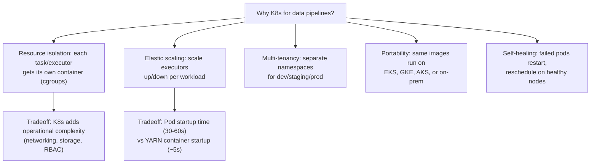

**Answer structure:**
```
Pros: Resource isolation, elastic scaling, portability, self-healing
Cons: Operational complexity, pod startup latency
Reality: Industry standard — everyone runs data infra on K8s
```

---

## 2. Docker — Deep Dive

### 2.1 Multi-Stage Build for Data Engineering

**Question:** *"Design a Dockerfile for a production PySpark job. Minimize image size and build time."*

```dockerfile
# Stage 1: Build dependencies
FROM python:3.11-slim AS builder

RUN apt-get update && apt-get install -y --no-install-recommends \
    openjdk-17-jre-headless \
    && rm -rf /var/lib/apt/lists/*

WORKDIR /build
COPY requirements.txt .

# Install with cache mounted for faster rebuilds
RUN --mount=type=cache,target=/root/.cache/pip \
    pip install --prefix=/install -r requirements.txt

# Stage 2: Runtime (minimal image)
FROM python:3.11-slim AS runtime

RUN apt-get update && apt-get install -y --no-install-recommends \
    openjdk-17-jre-headless \
    && rm -rf /var/lib/apt/lists/*

# Copy only installed packages from builder
COPY --from=builder /install /usr/local

WORKDIR /app
COPY src/ .

ENV SPARK_HOME=/opt/spark
ENV PYTHONPATH=/app

ENTRYPOINT ["spark-submit", "--master", "k8s://https://${K8S_API}", "main.py"]
```

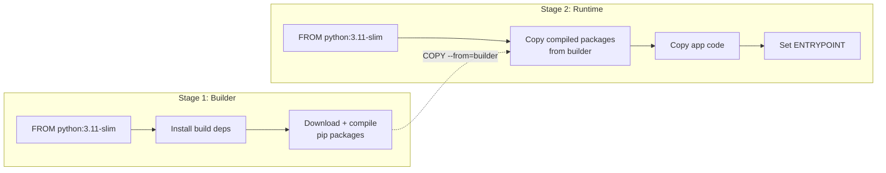

**Why multi-stage:**
- Builder stage has build tools (gcc, headers) — 200 MB+ of temp data
- Runtime stage copies only compiled artifacts — reduces image by 40-60%
- Cache mount on pip saves 30-60s per rebuild
- Result: ~500 MB vs ~1.2 GB for single-stage

### 2.2 Docker Layer Caching

**Question:** *"Your Docker build takes 5 minutes. How do you reduce it to under 1 minute?"*

```dockerfile
# Bad: source changes invalidate all subsequent layers
COPY . .
RUN pip install -r requirements.txt

# Good: dependencies layer is cached independently
COPY requirements.txt .
RUN pip install -r requirements.txt   # ← Cached if requirements.txt unchanged
COPY .                                 # ← Only this layer rebuilds on code changes
```

**Layer ordering rule:** Copy infrequently-changing dependencies first,
frequently-changing source code last.

### 2.3 Docker Compose for Local Dev

```yaml
version: '3.8'
services:
  zookeeper:
    image: confluentinc/cp-zookeeper:7.6
    environment:
      ZOOKEEPER_CLIENT_PORT: 2181

  kafka:
    image: confluentinc/cp-kafka:7.6
    depends_on: [zookeeper]
    ports: ["9092:9092"]
    environment:
      KAFKA_ADVERTISED_LISTENERS: PLAINTEXT://localhost:9092
      KAFKA_OFFSETS_TOPIC_REPLICATION_FACTOR: 1

  flink-jobmanager:
    image: flink:1.19-scala_2.12
    command: jobmanager
    ports: ["8081:8081"]
    environment:
      FLINK_PROPERTIES: "jobmanager.rpc.address: flink-jobmanager"
```

**Use for:** Local testing of Kafka/Flink/Spark pipelines without
installing anything. Not for production.

---

## 3. Kubernetes — Deep Dive

### 3.1 Architecture

**Question:** *"Draw the Kubernetes architecture. What happens when you run `kubectl apply -f deployment.yaml`?"*

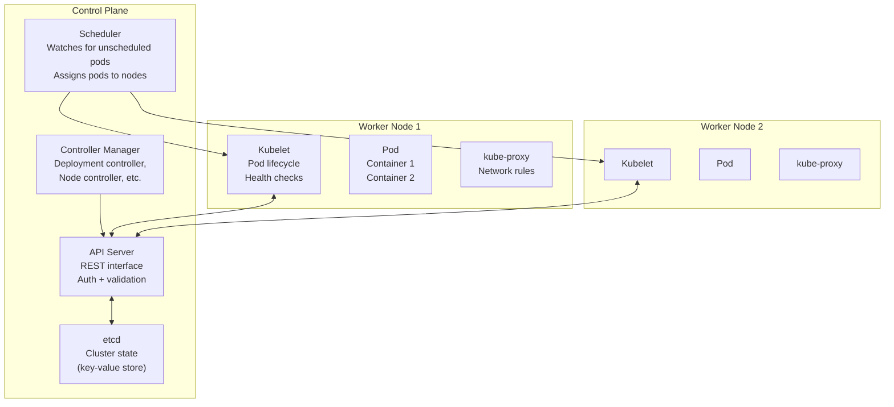

**Flow when deploying:**
```
1. kubectl apply → API Server validates and stores Deployment in etcd
2. Controller Manager detects desired replicas ≠ current → creates Pod objects
3. Scheduler watches for unscheduled pods → picks a node (filter + score)
4. Kubelet on selected node pulls image, starts containers
5. kube-proxy updates iptables/ipvs for Service networking
6. Controller Manager watches pod health → restarts if failed
```

### 3.2 Pod Lifecycle

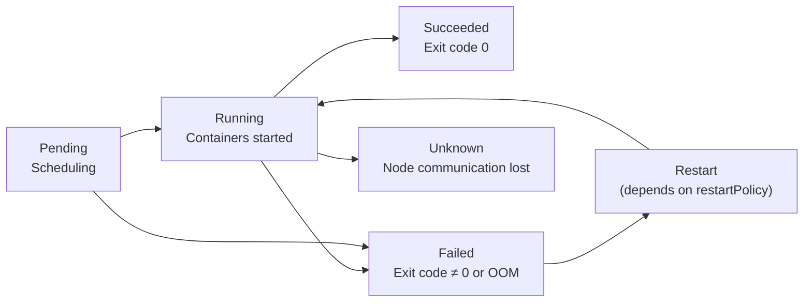

**Interview question:** "A Spark executor pod shows `OOMKilled`. What
does the pod status mean, and how do you fix it?"

```
Status:     OOMKilled (Exit Code 137)
Reason:     Container tried to use more memory than its limit
Fix steps:
1. Check `resources.limits.memory` in pod spec
2. Increase executor memory or memory overhead:
   --conf spark.executor.memory=8g
   --conf spark.executor.memoryOverhead=2g
3. Check for memory leak in UDFs or excessive data skew
4. Set requests = limits (Guaranteed QoS prevents eviction)
```

### 3.3 Resource Management (QoS Classes)

| QoS Class | requests vs limits | Eviction Priority | When to Use |
|---|---|---|---|
| **Guaranteed** | requests = limits for all containers | Lowest (last to evict) | Spark executors, Flink TaskManagers — critical workloads |
| **Burstable** | requests < limits for at least one container | Medium | Web servers, Airflow webserver — can tolerate temporary throttling |
| **BestEffort** | no requests or limits set | Highest (first to evict) | Batch jobs, CI runners — throwaway workloads |

```yaml
# Guaranteed QoS — for data pipeline critical workloads
resources:
  requests:
    memory: "8Gi"
    cpu: "2"
  limits:
    memory: "8Gi"
    cpu: "2"
```

### 3.4 Controller Types for Data Workloads

| Controller | Use | Example |
|---|---|---|
| **Deployment** | Stateless apps, rolling updates | Airflow webserver, Spark driver (client mode) |
| **StatefulSet** | Stateful apps, stable network identity | Kafka broker, Flink JobManager (needs stable DNS) |
| **DaemonSet** | One pod per node | Log collectors (Fluentd), monitoring agents |
| **Job** | Run-to-completion | Spark driver (cluster mode), batch ETL |
| **CronJob** | Scheduled jobs | Daily metadata refresh, compaction tasks |
| **Custom Resource (CRD)** | Application-specific lifecycle | FlinkDeployment, SparkApplication |

### 3.5 K8s Networking — How Spark Components Actually Talk

**Question:** *"Spark driver and executors run in different pods. How do they find and reach each other?"*

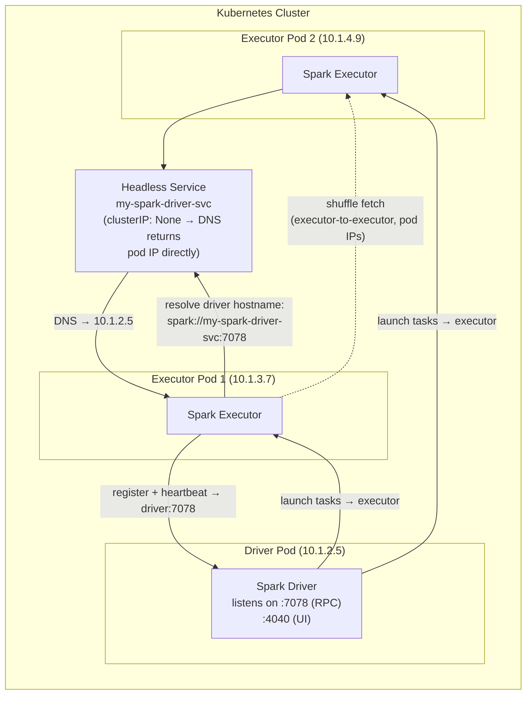

**Key networking facts for interviews:**

| Mechanism | What It Does | DE Relevance |
|---|---|---|
| **Pod IP (flat network)** | Every pod gets a routable IP cluster-wide | Executors reach each other directly for shuffle |
| **Headless Service** | `clusterIP: None` — DNS returns pod IPs, not a VIP | Spark auto-creates one for the driver so executors can resolve its pod IP |
| **Service (ClusterIP)** | Stable virtual IP load-balanced across pods | Airflow UI, Flink JobManager REST |
| **NetworkPolicy** | Firewall rules between pods/namespaces | Isolate prod pipelines from dev |
| **Ingress / LoadBalancer** | External access into the cluster | Exposing Spark UI / Flink Dashboard to engineers |

> [!TIP]
> Shuffle traffic is **pod-to-pod**, not through any service mesh hop.
> If your cluster runs a service mesh (Istio/Linkerd), ensure Spark
> namespaces are excluded — a proxy hop on every shuffle block can
> halve throughput.

---

## 4. Data Engineering on Kubernetes

### 4.1 Spark on K8s

**Question:** *"Explain the Spark on K8s execution model. How does dynamic allocation work?"*

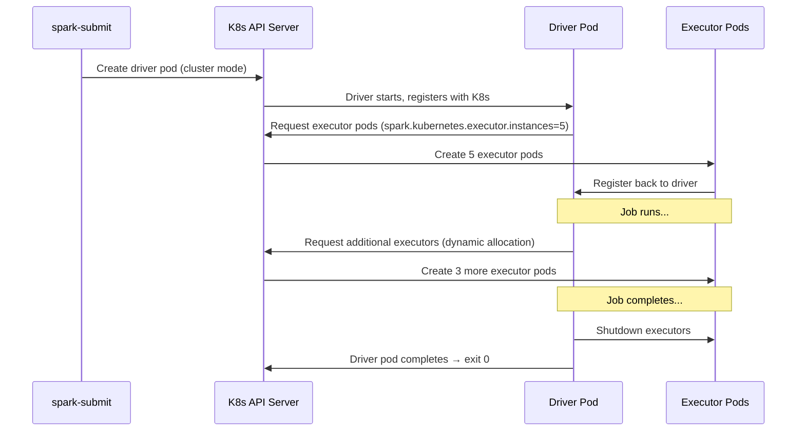

```bash
# Production Spark on K8s submission
spark-submit \
  --master k8s://https://${K8S_API_SERVER} \
  --deploy-mode cluster \
  --conf spark.kubernetes.container.image=myrepo/spark-job:latest \
  --conf spark.kubernetes.executor.instances=5 \
  --conf spark.dynamicAllocation.enabled=true \
  --conf spark.dynamicAllocation.maxExecutors=20 \
  --conf spark.executor.memory=8g \
  --conf spark.executor.instances=1 \
  --conf spark.kubernetes.executor.volumes.persistentVolumeClaim.checkpoint.mount.path=/checkpoint \
  --conf spark.kubernetes.executor.volumes.persistentVolumeClaim.checkpoint.options.claimName=spark-checkpoint \
  main.py
```

### 4.2 Airflow on K8s

**Question:** *"CeleryExecutor vs KubernetesExecutor — when do you use which?"*

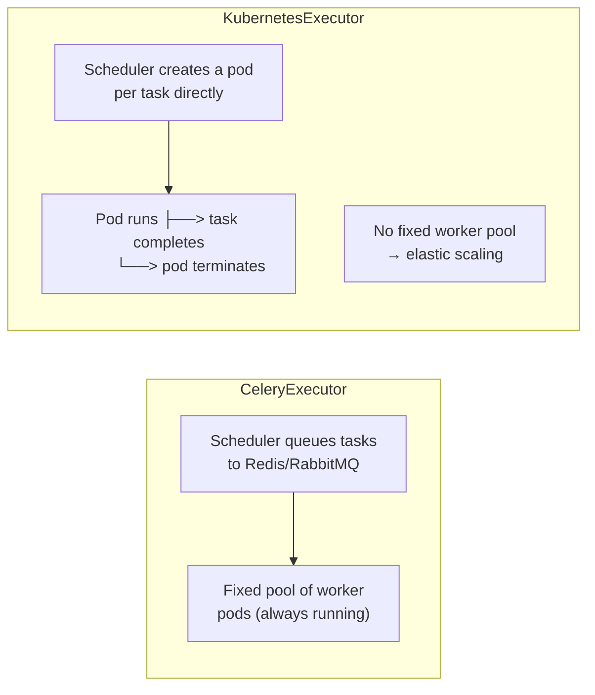

| Executor | Pros | Cons | When |
|---|---|---|---|
| **CeleryExecutor** | Low latency per task (pods pre-started), simpler resource management | Fixed worker pool (waste), hard to give different resources per task | Stable workloads, predictable task count |
| **KubernetesExecutor** | Per-task pod (isolated), elastic scaling (0 to N), different resource per task | Pod startup delay (30-60s), more K8s API calls | Variable workloads, tasks with different resource needs |

### 4.3 Flink on K8s

**Question:** *"How does the Flink Kubernetes Operator manage job lifecycle?"*

```yaml
# FlinkDeployment CRD — declarative job management
apiVersion: flink.apache.org/v1beta1
kind: FlinkDeployment
metadata:
  name: streaming-etl
spec:
  image: myrepo/flink-job:latest
  flinkVersion: v2_0
  flinkConfiguration:
    taskmanager.numberOfTaskSlots: "4"
    state.checkpoints.dir: s3://my-bucket/flink-checkpoints
    high-availability: org.apache.flink.kubernetes.highavailability.KubernetesHaServicesFactory
  job:
    jarURI: local:///opt/flink/usrlib/job.jar
    parallelism: 4
    upgradeMode: savepoint
    savepointTriggerNonce: 1
```

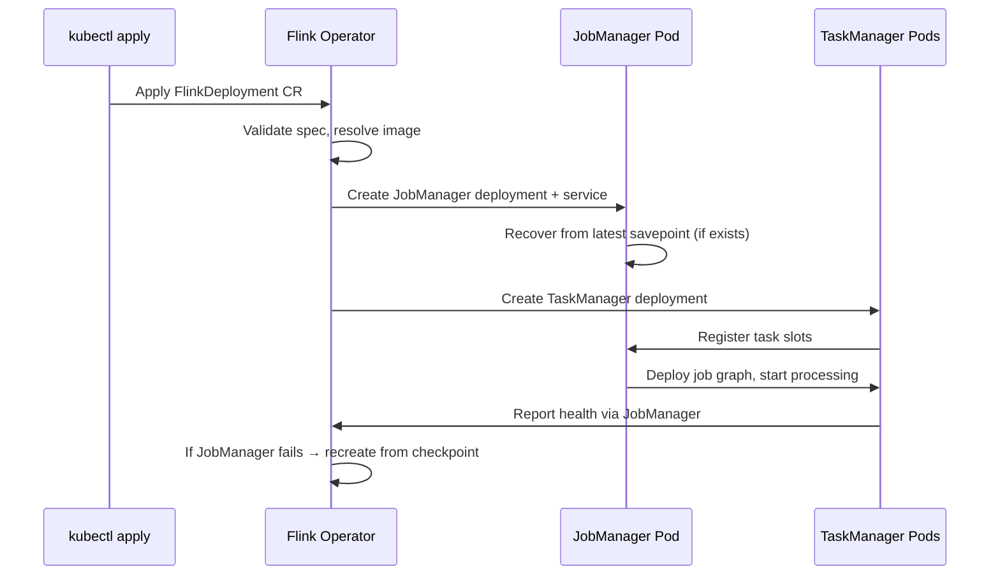

### 4.4 Pod Eviction and Graceful Shutdown

**Question:** *"Your nodes are being preempted (spot instances). How do you ensure zero data loss?"*

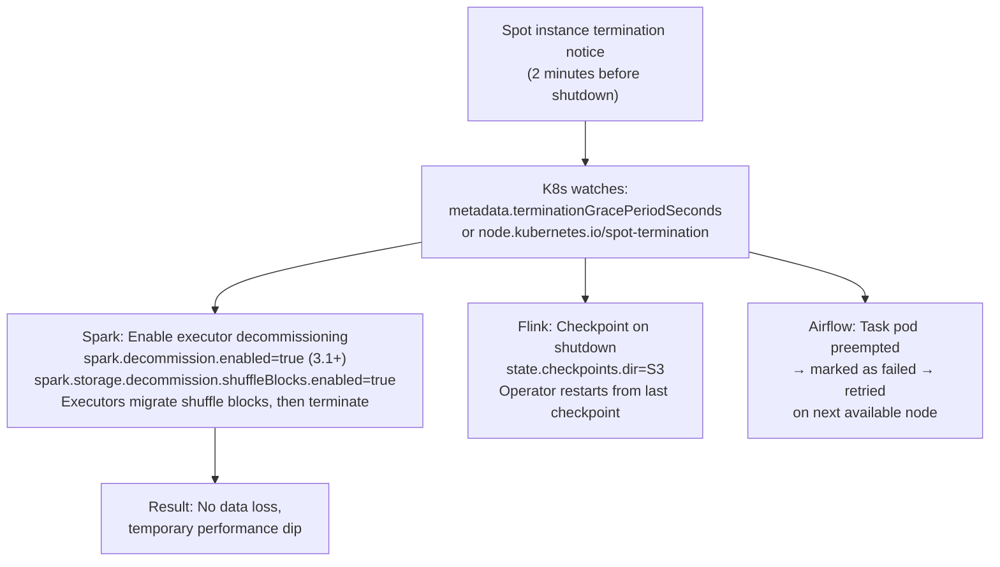

**K8s primitives for graceful shutdown:**
```yaml
# Pod spec
spec:
  terminationGracePeriodSeconds: 120  # Spark needs time to drain tasks
  containers:
  - name: spark-executor
    lifecycle:
      preStop:
        exec:
          command: ["/bin/sh", "-c", "graceful-stop.sh"]
```

---

## 5. Real Interview Questions

### Q1: "Your Airflow task runs on KubernetesExecutor and gets OOMKilled every 3 hours. Diagnose and fix."

**Diagnosis:**
```bash
# Check pod status
kubectl describe pod airflow-task-abc123
# → Last State: Terminated, Reason: OOMKilled, Exit Code: 137
```

**Root causes (in order of likelihood):**
1. Resource limits too low — `resources.limits.memory` < actual usage
2. Memory leak in task code (accumulating data in list/dict)
3. XCom picking up large data between tasks
4. Python process overhead not accounted for in pod resources

**Fix:**
```yaml
# Option 1: Increase memory limit (quick fix)
resources:
  requests:
    memory: "4Gi"    # Was 2Gi
    cpu: "1"
  limits:
    memory: "6Gi"    # Was 2Gi — allow burst
```

```python
# Option 2: Fix memory leak (permanent fix)
def my_task():
    results = []
    for chunk in large_data_generator():
        result = process(chunk)
        # results.append(result)          # ← Leak: keeps all results in memory
        yield result                       # ← Fix: stream results instead

# Option 3: Reduce XCom payloads
# Use Airflow's XCom return values for small data only (< 100 KB)
# For large data, write to S3 and pass the path
```

### Q2: "How do multi-stage Docker builds reduce image size for Spark jobs?"

**Before (single stage):** ~1.2 GB
```
Includes: OS, Python, Java JDK, build tools (gcc, make, headers),
pip cache, Spark jars, app code
```

**After (multi-stage builder pattern):** ~500 MB
```
Stage 1 (builder): OS + build tools + compile dependencies
Stage 2 (runtime): OS + Java JRE + compiled packages + app code
                    ↓ 60% smaller
```

### Q3: "You need 50 Spark executors for a 2-hour job. How many pods run concurrently?"

**Calculation:**
```
Spark executors:  50
Spark driver:     1
Total pods:       51 (50 executors + 1 driver)

But also:
- Dynamic allocation may add/remove executors
- Each executor is 1 pod with 1 container; for PySpark, the JVM spawns
  Python worker processes inside the same container (add memory headroom)
- K8s pod limits per node: ~30 pods for a large node (m5.4xlarge = 16 vCPU, 64 GB)

Node sizing:
  50 executors × 4 GB = 200 GB memory needed
  200 GB / 64 GB per node ≈ 4 nodes minimum
  Pod density: 50/4 ≈ 12 executors per node (well under 30 limit)
```

### Q4: "What happens during a rolling update of a Flink job on K8s?"

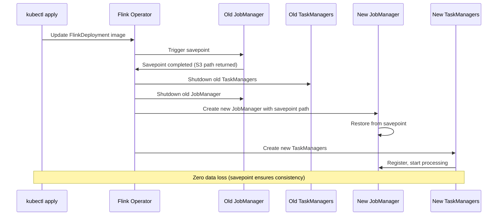

**Config for savepoint-based upgrade:**
```yaml
spec:
  job:
    upgradeMode: savepoint
    savepointTriggerNonce: <increment on each upgrade>
```

### Q5: "Design a local development environment for a Kafka + Flink pipeline without cloud resources."

```yaml
# docker-compose.yml
version: '3.8'
services:
  zookeeper:
    image: confluentinc/cp-zookeeper:7.6
  kafka:
    image: confluentinc/cp-kafka:7.6
    ports: ["9092:9092"]
    depends_on: [zookeeper]
    environment:
      KAFKA_OFFSETS_TOPIC_REPLICATION_FACTOR: 1
  schema-registry:
    image: confluentinc/cp-schema-registry:7.6
    depends_on: [kafka]
  flink-jobmanager:
    image: flink:1.19-scala_2.12
    command: jobmanager
    ports: ["8081:8081"]
  flink-taskmanager:
    image: flink:1.19-scala_2.12
    command: taskmanager
    depends_on: [flink-jobmanager]
    scale: 2
```

**Usage:** `docker compose up -d` → Flink UI at localhost:8081, produce
events via `kafka-console-producer`, submit SQL via Flink SQL Client.

### Q6: "Your K8s node has 16 CPU, 64 GB RAM. How many Spark executors should you run per node?"

**Calculation:**
```yaml
# K8s overhead per node:
system_reserved:   1 CPU, 4 GB
kubelet + kube-proxy: 0.5 CPU, 1 GB
Available:         14.5 CPU, 59 GB

# Spark executor config:
executor.memory:     8 GB
executor.cores:      4
memoryOverhead:      0.8 GB (max(10% × 8 GB, 384 MB) = 0.8 GB)
pyspark.memory:      0.5 GB (Python worker if PySpark)
Total per executor:  9.3 GB

# Pod resource per executor:
requests:          4 CPU, 8 GB
limits:            4 CPU, 9.3 GB (heap + overhead + Python)

# Executors per node (no driver on same node):
CPU:   14.5 / 4   = 3.6 → 3 (CPU bound)
Memory: 59 / 9.3  = 6.3 → 6
Limiting factor: CPU → 3 executors per node
Limiting factor: CPU → 3 executors per node

# Leave room for driver (if driver runs on worker nodes):
Total nodes for 50 executors: ceil(50 / 3) = 17 nodes
Plus 1 for driver → 18 nodes
```

> [!TIP]
> Always reserve 10-15% of node resources for system overhead.
> Don't pack executors to the absolute limit — leave headroom for
> dynamic allocation spikes and pod startup.

### Q7: "Pod is in CrashLoopBackOff. Walk me through debugging."

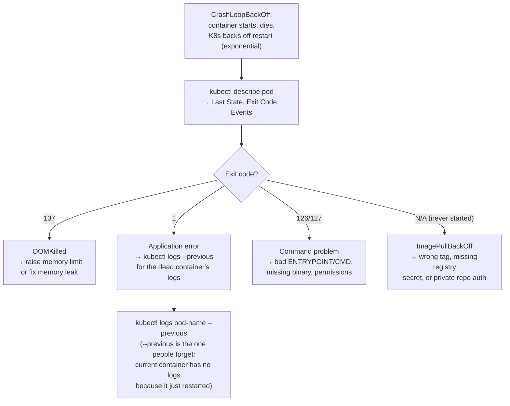

**The three commands that solve 90% of cases:**
```bash
kubectl describe pod <pod>          # events, exit code, last state
kubectl logs <pod> --previous       # logs from the crashed container
kubectl get events --sort-by=.lastTimestamp   # cluster-side story
```

### Q8: "Design CI/CD for a PySpark job that runs on K8s. Include testing and rollback."

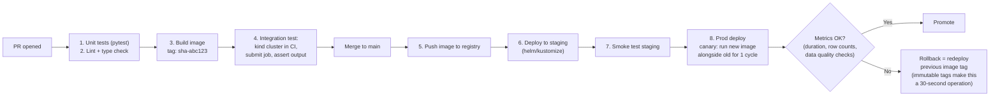

**Key principles:**
- **Immutable image tags** (git SHA, never `latest`) — rollback is redeploying the old tag
- **Data pipeline smoke tests** assert on *outputs* (row counts, null rates, freshness), not just "job succeeded"
- **Canary for batch** = run the new version on yesterday's data, compare outputs before swapping

### Q9: "A Flink job's checkpoints are timing out after you moved to K8s. Same job was fine on YARN. What changed?"

**Diagnosis:**
```
Checkpoint timeout = state snapshot didn't finish in time.

On K8s, the usual suspects:

1. Storage backend: YARN setup used HDFS (fast, local-ish).
   K8s setup points checkpoints at S3 with default s3a configs
   → small-file writes + no multipart tuning = slow uploads.
   Fix: state.backend=rocksdb (incremental), s3 multipart
   upload enabled, fs.s3a.fast.upload=true

2. CPU throttling: pod has limits.cpu = 2 but the TM was sized
   for 4 on YARN. RocksDB compaction + upload threads starve.
   Fix: kubectl describe pod → look for CPU throttling metrics;
   raise limits or reduce taskmanager.numberOfTaskSlots

3. Network: checkpoints cross availability zones or a NAT gateway
   with bandwidth caps.
   Fix: check pod/node AZ placement; endpoint in same region
```

**The K8s-specific insight:** "Same job, different platform" issues are
almost always **resource spec mismatches** (CPU limits throttle) or
**storage config differences** (HDFS locality vs S3 defaults), not the
platform itself.

---

## 6. Quick Reference — Interview Edition

| Question | Answer |
|---|---|
| **Why K8s for data pipelines?** | Resource isolation, elastic scaling, portability, self-healing |
| **Multi-stage build?** | Builder stage compiles deps → runtime stage copies only artifacts. 40-60% smaller images |
| **Layer caching?** | Copy requirements.txt first (stable), then source code (changes most) |
| **Guranteed QoS?** | requests = limits; last to evict; use for Spark/Flink executors |
| **Spark on K8s deployment?** | `--deploy-mode cluster` — driver runs as a pod, executors as separate pods |
| **Dynamic allocation?** | Driver requests/releases executors via K8s API based on workload |
| **KubernetesExecutor vs Celery?** | KE: per-task pod (elastic, isolated); CE: fixed pool (low latency, wasteful) |
| **Flink Operator?** | CRD managing savepoint-based upgrades, scaling, recovery |
| **Pod eviction handling?** | Graceful shutdown, checkpoint to durable storage, dynamic replacement |
| **OOMKilled diagnosis?** | Check pod status → reason: OOMKilled (137) → increase memory limit or fix memory leak |
| **Executors per node?** | CPU is usually the limit. Reserve 10-15% for system overhead |
| **Local dev without cloud?** | Docker Compose — ZK + Kafka + Schema Registry + Flink in one YAML file |
| **Driver-executor discovery?** | Headless service — Spark auto-creates it; DNS resolves driver pod IP |
| **Shuffle traffic path?** | Pod-to-pod direct. Keep Spark namespaces out of service mesh |
| **CrashLoopBackOff debug?** | `describe pod` (exit code) → `logs --previous` (crashed container's logs) |
| **Exit 137?** | OOMKilled — raise memory limit or fix leak |
| **CI/CD for Spark on K8s?** | Immutable SHA tags, output-asserting smoke tests, canary = rerun yesterday's data, rollback = old tag |
| **Checkpoints slow after K8s move?** | CPU throttling on pod limits, or S3 defaults vs HDFS locality — not the platform |
