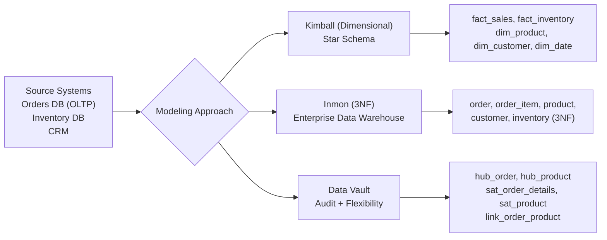
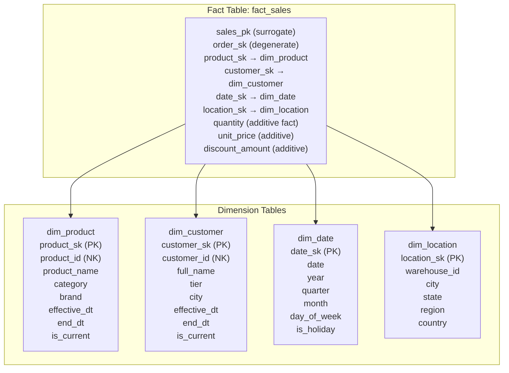
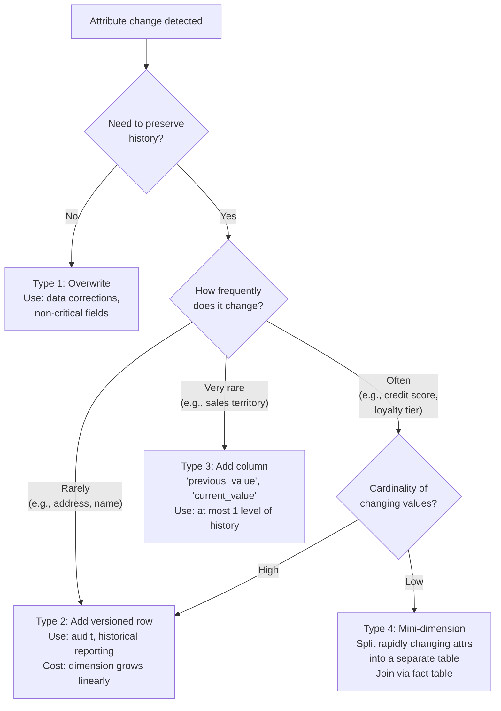
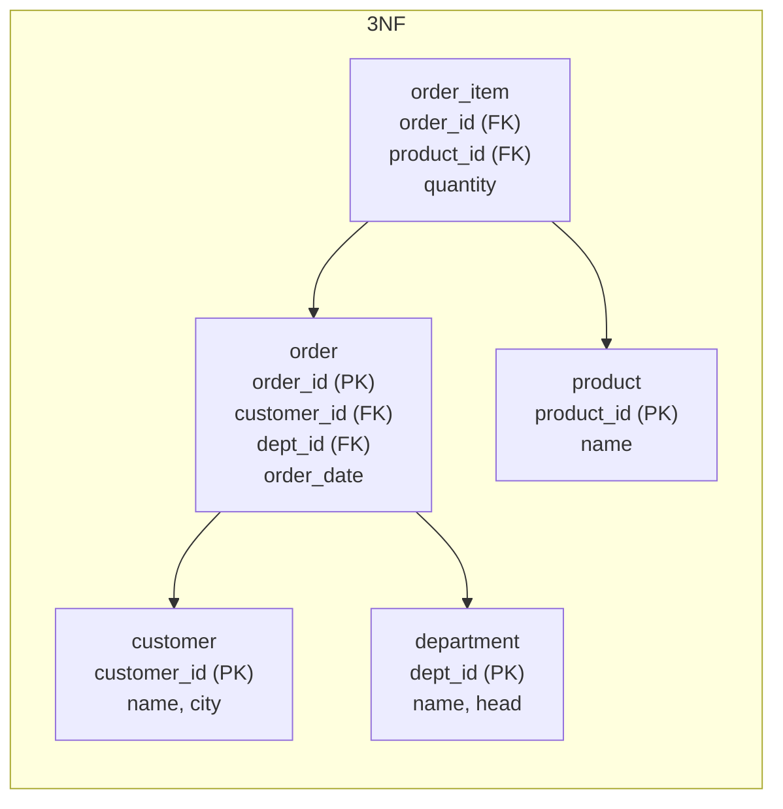
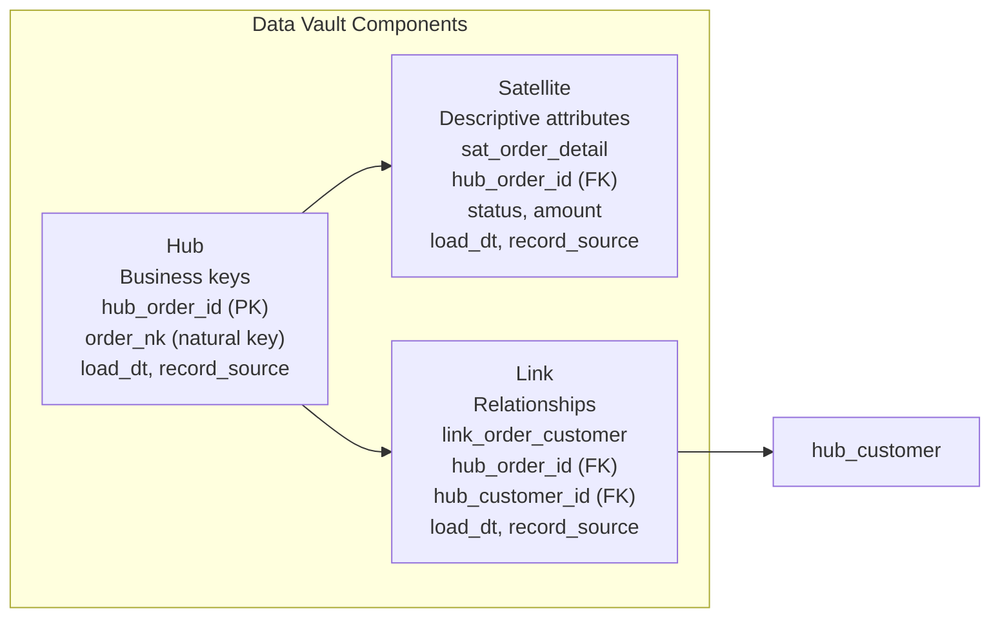
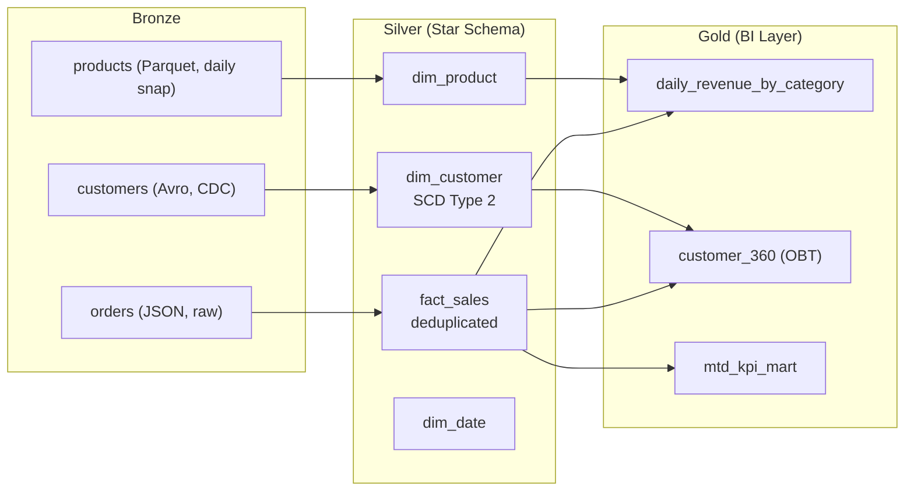
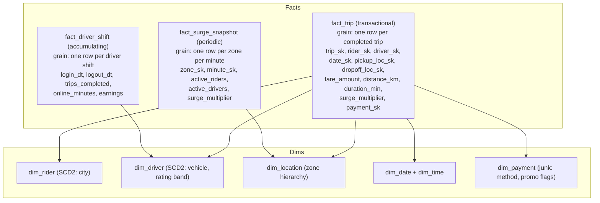
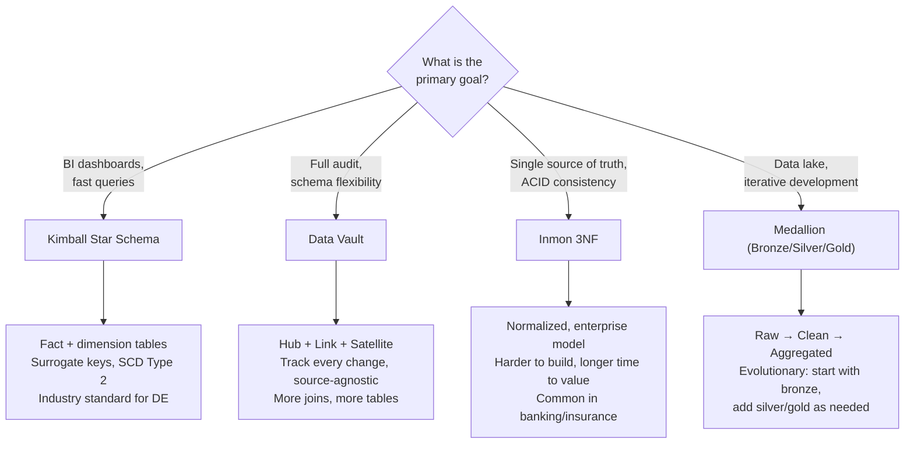

# Data Modeling — Interview Deep Dive

The most heavily tested design skill in DE interviews. Tests whether
you can translate business requirements into a structured, queryable,
and evolvable schema.

---

## 1. The Opening Question

**Question:** *"Design a data model for an e-commerce platform. The business needs: revenue by product category, customer lifetime value, and daily inventory levels."*



**Answer structure:**
```
1. Declare the grain: "one row per order line item" for fact_sales
2. Identify dimensions: product, customer, date
3. Identify facts: quantity, revenue, discount
4. Choose approach: Kimball (star) — fastest for BI, industry standard
5. Handle time: date dimension with date_key as FK
6. Handle changes: SCD Type 2 for customer address, Type 1 for corrections
```

---

## 2. Dimensional Modeling — Star Schema

### 2.1 Anatomy of a Star Schema

**Question:** *"Draw a star schema for an order system. Explain why it's structured this way."*



**Why this structure:**
- **fact_sales** is narrow (low row width) → fast aggregation scans
- **dimensions** are wide (many attributes, few rows) → cached in memory
- **Joins** are always 1 level (fact → dimension) → no multi-hop lookups
- **Surrogate keys** decouple warehouse from source system primary keys

### 2.2 Fact Table Types

| Type | Grain | Example | Additivity | When to Use |
|---|---|---|---|---|
| **Transactional** | One row per event | `fact_sales`: 1 row per order item | All facts additive | Most common — orders, clicks, log lines |
| **Periodic Snapshot** | One row per period per entity | `fact_monthly_inventory`: 1 row per product per month | Some facts (balance is semi-additive) | Inventory levels, account balances |
| **Accumulating Snapshot** | One row per process lifecycle | `fact_order_fulfillment`: 1 row per order with milestone dates | Date fields (not additive) | Order-to-delivery pipeline, loan processing |

**Grain declaration rule:** State the grain before building the model.

### 2.3 Dimension Types

| Type | Description | Example |
|---|---|---|
| **Conformed** | Shared across multiple fact tables | `dim_date`, `dim_customer` — same key in every fact |
| **Degenerate** | Fact table attribute with no separate dimension (usually an ID) | `order_number` stored directly in `fact_sales` |
| **Junk** | Low-cardinality flags grouped into one dimension | `dim_order_attributes`: `is_expedited`, `is_gift`, `has_coupon` |
| **Role-playing** | Same physical dimension used in different roles | `dim_date` joined as `order_date`, `ship_date`, `delivery_date` |
| **Shrunken** | Subset of a base dimension at a higher grain | `dim_product_category` (one row per category, rolled up from `dim_product`) |

---

## 3. Slowly Changing Dimensions

### 3.1 Type 2 — Full Implementation

**Question:** *"A customer moves from Mumbai to Delhi. The BI team needs to attribute past orders to Mumbai and future orders to Delhi. How do you model this?"*

**SQL implementation:**

```sql
-- Schema
CREATE TABLE dim_customer (
    customer_sk    INT IDENTITY(1,1) PRIMARY KEY,  -- Surrogate key
    customer_id    INT NOT NULL,                    -- Natural key from source
    full_name      VARCHAR(100),
    city           VARCHAR(50),
    tier           VARCHAR(20),
    effective_dt   DATE NOT NULL,                   -- When this version started
    end_dt         DATE,                             -- NULL = current version
    is_current     BIT DEFAULT 1,                    -- Query convenience
    CONSTRAINT uq_customer_version UNIQUE (customer_id, customer_sk)
);

-- Type 2 merge (run daily):
-- Step 1: Expire the current version of changed records
UPDATE dim_customer
SET end_dt = CURRENT_DATE - 1,
    is_current = 0
WHERE is_current = 1
  AND customer_id IN (
    SELECT c.customer_id
    FROM dim_customer c
    JOIN staging_customer s ON c.customer_id = s.customer_id
    WHERE c.is_current = 1
      AND (c.city != s.city OR c.tier != s.tier OR c.full_name != s.full_name)
  );

-- Step 2: Insert new version for changed records + new records
INSERT INTO dim_customer (customer_id, full_name, city, tier, effective_dt, end_dt, is_current)
SELECT
    s.customer_id, s.full_name, s.city, s.tier,
    CURRENT_DATE, NULL, 1
FROM staging_customer s
LEFT JOIN dim_customer c
    ON s.customer_id = c.customer_id AND c.is_current = 1
WHERE c.customer_sk IS NULL           -- new customer
   OR (c.city != s.city               -- or existing customer with attribute change
       OR c.tier != s.tier
       OR c.full_name != s.full_name);

-- Query for historical accuracy:
SELECT
    s.order_id,
    s.order_date,
    c.full_name,
    c.city AS customer_city_at_order_time
FROM fact_sales s
JOIN dim_customer c
    ON s.customer_sk = c.customer_sk;
-- c.city reflects the customer's city AS OF the order date
-- because the correct version was linked by customer_sk at load time
```

**Key insight:** The fact table links to the **specific version** of the
dimension (via surrogate key). The dimension tracks versions over time.
This means:
- Past queries always show correct historical attributes
- No need to rewrite fact rows when attributes change
- Query with `WHERE effective_dt <= query_date AND (end_dt IS NULL OR end_dt > query_date)` for point-in-time

### 3.2 SCD Decision Tree

**Question:** *"When do you use Type 1 vs Type 2 vs Type 3?"*



### 3.3 SCD Type 2 — Worked Example with Real Rows

**Question:** *"Show me the actual rows. Customer 42 moves Mumbai→Delhi on March 1. Orders happen Jan 15 (Mumbai) and Mar 10 (Delhi). What does the data look like?"*

**dim_customer after the move:**

| customer_sk | customer_id | full_name | city | effective_dt | end_dt | is_current |
|---|---|---|---|---|---|---|
| 101 | 42 | Asha Rao | Mumbai | 2024-01-01 | 2024-02-29 | 0 |
| 187 | 42 | Asha Rao | Delhi | 2024-03-01 | NULL | 1 |

**fact_sales (note: the fact row stores the SK valid at order time):**

| order_id | date_sk | customer_sk | amount |
|---|---|---|---|
| 9001 | 20240115 | **101** | 500.00 |
| 9150 | 20240310 | **187** | 720.00 |

**Query results:**

```sql
-- "Revenue by customer city" — historically correct, no extra work:
SELECT c.city, SUM(f.amount)
FROM fact_sales f JOIN dim_customer c ON f.customer_sk = c.customer_sk
GROUP BY c.city;

-- Mumbai: 500.00   (order 9001 → SK 101 → Mumbai)
-- Delhi:  720.00   (order 9150 → SK 187 → Delhi)
```

```sql
-- "Where did the customer live on 2024-02-01?" — point-in-time lookup:
SELECT city FROM dim_customer
WHERE customer_id = 42
  AND effective_dt <= '2024-02-01'
  AND (end_dt IS NULL OR end_dt > '2024-02-01');
-- → Mumbai
```

**The two lookup patterns interviews test:**
1. **As-was (default):** fact row's stored SK → the version valid when the event happened. No date filtering needed in the query.
2. **As-is (current view):** join on `customer_id` with `is_current = 1` → every historical order attributed to today's city. Use when the business wants current segmentation of historical facts.

> [!WARNING]
> The classic bug: joining fact to dimension on the **natural key**
> (`customer_id`) without an `is_current` or date filter — you get
> **row multiplication** (one fact row × N dimension versions).
> If your GROUP BY totals are suddenly 2-3x too big after an SCD
> attribute change, this is why.

---

## 4. Normal Forms — When to Normalize, When to Denormalize

**Question:** *"Walk me through 1NF, 2NF, 3NF violations in a denormalized table."*

### The Violations Example

```sql
-- Violates 1NF, 2NF, and 3NF:
CREATE TABLE orders_denormalized (
    order_id         INT PRIMARY KEY,
    customer_name    VARCHAR(100),
    customer_city    VARCHAR(50),
    product_ids      VARCHAR(200),       -- 1NF: comma-separated: "101,102,103"
    product_names    VARCHAR(500),       -- 1NF: "Keyboard,Mouse,Monitor"
    quantities       VARCHAR(100),       -- 1NF: "1,3,2"
    dept_name        VARCHAR(50),
    dept_head        VARCHAR(100),       -- 3NF: depends on dept_name, not order_id
    order_date       DATE
);
```

| Normal Form | Rule | Violation in This Table | Fix |
|---|---|---|---|
| **1NF** | Atomic values per cell, no repeating groups | `product_ids`, `product_names`, `quantities` contain multiple values | Extract to `order_item` table |
| **2NF** | 1NF + all non-key columns depend on the **full** composite key | If PK changed to `(order_id, product_id)`, `customer_name` depends only on `order_id` | Separate customer into its own table |
| **3NF** | 2NF + no transitive dependencies | `dept_head` depends on `dept_name`, not on PK | Separate department into its own table |

### After Normalization



### When to Denormalize for OLAP

| Scenario | Normalize (OLTP) | Denormalize (OLAP) |
|---|---|---|
| **Update frequency** | High (frequent inserts) | Low (periodic batch loads) |
| **Query pattern** | Point lookups, single-row | Aggregation, group-by, large scans |
| **Storage cost** | Minimize redundancy | Accept redundancy for speed |
| **Join depth** | Deep joins are OK | Prefer 1-level joins (star) |
| **Schema flexibility** | Strict (normalization reduces anomalies) | Looser (add columns easily) |

---

## 5. Data Vault Modeling

**Question:** *"Your source systems change schemas frequently. You need full audit history without rebuilding the warehouse every month. What modeling approach do you use?"*



| Component | What It Stores | Key Rules |
|---|---|---|
| **Hub** | Natural business keys (the "who/what") | No descriptive attributes; no foreign keys to other hubs |
| **Satellite** | Descriptive data (the "how/when/why") | Timestamped (load_dt); one satellite per natural key per source |
| **Link** | Many-to-many relationships between hubs | Only FKs to hubs + load_dt + record_source |

**When Data Vault wins:**
- Multiple source systems with different schemas
- Need full audit trail (every change tracked)
- Source schemas change frequently
- Parallel loading is a priority

**When it hurts:**
- Simple BI queries need 8-10 joins (mitigate with business vault / aggregation)
- More tables to manage (3-4x more than star schema)
- Steeper learning curve for analysts

---

## 6. Medallion Architecture (Lakehouse)

**Question:** *"Design a data model for a modern data lake."*

```
Bronze Zone (raw):     schema-on-read, Immutable, source-native format (JSON, Avro)
Silver Zone (cleaned): Deduped, validated, conformed → dims + facts (Parquet)
Gold Zone (aggregated): Business metrics, OBTs, pre-joined for BI (Parquet)
```



**One Big Table (OBT):** A wide denormalized table for BI tools:
```sql
CREATE TABLE customer_360_obt AS
SELECT
    c.customer_sk, c.full_name, c.tier,
    p.product_name, p.category,
    s.quantity, s.unit_price, s.discount_amount,
    d.date, d.year, d.month, d.quarter,
    l.city, l.state, l.region
FROM fact_sales s
JOIN dim_customer c ON s.customer_sk = c.customer_sk AND c.is_current = 1
JOIN dim_product  p ON s.product_sk = p.product_sk
JOIN dim_date     d ON s.date_sk = d.date_sk
JOIN dim_location l ON s.location_sk = l.location_sk;
```

> [!TIP]
> OBT is a delivery mechanism, not a storage format. Build Kimball
> star schema in silver, materialize OBT views in gold.

---

## 7. Real Interview Questions

### Q1: "Your star schema has 50 dimension tables. Most queries join 8-12 dimensions and take 2+ minutes. What do you do?"

**Diagnosis:**
- Too many dimensions per fact = narrow fact, many joins
- Dim tables are large (SCD Type 2 adds rows)
- Some dimensions could be junk or degenerate dimensions

**Fixes (in order of impact):**
1. Identify low-cardinality Boolean/flag columns → collapse into a **junk dimension**
2. Identify transaction IDs in the fact → **degenerate dimensions** (store in fact, no join)
3. Identify dimensions used only in gold layer → pre-join into an **OBT** for BI
4. If dim_customer has 100M rows (SCD Type 2), consider **Type 4 mini-dimension** for rapidly changing attributes

### Q2: "The data source added a new column `payment_method` with 3 values (card, upi, cod). Where does it go in the star schema?"

```mermaid
flowchart TD
    Q3["New column added: payment_method<br/>Cardinality: 3"]
    Q3 --> LOW{"Is this related to<br/>existing dimension?"}
    LOW -->|"Related to order"| JUNK["Option A: Add to junk dimension<br/>dim_order_attributes<payment_method, ...><br/>Best for: low-cardinality"""
    LOW -->|"Standalone"| NEW["Option B: New dimension<br/>dim_payment_method<br/>One row per method<br/>Best for: needs its own attributes (gateway, fees)"]
    LOW -->|"Already in fact"| DEG["Option C: Degenerate dimension<br/>Store payment_method code in fact<br/>Best for: rarely filtered, no extra attributes"]
```

### Q3: "Design a data model for a subscription business. Track monthly recurring revenue (MRR), churn, and customer lifetime value."

**Answer:**
1. **Fact tables:**
   - `fact_subscription` — transactional: one row per subscription event (start, renew, cancel)
   - `fact_mrr_snapshot` — periodic snapshot: one row per customer per month with MRR amount
   - `fact_churn` — accumulating snapshot: tracks the customer lifecycle with churn date, reactivation date
2. **Dimensions:** `dim_customer` (SCD Type 2 for tier changes), `dim_date`, `dim_plan` (plan name, price, billing cycle)
3. **Key metrics:**
   - MRR: `SUM(mrr_amount) WHERE is_active = 1 AND month = target_month`
   - Churn rate: `COUNT(DISTINCT churned_customers) / COUNT(DISTINCT active_customers_start_of_month)`
   - LTV: `SUM(revenue) / COUNT(DISTINCT customer_id)` for a cohort

### Q4: "What's wrong with using the source system's primary key as the dimension key in a warehouse?"

**Problems:**
1. **Reusability:** Same source key can mean different things across systems
2. **Type 2 SCD:** Source key remains the same, but you need multiple dimension rows
3. **Performance:** Source keys are often VARCHAR/GUID — slower for joins than INT
4. **Source changes:** If the source reuses keys (e.g., after data purge), warehouse gets corrupted

**Fix:** Always use a **surrogate key** (autoincrement INT or SEQUENCE) as the dimension
primary key. Store the natural/business key alongside it.

### Q5: "Your fact table has 5 billion rows. Adding a new dimension increases the load time by 3 hours. Why, and how do you fix it?"

**Cause:** Each new dimension FK in the fact table requires a lookup
(query or hash match) to resolve the source key → surrogate key for
every row. 5B lookups = expensive.

**Fixes:**
```
1. Optimize lookup: Use a lookup dictionary (loaded into memory)
   or pre-join in the ETL stage
2. Batch the lookups: Do a single JOIN in SQL instead of row-by-row
3. Use hash keys: If surrogate keys are hash of natural key, no lookup needed
   (but this makes SCD Type 2 harder)
4. Partition the load: By date range, parallelize the lookups
5. Consider degenerate dimension: If the dimension stores only an ID
   with no extra attributes, keep it in the fact table
```

### Q6: "Your business analyst wants to filter by 'customer email domain' and 'product category' in the same dashboard. How does the query plan work?"

```sql
SELECT d.email_domain, p.category, SUM(s.amount)
FROM fact_sales s
JOIN dim_customer c ON s.customer_sk = c.customer_sk
JOIN dim_product p ON s.product_sk = p.product_sk
JOIN dim_date d ON s.date_sk = d.date_sk
WHERE d.year = 2024
GROUP BY d.email_domain, p.category;
```

**Query plan (columnar database):**
1. **Prune:** `d.year = 2024` → zone map on dim_date.year skips irrelevant date partitions
2. **Join date→sales:** Filtered dim_date (365 rows) joined to fact_sales (5B rows) via hash table on date_sk
3. **Join customer→sales:** Hash match on customer_sk
4. **Join product→sales:** Hash match on product_sk
5. **Aggregate:** `GROUP BY email_domain, category` → hash aggregation
6. **Not bottlenecked** by join count because facts are on the probe side of hash joins, and dimensions are build-side (smaller)

### Q7: "Design a data model for a ride-sharing platform (Uber). Business needs: driver earnings reports, rider trip history, and surge-pricing analysis."

**Answer:**



**Why three fact tables:** each business question has a different grain.
Forcing surge analysis into fact_trip fails (surge exists even when no
trip completes). Driver earnings per shift needs the accumulating
snapshot because milestones (login→first trip→logout) are the analysis
unit.

### Q8: "fact_sales grows 2 billion rows/year. How do you partition and cluster it?"

**Answer:**
```
1. Partition by date (day or month) — aligns with:
   - Query filters (WHERE order_date >= ...)
   - Retention (drop old partitions, not DELETE)
   - Backfills (rewrite one partition, not the table)

2. Cluster/sort by the next-most-filtered column:
   - Snowflake: clustering key on (customer_id) if point lookups
     by customer dominate
   - Redshift: SORTKEY (order_date, region)
   - BigQuery: partition by date + cluster by customer_id
   - Iceberg: partition by days(order_ts), sort within by customer_id

3. Row-size check: 2B rows × ~200 bytes = 400 GB/year.
   At day-partition grain: ~1.1 GB/partition/day — healthy.
   Month partitions (33 GB) also fine; avoid year (too coarse for
   pruning + retention).
```

> [!TIP]
> Interview rule: **partition by what's filtered AND what maps to your
> retention/backfill boundary** — almost always a date column. Cluster
> by the second most selective filter. Never partition by a
> high-cardinality column (millions of partitions = metadata collapse).

### Q9: "Give me a real example where snowflake schema beats star in production."

**Answer:** Legitimate snowflake cases:

1. **Large shared sub-dimension:** `dim_product` has 50M rows; a
   `dim_brand` attribute set repeats identically across 10K products
   each. Normalizing brand out saves real storage AND makes brand-level
   renames one-row updates instead of 10K-row updates (brand correction
   happens more than you'd think after acquisitions).

2. **Hierarchy navigation:** Geography `city → state → country → region`
   with different teams owning different levels, and level-specific
   attributes (country has currency, region has sales VP). One wide
   dim_location forces all attributes onto every city row.

3. **Conformance across grains:** `dim_date` facts join at day grain,
   but `fact_budget` is monthly. A `dim_month` snowflaked off
   `dim_date` lets budget join at its true grain instead of a
   fake "first day of month" hack.

**The honest caveat:** BI tools generate uglier SQL over snowflake,
and joins multiply. Default to star; snowflake only when a *measured*
storage/update cost justifies it.

---

## 8. Decision Tree — Model Selection



---

## 9. Quick Reference — Interview Edition

| Question | Answer |
|---|---|
| **Default warehouse approach?** | Kimball (dimensional) — star schema, SCD Type 2, surrogate keys |
| **Grain declaration?** | State the grain before building: "one row per order line item" |
| **Fact types?** | Transactional (events), Periodic Snapshot (end-of-period), Accumulating Snapshot (lifecycle) |
| **Dimension types?** | Conformed (shared), Degenerate (in fact), Junk (flags), Role-playing (multiple roles) |
| **SCD Type 2 implementation?** | Surrogate key + effective_dt + end_dt + is_current column; MERGE on natural key match |
| **When to normalize?** | OLTP, operational reporting, compliance-heavy domains |
| **When to denormalize?** | OLAP, BI tools, wide tables for dashboard performance |
| **Data Vault when?** | Multiple source systems, changing schemas, full audit trail |
| **Medallion architecture?** | Bronze (raw) → Silver (cleaned/deduped/star) → Gold (aggregated/OBT) |
| **Surrogate key vs natural key?** | Surrogate in warehouse (always), natural in source (decouples warehouse from source) |
| **Lots of small dimensions?** | Collapse into junk dimension or degenerate in fact |
| **New column in source?** | Add to existing dimension (if related), new dim (if standalone), or junk (if low cardinality) |
| **SCD row multiplication bug?** | Joined on natural key without is_current/date filter — always join fact→dim on surrogate key |
| **As-was vs as-is?** | As-was: fact's stored SK (default). As-is: join natural key + is_current=1 |
| **Fact partitioning?** | Partition by date (matches filters + retention + backfills), cluster by 2nd filter column. Never partition by high-cardinality column |
| **Multiple business questions?** | One fact table per grain — don't force different grains into one table |
| **When snowflake?** | Measured cost of giant repeated sub-dimensions, owned hierarchies, multi-grain conformance. Default star |
