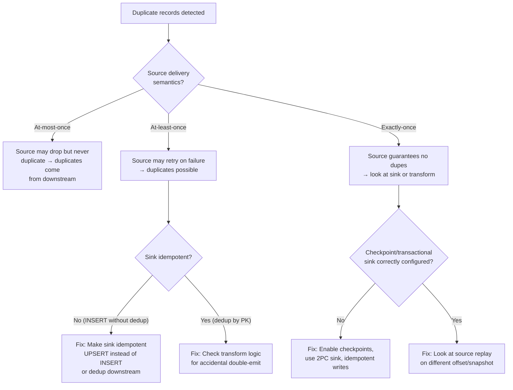
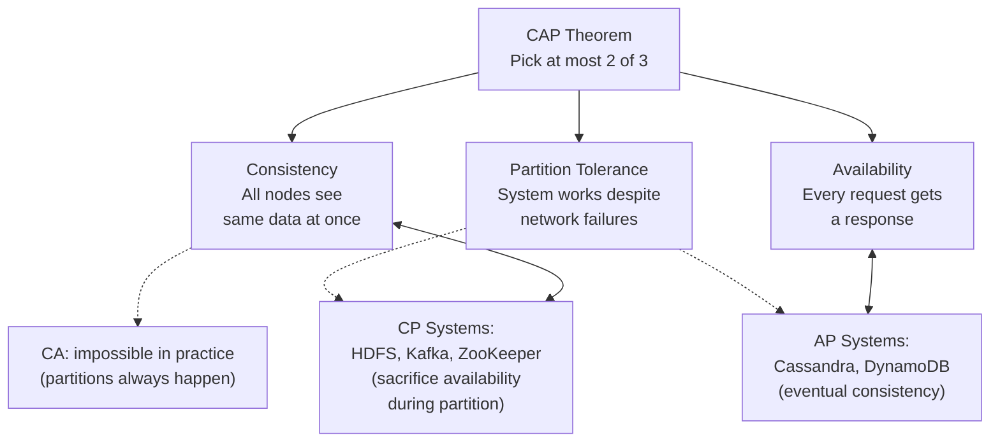
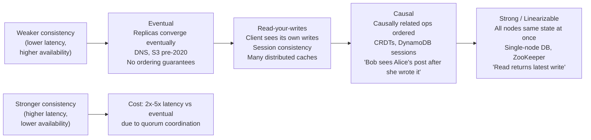
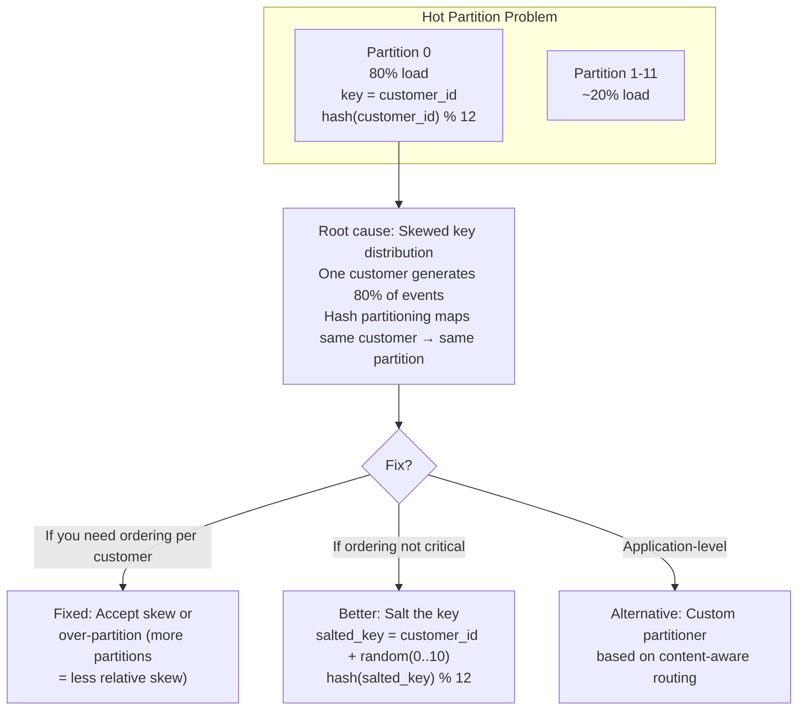
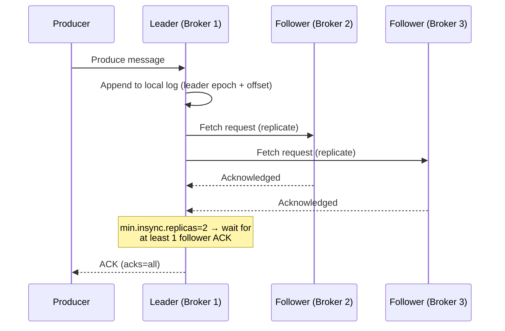
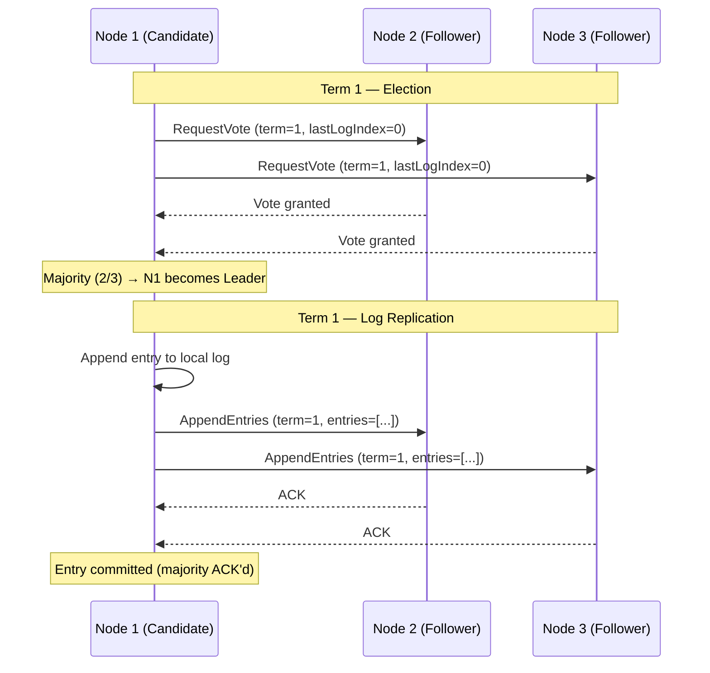
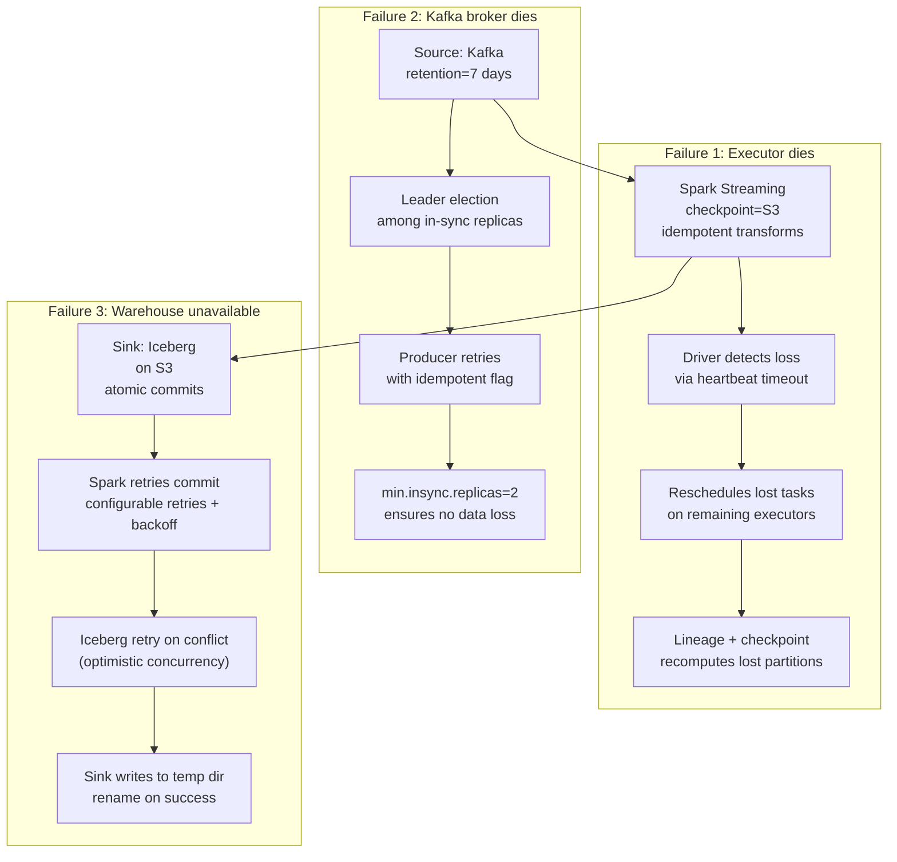
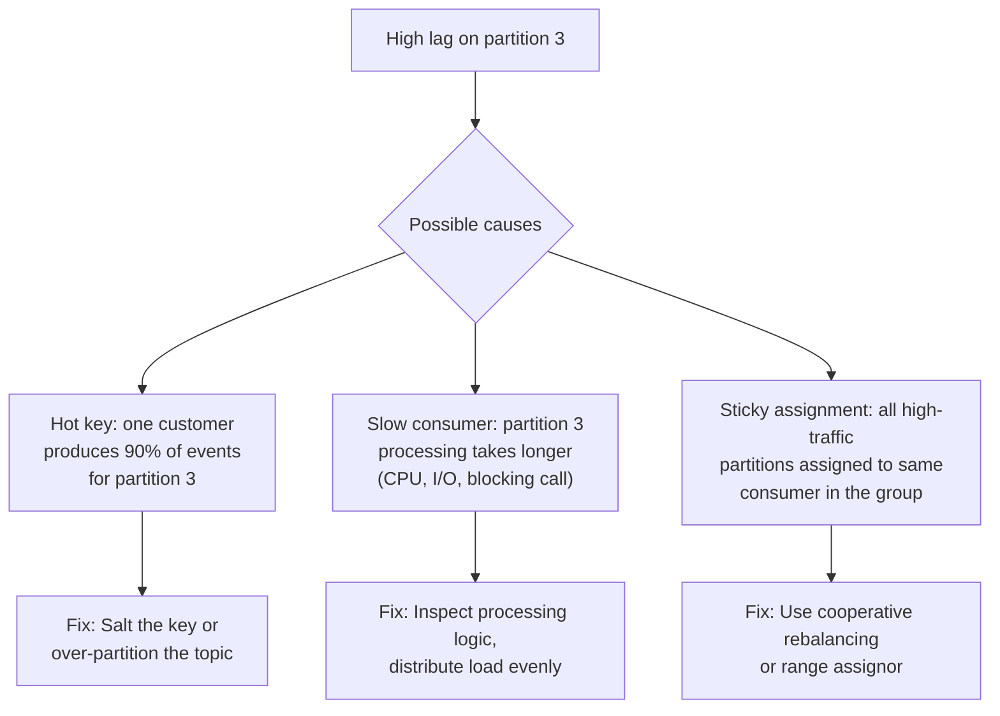
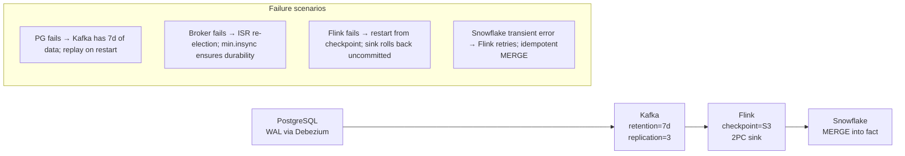

# Distributed Systems for Data Engineers — Interview Deep Dive

Every data pipeline is a distributed system. Understanding CAP,
consistency models, replication, and consensus is essential for
debugging production failures and designing reliable pipelines.

---

## 1. The Opening Question

**Question:** *"Your pipeline produced duplicate records today. How would you diagnose and fix it?"*



**Answer structure (DE interview version):**
```
1. Duplicates come from at-least-once delivery + non-idempotent sink
2. Fix the sink: UPSERT instead of INSERT, or deduplicate in staging
3. Long-term: use exactly-once sinks (2PC for Flink, idempotent for Kafka)
4. Monitor: track dedup ratio as a data quality metric
```

---

## 2. CAP Theorem

### 2.1 The Diagram

**Question:** *"Explain CAP theorem. Where does your pipeline's storage system fall?"*



**Real-world DE examples:**

| System | Category | What It Sacrifices | What Happens in a Partition |
|---|---|---|---|
| **HDFS** | CP | Availability (NameNode failover blocks all writes) | Metadata operations blocked until new NameNode elected |
| **Kafka** | CP | Availability (lose one replica + ISR requirement → partition unavailable) | Partition unavailable until ISR restored |
| **S3 (current)** | CP | Availability (very rare, strongly consistent) | 5xx errors for writes during severe partition |
| **Cassandra** | AP | Consistency (eventual reads) | Reads continue, stale data possible |
| **DynamoDB (default)** | AP | Consistency (eventual reads, opt-in strong) | Reads always succeed, may return stale |

> [!WARNING]
> CAP is a simplification for interviews. Real systems are **PA/EL**
> (Available during partition + Eventually Consistent) or **PC/EC**
> (Consistent during partition + tolerate unavailability). Always
> ask: *What happens during a network partition?*

### 2.2 CAP in Pipeline Design

**Question:** *"You're designing a payment reconciliation pipeline. Which CAP tradeoff do you make?"*

```
Payment pipeline: Must be consistent (no double-charge, no missing credit)
→ CP system: Kafka with acks=all + min.insync.replicas=2
→ If broker fails, partition is unavailable until ISR restored
→ Accept temporary unavailability over incorrect balance

Real-time dashboard: Must be available (show something on screen)
→ AP system: Cassandra or DynamoDB
→ If partition, show stale data (eventual consistency)
→ Accept stale data over blank dashboard
```

---

## 3. Consistency Models

### 3.1 Spectrum

**Question:** *"Explain the difference between eventual, causal, and strong consistency in terms of what a user sees."*



### 3.2 Consistency in DE Components

| Component | Model | Interview Answer |
|---|---|---|
| **S3 (since Dec 2020)** | Strong (read-after-write) | "Before Dec 2020, we had to write to a new key, then rename. Now we can overwrite safely." |
| **Kafka** | Strong per partition | "Within a partition, messages are totally ordered. Across partitions, no ordering guarantee." |
| **Snowflake** | Strong within warehouse | "Query always reads committed state. Cross-region replication is async." |
| **Iceberg** | Snapshot isolation | "Reader sees a consistent snapshot. Writer commits atomically via catalog CAS." |
| **Spark lineage** | Strong on recompute | "Lost partition is deterministically recomputed from lineage (if transformations are pure)." |
| **Flink checkpoint** | Exactly-once | "Checkpoint + 2PC commit: source offsets, operator state, sink writes are atomic." |

---

## 4. Partitioning / Sharding

### 4.1 Strategies

**Question:** *"A Kafka topic with 12 partitions has one partition receiving 80% of the traffic. What's wrong and how do you fix it?"*



### 4.2 Partitioning in Data Systems

| System | Mechanism | Control | Rebalancing |
|---|---|---|---|
| **Kafka** | Hash of key % partition count | Producer key, custom partitioner | Partition reassignment (cluster admin) |
| **Spark** | Hash shuffle via `repartition(n)` | `repartition()`, `coalesce()`, `partitionBy()` | On every shuffle (AQE auto-tunes) |
| **Flink** | `keyBy()` → hash partitioning | `keyBy()`, `partitionCustom()` | On savepoint-based rescaling |
| **HDFS** | Block-based (128 MB blocks) | `dfs.block.size` | Namenode manages block locations |
| **Trino/Presto** | Hash distributed via exchange | `DISTRIBUTE BY`, `PARTITION BY` | Per-query |

### 4.3 Skew Mitigation

| Technique | How | When |
|---|---|---|
| **Salting** | Append random prefix to key before hash | High-cardinality natural key with single hot value |
| **Over-partitioning** | Use more partitions than nodes | Skew is diffuse (many slight hot spots) |
| **Range partitioning** | Split data by value range | Naturally ordered data (dates, IDs) with uniform distribution |
| **Adaptive (AQE)** | Spark coalesces small partitions at runtime | Post-shuffle skew detected from runtime stats |
| **Two-phase aggregation** | Partial agg with salt → remove salt → final agg | Aggregation on skewed keys |

---

## 5. Replication

### 5.1 Strategies

**Question:** *"How does Kafka replicate data across brokers? What's the minimum configuration for durability?"*



**Durability configuration:**
```ini
# Kafka broker config
min.insync.replicas=2        # Minimum replicas that must ACK
default.replication.factor=3 # Total replicas

# Producer config
acks=all                     # Wait for all in-sync replicas
```

**What happens during broker failure:**
- Leader fails → one follower with latest LEO (Log End Offset) becomes leader
- Un-acked messages from old leader are lost if they weren't replicated
- `min.insync.replicas=2` means if 2 of 3 brokers are up, writes succeed
- If only 1 broker is up, writes fail (unavailable) — CP tradeoff

### 5.2 Quorum Math

**Question:** *"You have 5 Cassandra nodes with RF=3. Set W and R for strong consistency vs eventual consistency."*

```
N = number of replicas = 3
W = write quorum (nodes that must ACK write)
R = read quorum (nodes that must respond to read)

Strong consistency: W + R > N
  Example: W=2, R=2 → 2+2=4 > 3 ✓

Eventual consistency: W + R <= N
  Example: W=1, R=1 → 1+1=2 < 3 (reads may miss latest write)

Typical production: W=2, R=2 (3-way replication, strong)
Fast reads: W=2, R=1 (stale reads possible)
Fast writes: W=1, R=3 (write may not be seen by all readers)
```

---

## 6. Consensus — Raft

**Question:** *"Explain how Kafka KRaft works. How does it differ from ZooKeeper-based consensus?"*



| Aspect | ZooKeeper (Zab) | KRaft (Raft) |
|---|---|---|
| Metadata storage | External ZK cluster | Internal topic `__cluster_metadata` |
| Controller election | ZK leader election | Raft-based within controller quorum |
| Scalability limit | ~100K partitions | 1M+ partitions (no ZK bottleneck) |
| Operational complexity | Two systems to manage (ZK + Kafka) | Single system |
| Availability during ZK outage | Kafka unavailable | No single point of failure |

> [!TIP]
> KRaft (KIP-500) is production-ready since Kafka 3.5+ and the default
> in Kafka 4.0. Interview answer: "KRaft removes the ZooKeeper dependency
> by using Raft consensus directly in Kafka controllers, improving
> scalability and operational simplicity."

---

## 7. Failure Handling in Data Pipelines

### 7.1 Failure Scenarios by System

| System | Failure Type | Recovery Mechanism | Data Loss Risk |
|---|---|---|---|
| **Spark** | Executor loss | Rerun lost tasks from lineage (recomputation) | None (if deterministic) |
| **Flink** | TaskManager loss | Restart from checkpoint (operator state + source offsets) | None (with exactly-once sink) |
| **Kafka** | Broker loss | Follower → leader election, ISR adjustment | Acknowledged data safe; in-flight data lost |
| **Iceberg** | Writer failure | Optimistic concurrency → retry commit; partial files cleaned up | None (atomic commits) |
| **S3** | Regional outage | Cross-region replication (CRR) | Asynchronous; recent objects may be lost |

### 7.2 Pipeline Design for Failure

**Question:** *"Design a data pipeline that survives a Spark executor failure, a Kafka broker failure, and a warehouse outage — all at the same time."*



**Key design principles:**
1. **Idempotent transforms**: Rerunning a task produces the same output
2. **Checkpoint durable state**: Store checkpoints where they survive node loss (S3, not local disk)
3. **Retry with backoff**: Every component must retry transient failures
4. **Dead letter queue**: Captures records that fail beyond retry limit
5. **Alert on retry exhaustion**: Don't silently lose data

---

## 8. Real Interview Questions

### Q1: "Explain how Spark's lineage provides fault tolerance without replication."

**Answer:** Spark does NOT replicate data in memory. If an executor dies,
its in-memory data is lost. Recovery:
1. The driver detects executor loss via heartbeat timeout
2. It identifies which partitions were lost
3. It re-runs the **lineage graph** (the DAG of transformations) from
   the last checkpoint or source data for those partitions
4. New tasks are scheduled on surviving executors

**Cost:** Recomputation time. Mitigated by checkpointing at shuffle
boundaries (truncating lineage).

### Q2: "Your Kafka consumer reads from 12 partitions. One partition has higher lag than the others. What's the root cause?"



### Q3: "Does exactly-once semantics exist in distributed systems?"

**Answer:** Exactly-once is achievable end-to-end, but it requires
coordination at every stage:

```
Source:      Kafka with idempotent producer + transactions
                    ↓    (read_committed isolation)
Transform:   Flink checkpointing or Spark Structured Streaming
           (transactional state backend, e.g., RocksDB)
                    ↓
Sink:        Two-phase commit (Kafka, Iceberg, JDBC with XA)
```

**What can break it:**
- Inconsistencies in the 2PC coordinator (rare, but possible)
- Sink that doesn't support idempotent writes
- Custom non-deterministic transforms (e.g., `random()`, current timestamp)

**Interview answer:** "Exactly-once is theoretically possible but
requires every component in the pipeline to support it. In practice,
most pipelines run at-least-once with idempotent sinks, which gives
the same result as exactly-once."

### Q4: "How did S3 strong consistency (Dec 2020) change pipeline design?"

**Before Dec 2020 (eventual consistency):**
```python
# Had to use this pattern to avoid reading stale data:
obj = s3.put_object(Bucket='bucket', Key='tmp/data.parquet')
s3.copy_object(Bucket='bucket', CopySource='bucket/tmp/data.parquet', Key='data.parquet')
s3.delete_object(Bucket='bucket', Key='tmp/data.parquet')
# Because a LIST after the PUT might not show the object, and
# a GET after the overwrite might return the old version
```

**After Dec 2020 (strong consistency):**
```python
# Simple overwrite works:
s3.put_object(Bucket='bucket', Key='data.parquet', Body=data)
# Immediately readable. LIST shows it. No stale reads.
```

**Impact:** Simplified pipeline code: no write-then-rename patterns,
no eventual consistency delays in athena/EMR. Most documentation
written pre-2020 contains workarounds that are no longer needed.

### Q5: "Design a fault-tolerant CDC pipeline from PostgreSQL to Snowflake."



### Q6: "You have 100 TB of data across 1,000 partitions in Hive. One partition is 50 TB (skew). How do you fix it?"

**Diagnosis:**
```
Partition by date (yyyy-mm-dd):
  2024-01-01: 50 TB  ← 50% of all data, probably a backfill or bulk load
  2024-01-02: 20 GB
  2024-01-03: 15 GB
  ... 997 other partitions: 50 TB
```

**Fixes (in priority order):**
1. **Re-partition by a higher-cardinality key** (e.g., `customer_id % 1000 + date`)
   to distribute the large partition
2. **Sub-partition** the hot partition by an additional dimension (e.g.,
   `dt=2024-01-01/country=US/`)
3. **Use a bucketed table** in Hive: hash the key into N buckets within
   each partition
4. **If the skew is temporary** (one-time backfill): create a separate
   table for the large partition, union queries across both

---

## 9. Quick Reference — Interview Edition

| Question | Answer |
|---|---|
| **Deduplicate pipeline?** | At-least-once + non-idempotent sink. Fix: UPSERT or dedup in staging |
| **CAP for Kafka?** | CP — consistent during partition, unavailable if ISR drops below min.insync |
| **CAP for Cassandra?** | AP — available during partition, eventually consistent |
| **S3 consistency?** | Strong since Dec 2020 (read-after-write). Legacy write-then-rename no longer needed |
| **Exactly-once real?** | Requires every component to support it. Most production: at-least-once + idempotent sink |
| **Skew fix?** | Salt the key (add random prefix before hash) or over-partition |
| **Kafka durability?** | `acks=all`, `min.insync.replicas=2`, `replication.factor=3` |
| **Spark fault tolerance?** | Lineage recomputation (no replication). Checkpoint truncates lineage |
| **Flink fault tolerance?** | Checkpoint + 2PC commit to sink. Restart rolls back uncommitted |
| **ZooKeeper vs KRaft?** | KRaft (Raft) replaces ZK: no external system, scales to 1M+ partitions |
| **Strong vs eventual?** | Cost: 2-5x latency for strong. Use strong for money, eventual for dashboards |
| **Hot partition fix?** | Salt the key, over-partition, or custom partitioner |
