# File Formats for Data Engineers — Interview Deep Dive

The format question comes in every DE interview at some angle: sizing,
compression, evolution, performance. This file covers the internals
**through the lens of real interview questions** with diagrams, worked
examples, and decision frameworks.

---

## 1. The Big Picture — When to Pick What

> [!NOTE]
> This is the most common opening question in DE interviews.

**Question:** *"Design a storage strategy for a new data platform. What format do you use for each zone?"*

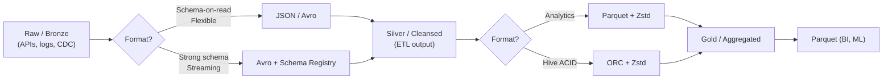

**Answer structure:**
```
Bronze (raw):   JSON (schema-on-read, flexible) or Avro (if you have a registry)
Silver (clean): Parquet (column pruning, predicate pushdown, Snappy/Zstd)
Gold (agg):     Parquet (same — optimized for BI tools)
Kafka messages: Avro (schema evolution, compact binary)
```

---

## 2. Parquet — The Analytics Workhorse

### 2.1 Physical Layout (Draw This on the Whiteboard)

**Question:** *"Draw the internal structure of a Parquet file and explain how Spark uses it to skip data."*

```
File: [PAR1] [Row Group 1] [Row Group 2] ... [ColumnIndex + OffsetIndex per RG] [FileMetaData (Thrift)] [footer_len: 4B] [PAR1]
         ▲                    ▲                                           ▲
         │                    │                                           │
       magic             128 MB rows,                                  schema + stats +
                         column chunks per col                        row group metadata
                                                                       + column_index_offset
                                                                         → points to ColumnIndex

Each Row Group:
┌─────────────────────────────────────────────────────┐
│ Column Chunk "customer_id" │ Column Chunk "amount" │ Column Chunk "order_date" │
│   Page Header              │   Page Header          │   Page Header             │
│   Data Page (PLAIN)        │   Data Page (DELTA)    │   Data Page (RLE/DICT)    │
│   Page Header              │   Page Header          │   Dictionary Page         │
│   Data Page (RLE)          │   Data Page (DELTA)    │   Page Header             │
└─────────────────────────────────────────────────────┘
                                                         ↓
                                           ColumnIndex v2 (per-page min/max per col)
                                           OffsetIndex v2 (page offsets/sizes)
```

**Key insight for interviews:** The footer is read FIRST. It contains
statistics for every column in every row group. Spark decides which
row groups to read without touching any data pages. The ColumnIndex
(since Parquet 2.0) provides per-page statistics for even finer
skipping — stored between the last row group data and the footer,
pointed to by offsets in the footer metadata.

**Key insight for interviews:** The footer is read FIRST. It contains
statistics for every column in every row group. Spark decides which
row groups to read without touching any data.

### 2.2 Predicate Pushdown Walkthrough

**Question:** *"You have a 1 TB Parquet table with 50 columns. Your query is:*
```sql
SELECT SUM(amount) FROM orders WHERE status = 'DELIVERED' AND order_date = '2024-01-15'
```
*How does Spark decide what to read?"*

**Step-by-step:**

1. **Read footer** (cost: ~5 ms, < 1 MB) — contains statistics for all 50 columns
2. **Plan row group selection** — for each row group, check:
   - `status` column stats: does `min..max` include `'DELIVERED'`?
   - `order_date` stats: does `min..max` include `2024-01-15`?
3. **Read only matching row groups** — for those RGs, read only `amount` column

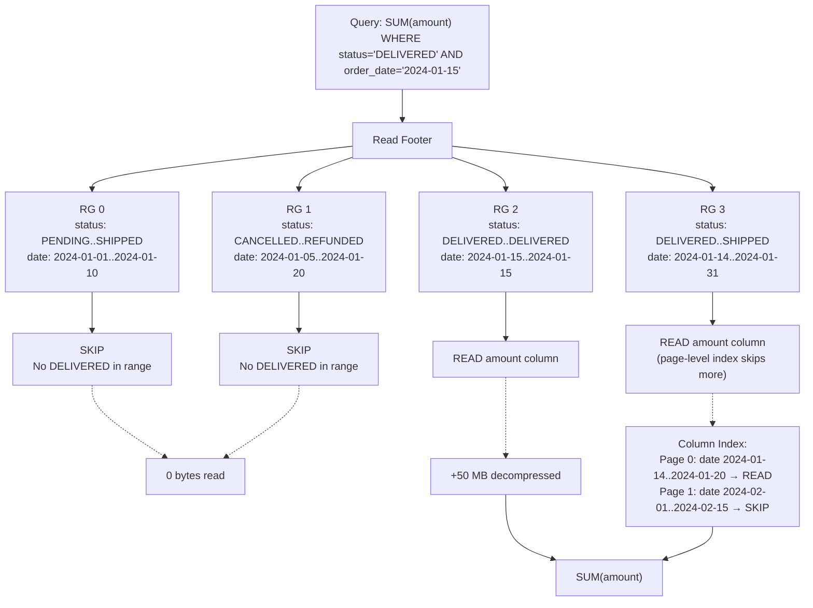

**Interview answer:** "Out of 1 TB, Spark reads < 100 MB because:
1. Row group statistics skip 50% of groups
2. Column pruning reads only `amount` (2% of columns)
3. Page-level index skips non-matching pages within the group
Total reduction: ~10,000x fewer bytes touched"

### 2.3 Encoding Example — Dictionary

**Question:** *"A column 'status' has 3 distinct values across 10 million rows. How does Parquet store it efficiently?"*

**Worked example:**

```
Raw column (10M rows, 7 bytes avg string):
"SHIPPED", "SHIPPED", "DELIVERED", "PENDING", "SHIPPED", ...

Step 1 — Dictionary encoding builds a mapping:
  index 0 → "PENDING"
  index 1 → "SHIPPED"
  index 2 → "DELIVERED"

Step 2 — Data page stores indices via RLE:
  [1, 1, 2, 0, 1, 2, 2, 1, 0, ...]  ← 10M shorts (2 bytes each)

Step 3 — RLE compresses runs:
  5,1  → five rows of index 1
  4,2  → four rows of index 2
  ...

Storage comparison:
  Raw strings:      70 MB  (10M × 7 bytes)
  Dictionary + RLE:  2 MB  (10M × 2 bytes × 0.1 after RLE)
  After Zstd:       ~0.5 MB

Reduction: ~140x
```

### 2.4 Small File Problem

**Question:** *"My Spark job writing to S3 creates 10,000 tiny Parquet files (each 10 MB). Query performance is terrible. Why and how do I fix it?"*

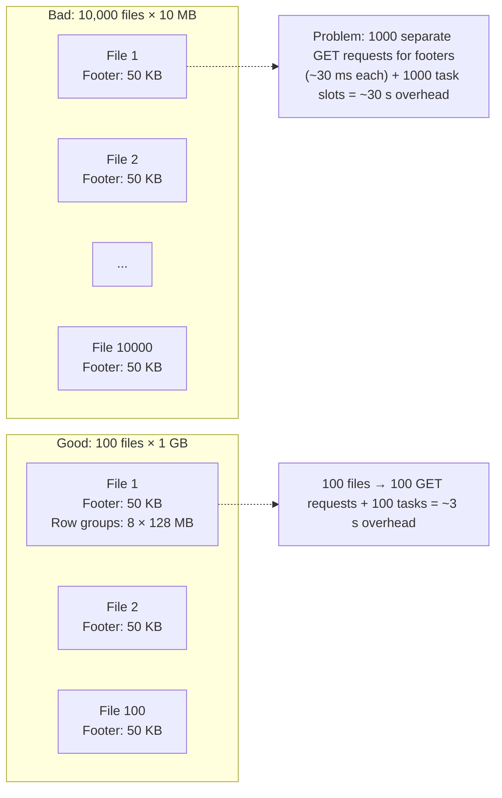

**Fix:**
```python
# Before writing: adjust output size
df.coalesce(100) \
  .write \
  .option("parquet.block.size", 256 * 1024 * 1024) \
  .parquet("s3://warehouse/orders/")
# Target: 256 MB - 1 GB per file
```

### 2.5 Schema Evolution Question

**Question:** *"You add a column `discount` to your Parquet schema. Old files don't have it. What happens when Spark reads them?"*

```sql
-- V1 schema: id INT, amount DOUBLE, status STRING
-- V2 schema: id INT, amount DOUBLE, status STRING, discount DOUBLE

SELECT id, discount FROM orders
```

**Answer:** Spark reads the schema from each Parquet file's footer.
Old files lack `discount` → Spark fills NULL for every row. No
rewrite needed. This works because:
- Parquet resolves columns by **name** (not position)
- Missing columns = NULL
- Type promotion works if compatible (INT → LONG, not reverse)

**Gotcha:** If the new column is marked NOT NULL in Spark, the query
fails. Always add nullable columns to existing tables.

---

## 3. Avro — The Streaming Standard

### 3.1 Why Avro for Kafka?

**Question:** *"You're designing a Kafka pipeline with 100+ event types. Why Avro over JSON?"*

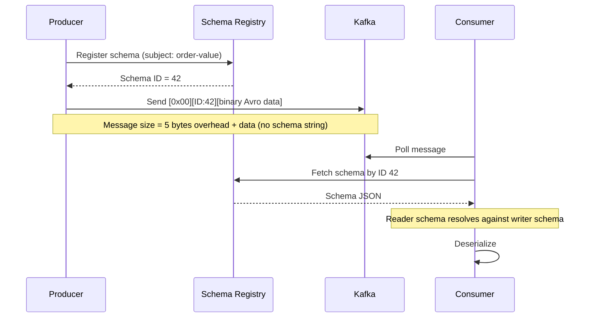

**Comparison (100-byte message, 10-field schema):**
```
JSON:   100 + 150 bytes overhead (key names) = 250 bytes
Avro:   100 + 5 bytes overhead = 105 bytes (no key names in data)
Ratio:  Avro roughly halves size vs JSON for typical payloads;
        overhead ratio varies with number of fields and field name length.
        With Schema Registry, schemas are never in the message — just a
        4-byte ID.
```

### 3.2 Schema Resolution with Example

**Question:** *"Walk me through what happens when a consumer with a different schema reads an Avro message."*

**Writer produces with this schema:**
```json
{
  "type": "record", "name": "Order",
  "fields": [
    {"name": "id", "type": "int"},
    {"name": "amount", "type": "double"},
    {"name": "status", "type": "string"},
    {"name": "discount", "type": ["null", "double"], "default": null}
  ]
}
```

**Consumer reads with this schema:**
```json
{
  "type": "record", "name": "Order",
  "fields": [
    {"name": "id", "type": "long"},
    {"name": "status", "type": "string"},
    {"name": "region", "type": "string", "default": "UNKNOWN"}
  ]
}
```

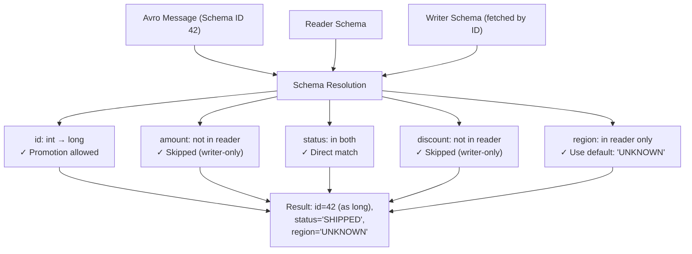

**Rules used:**
1. `id INT→LONG`: Widening promotion allowed
2. `amount` not in reader: Writer field is silently dropped
3. `discount` not in reader: Same — silent drop
4. `region` not in writer: Use `default: "UNKNOWN"` (required for safe evolution)

### 3.3 Binary Encoding Example

**Question:** *"How does Avro encode an int value of 42 vs -1 vs 1,000,000?"*

Avro uses **zig-zag variable-length integer encoding**:

```
Encoding formula: (n << 1) ^ (n >> 63)   for signed 64-bit

Value   Zig-Zag     Bytes (binary)
 42     (84)  →     0x54                                    → 1 byte
 -1     (1)   →     0x01                                    → 1 byte
  1000   (2000) →    0xD0 0x0F                               → 2 bytes
 1000000 (2000000) → 0x80 0x89 0x7A                          → 3 bytes
```

Each byte uses 7 bits for data + 1 continuation bit (MSB).
Small integers (most DE values) fit in 1–2 bytes instead of 4–8.

---

## 4. ORC — When It Matters

**Question:** *"When would you pick ORC over Parquet?"*

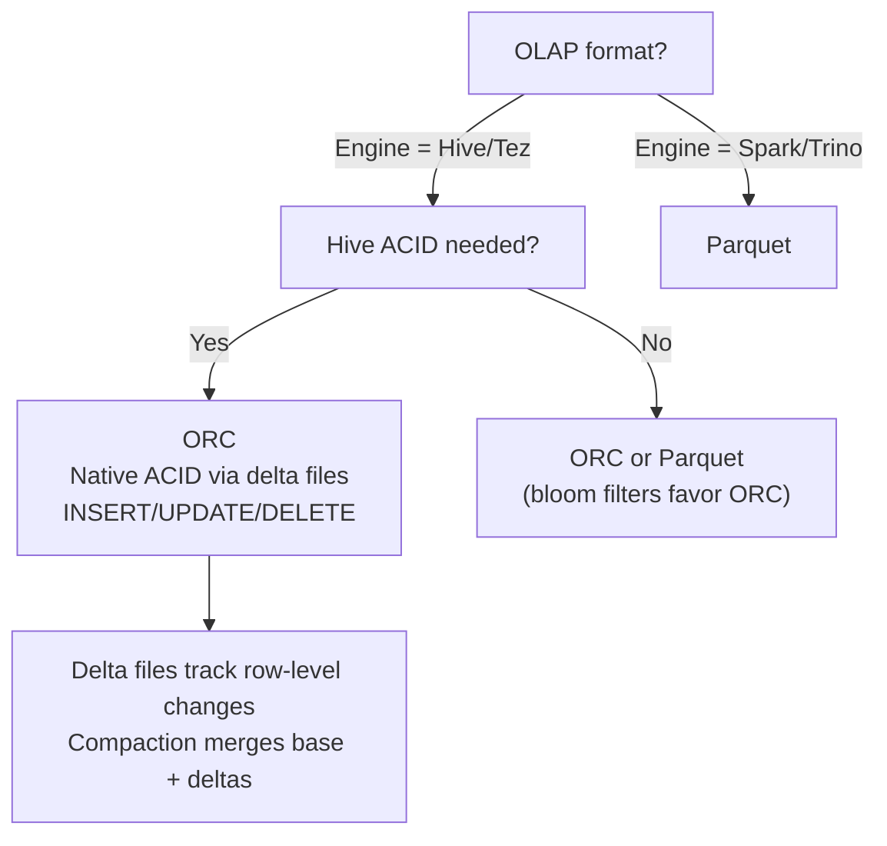

**ORC's unique feature — built-in bloom filters:**
```ini
-- Hive config for ORC bloom filters
SET orc.bloom.filter.columns=order_id,customer_id;
SET orc.bloom.filter.fpp=0.05;
```
Bloom filters definitively answer "this stripe definitely doesn't
contain this ID" — useful for point lookups on high-cardinality keys.

**Tradeoff:** ORC stripe-level indexes can give faster scans in Hive
workloads, but Parquet has universal engine support and a broader
ecosystem. For new projects outside Hive-heavy environments, Parquet
is the safer choice.

---

## 5. Compression Decision Scenarios

**Question:** *"Your data lake costs $10,000/month in S3. You want to reduce storage cost without hurting query performance. What do you do?"*

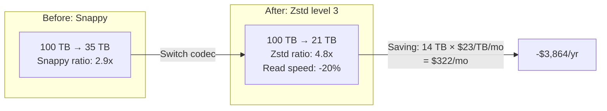

**Scenarios from real interviews:**
```
Q: "ETL intermediate data that gets deleted after 24 hours?"
A: LZ4 — write speed matters, not size

Q: "BI dashboard base table, queried every 30 seconds?"
A: Zstd level 3 — best read speed/size tradeoff

Q: "Cold data accessed once per year for audit?"
A: Gzip or Zstd level 9 — size dominates, read speed irrelevant

Q: "Kafka topic retention = 7 days, 500 MB/s throughput?"
A: Snappy — producer CPU is the bottleneck
```

---

## 6. Decision Trees — Whiteboard for Interview

### 6.1 Format Selection Flow

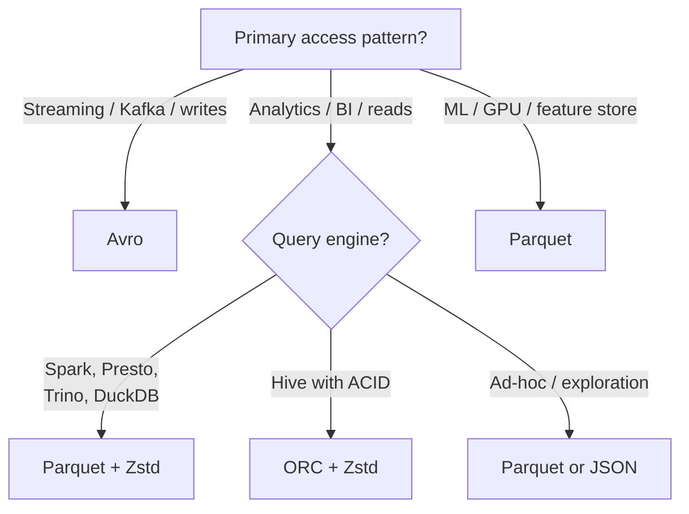

### 6.2 Compression Selection Flow

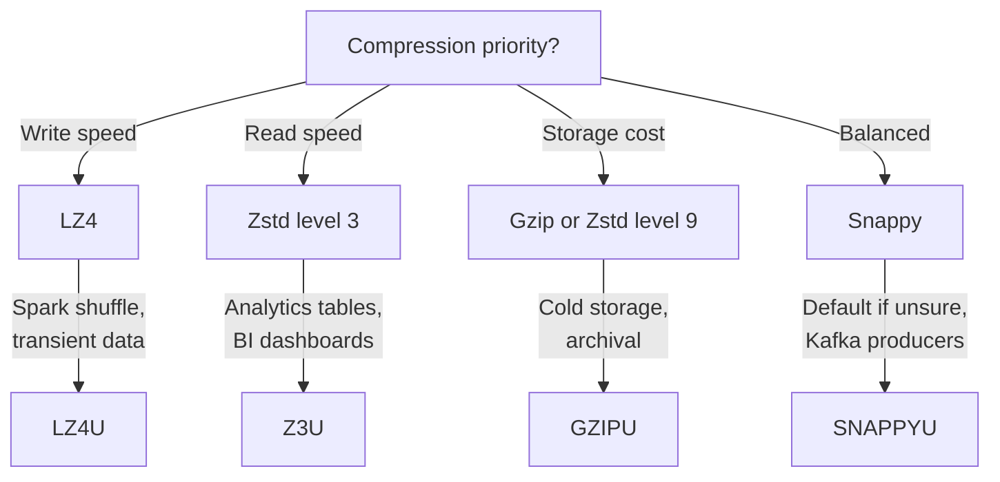

---

## 7. Real Interview Questions (from FAANG + GCC)

### Q1: "Your Spark job reads 1000 small Parquet files on S3. It's slow. Diagnose and fix."

**Diagnosis:**
- Each file requires a separate GET request with byte-range for its footer
  → 1000 requests × ~30 ms = 30 s in request latency alone
- 1000 tasks created → scheduling and bookkeeping overhead on driver
- No row group pruning benefit (1 row group per file, or none at 10 MB)

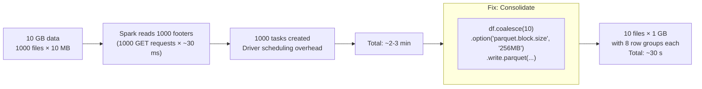

**Expected answer:**
1. Root cause: **small file problem** — too many metadata operations
2. Fix: Coalesce/repartition before write, target 256 MB–1 GB per file
3. Bonus: Enable AQE which auto-coalesces shuffle partitions

### Q2: "Explain how Parquet's column pruning and predicate pushdown differ."

| Mechanism | What It Skips | How | Granularity |
|---|---|---|---|
| **Column pruning** | Entire columns | Spark reads only column chunks for selected columns — within each row group, only requested column chunks are materialized | Column chunk (within row group) |
| **Predicate pushdown** | Row groups (and pages) | Footer statistics + column index to skip non-matching data | Row group / page |

**Example:** `SELECT amount FROM orders WHERE status = 'DELIVERED'`
- Column pruning: Reads only `amount` and `status` column chunks (not all 50 columns)
- Predicate pushdown: For each row group, checks `status.min..max`. If no `DELIVERED`, skip entire row group (30–100 MB saved per skip)

### Q3: "A column has 5 million unique UUIDs. Dictionary encoding is hurting performance. Why?"

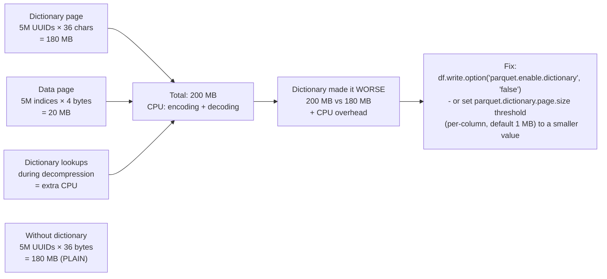

**Answer:** Dictionary encoding stores every distinct value once + index per row. For high-cardinality columns (UUIDs, hashes, timestamps), the dictionary page is nearly as large as the data, and both encode and decode add CPU. **Dictionary helps low-cardinality columns only.** Disable it per-column for UUIDs.

### Q4: "A Hive table uses ORC. You need to update 0.1% of rows daily. Write strategy?"

**Answer:** ORC supports ACID via delta files:

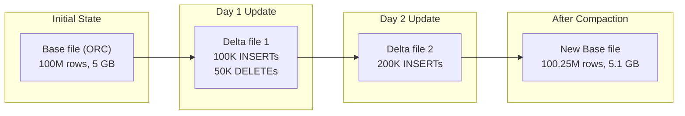

**Tradeoff:** Reads must merge base + all delta files (slower).
Compaction (bin-pack or sort) merges them periodically.
Use `hive.compactor.worker.threads` to schedule compaction.

### Q5: "Design a file format strategy for a new data lake. Consider cost, performance, query patterns."

| Zone | Format | Partitioning | Compression | Reasoning |
|---|---|---|---|---|
| **Bronze (raw)** | Avro (if registry) or JSON | Date/hour | Snappy | Schema flexibility, fast writes |
| **Silver (cleaned)** | Parquet | `year/month/day` | Zstd level 3 | Column pruning, predicate pushdown |
| **Gold (aggregated)** | Parquet | `year/month` | Zstd level 3 | BI tool compatibility, fast scans |
| **Kafka topics** | Avro | N/A | Snappy | Schema Registry, small payloads |
| **ML features** | Parquet | `dataset_name/version` | Zstd level 1 | GPU reads via RAPIDS |
| **Archive (< 1 query/yr)** | Gzip'd JSON | Single prefix | Gzip | Minimal cost, schema unknown |

### Q6: "Your 2-hour Spark ETL processes 50 columns but downstream only needs 5. How do you optimize?"

**The 2-minute fix:**
```python
# Before: reads all 50 columns through entire pipeline
df = spark.read.parquet("s3://bronze/orders/")
df.createOrReplaceTempView("orders")
result = spark.sql("""
    SELECT id, customer_id, amount, status, order_date
    FROM orders
    WHERE status = 'ACTIVE'
""")

# After: project early
df = spark.read.parquet("s3://bronze/orders/") \
    .select("id", "customer_id", "amount", "status", "order_date") \
    .filter(col("status") == "ACTIVE")
```

**Why it works:** Parquet reads only the 5 selected column chunks
from disk. Filter pushes to row group statistics. Before: 50 column
chunks decompressed. After: 5 chunks. **~90% less I/O.**

### Q7: "What happens to compression ratio if I sort data before writing Parquet?"

**Answer:** Sorting improves compression significantly for columns
with low cardinality or natural ordering:

```
Unsorted:  "SHIPPED", "DELIVERED", "PENDING", "SHIPPED", "CANCELLED"
            → dictionary has 4 entries, RLE gets no long runs
Sorted:    "CANCELLED", "CANCELLED", ..., "DELIVERED", ..., "PENDING", ..., "SHIPPED"
            → still 4 dictionary entries, but RLE produces
              long runs → 200,1 (200 of same index = 4 bytes vs 200 entries × 2 bytes each)
```

**Effect on compression:** Sorting rows so that values cluster (e.g.,
`ORDER BY status, order_date`) increases the length of identical-value
runs, making RLE and delta encoding more effective. The benefit depends
on data cardinality and ordering — gains of 10–30% are plausible on
real workloads, but the exact number varies with data distribution.

> [!TIP]
> Production pattern: sort by high-cardinality date column + one
> low-cardinality filter column (e.g., `ORDER BY order_date, status`).
> Improves both compression and predicate pushdown effectiveness.

---

## 8. Quick Reference — Interview Edition

| Question | Short Answer |
|---|---|
| **Format for analytics?** | Parquet — column pruning, predicate pushdown, universal support |
| **Format for Kafka?** | Avro + Schema Registry — binary size, schema evolution, compatibility enforcement |
| **Compression for Parquet?** | Zstd level 3 (best ratio/speed); Snappy (safe default); LZ4 (transient) |
| **How does Spark skip data?** | Footer stats → row group pruning → column index → page-level skipping |
| **Why is Avro smaller than JSON?** | No key names in payload, binary encoding (variable-length ints, zig-zag) |
| **Small file problem?** | Too many metadata ops → coalesce before write → target 256 MB–1 GB per file |
| **Schema evolution in Parquet?** | Add = NULL for old, drop = reader ignores, rename = alias metadata |
| **Schema evolution in Avro?** | Reader/writer resolution by name, defaults, promotion rules |
| **ORC vs Parquet?** | Parquet unless Hive ACID or bloom filters are required |
| **Dictionary encoding wins?** | Low cardinality (status, category, boolean); loses on UUIDs/hashes |
| **Sort before write?** | 20–40% better compression, better stats pruning, more CPU on write |
| **First thing to check for slow Parquet reads?** | File size distribution, number of row groups, column projection |
