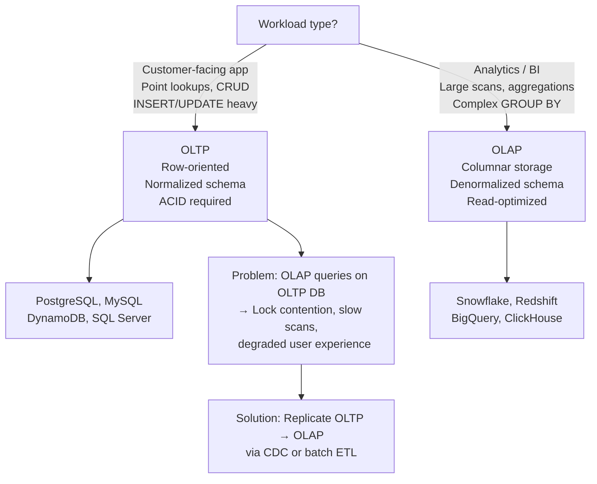
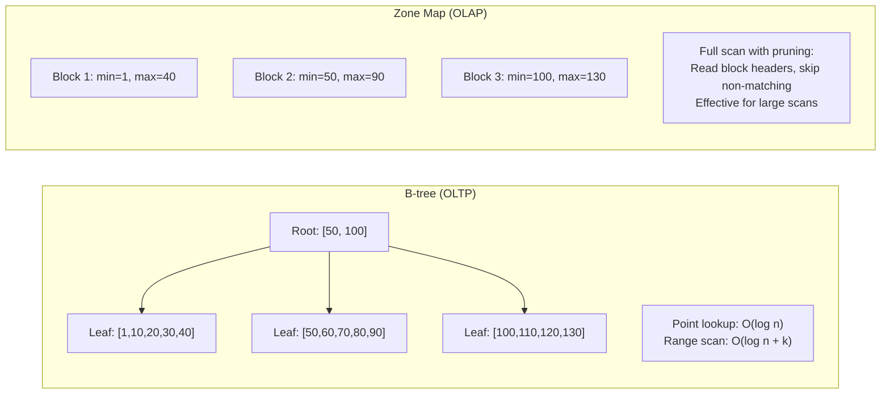
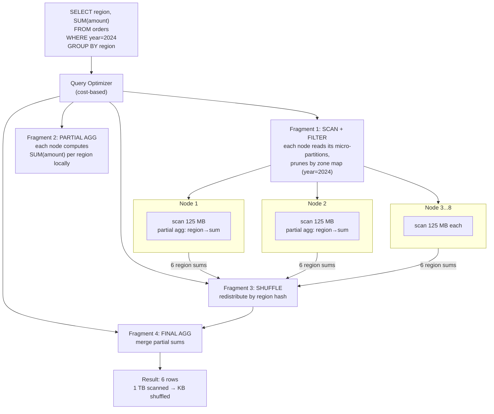
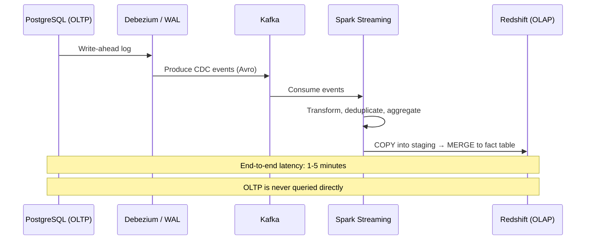
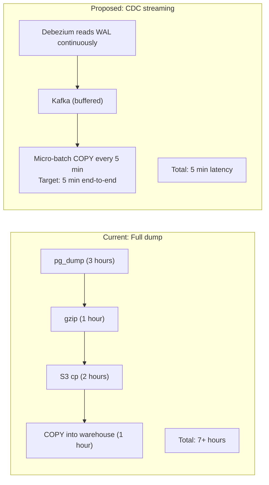
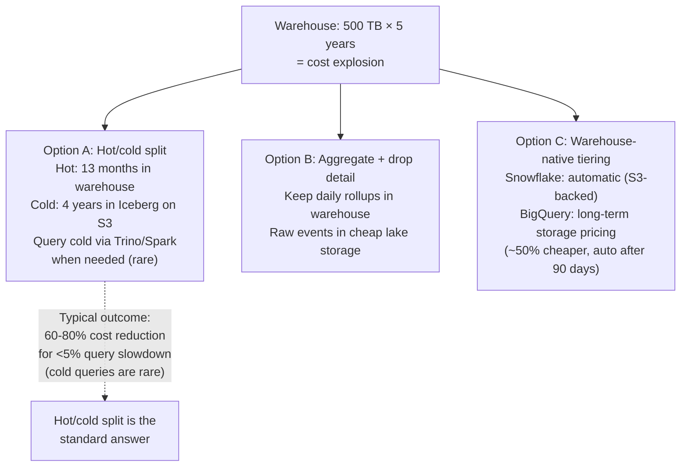
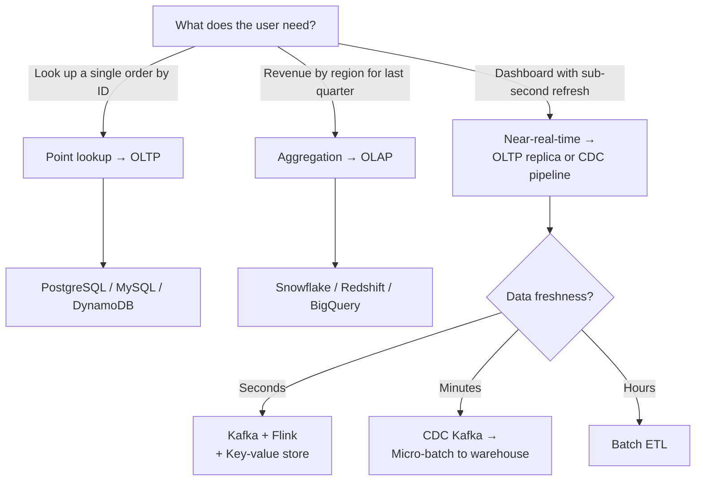
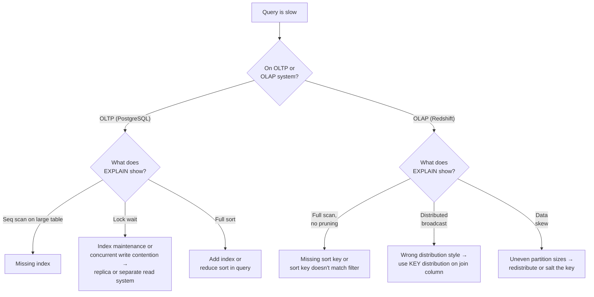

# OLAP vs OLTP — Interview Deep Dive

The most common opening question in DE interviews. Tests whether you
understand **why** the two worlds exist, not just the definition.

---

## 1. The Opening Question

**Question:** *"Explain the difference between OLAP and OLTP. When would you use each?"*



**Answer structure:**
```
OLTP: Run the business (transactions)
OLAP: Analyze the business (aggregations)

They are NOT interchangeable. The pipeline is:
OLTP (App DB) ──CDC/ETL──► OLAP (Warehouse)
```

---

## 2. Why Storage Orientation Matters

### 2.1 Page-Level Anatomy

**Question:** *"Why is columnar storage faster for analytical queries?"*

**Row-oriented (OLTP) storage on disk:**
```
Page (8 KB in PostgreSQL, 16 KB in MySQL):

[Row 1: order_id=101 | cust=Asha | amount=120.50 | status=DELIVERED | product=keyboard]
[Row 2: order_id=102 | cust=Ravi | amount=15.00  | status=CANCELLED | product=mouse   ]
[Row 3: order_id=103 | cust=Maya | amount=200.00 | status=SHIPPED   | product=monitor  ]
[Row 4: order_id=104 | cust=John | amount=45.00   | status=DELIVERED | product=cable   ]
...

To compute AVG(amount), the engine must:
1. Read every page (even though only 1 of 5 columns is needed)
2. Parse each row to extract the `amount` field
3. Skip all other fields (wasted I/O and CPU)
```

**Columnar (OLAP) storage on disk:**
```
Column 1 (order_id):  [101 | 102 | 103 | 104 | ...]
Column 2 (cust):      [Asha | Ravi | Maya | John | ...]
Column 3 (country):   [IN   | IN   | US   | UK   | ...]
Column 4 (amount):    [120.50 | 15.00 | 200.00 | 45.00 | ...]  ◄── only this is read
Column 5 (status):    [DELIVERED | CANCELLED | SHIPPED | DELIVERED | ...]

To compute AVG(amount):
1. Read only the `amount` column chunk
2. All values are adjacent → minimal I/O
3. Columnar compression (RLE/delta/dictionary) reduces data further
```

### 2.2 I/O Comparison with Real Numbers

**Scenario:** 10 million orders, 50 columns, 200 bytes per row. Table = 2 GB.

| Query | OLTP (Row) | OLAP (Column) |
|---|---|---|
| `SELECT AVG(amount)` | Reads 2 GB (all columns) | Reads 40 MB (1 column, INT 4 bytes) |
| `SELECT SUM(amount) WHERE status='DELIVERED'` | Reads 2 GB + full scan | Reads 40 MB (amount) + 4 MB (status with dict encoding) |
| `SELECT * WHERE order_id=42` | ~1 page = 8 KB (index lookup) | Reads multiple column chunks, slower |

**Key insight:** OLTP excels at **point lookups** (index → one page).
OLAP excels at **column scans** (read only what you need).

---

## 3. Index Structures

**Question:** *"Why don't OLAP systems use B-tree indexes?"*



| Index Type | OLTP | OLAP |
|---|---|---|
| **B-tree** | Primary tool — fast point lookups, row updates | Rare — maintenance cost > benefit during large scans |
| **Hash index** | Key-value lookups (e.g., PostgreSQL hash index) | Never used |
| **Zone map** (min/max) | Not needed | Core pruning mechanism in Redshift, Snowflake, Parquet |
| **Bloom filter** | Rare | ORC, Delta Lake, Iceberg for point-skip on high-cardinality |
| **Sort key** | Clustered index | Redshift compound/interleaved, Snowflake clustering |

**Interview answer:** "OLAP uses zone maps and bloom filters instead
of B-trees because analytical queries scan millions of rows. A B-tree
would add write overhead without helping bulk reads."

---

## 4. Compression: Row vs Column

**Question:** *"Why does columnar storage compress better?"*

Adjacent values in a column are often similar or repeating:

```
Row-oriented (mixed types, poor compression):
120.50 (double), DELIVERED (string), Asha (string), IN (string), 101 (int)
→ Gzip ratio: ~2x

Columnar (same types, sorted order):
amount column:      [5.00, 5.00, 10.00, 10.00, 10.00, 15.00, ...]
status column:      [DELIVERED, DELIVERED, SHIPPED, CANCELLED, ...]
country column:     [IN, IN, IN, IN, US, US, UK, ...]

→ Dictionary encoding + RLE on country: 9 bytes per row → 0.4 bytes
→ Delta encoding on amount: 8 bytes per row → 1-2 bytes
→ Zstd after encoding: total compression ~8-15x vs raw
```

**Worked example — country column (10M rows, 5 distinct values):**

```
Raw strings:    10M × 2 bytes (avg) = 20 MB
Dictionary:     5 × 2 bytes = 10 bytes + 10M × 3 bits (indices) ≈ 3.8 MB
After RLE:      variable-length runs ≈ 1-2 MB
After Zstd:     ≈ 0.5 MB
Total:          40x compression vs raw
```

---

## 5. How OLAP Engines Execute — MPP Internals

**Question:** *"Snowflake runs a query across 8 nodes. What actually happens to my SQL?"*



**Key internals to name in an interview:**

| Technique | What It Does | Systems |
|---|---|---|
| **MPP (Massively Parallel Processing)** | Query split into fragments, executed in parallel across nodes, results merged | Redshift, Snowflake, BigQuery, ClickHouse |
| **Vectorized execution** | Process 1000s of values per CPU instruction (SIMD) instead of row-at-a-time | ClickHouse, DuckDB, Snowflake, Trino |
| **Sparse / zone-map index** | Store min/max per block; skip blocks that can't match the filter | All OLAP systems |
| **Late materialization** | Read filter columns first, defer reading other columns until rows qualify | ClickHouse, Parquet readers |
| **Runtime filtering / bloom join** | Build a bloom filter on the small side of a join, push it to the scan | Redshift, Trino, Databricks |

> [!NOTE]
> **The interview soundbite:** "OLAP is fast because of column pruning
> (read less), zone maps (skip more), vectorization (CPU-efficient on
> what remains), and MPP (parallelize the rest). Every modern warehouse
> is these four ideas with different packaging."

---

## 6. Real Interview Questions

### Q1: "Design a pipeline that takes orders from PostgreSQL and makes them queryable in Redshift within 15 minutes."



**Answer:**
1. Capture changes: Debezium reads PostgreSQL WAL
2. Buffer in Kafka: decouples source from sink
3. Transform: Spark Streaming or Flink — deduplicate, convert to star schema
4. Load: COPY into Redshift staging, MERGE or DELETE+INSERT
5. Monitor: replica lag, consumer lag, Redshift WLM queue depth

### Q2: "Your dashboard querying the production PostgreSQL DB runs slow. Engineers want to add indexes. What do you recommend?"

**Problem:**
```sql
-- Dashboard query (runs every 30 seconds):
SELECT DATE_TRUNC('day', order_date), SUM(amount), COUNT(*)
FROM orders
WHERE status = 'DELIVERED'
GROUP BY 1;
```

**Wrong answer:** "Add an index on `(status, order_date)`."
- Index helps point lookups but this is a full scan of DELIVERED rows
- Index maintenance slows INSERTs on the OLTP DB
- Query still reads all matching rows, just through the index

**Right answer:**
1. Identify this as an **OLAP workload** on an **OLTP database**
2. Option A: Create a read replica, run queries there (replica lag may matter)
3. Option B: Replicate to a columnar warehouse (Redshift/Snowflake) via CDC
4. Option C: Materialized view with refresh schedule (compromise)

### Q3: "What is HTAP? Does it eliminate the need for separate OLAP systems?"

**Answer:**
HTAP (Hybrid Transactional/Analytical Processing) systems try to handle
both workloads in one engine:

| System | How It Works | Limitations |
|---|---|---|
| **SingleStore** | Rowstore + columnstore in same DB | Write path still row-oriented; analytical queries slower than dedicated OLAP |
| **ClickHouse** | Columnar, optimized for OLAP but supports point lookups | No ACID transactions; UPDATE/DELETE are async mutations |
| **MySQL HeatWave** | Separate analytical engine on same data | Dual-engine complexity; InnoDB rowstore + HeatWave columnar |
| **AlloyDB (Google)** | PostgreSQL-compatible with columnar engine | Still PostgreSQL at core; less mature than Snowflake/Redshift for OLAP |

**Verdict:** HTAP is useful for **near-real-time operational analytics**
(e.g., "show me this customer's orders from the last hour"). It does
NOT replace a dedicated OLAP warehouse for complex BI workloads.

### Q4: "Your Redshift query scans 1 TB but returns only 10 GB of results. How do you optimize?"

**Diagnosis:**
```
Probable causes (in order):
1. No sort key on the filtered column → full scan
2. Wrong distribution style → data movement between nodes
3. Query selecting * instead of specific columns
4. No compression on varchar columns → more I/O than needed
```

**Fix:**
```sql
-- 1. Set sort key on the most-filtered column
CREATE TABLE orders (
    id INT, amount DECIMAL, status VARCHAR, order_date DATE, ...
)
SORTKEY (order_date);
-- Now zone maps skip blocks outside the date range

-- 2. Select only needed columns
-- Bad: SELECT *
-- Good: SELECT order_date, SUM(amount)

-- 3. Use ENCODE on varchar columns
-- Redshift automatically uses ZSTD but verify:
SELECT "column", type, encoding FROM pg_table_def WHERE tablename = 'orders';
```

### Q5: "A batch job takes 3 hours to copy 5 TB from OLTP to OLAP. How would you reduce it to under 30 minutes?"



**Key changes:**
1. Replace full dump with **incremental CDC** — capture only changed rows
2. Stream instead of batch copy — data arrives continuously
3. Use **COPY with manifest** instead of individual file uploads
4. If CDC isn't possible: **partition the extract** by date and parallelize

### Q6: "Snowflake vs Redshift vs BigQuery — how do you choose?"

| Dimension | Snowflake | Redshift | BigQuery |
|---|---|---|---|
| **Architecture** | Storage/compute separated; virtual warehouses scale independently | RA3 separates storage/compute; older node types couple them | Fully serverless; slots allocated per query |
| **Scaling** | Resize warehouse (seconds), multi-cluster for concurrency | Concurrency scaling + elastic resize | Automatic (petabyte-scale by default) |
| **Pricing model** | Per-second warehouse credits + storage | Node-hours (RA3) or serverless RPU | On-demand bytes-scanned or flat-rate slots |
| **Zero-copy cloning** | Yes — instant table clones for dev/test | No (snapshots, slower) | Table snapshots |
| **Best fit** | Mixed workloads, many teams, data sharing | AWS-heavy shops, existing Redshift estate | GCP shops, spiky unpredictable load |

**Interview answer:** "All three are MPP columnar warehouses with
storage/compute separation now. The decision is ecosystem + pricing
model: Snowflake for multi-team governance and data sharing, BigQuery
for serverless spiky workloads, Redshift when you're all-in on AWS
with predictable load."

### Q7: "ClickHouse answers queries in 100ms that take Redshift 10 seconds. What's it doing differently?"

```
1. Sparse primary index: one index entry per granule (8,192 rows),
   not per row — the whole index fits in RAM
2. Vectorized execution: processes columns in SIMD batches
   (thousands of values per instruction)
3. Aggressive skipping: min/max + set + bloom-filter indexes per granule
4. No ACID overhead: append-mostly design, async mutations
5. Data layout control: ORDER BY in the table definition IS the
   physical sort — queries matching the sort prefix skip ~everything

Trade: ClickHouse gives up transactions, efficient UPDATE/DELETE,
and easy joins on huge dims. It's an OLAP specialist, not a warehouse
replacement for general workloads.
```

### Q8: "Analysts need 5 years of history, but warehouse storage costs are exploding. Options?"



### Q9: "Lambda vs Kappa architecture for a metrics platform — which and why?"

| Aspect | Lambda (batch + speed layers) | Kappa (stream only) |
|---|---|---|
| **Code paths** | Two (batch + streaming) — must keep in sync | One (streaming) |
| **Reprocessing** | Easy: rerun batch layer | Replay stream from retained history |
| **Latency** | Speed layer: seconds; batch: hours | Seconds throughout |
| **Ops burden** | High (two systems) | Lower (one system) |
| **Correctness** | Batch corrects speed-layer drift | Depends on retention + replay fidelity |

**Interview answer:** "Kappa when retention and replay cover your
reprocessing window (7-30 days is typical with Kafka). Lambda when you
need arbitrary historical reprocessing with different logic — the batch
layer over the lake is the source of truth, the stream layer is a
fast approximation. Most teams in 2026: **Kappa for the hot path,
periodic batch on Iceberg for the cold truth** — which is really a
pragmatic Lambda with the lake as the batch layer."

---

## 7. Decision Trees — Whiteboard for Interview

### 7.1 Architecture Selection



### 7.2 Performance Diagnosis (Query Slow?)



---

## 8. Quick Reference — Interview Edition

| Question | Answer |
|---|---|
| **OLTP default?** | Row-oriented, normalized 3NF, ACID, B-tree indexes, PostgreSQL/MySQL |
| **OLAP default?** | Columnar, star schema, read-optimized, zone maps, Snowflake/Redshift |
| **Why columnar is faster for analytics?** | Reads only needed columns; better compression (same types adjacent); zone maps skip data |
| **Can OLTP replace OLAP?** | No — point lookups vs scans, row vs column, ACID vs read-optimized are fundamental tradeoffs |
| **Can OLAP replace OLTP?** | No — OLAP sacrifices write performance and transactional guarantees |
| **The standard architecture?** | OLTP (production DB) → CDC/batch ETL → OLAP (warehouse) |
| **When to use HTAP?** | Near-real-time operational analytics; not a replacement for dedicated warehouse |
| **Redshift query scanning TB but returning GB?** | Check sort key, distribution style, column projection, compression |
| **PostgreSQL query slow for dashboard?** | It's an OLAP workload on an OLTP DB — replicate to a warehouse |
| **Fastest path from OLTP to OLAP?** | CDC (Debezium → Kafka → Flink → warehouse) for minutes latency |
| **Why OLAP is fast (4 reasons)?** | Column pruning (read less) + zone maps (skip more) + vectorization (CPU-efficient) + MPP (parallelize) |
| **Snowflake vs Redshift vs BigQuery?** | Ecosystem + pricing model decide; all three are MPP columnar with separated storage/compute |
| **Why ClickHouse is sub-second?** | Sparse index in RAM + vectorized execution + physical ORDER BY + no ACID overhead |
| **5 years of data, cost explosion?** | Hot/cold split: 13 months warehouse, 4 years Iceberg on S3 via Trino |
| **Lambda vs Kappa?** | Kappa when Kafka retention covers reprocessing; pragmatic Lambda = stream hot path + Iceberg batch truth |
