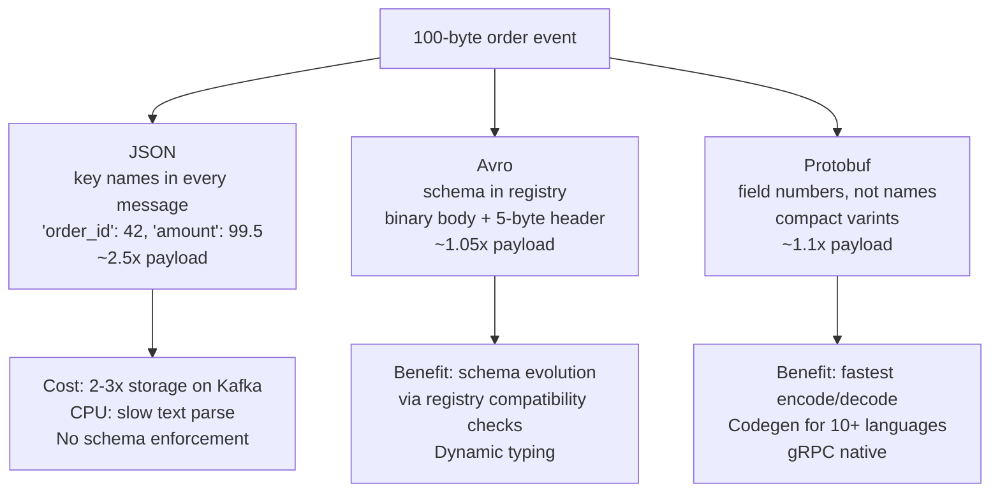
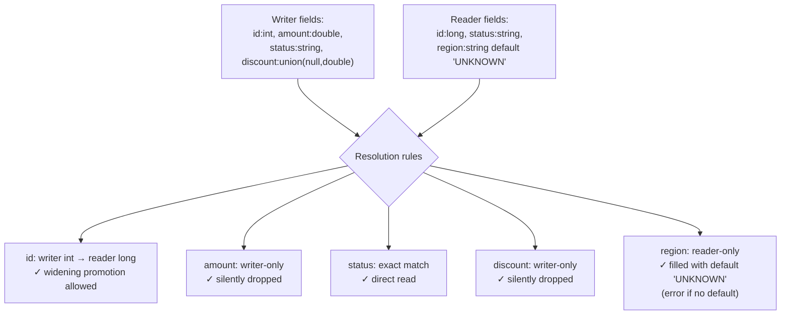
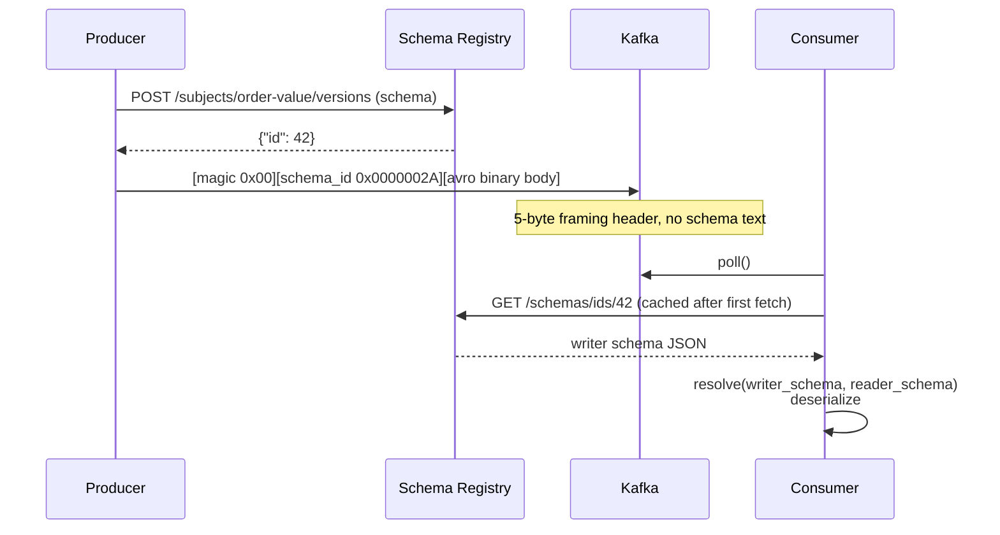
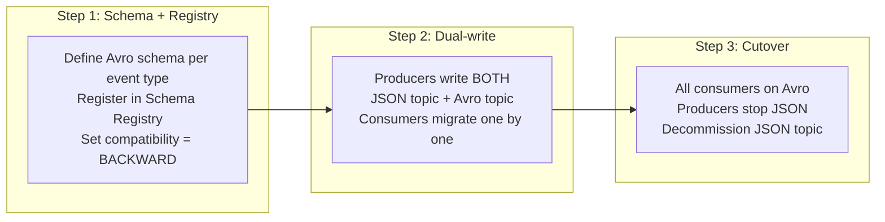
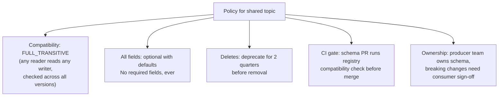
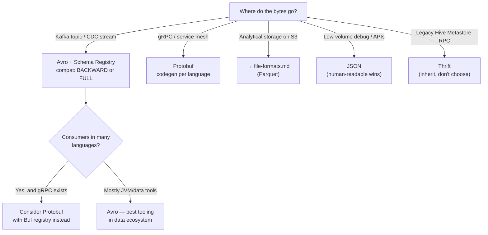

# Serialization & Wire Formats — Interview Deep Dive

How data becomes bytes on the wire: Avro, Protobuf, Thrift. These are
the formats for **messages and RPC**, not analytical storage.

> [!NOTE]
> For storage formats (Parquet, ORC, compression, predicate pushdown),
> see [`foundations/file-formats.md`](file-formats.md). For Spark-specific
> serialization (Kryo, Tungsten UnsafeRow), see
> [`apache-spark-pyspark/serialization.md`](../apache-spark-pyspark/serialization.md).

---

## 1. The Opening Question

**Question:** *"Your microservices communicate via Kafka. Why would you use Avro or Protobuf instead of JSON?"*



**Answer structure:**
```
JSON: fine for low-volume, human debugging
Avro: Kafka + schema evolution + schema registry (DE default)
Protobuf: service-to-service RPC, gRPC, multi-language codegen
```

---

## 2. Avro Wire Format — Deep Dive

### 2.1 Binary Encoding Rules

Every Avro type has a defined binary encoding. **No field names, no
delimiters** — values appear in schema order.

| Type | Encoding | Example |
|---|---|---|
| `null` | Zero bytes | — |
| `boolean` | 1 byte: `0x00` or `0x01` | `true` → `0x01` |
| `int` / `long` | Zig-zag varint | see below |
| `float` | 4 bytes, IEEE 754 little-endian | — |
| `double` | 8 bytes, IEEE 754 little-endian | — |
| `string` | varint length + UTF-8 bytes | `"hi"` → `0x04 0x68 0x69` (len=2 → zigzag 4) |
| `bytes` | varint length + raw bytes | — |
| `enum` | varint of symbol index | 2nd symbol → `0x02` |
| `array` | varint block count, items, `0` terminator | — |
| `map` | varint block count, key-value pairs, `0` | — |
| `union` | varint of branch index, then value | `["null","double"]` value `1.5` → `0x02 <8 bytes>` |
| `record` | fields concatenated in schema order | — |

### 2.2 Zig-Zag Varint — Worked Example

**Question:** *"Encode the Avro int values 42, -1, and 1000."*

Zig-zag maps signed → unsigned so small negatives stay small:

```
zigzag(n) = (n << 1) ^ (n >> 63)   [64-bit]

  n = 42:   42<<1 = 84   → 84 ^ 0  = 84    → 1 byte: 0x54
  n = -1:   -1<<1 = -2   → -2 ^ -1 = 1     → 1 byte: 0x01
  n = 1000: 1000<<1 = 2000                 → 2 bytes: 0xD0 0x0F
```

Varint: 7 data bits per byte, MSB = continuation flag.

```
2000 = 0b11111010000
  low 7 bits:  1010000 = 0x50 → byte 0: 0x50 | 0x80 (continue) = 0xD0
  next 7 bits: 0001111 = 0x0F → byte 1: 0x0F | 0x00 (stop)     = 0x0F

Verify decode: (0x0F << 7) | 0x50 = 1920 + 80 = 2000 ✓
```

**Interview point:** Small integers (IDs, counts, most DE values) cost
1-2 bytes instead of 4-8. This is why binary formats beat JSON by
more than the key-name savings alone.

### 2.3 Schema Resolution Walkthrough

**Question:** *"Writer schema has a field the reader doesn't. Reader schema has a field the writer doesn't. What happens?"*



**Rules:**
1. Match fields **by name**, not position
2. Writer-only fields → dropped silently
3. Reader-only fields → must have a default, else resolution error
4. Widening promotions: `int→long`, `int→double`, `float→double`

### 2.4 Schema Registry Wire Protocol



**Compatibility modes (enforced at registration):**

| Mode | Rule | Use |
|---|---|---|
| BACKWARD | New reader reads old data | Add fields with defaults (most common) |
| FORWARD | Old reader reads new data | Delete fields |
| FULL | Both | Safe default for shared topics |
| *_TRANSITIVE | Rule holds across ALL prior versions | Long-lived consumer fleets |
| NONE | No checks | Dev only |

---

## 3. Protobuf Wire Format — Deep Dive

### 3.1 Tag-Length-Value Encoding

**Question:** *"Protobuf is called a TLV format. What does a message actually look like on the wire?"*

Every field is encoded as: **tag** (field number + wire type) then **value**.

```
message Order {
  int32  order_id = 1;
  string status   = 2;
}

Order{order_id: 42, status: "OK"}

Wire bytes:
  0x08       tag: field 1, wire type 0 (varint)   (1<<3 | 0 = 0x08)
  0x2A       value: varint 42
  0x12       tag: field 2, wire type 2 (length-delimited)  (2<<3 | 2 = 0x12)
  0x02       length: 2
  0x4F 0x4B  "OK"

Total: 6 bytes. JSON equivalent: {"order_id":42,"status":"OK"} = 30 bytes.
```

**Wire types:**

| Type | Value | Used For |
|---|---|---|
| Varint | 0 | int32, int64, uint32, uint64, sint32, sint64, bool, enum |
| 64-bit | 1 | fixed64, sfixed64, double |
| Length-delimited | 2 | string, bytes, embedded messages, packed repeated |
| 32-bit | 5 | fixed32, sfixed32, float |

**Key insight:** Field **numbers**, not names, go on the wire. That's
why renaming a field in the `.proto` file is wire-compatible, but
reusing a field number with a different type corrupts data.

### 3.2 Protobuf vs Avro — The Real Differences

**Question:** *"When do you pick Protobuf over Avro?"*

| Dimension | Avro | Protobuf |
|---|---|---|
| Schema language | JSON | `.proto` IDL |
| Typing | Dynamic (resolved at read) | Static (codegen at compile) |
| Schema location | Registry or file header | Compiled into client/server |
| Unions | Native `[type1, type2]` | `oneof` keyword |
| Evolution rule anchor | Field names | Field numbers |
| Ecosystem | Kafka, Hadoop, Flink | gRPC, Envoy, Google APIs |
| Read without schema | Possible (generic records) | Possible but awkward (dynamic message) |
| Codegen required | No | Practically yes |

**Decision rule:**
- Kafka data pipeline with evolving schemas → **Avro + Schema Registry**
- Service mesh / gRPC / polyglot microservices → **Protobuf**

### 3.3 The `reserved` Keyword

```protobuf
message Order {
  reserved 4, 9 to 11;        // field numbers that must never be reused
  reserved "legacy_code";     // field names that must never be reused

  int32  order_id = 1;
  string status   = 2;
  double amount   = 3;
  // field 4 was 'legacy_code' — deleted, now reserved
}
```

> [!WARNING]
> Reusing a field number with a different type causes **silent data
> corruption**: old messages decode into the new field with garbage
> values. Always `reserved` deleted field numbers.

---

## 4. Thrift — What You Need to Know

Less common in new systems, but still asked because Hive/Hadoop
metadata and some legacy RPC use it.

| Aspect | Thrift |
|---|---|
| Schema | `.thrift` IDL, compiled |
| Protocols | Binary, Compact, Dense, JSON |
| Field identification | Field numbers (like Protobuf) |
| Current DE relevance | Hive Metastore API, legacy Hadoop RPC, some FinTech systems |

**Compact protocol trick:** Thrift Compact encodes the field number as
a **delta from the previous field** — consecutive fields (1, 2, 3...)
cost 1 byte each in the tag instead of 2.

---

## 5. Real Interview Questions

### Q1: "Your Kafka topic has 500 MB/s of JSON events. Cost is exploding. Walk me through the migration to Avro."



**Savings estimate:**
```
500 MB/s JSON → ~200 MB/s Avro (60% reduction typical)
Kafka storage (3x replication, 7-day retention):
  JSON: 500 × 86400 × 7 × 3 ≈ 900 TB
  Avro: 200 × 86400 × 7 × 3 ≈ 360 TB
Broker network: 60% less egress
```

### Q2: "A consumer broke after a producer added a field. Compatibility is BACKWARD. What went wrong?"

**Diagnosis:**
```
BACKWARD check: NEW reader schema must read data written by the
PREVIOUS writer schema.

Producer added field X WITHOUT a default.
  - Reader = new schema (has X), Writer = old messages (no X)
  - X is reader-only → resolution requires a default
  - No default → SchemaResolutionException on old messages

Note: the registry should have REJECTED the registration at publish
time (BACKWARD requires defaults on added fields). The break means the
check was bypassed, compat was set to NONE, or the consumer deployed
the new schema before the producer registered it.
```

**Why old consumers were fine:** old reader + new writer = writer-only
field X is silently skipped (that's FORWARD direction — adding fields
never breaks it).

**Fix:** Every added field must declare a `default`. Verify in CI:
schema PR runs the registry compatibility check before merge.

### Q3: "Why does Protobuf use field numbers instead of field names on the wire?"

1. **Size:** `0x08` (1 byte) vs `"order_id"` (10+ bytes) per field per message
2. **Rename safety:** Renaming a field in `.proto` is wire-compatible
   because the number stays the same
3. **Parsing speed:** Switch on integer tag, not string comparison

**Tradeoff:** You must never reuse a number — hence `reserved`.

### Q4: "Design the schema evolution policy for a Kafka topic consumed by 15 teams."



### Q5: "You inherited a pipeline where the producer changed a Protobuf field 3 from string to int32. Old messages now show garbage. Explain and fix."

**What happened:** Field 3, wire type changed from 2 (length-delimited)
to 0 (varint). Old messages with string values in field 3 get decoded
as varints → garbage ints.

**Fix:**
```protobuf
message Order {
  reserved 3;                 // retire the corrupted number
  int32 quantity = 15;        // new field, fresh number
  string quantity_legacy = 3; // NO — don't do this either; read old data
                              // with the OLD compiled schema, migrate,
                              // then write with new schema
}
```
**Recovery:** Replay old data with the old schema jar → transform →
write with new schema to field 15.

### Q6: "Why is Avro the default for CDC pipelines (Debezium) instead of Protobuf?"

1. Debezium emits schema changes dynamically — Avro's dynamic typing
   handles source table DDL changes without recompiling consumers
2. Schema Registry compatibility checks gate DDL-driven breakage
3. Kafka Connect's Avro converter is the most mature path for
   exactly-once sink connectors
4. Protobuf would require regenerating and redeploying consumer code
   on every upstream schema change

### Q7: "Your Avro messages in Kafka are 40% larger than expected. The schema has 80 nullable fields, mostly unset. Why?"

**Cause:** Every nullable field is a `union ["null", T]` — the union
branch index (varint) costs 1 byte per field per message even when null.

```
80 union fields × 1 byte branch index = 80 bytes overhead per message
```

**Fixes:**
- Split the event into core + optional extension messages
- Use a `map<string, string>` for sparse attributes (pays length+key
  only for present entries)
- Accept it: 80 bytes is still 10x cheaper than JSON's key names

---

## 6. Decision Tree — Whiteboard for Interview



---

## 7. Quick Reference — Interview Edition

| Question | Answer |
|---|---|
| **JSON → binary why?** | No key names on wire, varint compression, schema enforcement, evolution checks |
| **Avro union cost?** | 1 varint branch index per union field, even when null |
| **Zig-zag why?** | Maps -1→1, 1→2 so small negatives stay 1-byte varints |
| **Protobuf tag?** | (field_number << 3) \| wire_type, 1 varint |
| **Field rename safe?** | Avro: no (name-matched). Protobuf: yes (number-matched) |
| **Field number reuse?** | Never. Silent corruption. Use `reserved` |
| **BACKWARD vs FORWARD?** | BACKWARD: new reader reads old data. FORWARD: old reader reads new data |
| **Add field safe?** | Only with a default (both directions) |
| **Kafka message framing?** | Confluent: magic 0x00 + 4-byte schema ID + binary body |
| **Avro vs Protobuf?** | Avro: data pipelines, dynamic schemas. Protobuf: RPC, codegen, gRPC |
| **Thrift when?** | Inherit it (Hive Metastore, legacy Hadoop); don't choose it for new systems |
| **Sparse nullable fields?** | Union index byte per field adds up — use maps for sparse attributes |

---

## References

- [Avro Specification — Binary Encoding](https://avro.apache.org/docs/current/spec.html#binary_encoding)
- [Protobuf Encoding](https://protobuf.dev/programming-guides/encoding/)
- [Confluent Schema Registry — Wire Format](https://docs.confluent.io/platform/current/schema-registry/fundamentals/serdes-develop/index.html#wire-format)
- [Thrift Compact Protocol](https://github.com/apache/thrift/blob/master/doc/specs/thrift-compact-protocol.md)
