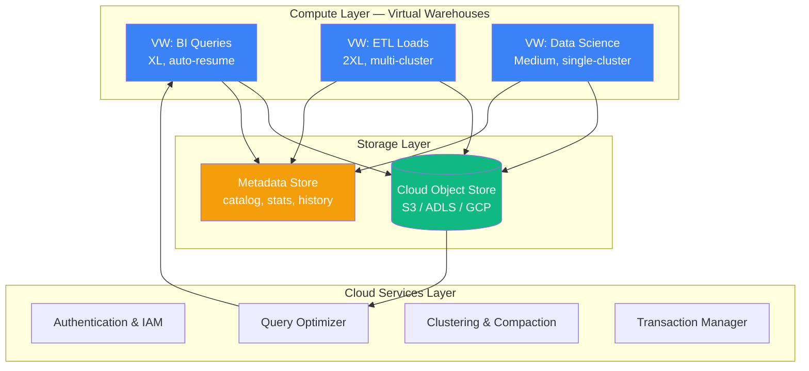

# Snowflake for Data Engineering

> Staff DE Sam walks Senior DE Alex through Snowflake — architecture, performance, cost, and the patterns GCCs expect senior engineers to know.

## Contents

1. [Architecture — Storage and Compute Separation](#1-architecture--storage-and-compute-separation)
2. [Virtual Warehouses](#2-virtual-warehouses)
3. [Micro-Partitions and Clustering](#3-micro-partitions-and-clustering)
4. [Time Travel and Fail-Safe](#4-time-travel-and-fail-safe)
5. [Zero-Copy Cloning](#5-zero-copy-cloning)
6. [Performance Tuning](#6-performance-tuning)
7. [Cost Management](#7-cost-management)
8. [Snowpipe and Continuous Ingestion](#8-snowpipe-and-continuous-ingestion)
9. [Streams and Tasks](#9-streams-and-tasks)
10. [Interview Cheatsheet](#10-interview-cheatsheet)

---

## 1. Architecture — Storage and Compute Separation



**Sam:** Snowflake separates three layers:

| Layer | What it is | Key property |
| :--- | :--- | :--- |
| **Storage** | Compressed, columnar, encrypted object store (S3/ADLS/GCP) | Pay only for what you store ($/TB). Zero-copy clones share storage. |
| **Compute** | Virtual warehouses — independent clusters of EC2 instances | Pay only when running. Can have multiple warehouses on the same data. |
| **Cloud Services** | Metadata, optimizer, security, transactions | Always-on (included in compute costs). |

**Alex:** The storage-compute separation is the main selling point. Why does it matter practically?

**Sam:** Because you can:
- Run a BI query on a small warehouse and a heavy ETL on a large warehouse — same data, different compute.
- Suspend the warehouse when idle — zero cost.
- Scale horizontally with multi-cluster warehouses for concurrency.
- Clone a 10TB database in seconds (metadata-only operation, no data copy).

---

## 2. Virtual Warehouses

### Sizing

| Size | Credits/hour | When to use |
| :--- | :--- | :--- |
| X-Small | 1 | Development, light BI |
| Small | 2 | Daily reporting |
| Medium | 4 | Standard ETL, moderate queries |
| Large | 8 | Heavy transformations |
| X-Large | 16 | Large fact table builds |
| 2X-Large | 32 | Massive data loads, complex joins |
| 3X-Large | 64 | Peak loads, multi-TB pipelines |
| 4X-Large | 128 | Extreme scale (rarely needed) |

**Sam:** Doubling the size does not make every query 2x faster. It makes queries that scan large amounts of data faster (full table scans, large aggregations). It does NOT help queries limited by a single node's CPU (e.g., a single partition sort).

### Multi-Cluster Warehouses

**Sam:** When you have many concurrent users, multi-cluster auto-scales:

```sql
ALTER WAREHOUSE reporting_wh
SET WAREHOUSE_SIZE = 'LARGE'
   MIN_CLUSTER_COUNT = 1
   MAX_CLUSTER_COUNT = 5
   AUTO_SUSPEND = 60     -- seconds of idle before suspend
   AUTO_RESUME = TRUE;
```

- New clusters spin up when existing ones are queued
- Each cluster is a full-size copy (so 5 LARGE clusters = 5 × 8 = 40 credits/hour)
- Use for BI workloads with unpredictable concurrency, NOT for scheduled ETL

### Auto-Suspend and Auto-Resume

**Sam:** Always set these. The single biggest Snowflake cost mistake is leaving a warehouse running overnight:

```sql
ALTER WAREHOUSE etl_wh SET AUTO_SUSPEND = 300;   -- Suspend after 5 min idle
```

---

## 3. Micro-Partitions and Clustering

**Sam:** Snowflake automatically divides tables into immutable micro-partitions (50–500MB each, columnar compressed):

```text
Table: orders (1TB)
├─ Micro-partition 1: rows 1–10M, order_date range Jan 1–15
├─ Micro-partition 2: rows 10M–22M, order_date range Jan 16–22
├─ Micro-partition 3: rows 22M–35M, order_date range Jan 23–31
└─ ...
```

**Alex:** How does this affect query performance?

**Sam:** Snowflake stores min/max metadata per micro-partition. A query with `WHERE order_date = 'Jan 5'` skips any micro-partition whose range does not include Jan 5. This is **automatic partition pruning** — no partition management needed.

### Clustering Keys

**Sam:** If you frequently filter on a non-date column (e.g., `customer_id`), manual clustering improves pruning:

```sql
ALTER TABLE fct_orders CLUSTER BY (order_date, customer_id);
```

- Clustering is automatic but incurs credits
- Check clustering status: `SYSTEM$CLUSTERING_INFORMATION('fct_orders')`
- Recluster on a schedule during low-load periods, or let auto-clustering handle it

> [!TIP]
> Snowflake's micro-partitioning + automatic clustering means you rarely need to think about partitioning. The main performance knob is warehouse sizing, not table design — the opposite of Redshift or traditional databases. Only add clustering keys for tables over 1TB with selective filters on non-date columns.

---

## 4. Time Travel and Fail-Safe

### Time Travel

**Sam:** Query, clone, or restore data as it existed at any point within the past N days (1–90, depending on edition):

```sql
-- Query data as of 2 hours ago
SELECT * FROM orders AT(TIMESTAMP => CURRENT_TIMESTAMP - INTERVAL '2 hours');

-- Query data as of a specific statement
SELECT * FROM orders BEFORE(STATEMENT => '8e5d0ca9-...');

-- Undo an accidental truncate
CREATE TABLE orders_restored CLONE orders AT(TIMESTAMP => '2025-06-15 14:30:00');

-- Restore a dropped table
UNDROP TABLE orders;
```

| Edition | Time travel retention | Fail-safe |
| :--- | :--- | :--- |
| Standard | 1 day | 7 days |
| Enterprise | 90 days | 7 days |
| Business Critical | 90 days | 7 days |

### Fail-Safe

**Sam:** 7-day period where Snowflake can recover data from physical backups. You cannot query it yourself — you must contact Snowflake support. Fail-safe is disaster recovery, not a query tool.

---

## 5. Zero-Copy Cloning

**Sam:** Creates a copy of a database, schema, or table that shares the underlying storage until data changes:

```sql
CREATE DATABASE dev_db CLONE prod_db;     -- Seconds, any size
CREATE TABLE dev_orders CLONE orders;       -- Single table clone
```

- Only metadata changes in the catalog — no data copied
- After cloning, writes to either database diverge (copy-on-write for changed micro-partitions)
- Use for: dev/test environments, point-in-time snapshots, parallel transformations

---

## 6. Performance Tuning

### Query Profiles

**Sam:** Use `EXPLAIN` and query history to find bottlenecks:

```sql
SELECT *
FROM TABLE(INFORMATION_SCHEMA.QUERY_HISTORY())
WHERE QUERY_ID = '...'
ORDER BY START_TIME DESC;
```

### Common Bottlenecks

| Symptom | Likely cause | Fix |
| :--- | :--- | :--- |
| Query spends time scanning but most micropartitions pruned | Table has no clustering on filter column | Add clustering key |
| Query shows "Remote" I/O | Data not cached (first run or after warehouse suspend) | Run once to warm cache, or increase warehouse size |
| Spilling to disk ("Disk Spill" in query profile) | Warehouse too small for the data volume | Use larger warehouse or reduce data scanned |
| High "Queued" time | Warehouse overloaded, all clusters busy | Add multi-cluster or schedule during off-peak |
| Query with JOIN between large tables is slow | Hash join spilling to disk | Cluster on join keys, increase warehouse |

### Caching

**Sam:** Snowflake has two cache levels:

1. **Result cache** (24 hours) — identical query returns instantly, no compute cost
2. **Warehouse cache** (local SSD on warehouse nodes) — persists while warehouse is running

Both are transparent. The practical implication: if the same dashboard query runs every 5 minutes, Snowflake serves it from result cache at zero cost.

---

## 7. Cost Management

**Alex:** Snowflake is expensive. How do you control it?

**Sam:** Four levers:

### 1. Resource Monitors

```sql
CREATE RESOURCE MONITOR daily_limit
  WITH CREDIT_QUOTA = 100
  FREQUENCY = DAILY
  START_TIMESTAMP = IMMEDIATELY
  TRIGGERS ON 80% DO NOTIFY
           ON 100% DO SUSPEND;

ALTER WAREHOUSE etl_wh SET RESOURCE_MONITOR = daily_limit;
```

### 2. Warehouse Configuration

- **Auto-suspend**: 5 minutes for dev, 10 minutes for ad-hoc
- **Auto-resume**: Always on for scheduled, never for manual queries
- **Sizing**: Right-size, do not overprovision. A Medium warehouse that runs 2x longer is cheaper than an X-Large that runs 1x faster.
- **Multi-cluster**: Use only for BI concurrency, never for ETL.

### 3. Query Cost Visibility

```sql
-- Most expensive queries in the last 7 days
SELECT
    QUERY_ID,
    QUERY_TEXT,
    WAREHOUSE_SIZE,
    CREDITS_USED_CLOUD_SERVICES,
    EXECUTION_TIME,
    BYTES_SCANNED
FROM TABLE(INFORMATION_SCHEMA.QUERY_HISTORY())
WHERE START_TIME > DATEADD(day, -7, CURRENT_TIMESTAMP)
ORDER BY CREDITS_USED_CLOUD_SERVICES DESC
LIMIT 20;
```

### 4. Storage Optimization

- Set `TIME_TRAVEL_RETENTION` to minimum needed (1 day for dev, 90 for prod)
- Use transient/temporary tables for intermediate ETL results (no fail-safe, no time travel)
- Compress before loading (Parquet > CSV)
- Drop old clones and unused databases

---

## 8. Snowpipe and Continuous Ingestion

**Sam:** Snowpipe loads data from cloud storage automatically when new files arrive:

```sql
-- Create pipe (one-time setup)
CREATE PIPE my_pipe
  AUTO_INGEST = TRUE
  AS
  COPY INTO orders
  FROM @my_stage
  FILE_FORMAT = (TYPE = PARQUET);
```

- Files in the stage's S3 bucket → S3 event notification → Snowpipe → table
- Costs per file loaded (not per warehouse credit)
- Use for near-real-time ingestion (1–5 minute delay typical)

---

## 9. Streams and Tasks

**Sam:** Streams capture CDC (Change Data Capture) on tables without a separate tool:

```sql
-- Create a stream on a table
CREATE STREAM orders_stream ON TABLE orders;

-- Reads new/changed rows and marks them as consumed
SELECT * FROM orders_stream;

-- Combine with a task for continuous processing
CREATE TASK process_orders
  WAREHOUSE = etl_wh
  SCHEDULE = '5 MINUTE'
WHEN
  SYSTEM$STREAM_HAS_DATA('orders_stream')
AS
  INSERT INTO orders_audit SELECT * FROM orders_stream;
```

| Use case | Pattern |
| :--- | :--- |
| Simple CDC | Stream on source table → Task reads stream → inserts into target |
| Incremental dbt | dbt incremental models with `incremental_strategy='merge'` |
| Log-based CDC (Debezium) | Kafka → Snowpipe (Avro/JSON) → Streams → Tasks |

---

## 10. Interview Cheatsheet

### Quick Reference

| Concept | Key fact |
| :--- | :--- |
| Virtual warehouse | Independent compute cluster, billed per second when running |
| Micro-partition | 50–500MB columnar chunk, auto-pruned by min/max metadata |
| Clustering key | Optional optimization for non-date filter columns on large tables |
| Time travel | Query/restore data up to 90 days back |
| Zero-copy clone | Instant metadata-only copy, shared storage until write |
| Result cache | Identical queries return in milliseconds, zero cost, 24h TTL |
| Warehouse cache | Local SSD on warehouse nodes, persists while warehouse is running |
| Resource monitor | Credit budget per warehouse or account level |
| Snowpipe | Serverless file ingestion from cloud storage, per-file billing |
| Stream | CDC capture on a table, tracks inserts/updates/deletes |
| Task | Scheduled SQL execution, can trigger on stream having data |
| Fail-safe | 7-day backup accessible only by Snowflake support |
| Transient table | No fail-safe, lower storage cost for temp/intermediate data |

### Key Interview Answer

> Snowflake's architecture separates storage (S3/ADLS) from compute (virtual warehouses), enabling independent scaling and zero-cost cloning. Micro-partitions with automatic metadata pruning eliminate manual partition management. Performance tuning is primarily about right-sizing the warehouse and clustering large tables on filter columns. Cost control is done through resource monitors, auto-suspend, right-sized warehouses, and transient tables for intermediate data. Snowpipe handles continuous ingestion from cloud storage, and streams + tasks provide CDC and scheduling without external tools.

---

### Resources

- [Snowflake Documentation](https://docs.snowflake.com/en/) — Official docs
- [Snowflake — Key Concepts](https://docs.snowflake.com/en/user-guide/intro-key-concepts) — Architecture overview
- [Snowflake — Performance Tuning](https://docs.snowflake.com/en/user-guide/performance-tuning-overview) — Query optimization guide
- [Snowflake — Cost Management](https://docs.snowflake.com/en/user-guide/cost-management) — Resource monitors and credit tracking
- [Select Star Snowflake Docs](https://selectstarsql.com/) — Free SQL tutorial on Snowflake dialect
