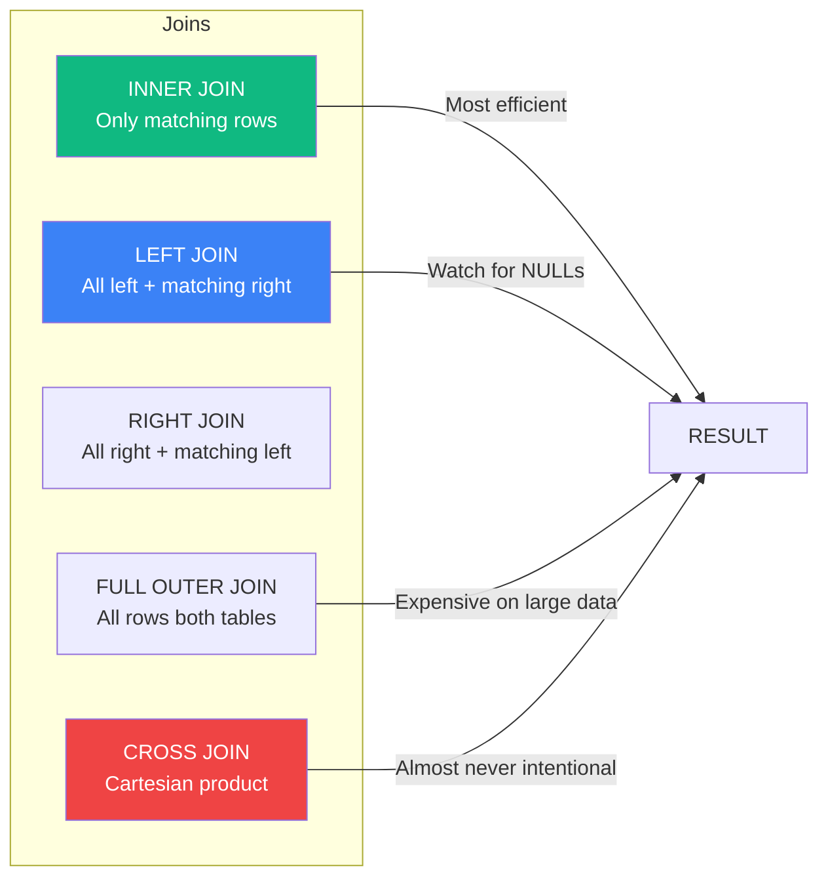
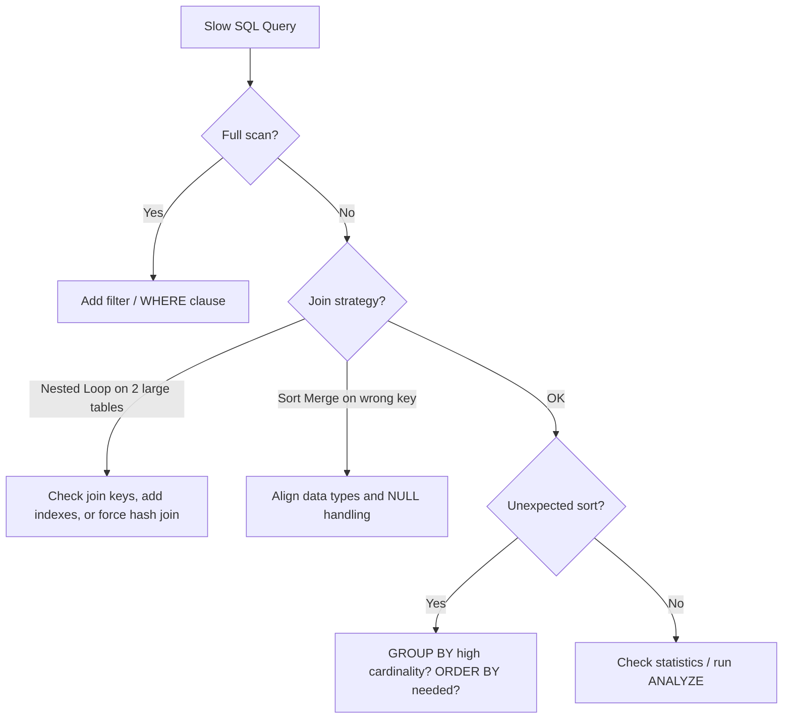

# SQL for Data Engineering

> Senior DE Alex and Staff DE Sam work through SQL topics that separate mid-level from senior/staff data engineers — not syntax, but correctness, performance, and production patterns.

## Contents

1. [Query Execution Order](#1-query-execution-order)
2. [Window Functions](#2-window-functions)
3. [Joins — Types, Performance, and Traps](#3-joins-types-performance-and-traps)
4. [CTEs and Recursive Queries](#4-ctes-and-recursive-queries)
5. [Aggregation Nuances](#5-aggregation-nuances)
6. [Query Performance and Execution Plans](#6-query-performance-and-execution-plans)
7. [Anti-Patterns](#7-anti-patterns)
8. [Partitioning and Clustering](#8-partitioning-and-clustering)
9. [Interview Cheatsheet](#9-interview-cheatsheet)

---

## 1. Query Execution Order

**Alex:** Most people write SQL top-down. But the database does not read it that way.

**Sam:** Correct. The logical order of operations is:

```text
FROM + JOIN        ← 1. Identify source tables and build row sets
WHERE              ← 2. Filter rows (before grouping)
GROUP BY            ← 3. Group rows into aggregates
HAVING              ← 4. Filter groups (after aggregation)
SELECT              ← 5. Compute expressions and aliases
ORDER BY            ← 6. Sort the result set
LIMIT / OFFSET      ← 7. Paginate
```

> [!WARNING]
> You cannot use a column alias from `SELECT` in `WHERE` because `WHERE` executes *before* `SELECT`. But you CAN use it in `ORDER BY`, `HAVING`, and `GROUP BY` in most databases (though MySQL allows it in `GROUP BY` and `HAVING` — not standard SQL).

**Alex:** Why does this matter in an interview?

**Sam:** Because the most common senior-level traps come from misunderstanding order. Example:

```sql
-- ❌ Will this work?
SELECT department_id, COUNT(*) AS emp_count
FROM employees
WHERE emp_count > 10     -- WHERE executes BEFORE SELECT → emp_count doesn't exist yet
GROUP BY department_id;

-- ✅ HAVING is the filter-after-group clause
SELECT department_id, COUNT(*) AS emp_count
FROM employees
GROUP BY department_id
HAVING COUNT(*) > 10;    -- HAVING can use aggregate expressions directly
```

**Alex:** And the difference between WHERE and HAVING in JOINs?

**Sam:** A `WHERE` on the right-side table of a `LEFT JOIN` effectively converts it to an `INNER JOIN`. Filter before joining with a subquery, or use `AND` in the `ON` clause for the outer table filter:

```sql
-- ❌ This turns LEFT JOIN into INNER JOIN:
SELECT o.order_id, p.payment_amount
FROM orders o
LEFT JOIN payments p ON o.order_id = p.order_id
WHERE p.payment_amount > 100;

-- ✅ Filter the right side before joining:
SELECT o.order_id, p.payment_amount
FROM orders o
LEFT JOIN (SELECT * FROM payments WHERE payment_amount > 100) p
    ON o.order_id = p.order_id;
```

---

## 2. Window Functions

**Sam:** Window functions are the single highest-leverage SQL skill for data engineers. Every GCC interview tests them.

```sql
ROW_NUMBER()       -- unique rank per partition, no ties
RANK()             -- ties get same rank, next rank is skipped
DENSE_RANK()       -- ties get same rank, no skipping
LAG(expr, N)       -- access row N before current
LEAD(expr, N)      -- access row N after current
FIRST_VALUE()      -- first value in window
LAST_VALUE()       -- last value in window (beware default frame)
NTILE(N)           -- divide rows into N buckets
SUM() OVER()       -- running total
AVG() OVER()       -- moving average
```

```sql
-- Practical: Find each department's top 3 earners
SELECT department_id, employee_name, salary, rank
FROM (
    SELECT department_id, employee_name, salary,
        DENSE_RANK() OVER (PARTITION BY department_id ORDER BY salary DESC) AS rank
    FROM employees
)
WHERE rank <= 3;

-- Practical: Compare each order to the previous order for the same customer
SELECT customer_id, order_date, order_amount,
    LAG(order_amount) OVER (PARTITION BY customer_id ORDER BY order_date) AS prev_amount,
    order_amount - LAG(order_amount) OVER (PARTITION BY customer_id ORDER BY order_date) AS amount_change
FROM orders;
```

**Alex:** What is the default window frame?

**Sam:** Default is `RANGE BETWEEN UNBOUNDED PRECEDING AND CURRENT ROW`. This means `LAG` and `LEAD` work, but `LAST_VALUE` without an explicit frame gives the current row — not the last row in the partition. Always specify frames for running calculations:

```sql
SUM(amount) OVER (
    PARTITION BY customer_id
    ORDER BY order_date
    ROWS BETWEEN UNBOUNDED PRECEDING AND CURRENT ROW
) AS running_total
```

> [!TIP]
| Frame type | Behavior | |
| :--- | :--- | :--- |
| `ROWS BETWEEN` | Physical — counts actual rows | Precise, fast |
| `RANGE BETWEEN` | Logical — includes ties in ORDER BY value | Correct for equal values, slower |
| no frame specified | `RANGE BETWEEN UNBOUNDED PRECEDING AND CURRENT ROW` | Default, watch for ties |

---

## 3. Joins — Types, Performance, and Traps



**Alex:** What is the first thing you check when a JOIN query is slow?

**Sam:** The join key, the join type, and the table sizes:

| Problem | Symptom | Fix |
| :--- | :--- | :--- |
| Missing index on join key | Full table scan | Add index or sort-merge join hint |
| Implicit CROSS JOIN | Result grows unexpectedly | Check `ON` clause (missing join condition) |
| Joining on nullable columns | NULLs never match, rows dropped | Use `COALESCE` or handle NULLs explicitly |
| Joining on different data types | Implicit cast, index not used | Cast to matching types |
| One huge table × one huge table | Massive shuffle | Filter before join, or use broadcast hint |

**Sam:** The join *algorithm* matters more than the join *type* in distributed engines (Spark):

```text
Broadcast Hash Join    → small table (< 10M rows) broadcasted to all workers
Sort Merge Join        → both large, sorted on key, merge
Shuffled Hash Join     → both large, partitioned by key hash
Cross Join             → every row with every row — avoid
```

### Semi Join and Anti Join

```sql
-- Semi join: rows in A that have a match in B (no duplicates from B)
SELECT * FROM orders WHERE customer_id IN (SELECT customer_id FROM active_customers);

-- Anti join: rows in A with NO match in B (missing records)
SELECT * FROM orders WHERE customer_id NOT IN (SELECT customer_id from inactive_customers);

-- 🚨 NOT IN with NULLs: if the subquery returns any NULL, the result is empty
-- Use NOT EXISTS instead:
SELECT * FROM orders o
WHERE NOT EXISTS (SELECT 1 FROM inactive_customers c WHERE o.customer_id = c.customer_id);
```

> [!WARNING]
> `NOT IN` with a subquery that can return `NULL` produces **zero results**. Always use `NOT EXISTS` or explicitly handle NULLs with `COALESCE`. This is a classic senior-level trap question.

---

## 4. CTEs and Recursive Queries

**Sam:** CTEs (`WITH` clause) make complex queries readable. They are not materialized by default (unlike temp tables). If the same CTE is referenced multiple times, some databases execute it each time.

```sql
WITH daily_orders AS (
    SELECT order_date, SUM(amount) AS total
    FROM orders
    GROUP BY order_date
),
ranked_days AS (
    SELECT order_date, total,
        DENSE_RANK() OVER (ORDER BY total DESC) AS rank
    FROM daily_orders
)
SELECT order_date, total
FROM ranked_days
WHERE rank <= 5
ORDER BY total DESC;
```

### Recursive CTEs

**Sam:** Recursive CTEs are essential for hierarchy traversal (org charts, bill of materials, product categories):

```sql
WITH RECURSIVE org_tree AS (
    -- Anchor: the root
    SELECT employee_id, manager_id, employee_name, 1 AS level
    FROM employees
    WHERE manager_id IS NULL

    UNION ALL

    -- Recursive: join back to get children
    SELECT e.employee_id, e.manager_id, e.employee_name, t.level + 1
    FROM employees e
    JOIN org_tree t ON e.manager_id = t.employee_id
)
SELECT * FROM org_tree ORDER BY level, employee_name;
```

**Alex:** When would you use this in a data pipeline?

**Sam:** Flattening a JSON category tree into a denormalized table for a BI tool. Without a recursive CTE, you need application code or multiple self-joins. With it, one query handles any depth.

---

## 5. Aggregation Nuances

### GROUP BY All Columns

**Sam:** In modern warehouses (BigQuery, Snowflake, DuckDB), use `GROUP BY ALL` or `GROUP BY 1, 2, 3` instead of listing every non-aggregated column. It reduces errors when the SELECT list changes.

```sql
SELECT customer_id, order_date, COUNT(DISTINCT product_id) AS products, SUM(amount) AS total
FROM orders
GROUP BY ALL;  -- Snowflake, DuckDB, BigQuery
```

### COUNT(*) vs COUNT(1) vs COUNT(column)

- `COUNT(*)` — counts rows, never NULL
- `COUNT(1)` — same as COUNT(*), no performance difference
- `COUNT(column)` — counts non-NULL values in column
- `COUNT(DISTINCT column)` — counts unique non-NULL values

### FILTER / COUNTIF

**Sam:** Many modern SQL dialects support conditional aggregation inline:

```sql
SELECT
    department_id,
    COUNT(*) FILTER (WHERE salary > 100000) AS high_earners,
    AVG(salary) FILTER (WHERE tenure_years > 5) AS avg_salary_senior
FROM employees
GROUP BY department_id;
```

---

## 6. Query Performance and Execution Plans

**Sam:** The single most important skill for senior roles: reading an execution plan and knowing what to fix.

### What to Look For

```text
Seq Scan → Full table read (missing index or filter)
Index Scan → Efficient row lookup
Nested Loop → OK for small tables, disaster if one is large
Hash Join → Good for medium tables, builds hash table on one side
Sort → Usually expensive, check ORDER BY or GROUP BY
Aggregate → HashAggregate (fast) vs SortAggregate (slow, needs memory)
```

### The Three Performance Questions

**Alex:** When you see a slow query, what do you check first?

**Sam:** Three things, in order:

1. **Is it reading more data than needed?** — Filters in WHERE, partition pruning, SELECT * vs needed columns
2. **What is the join strategy?** — Broadcast vs sort-merge, join key data types, NULL handling
3. **Is there an unexpected sort or shuffle?** — GROUP BY on high-cardinality column, ORDER BY without index, DISTINCT on wide rowset

```sql
-- Before: reading all columns, no filter pushdown
SELECT * FROM orders WHERE order_date > '2025-01-01';

-- After: read only needed columns, add partition filter
SELECT order_id, customer_id, amount
FROM orders
WHERE order_date >= '2025-01-01' AND order_date < '2025-02-01';
```

### Cardinality Estimation

**Sam:** The optimizer guesses how many rows each step returns. Bad statistics → bad plan. In production:

```sql
ANALYZE orders;                 -- Update table statistics (Postgres)
OPTIMIZE TABLE orders;          -- Compute stats (MySQL)
ALTER TABLE orders COMPUTE STATISTICS;  -- Athena/Iceberg
```

---

## 7. Anti-Patterns

### SELECT *

```sql
-- ❌ Reads every column, prevents predicate pushdown, breaks on schema change
SELECT * FROM orders;
-- ✅ Explicit column list
SELECT order_id, customer_id, amount FROM orders;
```

### Implicit CROSS JOIN

```sql
-- ❌ Forgot the ON clause
SELECT o.order_id, p.payment_id
FROM orders o
JOIN payments p;   -- Missing ON → Cartesian product
```

### Non-SARGable WHERE

**Sam:** A predicate is SARGable (Search ARGument-able) when the database can use an index on the filtered column:

```sql
-- ❌ Non-SARGable: function on the column
SELECT * FROM orders WHERE DATE(order_date) = '2025-01-15';
-- ✅ SARGable: range comparison
SELECT * FROM orders WHERE order_date >= '2025-01-15' AND order_date < '2025-01-16';

-- ❌ Non-SARGable: column in expression
SELECT * FROM orders WHERE amount + 10 > 100;
-- ✅ SARGable
SELECT * FROM orders WHERE amount > 90;
```

### Using HAVING Without GROUP BY

```sql
-- ❌ HAVING without GROUP BY — works but confusing
SELECT region, SUM(revenue)
FROM sales
HAVING SUM(revenue) > 10000;  -- Implicit GROUP BY ALL
-- ✅ Explicit
SELECT region, SUM(revenue)
FROM sales
GROUP BY region
HAVING SUM(revenue) > 10000;
```

### Overusing DISTINCT to Hide Bad Joins

```sql
-- ❌ If you need DISTINCT after a JOIN, the join is wrong
SELECT DISTINCT customer_id, customer_name
FROM orders o
JOIN customers c ON o.customer_id = c.id;
-- ✅ Correct: no duplicates if join on primary key
SELECT customer_id, customer_name
FROM customers
WHERE id IN (SELECT customer_id FROM orders);
```

---

## 8. Partitioning and Clustering

### Partitioning

Physical data organization by a column (usually date). Enables **partition pruning** — skipping irrelevant files entirely.

```sql
-- Create partitioned table (Postgres)
CREATE TABLE orders (
    order_id BIGINT,
    customer_id INT,
    order_date DATE,
    amount DECIMAL(10,2)
) PARTITION BY RANGE (order_date);

-- Query that prunes to one month instead of scanning all
SELECT SUM(amount) FROM orders
WHERE order_date BETWEEN '2025-01-01' AND '2025-01-31';
```

| System | Partition syntax | Notes |
| :--- | :--- | :--- |
| Postgres | `PARTITION BY RANGE (col)` | Manual partition creation |
| Snowflake | `PARTITION BY (col)` | Automatic micro-partitioning |
| BigQuery | `PARTITION BY _PARTITIONDATE` | Ingestion-time or column-based |
| Athena/Iceberg | `PARTITION BY (days(col))` | Hidden partitioning — transforms, not dirs |
| Redshift | `DISTSTYLE EVEN` + `SORTKEY` | Distribution + sort, not partition |

### Clustering (Within Partitions)

**Sam:** Clustering sorts data within a partition by a secondary column. Helps when filtering on non-partition columns:

```sql
-- BigQuery: clustering within daily partitions
CREATE TABLE orders
PARTITION BY DATE(order_date)
CLUSTER BY customer_id;
```

---

## 9. Interview Cheatsheet



### Quick Rules

| Situation | Rule |
| :--- | :--- |
| Filter on a function | Make it SARGable — rewrite as range |
| Need row number per group | `ROW_NUMBER() OVER (PARTITION BY ... ORDER BY ...)` |
| Filter after aggregation | `HAVING`, not `WHERE` |
| LEFT JOIN + filter on right | Filter before join (subquery), not in WHERE |
| NULLs in NOT IN subquery | Use `NOT EXISTS` instead |
| Same CTE referenced twice | Materialize to temp table if database re-evaluates |
| Need hierarchy | Recursive CTE |
| Slow on big table + small filter | Check index, check partition pruning, check stats |

### Key Interview Answer

> SQL performance tuning starts with reading the execution plan. I look for full table scans, nested loop joins on large tables, and unexpected sorts. The first fix is always filtering more data earlier — apply WHERE clauses before JOINs, use partition pruning, and select only the columns I need. Window functions (ROW_NUMBER, LAG/LEAD) replace self-joins and are the mark of senior SQL. For correctness, I remember the order of execution: FROM → WHERE → GROUP BY → HAVING → SELECT → ORDER BY, and know that WHERE cannot reference SELECT aliases.

---

### Resources

- [Use The Index, Luke](https://use-the-index-luke.com/) — SQL indexing and performance explained visually
- [Modern SQL](https://modern-sql.com/) — Window functions, CTEs, and advanced patterns
- [Explain Shell](https://explain.depesz.com/) — Visualize Postgres execution plans
- [SQL for Data Analysis (Morioh)](https://morioh.com/p/1a2a2b0c0c0c) — Practical SQL for data work
