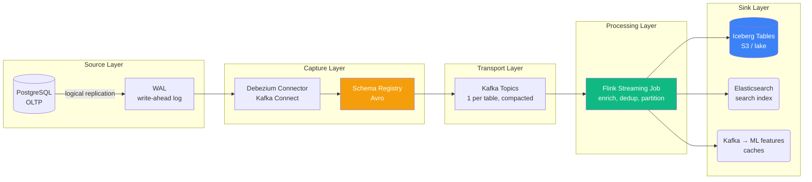
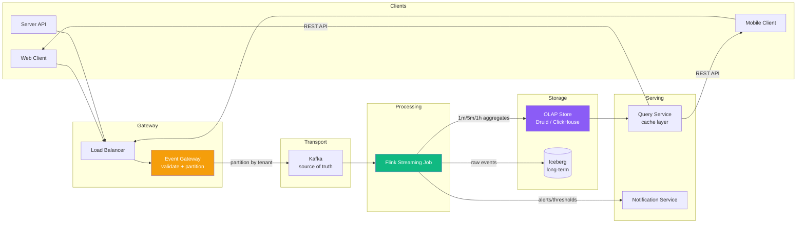
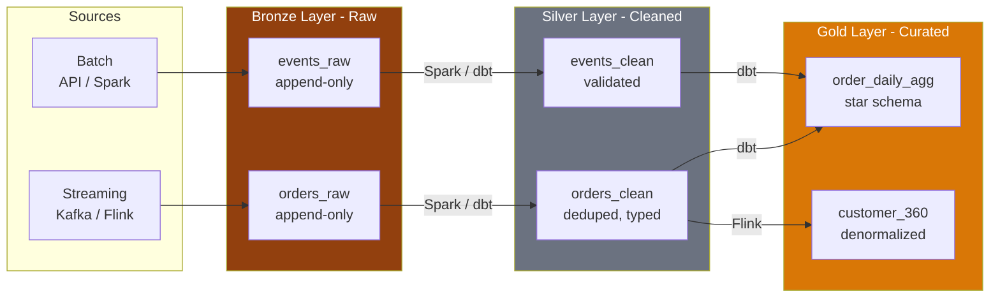
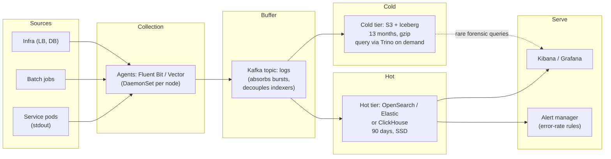
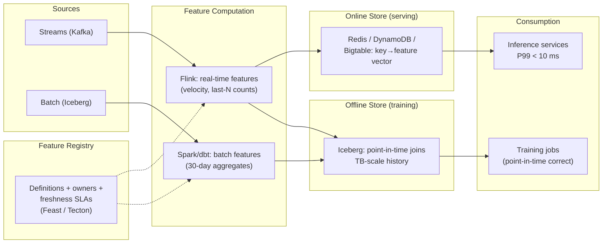

# Data Engineering System Design — Interview Prep Notes

> Format: Senior DE (Alex) ↔ Staff DE (Sam) conversation series.
> Goal: System design scenarios typical at senior/staff-level DE interviews.

---

## Table of Contents

1. [Introduction](#1-introduction)
2. [Scenario A: Design a CDC Pipeline](#2-scenario-a-design-a-cdc-pipeline)
3. [Scenario B: Design a Real-Time Metrics Pipeline](#3-scenario-b-design-a-real-time-metrics-pipeline)
4. [Scenario C: Design a Data Lakehouse](#4-scenario-c-design-a-data-lakehouse)
5. [Scenario D: Design an Incremental Batch Pipeline](#5-scenario-d-design-an-incremental-batch-pipeline)
6. [Scenario E: Design a Log Aggregation Platform](#6-scenario-e-design-a-log-aggregation--observability-platform)
7. [Scenario F: Design a Feature Store for ML](#7-scenario-f-design-a-feature-store-for-ml)
8. [Decision Trade-off Framework](#8-decision-trade-off-framework)
9. [Quick Reference Cheatsheet](#9-quick-reference-cheatsheet)
10. [Modern Cross-Cutting Concerns](#10-modern-cross-cutting-concerns)
11. [Resources](#11-resources)

---

## 1. Introduction

Data engineering system design interviews differ from general software engineering system design. You are not designing a URL shortener or a chat system. The questions focus on moving, processing, and storing data at scale:

| DE question | Core problem | Key technologies expected |
| :--- | :--- | :--- |
| CDC pipeline | Reliable capture of database changes into a lake/warehouse | Debezium, Kafka, Schema Registry, Flink, Iceberg |
| Real-time metrics | Low-latency event collection and aggregation | Kafka, Flink, Druid/ClickHouse |
| Data lakehouse | Unified batch/stream with ACID and governance | Iceberg, Nessie/Polaris, Flink/Spark, dbt |
| Incremental batch | Processing only new/changed data day over day | Spark, Iceberg, Airflow, high-watermark patterns |
| Log aggregation | Searchable logs at scale with cost control | Fluent Bit/Vector, Kafka buffer, OpenSearch/ClickHouse, S3 cold tier |
| Feature store | One feature definition serving training + inference | Feast/Tecton, Iceberg offline store, Redis/DynamoDB online store |

These notes cover each scenario with architecture diagrams, trade-off tables, and dialogue explaining the "why".

### What Interviewers Score (Evaluation Criteria)

| Dimension | What a strong answer demonstrates | Red flags |
| :--- | :--- | :--- |
| **Requirements first** | Asks about latency SLA, throughput, consumer count, growth before drawing anything | Jumps to "Kafka + Flink" without clarifying |
| **Layered architecture** | Ingestion → buffer → compute → storage → serving, each justified | One box labeled "Spark" doing everything |
| **Trade-off articulation** | Names what each choice costs, not just what it does | "Tool X is just better" with no downside stated |
| **Failure design** | Recovery, idempotency, dedup, backfill — designed in, not bolted on | "We'll retry" as the entire failure strategy |
| **Scale realism** | Numbers: partitions, file sizes, state size, QPS — with the math shown | "It scales horizontally" with no bottleneck analysis |
| **Operational ownership** | Monitoring, alerting, maintenance jobs, schema governance | Design ends at "data lands in the lake" |

**The drill questions after each scenario are the follow-ups that
separate seniors from staff: they test whether you've operated the
system, not just read about it.**

---

## 2. Scenario A: Design a CDC Pipeline

### Problem Statement

> Your company has a PostgreSQL OLTP database. Multiple downstream systems (analytics, search, ML features, audit) need low-latency access to changes without polling the production database.

### High-Level Design



### Why This Architecture in 2025–2026

- **Debezium + Kafka Connect** is the standard CDC capture layer — reads Postgres WAL with minimal overhead (logical replication slot, no table locks). Compare: AWS DMS (managed, higher latency, no schema registry integration), GoldenGate (Oracle, pricey).
- **Avro with Schema Registry** allows producers and consumers to evolve schemas independently and validates compatibility at write time (backward, forward, full).
- **Kafka topics configured with `cleanup.policy=compact`** retain the latest state per key — downstream systems can rebuild a full snapshot at any time.
- **Flink** does the heavy stateful processing: deduplicate out-of-order events, join CDC streams to materialize dimension snapshots, handle late-arriving changes.
- **Iceberg** provides ACID commits to S3 for the lake layer — atomic metadata swaps, no directory listing, time travel for reprocessing.

### Key Decisions and Trade-offs

| Decision | Option A | Option B | Why pick |
| :--- | :--- | :--- | :--- |
| Capture method | WAL (logical replication) | Query-based polling | WAL: no load on source DB, captures deletes, low latency. Polling: simpler but misses deletes, adds query load. Always WAL for production. |
| Schema format | Avro with Schema Registry | JSON in Kafka | Avro: compact binary, schema evolution enforced, better Snowflake/iceberg integration. JSON: human-friendly, no registry dependency. Pick Avro for any multi-consumer pipeline. |
| Storage format | Iceberg | Delta Lake, Hudi | Iceberg: widest engine support (Flink, Spark, Trino, Snowflake), open spec, no single-vendor dependency. Delta: better Spark-native performance. Hudi: stronger upsert/incremental query but niche. Trend is Iceberg-first (2025+). |
| Catalog | Apache Polaris / Nessie | AWS Glue / Hive Metastore | Polaris: open, REST-based, Iceberg-native. Glue: easiest if already in AWS. Hive Metastore: legacy — avoid for new deployments. |
| Exactly-once to lake | Flink Iceberg sink (2PC) | Spark batch upsert | Flink: continuous, sub-minute freshness. Spark: hourly/daily only. For CDC, freshness matters — use Flink. |
| Backfill | Reprocess from WAL snapshot | Separate batch job | Flink can rewind consumer offsets and reprocess. For full backfill, a standalone Spark/Iceberg job is faster. Design both from day one. |

**Alex:** Is a Kafka topic per table always the right level of granularity?

**Sam:** Generally yes — it gives independent consumer groups per table, independent partition scaling, and clear data contracts. Exceptions: high-volume event tables with >10K changes/second might need multiple topics (shard by tenant) to stay within broker throughput per partition. Small reference tables with <1 change per minute could share a topic to reduce connect cluster load. Start with one topic per table, monitor, split if needed.

**Alex:** How do you detect and handle schema drift?

**Sam:** Schema Registry enforces a compatibility mode. Backward (default): new schema must accept all old data. Forward: old readers must accept new data. Full: both directions. When a breaking change is required (rename column, change type), the process is: register a new schema version that passes compatibility → wait for all consumers to upgrade → deploy the source change. For truly incompatible changes (drop column), use a new schema subject and a data migration to the new topic. Never silently drop columns — downstream dbt models and iceberg schemas will fail at read time.

**Alex:** What about table locking?

**Sam:** Debezium uses a logical replication slot — Postgres does not lock the table to create one (it reads a snapshot concurrently). The initial snapshot is consistent without blocking writes. For MySQL, Debezium uses `LOCK TABLES` briefly for the binlog position — schedule this during a maintenance window for large tables. Production concern is not locking — it is replication slot retention: if the Kafka connector is down for too long, Postgres WAL accumulates and fills disk. Alert on replication slot lag and set a `slot.max.lag` threshold.

**Alex:** Walk me through failure recovery.

**Sam:** A connector crash → on restart, Debezium resumes from the last committed Kafka offset (stored in Kafka Connect's internal topics). A Flink job crash → resumes from last checkpoint, sources rewind Kafka offsets, and the Iceberg commit is rolled back at the catalog level. A full-topic corrupt-on-broker scenario → you rebuild from the compacted topic (latest state per key) or re-run the initial snapshot via Debezium's `snapshot.mode=when_needed`. The critical architectural property is **immutable event log**: as long as Kafka retains the data, any downstream state is recoverable.

### Key Interview Answer

> A CDC pipeline starts with Debezium tailing the source DB's WAL and writing Avro-serialized change events to compacted Kafka topics. The Schema Registry enforces compatibility. Flink reads the feeds, handles deduplication and late events, and sinks to Iceberg via its exactly-once two-phase commit. This architecture gives sub-minute freshness with full ACID compliance on S3 and the ability to reprocess from any point by resetting offsets.

### Drill Questions (Scenario A)

| Interviewer asks | Strong answer |
| :--- | :--- |
| "The source DBA says replication slots are filling the disk. Now what?" | Slot retains WAL until consumed. Connector down too long → WAL accumulates. Alert on slot lag; set max WAL size; if slot lost, Debezium `snapshot.mode=when_needed` re-snapshots |
| "A column rename breaks 30 downstream consumers. Walk the rollout." | Registry new version (backward) → consumers upgrade → source deploys. Truly breaking change → new subject + new topic + migration |
| "Postgres failover happens. Does Debezium survive?" | Replication slots don't survive failover by default → use failover slots (PG16+) or re-create slot + new snapshot on the replica. State this — it shows you've run it |
| "Debezium vs AWS DMS?" | DMS: managed, simpler, higher latency, weaker schema evolution. Debezium: registry integration, community, control. Default Debezium unless the team has zero Kafka ops capacity |
| "How do you backfill a table that existed before CDC was set up?" | Debezium initial snapshot (consistent, no table lock on PG) OR bulk export → Iceberg, then start CDC from the snapshot's LSN |

---

## 3. Scenario B: Design a Real-Time Metrics Pipeline

### Problem Statement

> Design a system that ingests user interaction events (clicks, page views, API calls) at 100K events/second, computes real-time aggregations (counts over 1m/5m/1h windows), and serves results with sub-second query latency.

### High-Level Design



### Key Decisions

| Decision | Option A | Option B | Why pick |
| :--- | :--- | :--- | :--- |
| Ingestion protocol | HTTP POST to gateway | Direct Kafka producer from client | Gateway: validation, auth, rate-limiting, schema check. Direct Kafka: simpler but exposes Kafka to the internet and couples clients to brokers. Always a gateway. |
| OLAP store | Druid | ClickHouse | Druid: native streaming ingestion from Kafka, automatic rollup, sub-second `GROUP BY` on pre-aggregated data. ClickHouse: faster raw scans, better JOIN support, more SQL-compatible. Both are excellent — pick based on query pattern: Druid for pre-defined dashboards, ClickHouse for ad-hoc exploration. |
| Event-time vs processing-time | Event time from client | Server receive time | Event time gives accurate user-behavior metrics but requires watermark handling for late data. Server time is simpler but inaccurate (network delay, batched clients). Use event time, tolerate late events via allowed lateness or side output. |
| Retention policy | Hot (OLAP): 30 days; Cold (Iceberg): permanent | OLAP: 7 days; Iceberg: 90 days | OLAP storage is expensive (in-memory + SSDs). Iceberg on S3 is cheap. Keep only recent, high-resolution data in OLAP; everything else in Iceberg with Trino/Presto for rare queries. |

**Alex:** Can't we use Flink to aggregate and serve directly from memory?

**Sam:** Only for very small queries. Flink's internal state is optimized for streaming computation, not for serving random queries at 1000+ QPS. Windowed aggregates in Flink's state are per-key and distributed across TaskManagers — there is no global index. You would need to extract state to an external serving layer anyway. The pipeline should be: Flink computes → writes to OLAP store → OLAP store serves. Flink is not a database.

**Alex:** How do you handle late data in dashboards?

**Sam:** Two strategies depending on SLA. For interactive dashboards that show "last hour" data, accept that the final number stabilizes after `out-of-order + watermark delay + allowed lateness` (say 2 minutes). Show a "live" value with a disclaimer, then update when late events arrive. For compliance/financial metrics where late data is unacceptable, close windows later (longer watermark bound) and accept dashboard delay. Never backfill OLAP stores late by mutating past windows — instead, publish corrected aggregates as new rows with a `corrected_at` timestamp and let consumers decide.

### Key Interview Answer

> A real-time metrics pipeline uses a stateless gateway for validation, Kafka for buffering, Flink for windowed streaming aggregation, and an OLAP store (Druid or ClickHouse) for serving. The architecture separates the compute (Flink) from the serving (OLAP). Event time is critical for correctness; watermark strategies handle late data. Long-term raw data goes to Iceberg for backtesting and ML.

### Drill Questions (Scenario B)

| Interviewer asks | Strong answer |
| :--- | :--- |
| "100K → 10M events/sec. What breaks first?" | Gateway (stateless — scales horizontally), then Kafka partitions (reshard), then OLAP ingestion (Druid middleManagers / CH shards). Flink scales by parallelism; the OLAP store is usually the real wall |
| "Users want the dashboard to show 'right now' AND be exactly correct. Response?" | Impossible together — provisional + corrected. Fire windows early with approximations, re-fire with late data; label live numbers as estimates |
| "Why not just Kafka Streams?" | Kafka-in/Kafka-out only; you still need the OLAP serving layer. Flink wins when sinks aren't Kafka and windows get complex |
| "Cardinality explosion: user_id in the GROUP BY blows up Druid. Fix?" | Roll up at ingestion (Flink pre-aggregates per-minute), use sketches (HLL) for uniques, cap high-cardinality dims in the rollup spec |
| "One tenant produces 80% of events. Consequences?" | Hot partition (Kafka), hot rollup (Druid segment imbalance). Shard by tenant_id for the whale; separate topic; per-tenant quotas at the gateway |

---

## 4. Scenario C: Design a Data Lakehouse

### Problem Statement

> Your data platform has grown from a few Spark batch jobs into dozens of teams producing and consuming diverse datasets. You need a unified storage layer that supports batch and streaming ingestion, ACID transactions, schema evolution, and governance — without vendor lock-in.

### Architecture

```
┌─────────────────────────────────────────────────────┐
│                   Catalog Layer                      │
│      Polaris / Nessie (Git-like branching, RBAC)     │
├─────────────────────────────────────────────────────┤
│                   Storage Layer                      │
│        Iceberg tables on S3 / ADLS / GCS            │
│        Partitioned by time + tenant                 │
├─────────────────────────────────────────────────────┤
│              Ingestion Layer                         │
│  Batch: Spark / Airflow     Stream: Flink            │
├─────────────────────────────────────────────────────┤
│              Transformation Layer                    │
│  dbt (SQL)                Custom Spark/Flink jobs    │
├─────────────────────────────────────────────────────┤
│              Serving Layer                           │
│  Trino / Starburst        Snowflake                 │
│  Spark (ad-hoc)           DuckDB (local)            │
└─────────────────────────────────────────────────────┘
```

### Medallion Architecture



| Layer | Characteristics | Schema | Retention |
| :--- | :--- | :--- | :--- |
| **Bronze** | Raw data, append-only, exactly as received | Keep source schema, but add `_ingested_at`, `_source`, `_file` | Long (90 days+), compaction to avoid too many small files |
| **Silver** | Cleaned, validated, typed, deduplicated | Enforced schema, column-level docs, nullable handled | Medium (60 days), partition by day |
| **Gold** | Business-ready: aggregated, joined, conformed | Star/snowflake schemas, metrics with certified definitions | Long (forever), incremental compaction |

### Key Decisions

| Decision | Leading options | Trade-offs |
| :--- | :--- | :--- |
| Table format | **Iceberg** | Open spec, broad engine support, hidden partitioning, partition evolution, time travel. Delta Lake is better if Spark is the only engine. Hudi has stronger upsert performance but fewer integrators. |
| Catalog | Apache Polaris (open) / AWS Glue / Snowflake | Polaris: open REST catalog, Iceberg-native, RBAC. Glue: easy if AWS-native, but Glue's Iceberg support lagged. Snowflake Polaris: hosted. For a multi-engine lakehouse, an open REST catalog is the 2025–2026 standard. |
| Branching / versioning | Nessie (Git-like branching on Iceberg) | Useful for: test-on-branch without copying data, rolling back bad writes, CI/CD for data pipelines. Adds complexity. Start without branching; add Nessie if you hit production incidents from bad writes. |
| File compaction | Spark `RewriteDataFiles` or Flink compaction job | Small files from streaming are the #1 lakehouse performance killer. Run compaction daily on Bronze/Silver, hourly on high-volume streaming. Target 256MB–1GB files. |
| Governance | Column-level lineage, RBAC via catalog, data contracts | Iceberg/Polaris support column-level access. dbt + SDF for lineage. Data contracts (schema, freshness, quality SLAs) between producer and consumer teams. |

**Alex:** We have both batch and streaming workloads. Is Flink writing to Bronze and dbt transforming Silver-to-Gold the standard pattern?

**Sam:** That exact pattern — Flink → Bronze, Spark/dbt → Silver/Gold — is the most common lakehouse architecture in 2025–2026. Flink handles streaming ingestion to Bronze (or to Iceberg via the Flink Iceberg sink). dbt handles the Silver and Gold transformations in SQL, backed by Trino, Spark, or Snowflake depending on scale. For sub-minute freshness requirements, keep Silver also in Flink; for hourly/daily, use dbt. The key principle is: bronze is immutable, silver is cleaned, gold is business-defined — each layer enforces progressively stricter contracts.

**Alex:** When does the lakehouse break down?

**Sam:** Three scenarios. First, when streaming freshness expectations hit database-level latency (<1 second) — Iceberg's metadata commit overhead (1–5s per snapshot) is too slow; a real-time OLAP cache (Druid/ClickHouse) in front of Iceberg is needed. Second, when thousands of concurrent small-write pipelines starve each other at the catalog — rate-limit commits and batch writes. Third, when schema governance is absent — every team uses their own field names for "customer_id" and gold models become join nightmares. Enforce data contracts and a shared schema registry from day one.

> [!NOTE]
> The lakehouse converges batch and streaming at the **storage layer**, not the compute layer. Flink writes continuously to Iceberg Bronze; dbt/Spark batch-transform to Silver/Gold. Compute is ephemeral; Iceberg's ACID metadata commits make this possible on object storage.

### Key Interview Answer

> A lakehouse uses an open table format (Iceberg) on object storage, an open REST catalog (Polaris), and a medallion architecture (Bronze → Silver → Gold) to separate concerns. Batch and streaming merge at the storage layer. The catalog provides ACID, schema evolution, and governance. dbt handles SQL transformations; Flink and Spark handle the ingest and complex processing. The lakehouse does not replace real-time OLAP stores — it complements them.

### Drill Questions (Scenario C)

| Interviewer asks | Strong answer |
| :--- | :--- |
| "Bronze is at 500K small files. Walk the fix." | Compaction pipeline: rewrite_data_files daily (bronze), hourly (streaming silver); target 256–512 MB; then rewrite_manifests; then reduce upstream write frequency |
| "A bad dbt deploy corrupted Gold for 3 days. Undo it." | Iceberg time travel: point catalog at pre-deploy snapshot OR rollback procedure. Then fix dbt, re-run incremental. This is why snapshots + retain_last matter |
| "Two teams both need 'revenue' but define it differently." | Conformed metrics layer (dbt metrics / semantic layer) with ONE certified definition; second team gets a differently-named metric. This is a governance problem, not a compute problem |
| "Why Polaris over Glue catalog?" | Glue: zero-ops, AWS-only, throttling at high TPS. Polaris: REST, engine-neutral, RBAC, multi-cloud. If you're Glue-native and single-engine, Glue is fine — say that too |
| "Cost of the lakehouse vs the old warehouse?" | Storage: 5-10x cheaper (S3 vs warehouse storage). Compute: similar per-query, but you now pay per engine. The win is flexibility + no egress, not raw TCO |

---

## 5. Scenario D: Design an Incremental Batch Pipeline

### Problem Statement

> Design a daily pipeline that ingests 50GB of new order data from an external API, transforms it (join, aggregate, apply SCD Type 2), and loads it into a reporting warehouse. The pipeline must be idempotent, handle late-arriving data up to 48 hours, and recover from failures without data loss.

### Design

```mermaid
flowchart LR
    subgraph External
        API[External API<br/>REST + timestamp]
    end
    subgraph Bronze
        B[orders_raw<br/>Iceberg, append-only<br/>partitioned by order_date]
    end
    subgraph Silver
        S[orders_staging<br/>Iceberg, upsert<br/>deduplicated]
    end
    subgraph Gold
        G[fact_orders<br/>dim_customers<br/>Iceberg]
    end
    subgraph Warehouse
        RW[(Snowflake / Redshift<br/>reporting)]
    end

    API -->|hourly poll| IJ[Ingestion Job<br/>Spark]
    IJ -->|high watermark| B
    B -->|daily| SJ[Staging Job<br/>Spark]
    SJ -->|dedup + validate| S
    S -->|MERGE INTO| DMJ[Dimension Merge<br/>Spark, SCD Type 2]
    DMJ -->|Iceberg MERGE INTO| G
    G -->|dbt transforms| RW

    style B fill:#92400e,color:#fff
    style S fill:#6b7280,color:#fff
    style G fill:#d97706,color:#fff
    style IJ fill:#3b82f6,color:#fff
    style SJ fill:#3b82f6,color:#fff
    style DMJ fill:#3b82f6,color:#fff
```



### Key Patterns

| Pattern | Implementation | Why |
| :--- | :--- | :--- |
| **High watermark** | A `_airflow_watermark` variable updated after each successful run | Makes the pipeline restartable: failed at 11 PM? Next run picks up from the last committed watermark, not from the beginning. |
| **Idempotent writes** | Iceberg `MERGE INTO` — update matching rows, insert new | Re-running the same batch does not produce duplicates. Without `MERGE`, you need a manual dedup step (expensive on 50GB). |
| **Late-arriving data** | Accept within 48-hour window; Bronze partition covers future dates | Low-latency: data from yesterday arriving today can be merged into yesterday's Silver/Gold partition via `MERGE`. Outside 48-hour window: route to a reconciliation workflow. |
| **Failure recovery** | Retry from last successful stage via Airflow retries + checkpoint | If the dimension merge fails, the staging step is already committed — restart from dimension merge, not from ingestion. Airflow retries + task-level idempotency. |
| **Small file compaction** | Weekly Spark `RewriteDataFiles` on Bronze | The hourly ingestion produces many small Parquet files. Compaction merges them to ~512MB for query performance. Run as a light-weight maintenance job. |

**Alex:** Iceberg `MERGE INTO` is slow on large tables. How do you handle a 10TB fact table?

**Sam:** Partition pruning is the answer for 95% of cases: if the merge is scoped to the last partition (yesterday's data), Iceberg reads only that partition's metadata and files — it does not scan the full 10TB. For cases where updates cross many partitions (backfills, global corrections), use a two-step approach: append corrected rows to a staging partition, then run a `REWRITE` that atomically replaces the affected old files. Avoid row-by-row `MERGE` on multi-TB tables: it becomes an Iceberg snapshot-per-row write storm. Batch corrections, then rewrite.

**Alex:** When is daily batch wrong and streaming is mandatory?

**Sam:** Daily batch is wrong when the downstream consumer defines freshness in minutes, not hours. Fraud detection, real-time dashboards, and operational alerts all need streaming. It is also wrong when the data volume makes a daily batch physically unfeasible (5TB of changes per hour — you cannot hold 120TB in one Spark shuffle per day). In that case, continue daily batch but use micro-batch (hourly ingestion into Bronze, continuous compact + merge via Flink) — the hybrid approach. For 99% of reporting and ML pipelines, daily batch with Iceberg incremental reads is sufficient.

### Key Interview Answer

> An incremental batch pipeline uses a high-watermark pattern to read only new data, Iceberg `MERGE INTO` for idempotent upserts, and partitioned fact tables so merges scan only the relevant partition. Late-arriving data is handled within a configurable window via upsert into the target partition. Compaction runs periodically to manage small files from frequent ingestion. Airflow orchestrates the stages with retry boundaries at each write.

### Drill Questions (Scenario D)

| Interviewer asks | Strong answer |
| :--- | :--- |
| "The API has no updated_at field. How do you do incremental?" | Can't, reliably. Options: full snapshot + diff by hash (expensive but correct), CDC on the API's own DB if accessible, or negotiated contract change. Saying "I'd ask for updated_at" is a senior answer |
| "Watermark job ran with the wrong date and skipped a day. Recover?" | Backfill with explicit (start,end) params overriding the watermark; then fix watermark state. Parameterized backfills are a day-one requirement, not an afterthought |
| "MERGE INTO is scanning the whole 10 TB table. Why?" | Missing partition filter in the merge condition — predicate must reference the partition column so pruning kicks in. Check the physical plan |
| "Duplicate API responses caused double-counted revenue. Root cause?" | Non-idempotent ingestion (INSERT instead of MERGE) + retry after partial success. Fix: MERGE on natural key + stage-then-swap |
| "Data arrives 3 days late for a monthly close report. Handle it?" | Reconciliation window: re-run the affected partitions via MERGE (idempotent, so safe); if outside the 48h window, route to a correction workflow with finance sign-off |

---

## 6. Scenario E: Design a Log Aggregation / Observability Platform

### Problem Statement

> Design a system that collects application logs from 2,000 services (500 GB/day), makes them searchable within 30 seconds, retains 90 days for debugging and 13 months for compliance, and alerts on error patterns.

### High-Level Design



### Key Decisions

| Decision | Option A | Option B | Why pick |
| :--- | :--- | :--- | :--- |
| Agent | Fluent Bit | Logstash, Vector | Fluent Bit: tiny footprint (~10 MB), K8s-native. Vector: Rust, better transforms. Logstash: heavy JVM, legacy |
| Hot store | OpenSearch | ClickHouse, Loki | OpenSearch: full-text search, mature. ClickHouse: 10-20x cheaper storage, SQL, weaker text search. Loki: cheapest, label-indexed only |
| Buffer | Kafka | Direct-to-indexer | Kafka absorbs ES indexing backpressure (the classic ES-yellow-status killer). Always buffer |
| Retention split | 90d hot + 13mo cold | All in hot tier | Hot-tier SSD costs dominate. 95% of queries hit <7 days; compliance queries are rare and tolerate minutes of Trino latency |
| Sampling | Tail-based at agent | Head-based | Tail sampling for traces; for logs: keep all ERROR, sample INFO at high volume |

**Alex:** Elasticsearch keeps falling over at ingest peaks. What do you change first?

**Sam:** First, confirm the buffer: logs should flow Kafka → indexer consumers that batch bulk-index. Direct agent-to-ES means any ES slowdown backpressures into the agents and drops logs. Second, check index design: daily indices with ILM (index lifecycle management), not one giant index; shards sized 20–40 GB. Third, reduce cardinality of indexed fields — `message` as text is fine, but indexing `request_id` + `user_id` + 40 labels as keywords explodes memory. If the team can't operate ES, this is when ClickHouse or Loki enters the conversation.

### Key Interview Answer

> Log aggregation is agents on nodes (Fluent Bit) shipping to a Kafka buffer, consumers bulk-indexing into a hot store (OpenSearch/ClickHouse) for 90 days, with cold S3 retention for compliance. The buffer is non-negotiable — it's what keeps the indexer from dropping logs at peak. Cost control comes from the hot/cold split and from being deliberate about which fields get indexed.

### Drill Questions (Scenario E)

| Interviewer asks | Strong answer |
| :--- | :--- |
| "Logs must be searchable in 5 seconds, not 30." | Ingest→Kafka→bulk-index latency is the budget: flush intervals at agent (1s), consumer batch (1-2s), ES refresh_interval (1s). Achievable; costs CPU at the indexer |
| "A service starts logging 100x normal volume. Blast radius?" | Per-service quotas at the agent or Kafka; circuit breaker that samples instead of drops-all; alert on volume anomaly (observability on the observability platform) |
| "PII in logs?" | Redaction at the agent (regex/allowlist) before it leaves the node — PII that reaches the index is a compliance incident, not a config issue |
| "Why not just CloudWatch/Stackdriver?" | Fine until multi-cloud, high cardinality, or cost (cloud log services charge ingest + retention + query; at 500 GB/day the bill typically crosses self-managed cost). Know the crossover exists |

---

## 7. Scenario F: Design a Feature Store for ML

### Problem Statement

> Design a feature store that serves ML models: offline features for training (point-in-time correct, TB scale) and online features for inference (P99 < 10 ms lookups), with one definition shared by both paths.

### High-Level Design



### Key Decisions

| Decision | Option A | Option B | Why pick |
| :--- | :--- | :--- | :--- |
| Online store | Redis | DynamoDB, Bigtable, Cassandra | Redis: fastest, in-memory cost. DynamoDB: managed, scales to zero ops, ~single-digit-ms P99. Pick by ops appetite; both hit the SLA |
| Point-in-time join | Feast/Spark ASOF join | Manual timestamp joins | Training-serving skew comes from wrong PIT joins; never hand-roll. `ASOF JOIN` semantics: feature value as-of the label timestamp, not latest |
| One definition | Registry (Feast) | Duplicate code in two pipelines | The #1 feature-store failure is training/serving skew from two implementations. Registry generates both paths |
| Freshness tiers | Two paths (stream + batch) | Stream everything | Real-time features (velocity) stream; stable aggregates (30-day avg) batch. Streaming everything triples cost for features that change daily |

**Alex:** What is training-serving skew and how does the store prevent it?

**Sam:** Skew is when the features the model trained on differ from what it sees in production — from three causes: different code paths (fixed by the registry generating both), different data timing (fixed by point-in-time correct offline joins), and different freshness (fixed by documenting per-feature freshness SLAs — a model can't consume a 1-hour-old feature at inference if it trained on real-time values). The store's job is to make all three explicit.

### Key Interview Answer

> A feature store is a registry plus two serving paths: an offline store (Iceberg, point-in-time-correct joins for training) and an online store (Redis/DynamoDB, <10 ms lookups for inference). The registry is the core value: one feature definition generates both the batch and streaming computation, eliminating training-serving skew. Freshness is tiered — real-time features stream, stable aggregates batch.

### Drill Questions (Scenario F)

| Interviewer asks | Strong answer |
| :--- | :--- |
| "Online lookups spike to 50 ms P99 during model retraining. Why?" | Retraining bulk-reads the offline store AND backfills the online store; the backfill write burst contends with reads. Fix: separate write capacity / shadow online store + atomic swap |
| "A feature has a bug — 3 models already trained on it." | Version features (feature_v2); retrain affected models; the registry's lineage (which models consumed which version) is what makes this answerable in hours not weeks |
| "Why not just query the warehouse at inference time?" | Warehouse P99 is 100 ms – seconds under concurrency, not <10 ms; and you'd recouple models to analytics infra. The online store exists precisely to break that coupling |
| "Cold-start: new user, no history. Features?" | Default/imputed values marked as such (is_cold_start flag as its own feature); never silently serve stale features of a different entity |

---

## 8. Decision Trade-off Framework

A reusable framework for DE system design interviews:

```
1. COLLECT REQUIREMENTS
   - Latency SLA (seconds / minutes / hours / days)
   - Throughput (rows/sec, peak vs steady)
   - Data volume (current + 12-month growth)
   - Consumer count and their query patterns (dashboard / SQL / API)
   - Ordering and deduplication semantics
   - Schema evolution velocity (how often do fields change?)

2. CHOOSE STORAGE PARADIGM
   Latency < 1s:       Kafka + Flink + OLAP store (Druid/ClickHouse)
   Latency < 1 minute: Kafka + Flink + Iceberg
   Latency < 1 hour:   Kafka + Flink/Spark + Iceberg (medallion)
   Latency < 1 day:    Object store + Spark + Iceberg (medallion)

3. CHOOSE TABLE FORMAT
   Multi-engine lakehouse: Iceberg
   Spark-only:              Delta Lake
   Heavy upserts:           Hudi or Iceberg with merge-on-read

4. CHOOSE COMPUTE
   Streaming:           Flink
   Batch SQL:           Spark or Trino (for Iceberg)
   Lakehouse SQL:       dbt + Trino
   Orchestration:       Airflow or Dagster

5. HANDLE EDGE CASES
   - Late data (watermark strategy / allowed lateness / reconciliation)
   - Schema drift (Schema Registry + compatibility)
   - Small files (compaction strategy)
   - Failure recovery (checkpoint / idempotent writes / retry boundaries)
```

---

## 9. Quick Reference Cheatsheet

| Scenario | Key technology stack | State? | Serving |
| :--- | :--- | :--- | :--- |
| CDC pipeline | Debezium → Kafka Avro + Registry → Flink → Iceberg | Flink state (dedup, joins), Iceberg files | Iceberg via Trino / Snowflake |
| Real-time metrics | Gateway → Kafka → Flink → Druid/ClickHouse | Flink state (windows) | OLAP store direct |
| Lakehouse | Flink (ingest) → Iceberg (medallion) → dbt (transform) | Iceberg catalog | Trino / Spark / DuckDB |
| Incremental batch | Spark → Iceberg (high-watermark + merge into) | Iceberg files | Warehouse (Snowflake/Redshift) |
| Log aggregation | Fluent Bit → Kafka buffer → bulk-index → OpenSearch + S3 cold | Kafka buffer, ES indices | Kibana/Grafana + Trino for cold |
| Feature store | Registry (Feast) → Iceberg offline + Redis/DynamoDB online | Feature registry, online KV | Training (PIT joins) + inference (<10ms) |
| All in one sentence? | Kafka decouples producers and consumers; Iceberg unifies batch and stream at the storage layer; Flink provides stateful stream processing between them. | | |

### Common Interview Traps

| Trap | What interviewers want |
| :--- | :--- |
| "We use Kafka for everything — queue, store, and stream processor" | Kafka is a log, not a compute engine. Do not run aggregations in Kafka Streams if multi-partition/temporal joins are needed. Flink or Spark Streaming for compute. |
| "Iceberg replaces our warehouse" | Iceberg replaces the storage layer but not the compute, concurrency, or governance that a warehouse provides. For ad-hoc BI at sub-second latency, a query engine (Trino) or warehouse (Snowflake) is still needed. |
| "Exactly-once is a Kafka config" | Exactly-once is a pipeline property, not a single config. Kafka produces idempotently, Flink checkpoints state, Iceberg commits atomically — all three must work together. |
| "We use event time everywhere" | Event time is correct for analytics. But for operational alerts (is the server down?), processing time is correct — you want to know when the failure happened in clock time, not when the user last sent a request. |
| "More partitions = more throughput" | Partitions determine parallelism, not peak throughput per partition. More partitions add overhead (file handles, metadata, leader election). Right-size for consumer parallelism, not throughput. |

---

## 10. Modern Cross-Cutting Concerns

Topics that span across system design scenarios — increasingly asked
at senior/staff level.

---

### Data Contracts

A formal agreement between a data **producer** and **consumer** about
schema, semantics, freshness, quality, and SLAs.

```yaml
# Example data contract (YAML)
version: 1
dataset: orders
owner: payments-team
schema:
  order_id: { type: string, nullable: false, description: "UUID" }
  amount:  { type: double,  nullable: false, min: 0 }
  status:  { type: string,  nullable: false, enum: ["PENDING","SHIPPED","DELIVERED"] }
freshness:
  sla: 15 minutes
  lag_tolerance: 5 minutes
quality:
  - row_count > 0
  - amount > 0
  - no_null_order_ids
```

**Why they matter:**
- Break the "toss it over the wall" pipeline pattern
- Producers know what they commit to; consumers can trust the data
- Enable independent team ownership (Data Mesh enabler)
- Tools: dbt contracts, Great Expectations, Soda, DataHub

**Interview angle:** "How do you ensure downstream consumers don't break
when the source schema changes?" — Answer: Data contracts with schema
registry + CI checks on producer changes.

---

### Data Mesh (Zhamak Dehghani)

A decentralized sociotechnical architecture where **domain teams own
their data as a product**.

| Principle | What It Means | DE Impact |
|---|---|---|
| **Domain ownership** | Each domain team owns its data pipelines and serves data | No central data team bottleneck |
| **Data as a product** | Data is treated like a product (documented, versioned, discoverable) | Requires SLAs, quality monitoring, documentation |
| **Self-serve platform** | Shared infrastructure for storage, compute, catalog | Platform team builds and maintains the foundation |
| **Federated governance** | Global standards (schema, PII, access) + local autonomy | Polaris/REST catalog, OpenLineage, DataHub |

**When it works:** Large organizations (500+ engineers), clear domain
boundaries, mature platform team.
**When it fails:** No platform investment, teams not ready to own data,
unclear domain boundaries.

**Interview angle:** "Your company is growing fast and the central data
team is a bottleneck. How do you scale?" — Discuss Data Mesh principles
but acknowledge the organizational complexity.

---

### Reverse ETL

Syncing data from the **warehouse** back into **operational tools**
(Salesforce, HubSpot, Zendesk, ad platforms).

```
Source systems ──► Warehouse ──► Reverse ETL ──► Operational tools
       │                                        │
  (OLTP, events)                     (CRM, support, marketing)
```

| Aspect | Forward ETL | Reverse ETL |
|---|---|---|
| Direction | Source → Warehouse | Warehouse → Operational tools |
| Purpose | Analytics | Operations / Activation |
| Tools | Fivetran, Airbyte, Stitch | Census, Hightouch, Grouparoo |
| Latency tolerance | Hours to days | Minutes to hours |

**Interview angle:** "How would you make customer analytics available to
the CRM team?" — Warehouse → segment definition (SQL) → Reverse ETL →
CRM sync.

---

### Data Observability

Monitoring **data quality and pipeline health** beyond infrastructure
metrics (CPU/memory). Often described as "monitoring + alerting +
lineage + quality" for data.

```
Five pillars of data observability:

1. Freshness  — Is the data up to date?
2. Distribution — Has the data profile changed?
3. Volume    — Are we missing rows?
4. Schema    — Did the structure change?
5. Lineage   — Where did this data come from?
```

| Tool | Type | Key Feature |
|---|---|---|
| Monte Carlo | SaaS | End-to-end observability, automated monitoring |
| Sifflet | SaaS | Column-level lineage, data quality dashboards |
| Bigeye | SaaS | Auto-classification of metric anomalies |
| OpenLineage | Open-source | Standard for collecting lineage metadata |
| Marquez | Open-source | OpenLineage-compatible lineage UI |
| Great Expectations | Open-source | Data quality tests (expectations) |
| Soda | Open-source | SQL-based data quality checks |
| DataHub | Open-source | Metadata + lineage + search |

**Interview angle:** "Your CEO asks: 'Can we trust the dashboard?' —
How do you answer?" — Walk through the five pillars: freshness,
distribution, volume, schema, lineage.

---

## 11. Resources

- [Designing Data-Intensive Applications (Kleppmann)](https://dataintensive.net/) — foundational reference for distributed data systems
- [Streaming Systems (Akidau / Chernyak / Lax)](https://streaming-system.com/) — watermarks, windows, triggers, exactly-once
- [Iceberg Documentation](https://iceberg.apache.org/docs/latest/) — table format spec, maintenance, catalog integration
- [Flink Operations Primer (Ververica)](https://www.ververica.com/blog/flink-operations-primer) — checkpoint tuning, backpressure, state
- [dbt Documentation](https://docs.getdbt.com/) — incremental models, materializations, testing
- [The Medallion Architecture (Databricks)](https://www.databricks.com/glossary/medallion-architecture) — bronze/silver/gold pattern
- [Apache Polaris](https://polaris.apache.org/) — open REST catalog for Iceberg
- [Debezium Documentation](https://debezium.io/documentation/) — CDC connector patterns

### Best Articles by Topic

#### Real-Time Analytics Pipeline
- [Kafka + Flink + ClickHouse: Building a Real-Time Analytics Platform (Uber Engineering)](https://eng.uber.com/real-time-analytics-platform/) — production architecture for petabyte-scale real-time analytics with explicit tradeoff decisions
- [Designing a Real-Time Metrics Pipeline (HelloInterview)](https://www.hellointerview.com/learn/system-design/design-a-real-time-metrics-pipeline) — step-by-step system design walkthrough covering Kafka, Flink, Druid/ClickHouse, tradeoffs at each layer

#### CDC Pipeline
- [Building a Reliable CDC Pipeline (Debezium + Kafka + Flink + Iceberg)](https://debezium.io/blog/category/tutorial/) — end-to-end CDC architecture with schema evolution handling

#### Data Lakehouse
- [The Medallion Architecture (Databricks)](https://www.databricks.com/glossary/medallion-architecture) — bronze/silver/gold pattern
- [Designing a Data Lakehouse (HelloInterview)](https://www.hellointerview.com/learn/system-design/design-a-data-lakehouse) — full system design walkthrough covering Iceberg, catalog choice, query engine selection

#### General System Design for DE
- [System Design for Data Engineers (Akanksha Singh)](https://medium.com/@akanksha_singh/system-design-for-data-engineers-65cf66abf325) — explains how DE system design differs from SWE system design, with data-specific tradeoffs
- [Data Engineering System Design Interview Framework (dataskew)](https://dataskew.io/blog/data-engineer-interview-system-design) — 5-step framework with 3 example scenarios, common pitfalls, and drill questions

System design for caching concepts (CDN, Redis, write-through) is covered separately in [`system-design/caching.md`](caching.md).
